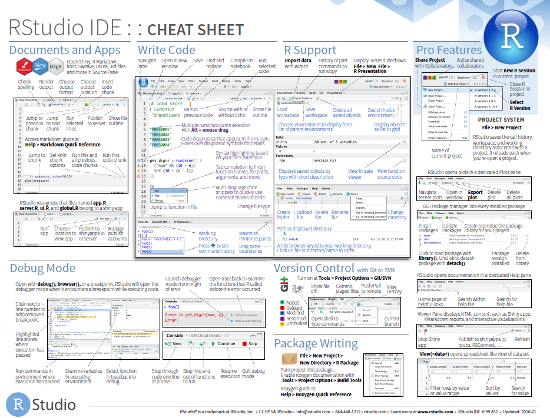
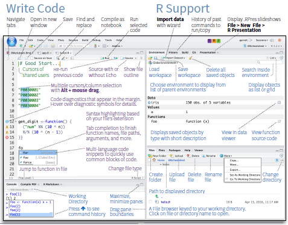

```{r}
#| label: setup
#| include: false
# devtools::install_github("dill/emoGG")
library(pacman)
p_load(
  broom, tidyverse,
  latex2exp, ggplot2, ggthemes, ggforce, viridis, extrafont, gridExtra,
  kableExtra, snakecase, janitor,
  data.table, dplyr, estimatr,
  lubridate, knitr, parallel,
  lfe,fixest, etable,
  here, magrittr, formatR
)
# Define pink color
red_pink <- "#e64173"
turquoise <- "#20B2AA"
orange <- "#FFA500"
red <- "#fb6107"
blue <- "#254BE1"
dblue <- '#003366'
green <- "#8bb174"
grey_light <- "grey70"
grey_mid <- "grey50"
grey_dark <- "grey20"
red <- "#6A5ACD"
slate <- "#314f4f"
# Dark slate grey: #314f4f
# Knitr options
opts_chunk$set(
  comment = "#>",
  fig.align = "center",
  fig.height = 7,
  fig.width = 10.5,
  warning = F,
  message = F
)
opts_chunk$set(dev = "svg")
options(device = function(file, width, height) {
  svg(tempfile(), width = width, height = height)
})
options(crayon.enabled = F)
options(knitr.table.format = "html")
# A blank theme for ggplot
theme_empty <- theme_bw() + theme(
  line = element_blank(),
  rect = element_blank(),
  strip.text = element_blank(),
  axis.text = element_blank(),
  plot.title = element_blank(),
  axis.title = element_blank(),
  plot.margin = structure(c(0, 0, -0.5, -1), unit = "lines", valid.unit = 3L, class = "unit"),
  legend.position = "none"
)
theme_simple <- theme_bw() + theme(
  line = element_blank(),
  panel.grid = element_blank(),
  rect = element_blank(),
  strip.text = element_blank(),
  axis.text.x = element_text(size = 18, family = "STIXGeneral"),
  axis.text.y = element_blank(),
  axis.ticks = element_blank(),
  plot.title = element_blank(),
  axis.title = element_blank(),
  # plot.margin = structure(c(0, 0, -1, -1), unit = "lines", valid.unit = 3L, class = "unit"),
  legend.position = "none"
)
theme_axes_math <- theme_void() + theme(
  text = element_text(family = "MathJax_Math"),
  axis.title = element_text(size = 22),
  axis.title.x = element_text(hjust = .95, margin = margin(0.15, 0, 0, 0, unit = "lines")),
  axis.title.y = element_text(vjust = .95, margin = margin(0, 0.15, 0, 0, unit = "lines")),
  axis.line = element_line(
    color = "grey70",
    size = 0.25,
    arrow = arrow(angle = 30, length = unit(0.15, "inches")
  )),
  plot.margin = structure(c(1, 0, 1, 0), unit = "lines", valid.unit = 3L, class = "unit"),
  legend.position = "none"
)
theme_axes_serif <- theme_void() + theme(
  text = element_text(family = "MathJax_Main"),
  axis.title = element_text(size = 22),
  axis.title.x = element_text(hjust = .95, margin = margin(0.15, 0, 0, 0, unit = "lines")),
  axis.title.y = element_text(vjust = .95, margin = margin(0, 0.15, 0, 0, unit = "lines")),
  axis.line = element_line(
    color = "grey70",
    size = 0.25,
    arrow = arrow(angle = 30, length = unit(0.15, "inches")
  )),
  plot.margin = structure(c(1, 0, 1, 0), unit = "lines", valid.unit = 3L, class = "unit"),
  legend.position = "none"
)
theme_axes <- theme_void() + theme(
  text = element_text(family = "Fira Sans Book"),
  axis.title = element_text(size = 18),
  axis.title.x = element_text(hjust = .95, margin = margin(0.15, 0, 0, 0, unit = "lines")),
  axis.title.y = element_text(vjust = .95, margin = margin(0, 0.15, 0, 0, unit = "lines")),
  axis.line = element_line(
    color = grey_light,
    size = 0.25,
    arrow = arrow(angle = 30, length = unit(0.15, "inches")
  )),
  plot.margin = structure(c(1, 0, 1, 0), unit = "lines", valid.unit = 3L, class = "unit"),
  legend.position = "none"
)
theme_set(theme_gray(base_size = 20))
# Column names for regression results
reg_columns <- c("Term", "Est.", "S.E.", "t stat.", "p-Value")
# Function for formatting p values
format_pvi <- function(pv) {
  return(ifelse(
    pv < 0.0001,
    "<0.0001",
    round(pv, 4) %>% format(scientific = F)
  ))
}
format_pv <- function(pvs) lapply(X = pvs, FUN = format_pvi) %>% unlist()
# Tidy regression results table
tidy_table <- function(x, terms, highlight_row = 1, highlight_color = "black", highlight_bold = T, digits = c(NA, 3, 3, 2, 5), title = NULL) {
  x %>%
    tidy() %>%
    select(1:5) %>%
    mutate(
      term = terms,
      p.value = p.value %>% format_pv()
    ) %>%
    kable(
      col.names = reg_columns,
      escape = F,
      digits = digits,
      caption = title
    ) %>%
    kable_styling(font_size = 20) %>%
    row_spec(1:nrow(tidy(x)), background = "white") %>%
    row_spec(highlight_row, bold = highlight_bold, color = highlight_color)
}
```

# Agenda

## Today
#### Why [R]{.mono}?

:::{.smaller}
1. Overview
1. Installation
1. RStudio

#### Basics

1. Objects
1. Classes
1. Functions
1. Data Frames
1. Packages
1. Data
1. Plotting
1. Regression
:::

# [R]{.mono}

## What is it?

The [[R]{.mono} project website](https://www.r-project.org):

> R is a free software environment for statistical computing and graphics. It compiles and runs on a wide variety of UNIX platforms, Windows and MacOS.

::: {.fragment}
What does that mean?

- [R]{.mono} is a statistical computing language that is flexible for many tasks used in applied econometrics.

- [R]{.mono} has a ton of online help forums in addition to help files by package developers (*e.g.*, [Stack Overflow](https://stackoverflow.com/questions/tagged/r)).
  -more on packages soon.

- [R]{.mono} is **free** and **open source**.
:::


## Why are we using [R]{.mono}?

:::{.smaller}
1. [R]{.mono} is __free__ and __open source__—saving both you and the university money.

1. Economists are (gradually/quickly??) switching to [R]{.mono} along with data scientists, and researchers in other fields.

1. More employers favor [R]{.mono} over proprietary software like [Stata]{.mono}.

1. [R]{.mono} is very __flexible and powerful__—adaptable to nearly any task, _e.g._, 'metrics, spatial data analysis, machine learning, web scraping, data cleaning, website building, teaching.

1. _Related:_ [R]{.mono} imposes __no limitations__ on your amount of observations, variables, memory, or processing power and allows multiple objects at once (more on objects soon).

1. With work you'll develop a marketable tool that will help with your research or other career paths.

1. I personally shifted from [Stata]{.mono} to [R]{.mono}. Sometimes I go back and forth (not recommended).
:::


## The install

Installing [R]{.mono} is fairly straightforward, but it occasionally involves challenges for older computers.  You also have to keep version updates on your mind because some packages are version specific.

**Step 1:** Download ([r-project.org](https://www.r-project.org/)) and install [R]{.mono} [for your operating system]{.dblue}.

**Step 2:** Download ([rstudio.com](https://www.rstudio.com/products/rstudio/download/#download)) and install [RStudio]{.mono} [Desktop]{.orange} [for your operating system]{.purple}.

I always just use all the default prompts for the installation. 

[DataCamp](https://www.datacamp.com/community/tutorials/installing-R-windows-mac-ubuntu) has a nice tutorial on installing [R]{.mono} and [RStudio]{.mono} for Windows, Mac, and Linux operating systems.


# RStudio

## RStudio

- RStudio is an integrated development environment (IDE) for [R]{.mono}.

- Another way of saying this is that RStudio is the front end and [R]{.mono} is the back end.

- There are other options, but RStudio is free, widely used, and pretty user-friendly.

- We'll now take some time to explore some of the features of RStudio

---

::: {.center}

:::

---

::: {.center}
{width=80%}
:::

---

### RStudio

**Download:** [https://rstudio.com/products/rstudio/download/](https://rstudio.com/products/rstudio/download/)

**Cheat Sheets:** [https://rstudio.com/resources/cheatsheets/](https://rstudio.com/resources/cheatsheets/)

**RStudio Cheat Sheet:** [https://rstudio.com/resources/cheatsheets/raw/master/rstudio-ide.pdf](https://rstudio.com/resources/cheatsheets/raw/master/rstudio-ide.pdf)


# [R]{.mono} Basics


## Basic structure

:::{.smallest}
Okay - back to [R]{.mono}. There are a few basics to keep in mind with [R]{.mono}:

::: {.fragment}
[1\. Everything is an __object__.]{.more-left}
:::  

::: {.fragment}
[`foo`]{.less-right}
:::

::: {.fragment}
[2\. Every object has a __name__ and __value__.]{.more-left}
:::

::: {.fragment}
[`foo <- 2`]{.less-right}
:::

::: {.fragment}
[3\. You use __functions__ on these objects.]{.more-left}
:::

::: {.fragment}
[`mean(foo)`]{.less-right}
:::

::: {.fragment}
[4\. Functions come in __libraries__ (__packages__)]{.more-left}
:::

::: {.fragment}
[`library(dplyr)`]{.less-right}
:::

::: {.fragment}
5\. [R]{.more-left .mono} will try to __help__ you.
:::

::: {.fragment}
[`?dplyr`]{.less-right}
:::

::: {.fragment}
6\. [R]{.more-left .mono} has its __quirks__.
:::

<!-- ::: {.fragment} -->
<!-- [`NA; error; warning`]{.less-right} -->
<!-- ::: -->

:::

# Objects

## Everything is an object
Define an object 
```{r}
#| cache: true
a <- 2
```

Now `a` is in the [R]{.mono} environment 
```{r}
#| cache: true
a
```


## Objects
### We can define and perform functions on multiple objects
```{r}
#| cache: true
b <- a + 2
b
c <- a + b
c
```

the `<-` operator assigns an object e.g. (`c <- a + b`) and then just typing object into the console returns the object's value e.g. `c`


# Classes

## Objects are in a certain class

Let's define some more objects
```{r}
#| cache: true
numbers <- c(2, 4, 6)

numbers.2 <- c(a, b, c)

letters <- c('a','b','c')

factors <- as.factor(letters)

factors.2 <- as.factor(numbers)
```

---

### Classes
#### What do these classes look like?
```{r}
#| cache: true
numbers

letters

factors.2
```

---

### Classes
#### We can use the `class` function to determine an object's class
```{r}
#| cache: true
class(a)
class(numbers)
class(letters)
class(factors)
```


# Functions

## Most work in [R]{.mono} will require functions
- [R]{.mono} has many built in functions

  - `mean`
  - `sd`
  - `max`
  - `class`
  - `summary`

- Many more functions are available through packages (more on that soon)


##

class: clear
```{r}
#| cache: true
mean(numbers)

mean(numbers.2)

mean(letters)

mean(factors.2)
```


## Help and functions

**Q:** How do we know which arguments a function requires/accepts?

::: {.fragment}
**A:** `?`
:::

::: {.fragment}
Meaning you can type `?mean` into your [R]{.mono} console to find the help file associated with the functions/objects named `mean`.
:::

::: {.fragment}
**Double bonus:** Use `??mean` to perform a fuzzy search for the term `mean` in all of the help files.
:::

## Example function: `mean`

**Q:** How do we know which arguments a function requires/accepts?

**A$_2$:** [RStudio]{.mono} will also try to help you.

- Type a name (_e.g._, `mean`) into the console; [RStudio]{.mono} will show you some info about the function.
- After you type the name and parentheses (_e.g._, `mean()`), press [tab]{.mono}, and [RStudio]{.mono} will show you a list of arguments for the function.
- Similar functionality in the script section when you hover over or start typing a function.


## We can write our own functions
```{r}
#| cache: true
our_function <- function(arg1, arg2, arg3) {
  arg1*arg2*arg3
}
```

- Our function will show up in the `Environment` pane of RStudio.

- Functions take inputs.
  - In our case `arg1`, `arg2`, and `arg3`
  
- Then functions perform some operation on those inputs.


##

class:clear
```{r}
#| error: true
our_function <- function(arg1, arg2, arg3) {
  arg1*arg2*arg3
}

our_function(arg1=2, arg2=4, arg3=6)

our_function(2,4,6)

our_function(a,b,c)

our_function('a','b','c')
```

## We can also save the output of a function to an object 
```{r}
#| error: true
our_function <- function(arg1, arg2, arg3) {
  arg1*arg2*arg3
}

output <- our_function(2,4,6)

output
```

# Data frames

## Data frames are the base spreadsheet style way of storing data in [R]{.mono}

```{r}
#| cache: true
df <- data.frame(x1 = c(a,b,c),
                 x2 = numbers,
                 x3 = letters,
                 x4 = factors,
                 x5 = c(1,2,3))
df
```
  - Now we have a data frame called `df` that has the variables (columns) `x1, x2, x3, x4, x5`
  - We can have the variables as existing objects (`x1-x4`)or newly created data (`x5`)

---

### We isolate a specific column of a data frame with `$`
```{r}
#| cache: true
df$x1
df$x3
df$x4
```


---

### We can perform operations/functions of these 
```{r}
#| cache: true
mean(df$x1)
class(df$x1)
```

---

### We can add variables to data frames
```{r}
#| cache: true
df$x6 <- 3

df

df$x7 <- seq(1:3)

df
```

---

### We can combine data frames by rows (`rbind`) or by columns (`cbind`)

```{r}
#| cache: true
rbind(df,df)
cbind(df,df)
```


## Data frames
### We can create new data frames or write over an existing data frame

```{r}
#| cache: true
df
df2 <- cbind(df,df)
df2
```

---

### We can create new data frames or write over an existing data frame

```{r}
#| cache: true

df
df <- rbind(df,df)
df
```


# Packages

## Packages
- You can install packages through the function `install.packages()` function in [R]{.mono}
  - You need to write the package name in quotes e.g. `install.packages('data.table)`
  - You only need to **install a package once** (until you update [R]{.mono})
  - You can also install packages through the package tab in RStudio
  
- You can load a package using `library()` function
  - You do not need quotes when loading a package
  - You need to **load packages every time you open [R]{.mono}**

---

### Packages

- Packages are open source and provide access to useful functions and data
- You can get help on a package with the `?` function e.g. `?data.table`
- We'll get familiar with packages with both `data.table` for using data and `ggplot2` for plotting.


# Data

## Data
- We will know start working with data using the `data.table` package
- Recall our data frame, let's make it a little bigger because that's where `data.table` becomes really helpful

:::{.smaller}
```{r}
#| cache: true
df <- rbind(df,df,df,df,df,df,df,df,df,df)
df <- rbind(df,df)
dim(df)
```
:::

:::{.smallest}
```{r}
#| cach: true
#| tidy_table: true
head(df,15)
```
:::


## Data Table
- We can't really see all the data frame
- Now we'll convert to a `data.table` and check it out

:::{.smaller}
```{r}
#| cache: true
library(data.table)
dt <- as.data.table(df)
dt
```
:::

---

### Data
1\. We can load in `RData` data right into [R]{.mono} and it has an assigned object

:::{.smallest}
```{r}
#| cache: true
load('seattle_housing.RData') ## this object is an RData file and already has a name 'rain.sales'
rain.sales
```
:::

---

### Data
2\. We can load in other types of data such csv files using the `read.csv` function
```{r}
#| cache: true
#| eval: false
read.csv('seattle_housing.csv')
```


If we don't assign a the dataset as an object [R]{.mono} will not store it 
```{r}
#| cache: true
#| eval: false
rain.sales <- read.csv('seattle_housing.csv')
```

**Note:** You need to be careful about loading in csv or text files - check out the `header` and `sep` options.

---


### Data
#### We can also directly load it and convert it into a `data.table` object using nested functions

```{r}
#| cache: true
rain.sales <- as.data.table(read.csv('seattle_housing.csv'))
```


## Data Table Stucture
### The basic structure of data tables follows `data[i,j]`
- `data` is the name of the object (dataset)

- `[]` allows you to subset the data

- The `data.table` structure is: `[i,j]`

- `i` designates rows

- `j` designates columns (variables)

---

###  `data.table` allows easy sub-setting by rows 

```{r}
#| cache: true
rain.sales[1:1000]
```

---


###  `data.table` allows easy sub-setting by rows 

```{r}
#| cache: true
rain.sales[district=='SEATTLE',]
```

---

###  `data.table` allows easy sub-setting by columns 

```{r}
#| cache: true
rain.sales[,1:6]
```

---


###  `data.table` allows easy sub-setting by columns 

```{r}
#| cache: true
rain.sales[,c(1:6,9)]
```

---

###  `data.table` allows easy sub-setting by columns 

:::{.smaller}
```{r}
#| cache: true
rain.sales[,list(pin,tract,bg,zip,district,date,price)]
```
:::

---

###  `data.table` allows easy sub-setting by both rows and columns 

```{r}
#| cache: true
rain.sales[district=='SEATTLE',list(pin,tract,bg,zip,district,date,price)]
```

---

###  We can also perform functions on different subsets of the data

```{r}
#| cache: true
mean(rain.sales[,price])
mean(rain.sales[district=='SEATTLE',price])
mean(rain.sales[district=='SEATTLE' & sale.year==2018,price])
```

---


###  We can create variable based on functions applied to groups in the data

:::{.smallest}
```{r}
#| cache: true
rain.sales[,mean.price := mean(price,na.rm = T)]

## add a variable by group
rain.sales[,mean.district.price := mean(price,na.rm=T), by = district]

rain.sales[,mean.district.year.price := mean(price,na.rm=T), by = c('district','sale.year')]

rain.sales[,list(district,sale.year,price,mean.price,mean.district.price,mean.district.year.price)]
```
:::


# Plotting

## Plotting
### R has a lot of great graphing tools, but we'll primarily be using `ggplot2`
- `ggplot2` has a lot of great functionality and produces great looking graphs 

```{r}
library(ggplot2)
```

- `ggplot2` will graph objects directly and you can also save `ggplot2` objects and export them as pdf, png, and other file formats


---

### Let's start graphing some densities of housing prices using `ggplot2`

:::{.smaller}
```{r}
#| out.width: '50%'
ggplot(data=rain.sales,aes(x=price)) + geom_density()
```
:::
This doesn't look so great so maybe we can improve it a bit.

---

### Plotting
- Let's get rid of far outliers above $3 million
- Let's also change the `ggplot` theme using `theme_minimal()`

:::{.smaller}
```{r}
#| out.width: '50%'
ggplot(data=rain.sales[price<3000000],aes(x=price)) + geom_density() + theme_minimal()
```
:::
Looks better but we can still improve it.

---

### Plotting
:::{.smaller}
- Now we'll use the `scales` package to add dollars to the x-axis
- We'll also increase the font size and add a bit of color

```{r}
#| out.width: '50%'
library(scales)
ggplot(data=rain.sales[price<3000000],aes(x=price)) + 
  geom_density(fill='dodgerblue',color=NA) + 
  scale_x_continuous(labels=scales::dollar) + theme_minimal(base_size = 20)
```

Nice.  Now let's see some additional features.
:::

---

### Plotting

:::{.smaller}
- Now we'll focus on a subset of cities in King County and see the distributions by city  by adding `fill=district` into the `aes()` portion of ggplot
- We'll also change the transparency using `alpha`

```{r}
#| out.width: '40%'
#| tidy: true
ggplot(data=rain.sales[price<3000000 & 
                         district %in% c('SEATTLE','BELLEVUE','AUBURN','BOTHEL','MERCER ISLAND','REDMOND','KIRKLAND')],
       aes(x=price, fill = district)) + geom_density(color=NA, alpha=0.5) + 
  scale_fill_discrete(name="City") + 
  scale_x_continuous(labels=scales::dollar) + theme_minimal(base_size = 20)
```
Looks good, but kind of hard to read.
:::

---

### Plotting

:::{.smallest}
- Let's use `facet_wrap` to have each city's density in it's own panel
```{r}
#| out.width: '60%'
ggplot(data=rain.sales[price<3000000 & 
                         district %in% c('SEATTLE','BELLEVUE','AUBURN','BOTHEL','MERCER ISLAND','REDMOND','KIRKLAND')],
       aes(x=price, fill = district)) + geom_density(color=NA, alpha=0.5) + 
  facet_wrap(~district) + scale_fill_discrete(guide=FALSE) + 
  scale_x_continuous(labels=scales::dollar) + theme_minimal(base_size = 15)
```
Great!  We can change the angle of the x-axis text to make it fit better, but I'm not going to do that now.
:::

# Regression

## Regression
Now we'll introduce some basic regression functionality in [R]{.mono}

- Base [R]{.mono} uses the `lm()` (linear model) function to run regressions (similar to Stata's `reg`)
- I almost exclusively save the model output, which creates an `lm` object 
- Let's start with a hedonic regression on the impact of nice views on housing prices in Seattle
- In our dataset we have a couple variables for mountain and water views

:::{.smallest}
```{r}
rain.sales[,list(sound,lake.wash,lake.sam,rainier,cascades,territorial)]
```
:::

---

### Regression
We're going to collapse that into two dummy variables using the `ifelse` function
```{r}

rain.sales[,water.view := ifelse(sound>0 | lake.wash>0 | lake.sam>0,1,0)]
rain.sales[,mount.view := ifelse(rainier>0 | cascades>0 | territorial>0,1,0)]
```
The actual variables account for the quality of the view, but we're take a broad measure of any view at all.

---


### There are a couple things to point out.

:::{.smaller}
1\. The first argument defines the regression equation. `~` serves as the equal sign in a model equation: the dependent variable is to the left and the independent variables are to the right separated
with `+`.<br>
2\. We need to tell .mono[R]{.smallest} what dataset we're using: `data=rain.sales`.  This is the second argument in the `lm` function.<br>
3\. We will save the output of the regression to `m1`<br>
4\. To see the output we use the `summary()` function
:::

:::{.smallest}
```{r}
#| cache: true
m1 <- lm(price ~ water.view + mount.view,
         data=rain.sales)
summary(m1)
```
:::

---


### Regression

:::{.smaller}
- This is a simple model without any controls so let's add some controls to reduce the omitted variable bias with these variables.<br>
  -**Q:** Could we have omitted variable bias for estimating the capitalization of views?
- We'll control for spatial and temporal effects for census tracts (`tract`) and sale year `sale.year`.
:::

:::{.smallest}
```{r}
#| cache: true
m2 <- lm(price ~ water.view + mount.view + tract + sale.year,
         data=rain.sales)
summary(m2)
```
:::

---


### Regression

:::{.smallest}
```{r}
#| cache: true
m2 <- lm(price ~ water.view + mount.view + tract + sale.year,
         data=rain.sales)
summary(m2)
```
:::


**Q:** Anything funny about this output?

::: {.fragment}
**A:** `tract` and `sale.year` are treated as continuous variables.
:::

---


### Regression
- The variable classes are really important when running regressions in [R]{.mono} (or any other package).
- We can convert the `tract` and `sale.year` to fixed effects if we really want tract and year fixed effects with `as.factor()`.

:::{.smaller}
```{r}
#| cache: true
#| tidy: true
m3 <- lm(price ~ water.view + mount.view + as.factor(tract) + as.factor(sale.year),
         data=rain.sales)
summary(m3)
```
:::

---


### Regression

:::{.smaller}
- There are a lot of tracts and we don't really want to estimate each of those fixed effects. 
- This is computationally intensive and slows down the estimation.
- We can estimate models with a lot of fixed effects by demeaning the data using the `feols` function from the `fixest` package
- The syntax is the same, except fixed effects go after  `|` in the model equation.
:::

:::{.smaller}
```{r}
#| cache: true
library(fixest)
m4 <- feols(price ~ water.view + mount.view |
            tract + sale.year,
         data=rain.sales)
summary(m4)
```
:::

---

### Regression

:::{.smaller}
- Let's estimate one more model where we add some additional controls.  
:::

:::{.small}
```{r}
#| cache: true
m5 <- feols(price ~ water.view + mount.view + 
             yearbuilt + sqft + lot + beds + baths |
             tract + sale.year,
            se='iid',
            # cluster = 'tract',
          data=rain.sales)
summary(m5)
```
:::

---

### Regression

:::{.smaller}
- Now let's correct for potentially correlation within census tracts in the error term with clustered standard errors.  
:::

:::{.small}
```{r}
#| cache: true
m6 <- feols(price ~ water.view + mount.view + 
             yearbuilt + sqft + lot + beds + baths |
             tract + sale.year,
            cluster = 'tract',
          data=rain.sales)
summary(m6)
```
:::

---

### Regression

- Finally let's create a table of the results from all our regressions `m1-m6`.
- The `etable` package creates nice tables with a lot of different options.
- This only works with `fixest` objects so I re-ran the original three models using `feols`.
- You can export these to text or latex files, or create tables right in [R]{.mono} (more on that later).

---

### Regression

```{r}
#| cache: true
m1 <- feols(price ~ water.view + mount.view,
         data=rain.sales)
m2 <- feols(price ~ water.view + mount.view + tract + sale.year,
         data=rain.sales)
m3 <- feols(price ~ water.view + mount.view + as.factor(tract) + as.factor(sale.year),
         data=rain.sales)
```

---

### Regression

:::{.smallest}
```{r}
#| results: 'asis'
#| echo: true
library(etable)
tab <- etable(m1,m2,m3,m4,m5,m6,
       drop = 'as.factor', se.below = T)
tab %>% 
  kbl() %>%
  kable_classic(font_size=12) %>% 
    kable_styling(bootstrap_options = c("striped", "hover", "condensed")) %>% 
    scroll_box(width = "800px", height = "500px")
```
:::

