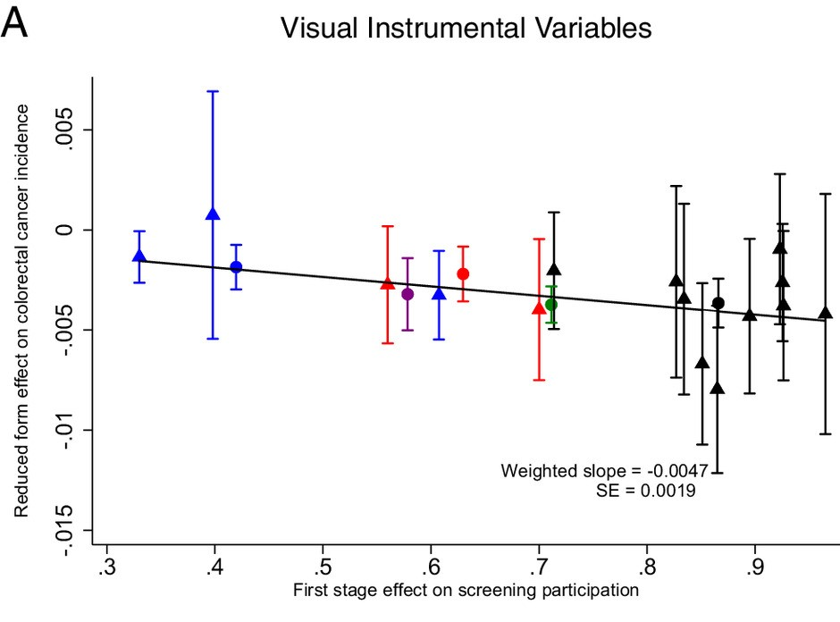
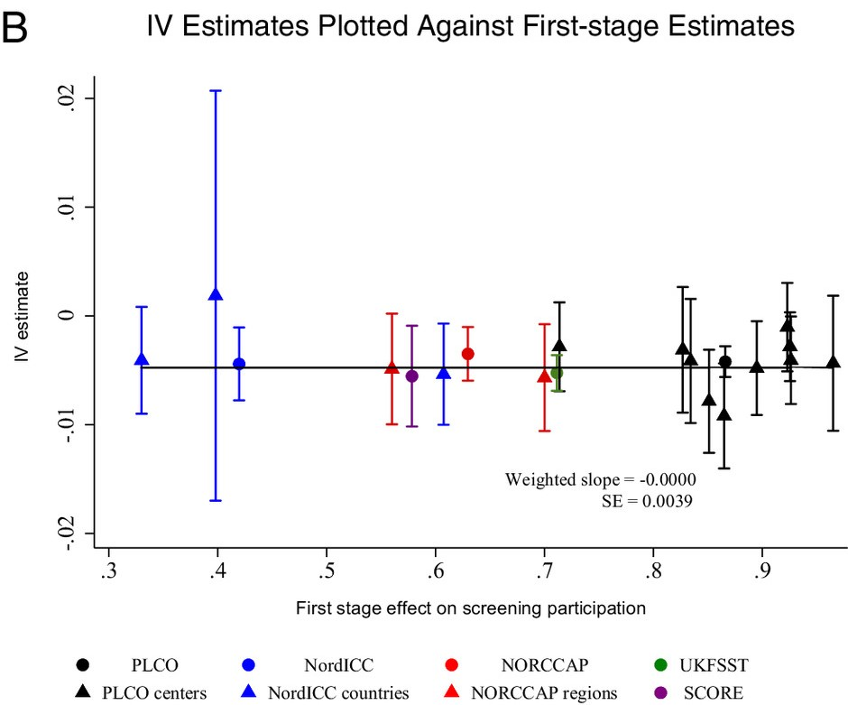

```{r, setup, include = F}
# devtools::install_github("dill/emoGG")
library(pacman)
p_load(
  broom, tidyverse,
  ggplot2, ggthemes, ggforce, ggridges,
  latex2exp, viridis, extrafont, gridExtra, cowplot,
  kableExtra, snakecase, janitor,
  data.table, dplyr,
  lubridate, knitr,
  estimatr, lfe, here, magrittr, MASS, xtable
)
# Define pink color
red_pink <- "#e64173"
turquoise <- "#20B2AA"
orange <- "#FFA500"
red <- "#fb6107"
blue <- "#3b3b9a"
green <- "#8bb174"
grey_light <- "grey70"
grey_mid <- "grey50"
grey_dark <- "grey20"
purple <- "#6A5ACD"
slate <- "#314f4f"
# Dark slate grey: #314f4f
# Knitr options
opts_chunk$set(
  comment = "#>",
  fig.align = "center",
  fig.height = 7,
  fig.width = 10.5,
  warning = F,
  message = F
)
opts_chunk$set(dev = "svg")
options(device = function(file, width, height) {
  svg(tempfile(), width = width, height = height)
})
options(crayon.enabled = F)
options(knitr.table.format = "html")
# A blank theme for ggplot
theme_empty <- theme_bw() + theme(
  line = element_blank(),
  rect = element_blank(),
  strip.text = element_blank(),
  axis.text = element_blank(),
  plot.title = element_blank(),
  axis.title = element_blank(),
  plot.margin = structure(c(0, 0, -0.5, -1), unit = "lines", valid.unit = 3L, class = "unit"),
  legend.position = "none"
)
theme_simple <- theme_bw() + theme(
  line = element_blank(),
  panel.grid = element_blank(),
  rect = element_blank(),
  strip.text = element_blank(),
  axis.text.x = element_text(size = 18, family = "STIXGeneral"),
  axis.text.y = element_blank(),
  axis.ticks = element_blank(),
  plot.title = element_blank(),
  axis.title = element_blank(),
  # plot.margin = structure(c(0, 0, -1, -1), unit = "lines", valid.unit = 3L, class = "unit"),
  legend.position = "none"
)
theme_axes_math <- theme_void() + theme(
  text = element_text(family = "MathJax_Math"),
  axis.title = element_text(size = 22),
  axis.title.x = element_text(hjust = .95, margin = margin(0.15, 0, 0, 0, unit = "lines")),
  axis.title.y = element_text(vjust = .95, margin = margin(0, 0.15, 0, 0, unit = "lines")),
  axis.line = element_line(
    color = "grey70",
    size = 0.25,
    arrow = arrow(angle = 30, length = unit(0.15, "inches")
  )),
  plot.margin = structure(c(1, 0, 1, 0), unit = "lines", valid.unit = 3L, class = "unit"),
  legend.position = "none"
)
theme_axes_serif <- theme_void() + theme(
  text = element_text(family = "MathJax_Main"),
  axis.title = element_text(size = 22),
  axis.title.x = element_text(hjust = .95, margin = margin(0.15, 0, 0, 0, unit = "lines")),
  axis.title.y = element_text(vjust = .95, margin = margin(0, 0.15, 0, 0, unit = "lines")),
  axis.line = element_line(
    color = "grey70",
    size = 0.25,
    arrow = arrow(angle = 30, length = unit(0.15, "inches")
  )),
  plot.margin = structure(c(1, 0, 1, 0), unit = "lines", valid.unit = 3L, class = "unit"),
  legend.position = "none"
)
theme_axes <- theme_void() + theme(
  text = element_text(family = "Fira Sans Book"),
  axis.title = element_text(size = 18),
  axis.title.x = element_text(hjust = .95, margin = margin(0.15, 0, 0, 0, unit = "lines")),
  axis.title.y = element_text(vjust = .95, margin = margin(0, 0.15, 0, 0, unit = "lines")),
  axis.line = element_line(
    color = grey_light,
    size = 0.25,
    arrow = arrow(angle = 30, length = unit(0.15, "inches")
  )),
  plot.margin = structure(c(1, 0, 1, 0), unit = "lines", valid.unit = 3L, class = "unit"),
  legend.position = "none"
)
theme_set(theme_gray(base_size = 20))
# Column names for regression results
reg_columns <- c("Term", "Est.", "S.E.", "t stat.", "p-Value")
# Function for formatting p values
format_pvi <- function(pv) {
  return(ifelse(
    pv < 0.0001,
    "<0.0001",
    round(pv, 4) %>% format(scientific = F)
  ))
}
format_pv <- function(pvs) lapply(X = pvs, FUN = format_pvi) %>% unlist()
# Tidy regression results table
tidy_table <- function(x, terms, highlight_row = 1, highlight_color = "black", highlight_bold = T, digits = c(NA, 3, 3, 2, 5), title = NULL) {
  x %>%
    tidy() %>%
    select(1:5) %>%
    mutate(
      term = terms,
      p.value = p.value %>% format_pv()
    ) %>%
    kable(
      col.names = reg_columns,
      escape = F,
      digits = digits,
      caption = title
    ) %>%
    kable_styling(font_size = 20) %>%
    row_spec(1:nrow(tidy(x)), background = "white") %>%
    row_spec(highlight_row, bold = highlight_bold, color = highlight_color)
}
```

# Intro
## Roadmap

:::{.smaller}

### 1. Motivation
- Endogeneity and omitted variable bias
- Simultaneity and measurement error
- Why selection-on-observables may fail

---

### 2. Instrumental Variables Framework
- Structural vs. reduced form
- Wald estimator (binary instrument)
- 2SLS with multiple instruments

:::
---

:::{.smaller}

### 3. Identification Assumptions
- Relevance
- Exclusion restriction
- Independence
- Monotonicity (for LATE)

---

### 4. Interpretation
- LATE and compliers
- Comparison to ATE / ATT
- Policy interpretation

:::

---

:::{.smaller}

### 5. Implementation in R
- First stage diagnostics
- Weak instrument tests
- Clustered SEs
- `fixest::feols()` IV syntax

---

### 6. Applications & Pitfalls
- Weak instruments
- Overidentification tests
- Threats to exclusion
- External validity

:::

## Learning Objectives

By the end of this lecture, you should be able to:

::: {.fragment}
- Diagnose sources of endogeneity in an applied setting
:::

::: {.fragment}
- Derive the Wald estimator and interpret 2SLS as a ratio of covariances
:::

::: {.fragment}
- State and evaluate the IV identification assumptions
:::

::: {.fragment}
- Explain LATE and identify the population being estimated
:::

::: {.fragment}
- Implement IV estimation in R and interpret first-stage diagnostics
:::

::: {.fragment}
- Assess instrument strength and common specification threats
:::

## Today

Instrumental variables (and two-stage least squares)

## Upcoming

- Problem Set 4 - due 3/3

# Reading
## Shift-Share/Bartik instruments
- [Mixtape Ch. 7.8.3]{.orange}
- [Autor, D. H., Dorn, D., & Hanson, G. H. (2013). The China syndrome: Local labor market effects of import competition in the United States. American economic review, 103(6), 2121-2168.](https://www.aeaweb.org/articles?id=10.1257/aer.103.6.2121)

- [Goldsmith-Pinkham, P., Sorkin, I., & Swift, H. (2020). Bartik instruments: What, when, why, and how. American Economic Review, 110(8), 2586-2624.](https://www.aeaweb.org/articles?id=10.1257/aer.20181047)

- [Borusyak, K., Hull, P., & Jaravel, X. (2022). Quasi-experimental shift-share research designs. The Review of Economic Studies, 89(1), 181-213.](https://academic.oup.com/restud/article/89/1/181/6294942)

# Research designs

## Selection on observables and/or unobservables

We've been focusing on ***selection-on-observables* designs**, _i.e._,
$$
\begin{align}
  \def\ci{\perp\mkern-10mu\perp}
  \left(\text{Y}_{0i},\, \text{Y}_{1i}\right) \ci \text{D}_{i}|\text{X}_{i}
\end{align}
$$
for **observable** variables $\text{X}_{i}$.

::: {.fragment}
**<span style="color:#1f4e79">*Selection-on-unobservable* designs</span>** replace this assumption with two new (but related) assumptions

1. $\left(\text{Y}_{0i},\, \text{Y}_{1i}\right) \perp \text{Z}_{i}$ - There is a variable $Z_i$ that is independent of the potential outcomes.

2. $\mathop{\text{Cov}} \left( \text{Z}_{i},\, \text{D}_{i} \right) \neq 0$ - That variable $Z_i$ is correlated with treatment $(D_i)$.
:::

## Selection on observables and/or unobservables
The goal of applied econometrics is to estimate causal parameters.  We need to isolate exogenous variation in $\text{D}_{i}$.

::: {.fragment}
(We want to avoid selection bias.)
:::

::: {.fragment}
- **Selection-on-observables designs** assume that we can control for all *endogenous variation* (selection) in $\text{D}_{i}$ through a known (and observed) $\text{X}_{i}$.
:::

::: {.fragment}
- **<span style="color:#1f4e79">Selection-on-unobservables designs</span>** assume we can isolate *exogenous variation* in $\text{D}_{i}$ (generally using some $\text{Z}_{i}$) and then use this component of $\text{D}_{i}$ to estimate the causal effect of $\text{D}_{i}$ on $\text{Y}_{i}$.
:::

::: {.fragment}
 We ignore or remove the *endogenous variation* in $\text{D}_{i}$ (it's bad).
:::

## Which is better?

::: {.smaller}
Both ***selection-on-unobservable*** and **<span style="color:#1f4e79">*selection-on-unobservable*</span>** designs represent _identification strategies_. Is one intrinsically prefered to the other?

::: {.fragment}
Both rely on assumptions.  The question is which assumptions are defensible in a given application.
:::

::: {.fragment}
1. It's easy to violate the assumptions of either design.
:::

::: {.fragment}
2. **Selection on observables** assumes we know _everything_ about selection into treatment—we can remove all of the selection bias (recall our omitted variable bias formula)
[Difficult in observational settings, and difficult to validate.]{.red}
:::

::: {.fragment}
3. **<span style="color:#1f4e79">Selection on unobservables</span>** assumes we can isolate _some_ exogenous variation in $\text{D}_{i}$, which we then use to estimate the effect of $\text{D}_{i}$ on $\text{Y}_{i}$. <br>[Can defend in some settings, and possible to validate. May have power issues.]{.red}
:::
:::

# Instrumental variables

## Introduction

**Instrumental variables:** (IV).super[.dblue[1]] is the canonical selection-on-unobservables design.  We attempt to isolate **exogneous variation** in $\text{D}_{i}$ via an [instrument]{.dblue} $\color{#0073e6}{\text{Z}_{i}}$.

Note: For the moment, we're lumping together IV and two-stage least squares (2SLS) together—as many people do—even though they are technically different.

---

Consider some model (structural equation)
$$
\begin{align}
  \text{Y}_{i} = \beta_0 + \beta_1 \text{D}_{i} + \varepsilon_i \tag{1}
\end{align}
$$
To guarantee consistent (unbiased) OLS estimates for $\beta_1$ we need $\mathop{\text{Cov}} \left( \text{D}_{i},\,\varepsilon_i \right)=0$.

<br> We cannot test this, so really we need to *assume* $\mathop{\text{Cov}} \left( \text{D}_{i},\,\varepsilon_i \right)=0$.
<br> In general, this is a heroic assumption.

::: {.fragment}
**Alternative:** Estimate $\beta_1$ via instrumental variables.
:::

## Definition

::: {.smaller}
For our model
$$
\begin{align}
  \text{Y}_{i} = \beta_0 + \beta_1 \text{D}_{i} + \varepsilon_i \tag{1}
\end{align}
$$

A valid **instrument** is a variable $\color{#0073e6}{\text{Z}_{i}}$ such that

::: {.fragment}
1. $\mathop{\text{Cov}} \left( \color{#0073e6}{\text{Z}_{i}},\, \text{D}_{i} \right) \neq 0$
:::
::: {.fragment}
- our [instrument]{.dblue} is correlated with treatment
:::

::: {.fragment}
2. $\mathop{\text{Cov}} \left( \color{#0073e6}{\text{Z}_{i}},\, \varepsilon_i \right) = 0$
:::
::: {.fragment}
- and our [instrument]{.dblue} is uncorrelated with determinants of $\text{Y}_{i}$ other than $D_i$  **(exclusion restriction)**
:::
::: {.fragment}
- Another way of stating the exclusion restriction is that the only way that $Z_i$ affects $Y_i$ is through $D_i$.
:::
:::

## Example

::: {.smaller}
Back to the returns to a college degree,
$$
\begin{align}
  \text{Income}_i = \beta_0 + \beta_1 \text{Grad}_i + \varepsilon_i
\end{align}
$$
OLS is likely biased.

::: {.fragment}
Why?
:::

::: {.fragment}
What if that state conducts a random [**lottery**]{.dblue} for scholarships? 
:::

::: {.fragment}
Let $\color{#0073e6}{\text{Lottery}_i}$ denote an indicator for whether $i$ won a lottery scholarship.

[Note: It's important to consider who is eligible and/or applied to the lottery.]{.smallest}
:::

::: {.fragment}
1. $\mathop{\text{Cov}} \left( \color{#0073e6}{\text{Lottery}_i},\, \text{Grad}_i \right)\neq 0$ if scholarships increase graduation rates.
:::

::: {.fragment}
2. $\mathop{\text{Cov}} \left(\color{#0073e6}{\text{Lottery}_i},\, \varepsilon_i\right) = 0$ since the lottery is randomized.
:::

:::

# Instrumental variables
## The IV estimator

The IV estimator for our model
$$
\begin{align}
  \text{Y}_{i} = \beta_0 + \beta_1 \text{D}_{i} + \varepsilon_i \tag{1}
\end{align}
$$
with (valid) instrument $\color{#0073e6}{\text{Z}_{i}}$ is
$$
\begin{align}
   \hat{\beta}_\text{IV} = \left(\text{Z}'\text{D}\right)^{-1} \left( \text{Z}'\text{Y}\right)
\end{align}
$$
--- 

If you have no covariates, then
$$
\begin{align}
  \hat{\beta}_\text{IV} = \dfrac{\mathop{\text{Cov}} \left( \color{#0073e6}{\text{Z}_{i}},\, \text{Y}_{i}\right)}{\mathop{\text{Cov}} \left( \color{#0073e6}{\text{Z}_{i}},\, \text{D}_{i} \right)}
\end{align}
$$

If you have additional (exogenous) covariates $\text{X}_i$, then
$$
\begin{align}
  \text{Z} &= \begin{bmatrix}\color{#0073e6}{\text{Z}_{i}} & \text{X}_{i}\end{bmatrix}
  \\[0.5em]
  \text{D} &= \begin{bmatrix}\color{#0073e6}{\text{D}_{i}} & \text{X}_{i}\end{bmatrix}
\end{align}
$$

# Two-stage least squares
## Setup

We often implement IV as a two-stage process known as **two-stage least squares** (2SLS).

::: {.fragment}
**First stage:** Estimate the effect of the instrument $\color{#0073e6}{\text{Z}_{i}}$ on our endogenous treatment variable $\text{D}_{i}$ and (predetermined) covariates $\text{X}_{i}$. Save $\color{#006400}{\widehat{\text{D}}_{i}}$.

$$
\begin{align}
  \text{D}_{i} = \gamma_1 \color{#0073e6}{\text{Z}_{i}} + \gamma_2 \text{X}_{i} + u_i
\end{align}
$$
:::

::: {.fragment}
**Second stage:** Estimate the original structural model replace $\text{D}_i$ with $\color{#006400}{\widehat{\text{D}}_{i}}$.

$$
\begin{align}
  \text{Y}_{i} = \beta_1 \color{#006400}{\widehat{\text{D}}_{i}} + \beta_2 \text{X}_{i} + \varepsilon_i
\end{align}
$$
:::

::: {.fragment .smallest}
**Note:** The controls $\text{X}_{i}$ must match in the first and second stages.
:::


## IV estimation

This two-step procedure, with a valid instrument, produces an estimator $\hat{\beta}_1$ that is consistent for $\beta_1$.

$$
\begin{align}
  \hat{\beta}_\text{2SLS} &= \left( \text{D}' \text{P}_{\text{Z}} \text{D} \right)^{-1} \left( \text{D}' \text{P}_{\text{Z}} \text{Y} \right)
  \\[0.3em]
  \text{P}_{\text{Z}} &= \text{Z} \left( \text{Z}'\text{Z} \right)^{-1} \text{Z}'
\end{align}
$$

where $\text{D}$ is a matrix of our treatment and predetermined covariates $\left( \text{X}_{i} \right)$ and $\text{Z}$ is a matrix of our instrument and our predetermined covariates.

## IV estimation

Important notes

- The controls $\left( \text{X}_{i} \right)$ must match in the first and second stages.

- If you have exactly **one instrument** and exactly **one endogenous variable**, then 2SLS and IV are identical.

- Your second-stage standard errors are not correct.

## The reduced form

In addition to the regressions within the two stages of 2SLS

1. $\text{D}_{i} = \gamma_1 \color{#0073e6}{\text{Z}_{i}} + \gamma_2 \text{X}_{i} + u_i$
2. $\text{Y}_{i} = \beta_1 \color{#006400}{\widehat{\text{D}}_{i}} + \beta_2 \text{X}_{i} + \varepsilon_i$

there is a third important and related regression:

::: {.fragment}
the reduced form.
:::

::: {.fragment}
The **reduced form** regresses the outcome $\text{Y}_{i}$ (LHS of the second stage) on our instrument $\color{#0073e6}{\text{Z}_{i}}$ and covariates $\text{X}_{i}$ (RHS of the first stage).
$$
\begin{align}
   \text{Y}_{i} = \pi_1 \color{#0073e6}{\text{Z}_{i}} + \pi_2 \text{X}_{i} + u_i
\end{align}
$$
:::

::: {.fragment}
Thus, the reduced form provides a consistent estimate of the causal effect of our instrument on the outcome.
:::

## The reduced form

While the reduced form estimates the causal effect of the instrument on our outcome, we're usually interested in the effect of *treatment* $\left( \text{D}_{i} \right)$.

::: {.fragment}
That said, the reduced form is still incredibly helpful/important:
:::

::: {.incremental}
- Clarifies your source of identifying variation. 
- Does not suffer from *weak instruments* problems. 
- Only requires $\mathop{\text{Cov}} \left( \text{Z}_{i},\, \varepsilon_i \right) = 0$. 
- Offers insights into your estimates
:::

::: {.fragment}
$$
\begin{align}
  \widehat{\beta}_{1}^\text{2SLS} = \dfrac{\widehat{\pi}_{1}}{\widehat{\gamma}_{1}}
\end{align}
$$
when you have exactly one instrument.
:::

## The reduced form, intuition

::: {.smaller}
This expression for the 2SLS (and IV) estimator can be very helpful.
$$
\begin{align}
  \widehat{\beta}_{1}^\text{2SLS} = \dfrac{\color{#8B0000}{\widehat{\pi}_{1}}}{\color{#006400}{\widehat{\gamma}_{1}}} = \dfrac{\color{#8B0000}{\text{Reduced-form estimate}}}{\color{#006400}{\text{First-stage estimate}}}
\end{align}
$$


::: {.fragment}
What's the interpretation/intuition?
:::
::: {.fragment}
Back to our example: $\widehat{\beta}_1 =$ estimated effect of college graduation on income.
:::
::: {.fragment}
$\color{#8B0000}{\widehat{\pi}_1}$ gives the estimated causal effect of the scholarship lottery on income. 
:::
::: {.fragment}
We need to consider how winning the lottery affects graduation. We need to rescale $\color{#8B0000}{\widehat{\pi}_1}$ if the effect of lottery on graduation is $<$ 100%.
:::
::: {.fragment}
$\color{#006400}{\widehat{\gamma}_1}$ estimates the effect of winning the scholarship lottery on graduation — the share of winners who graduated *due* to winning.
:::

::: {.fragment}
 We can scale with $\color{#006400}{\widehat{\gamma}_1}$!
:::

:::

## The reduced form, example

Let's gain some insight into scaling the reduced form.  Imagine that 50% of lottery winners graduate from college due to the lottery, _i.e._, $\color{#006400}{\widehat{\gamma}_1 =}$ [0.50]{.green}.

::: {.fragment}
Imagine none of the applicants would have graduated otherwise
:::
::: {.fragment}
Our reduced-form estimate of $\color{#8B0000}{\widehat{\pi}_1= \$5,000}$ says that lottery winners make $5,000 more than the control group, on average.
:::

::: {.fragment}
However, half of the winners did not graduate, so $\color{#8B0000}{\widehat{\pi}_1}$ "underestimates" the effect of college graduation by combining graduates by nongraduates.
:::


::: {.fragment}
Thus, we want to double $\color{#8B0000}{\widehat{\pi}_1}$, _i.e._, divide by $\color{#006400}{\widehat{\gamma}_1}$:
:::
::: {.fragment}
$\color{#8B0000}{\widehat{\pi}_1}/\color{#006400}{\widehat{\gamma}_1}$ =$\color{#8B0000}{\$5,000}/\color{#006400}{0.50}$ = $10,000.
:::

---

**Q:** How do we get this intuitive expression? $\left( \widehat{\beta}_1^\text{IV} = \dfrac{\widehat{\pi}_1}{\widehat{\gamma}_1} \right)$


## Derivation

::: {.smaller}
::: {.fragment}
$\widehat{\beta}_1^\text{IV} = \left( \text{Z}'\text{D} \right)^{-1} \left( \text{Z}'\text{Y} \right)$
:::

::: {.fragment}
$\color{#ffffff}{\widehat{\beta}_1^\text{IV}} = \left( \widetilde{\text{Z}}'\widetilde{\text{D}} \right)^{-1} \left( \widetilde{\text{Z}}'\text{Y} \right)$   applying FWL to reduce $\text{D}$ and $\text{Z}$ to vectors.
:::

::: {.fragment}
$\color{#ffffff}{\widehat{\beta}_1^\text{IV}} = \dfrac{\mathop{\text{Cov}} \left( \widetilde{\text{Z}}_{i},\, \text{Y}_{i} \right)}{\mathop{\text{Cov}} \left( \widetilde{\text{Z}}_i,\, \widetilde{\text{D}}_{i} \right)}$
:::

::: {.fragment}
 $= \dfrac{\mathop{\text{Cov}} \left( \widetilde{\text{Z}}_{i},\, \text{Y}_{i} \right)/\mathop{\text{Var}} \left( \widetilde{\text{Z}}_i \right)}{\mathop{\text{Cov}} \left( \widetilde{\text{Z}}_i,\, \widetilde{\text{D}}_{i} \right)/\mathop{\text{Var}} \left( \widetilde{\text{Z}}_i \right)}$
:::

::: {.fragment}
$\color{#ffffff}{\widehat{\beta}_1^\text{IV}} = \dfrac{\widehat{\pi}_1}{\widehat{\gamma}_1}$  [✔]{.dblue}
:::

::: {.fragment}
Let's push a bit deeper into IV's mechanics and intuition.
:::

:::

# IV: Mechanics and intuition
## Setup

::: {.smaller}
In this section, we'll use medical trials as a working example.

::: {.fragment}
We are interested in the regression model for the effect of some treatment (_e.g._, blood-pressure medication) on medical outcome $\text{Y}_{i}$
:::

::: {.fragment}
$$
\begin{align}
  \text{Y}_{i} = \beta_0 + \beta_1 \text{D}_{i} + \varepsilon_i
\end{align}
$$
$\text{D}_{i}$ indicates whether $i$ *takes* the treatment (medication). $\varepsilon_i$ captures all other factors that affect $\text{Y}_{i}$.
:::

::: {.fragment}
 Or in potential-outcomes framework:

$$
\begin{align}
  \text{Y}_{i} &= \text{Y}_{1i} \text{D}_{i} + \text{Y}_{0i} (1-\text{D}_{i}) \\
  \text{Y}_{0i} &= \beta_0 + \varepsilon_i \\
  \text{Y}_{1i} &= \text{Y}_{0i} + \beta_1
\end{align}
$$
:::

:::

::: {.smallest}
Credit/thanks go to [Michael Anderson](https://are.berkeley.edu/~mlanderson/ARE_Website/Home.html) via [Ed Rubin](http://edrub.in/) for this example—and much of these notes.
:::

## Research design

::: {.smaller}
**Goal:** *Estimate the effect of blood-pressure medication* on blood pressure.

::: {.fragment}
**Challenge: *Selection bias:* Even if treatment reduces blood pressure, selection bias fights against the estimated effect.
:::

::: {.fragment}
**Solution:** *Randomized medical trial:* Ask randomly chosen individuals in treatment group to take the pill. Control individual get placebo (or nothing).
:::

::: {.fragment}
**Analysis 1:** *Intention to treat (ITT)*: $\widehat{\beta}_1^\text{ITT} = \overline{\text{Y}}_\text{Trt} - \overline{\text{Y}}_\text{Ctrl}$
:::

::: {.fragment}
**ITT problem:** *Bias from noncompliance:* People don't always follow rules.
<br>*E.g.*, treated folks who don't take pills; control folks who take pills.
:::

::: {.fragment}
**Analysis 2:** *IV!*
:::

::: {.fragment}
 Instrument medication $\text{D}_{i}$ with intention to treat $\text{Z}_{i}$.
:::

:::

## The IV solution

First question: Is $\text{Z}_{i}$ a valid instrument for $\text{D}_{i}$?


::: {.fragment}
1. $\mathop{\text{Cov}} \left( \text{Z}_{i},\, \varepsilon_i \right) = 0$ as $\text{Z}_{i}$ was randomly assigned (exclusion restriction).
:::

::: {.fragment}
2. $\mathop{\text{Cov}} \left( \text{Z}_{i},\, \text{D}_{i} \right)\neq 0$ if assignment to treatment changes the likelihood you take the pills (first stage).
:::


::: {.fragment}
∴ $\text{Z}_{i}$ is a valid instrument for $\text{D}_{i}$ and IV consistently estimates $\beta_1$.
:::

## Noncompliance

**Noncompliant** individuals do not abide by their treatment assignment.

::: {.fragment}
Let's see how IV "solves" this problems.
:::

::: {.fragment}
First, assume noncompliance only affects treated individuals—*i.e.*, treated folks sometimes don't take their pills; control folks never take pills.

This is often called one-sided noncompliance. This would be the case of the COVID vaccine trials where the vaccine is not publicly available so subjects in the control group **cannot** take get the shot. 
:::

---

## Noncompliance, continued

The **first stage** recovers the share of treatment individuals who take the pill
$$
\begin{align}
  \text{D}_{i} = \gamma_1 \text{Z}_{i} + u_i
\end{align}
$$

::: {.fragment}
*i.e.*, if 50% of treated individuals take the medication, $\widehat{\gamma} =$ 0.50.
:::

::: {.fragment}
The **reduced form** estimates the *ITT*
$$
\begin{align}
  \text{Y}_{i} = \pi_1 \text{Z}_{i} + v_i
\end{align}
$$
:::

::: {.fragment}
which we know IV rescales using the first stage
$$
\begin{align}
  \widehat{\beta}_{1}^\text{IV} = \dfrac{\widehat{\pi}_1}{\widehat{\gamma}_1} = \dfrac{\widehat{\pi}_1}{0.50} =
  2 \times \widehat{\pi}_1
\end{align}
$$
:::


## Noncompliance, continued

::: {.smaller}
IV solves the noncompliance issue by rescaling by the rate of compliance.

::: {.fragment}
If everyone perfectly complies, then $\widehat{\gamma}_1 = 1$ and $\widehat{\beta}_{1}^\text{IV} = \widehat{\pi}_1/1 = \widehat{\beta}_{1}^\text{ITT}$.
:::

::: {.fragment}
**Further example:** $N_\text{Trt}$ = 10; trt. compliance = 50%; ctrl. compliance = 100%.

$\overline{\text{Y}}_\text{Trt} = \dfrac{5 (\beta_0 + \beta_1) + 5 (\beta_0)}{10} = \beta_0 + \dfrac{\beta_1}{2}$
:::

::: {.fragment}
 and $\overline{\text{Y}}_\text{Ctrl} = \beta_0$.
:::

::: {.fragment}
So our reduced-form estimate (the ITT) is $\widehat{\gamma}_1 = \dfrac{\beta_1}{2}$ (half the true effect).
:::

::: {.fragment}
IV consistently estimates $\beta_1$ via rescaling the ITT by the rate of compliance
$$
\begin{align}
  \widehat{\beta}_1^\text{IV} = \dfrac{\pi}{\gamma} = \dfrac{\beta_1/2}{1/2} = \beta_1
\end{align}
$$
:::

:::

## Example 

This can have big implications in many settings including medical trials with imperfect compliance.

Doctors and public health officials advocate for cancer screening as cost-effective medical intervention.

However, randomized trials for that invite participants to free colonoscopy and sigmoidoscopy show very different results.

So do screenings work?

::: {.fragment}
Enter IV!

[Angrist and Hull (2023)](https://www.pnas.org/doi/10.1073/pnas.2311556120)
:::

## Example 

```{r, echo=F, out.width='70%', out.height='70%'}

```

## Example 

```{r, echo=F, out.width='70%', out.height='70%'}

```

## Takeaways

Main points

1. IV **rescales** [the causal effect of]{.dblue} $\color{#0073e6}{\text{Z}_{i}}$ [on]{.dblue} $\color{#0073e6}{\text{Y}_{i}}$ by [the causal effect of]{.green} $\color{#006400}{\text{Z}_{i}}$ [on]{.green} $\color{#006400}{\text{D}_{i}}$.

::: {.fragment}
2. IV **does not** compare treated compliers to untreated non-compliers.
:::

::: {.fragment}
<br>Such a comparison/estimator would re-introduce selection bias.
:::

---

Thus far, we assumed homogeneous treatment effects.

**Q:** What happens .*when treatment effects are heterogeneous*?

# IV + heterogeneity

## Recap

So far we've discussed two concepts of treatment effects (really 3 if you count ITT).


::: {.incremental}
1. **Average treatment effect (ATE):** The average treatment effect for an individual randomly drawn from our sample.
1. **Average Treatment effect on the treated (ATT]):** The average treatment effect for a *treated* individual
randomly drawn from our sample.
:::

::: {.fragment}
When we assume homogeneous/constant treatment effects, ATE = ATT
:::

---

::: {.fragment}
**Q:** If treatment effects vary, then what do IV and 2SLS estimate?
:::

::: {.fragment}
**A:** Not ATE.
:::

::: {.fragment}
 And not ATT.
:::

::: {.fragment}
 They estimate the LATE.
:::

::: {.fragment}
 See [Angrist, Imbens, and Rubin (1996)](https://www.jstor.org/stable/2291629).
:::

## The LATE

IV generally estimates the [**LATE**]{.dblue} — the [Local Average Treatment Effect]{.dblue}.

::: {.fragment}
**Recall:** IV works by isolating variation in $\text{D}_{i}$ induced by our instrument $\text{Z}_{i}$.
:::

::: {.fragment}
In other words: IV focuses on the individuals whose $\text{D}_{i}$ changes [**due**]{.red} to $\text{Z}_{i}$.

Angrist, Imbens, and Rubin (1996) call these individuals **compliers**.
:::

---

However, *compliers* are only one of four possible groups.

::: {.incremental}
1. **Compliers** $\text{D}_{i} = 1$ iff $\text{Z}_{i}=1$.
1. **Always-takers** $\text{D}_{i} = 1$ $\forall \text{ Z}_{i}$.
1. **Never-takers** $\text{D}_{i} = 0$ $\forall \text{ Z}_{i}$.
1. **Defiers** $\text{D}_{i} = 1$ iff $\text{Z}_{i}=0$.
:::

::: {.incremental}
1. **Compliers** Only take pills **when treated**.
1. **Always-takers** **Always** take pills.
1. **Never-takers** **Never** take pills.
1. **Defiers** <br>Only take pills **when untreated**.
:::

## The LATE

::: {.smaller}
Because IV only uses variation in $\text{D}_{i}$ that correlates with $\text{Z}_{i}$, IV mechanically drops *always-takers* and *never-takers*.

::: {.fragment}
Most IV derivations/applications assume away the existence of *defiers*. 
:::

::: {.fragment}
*What's the problem with defiers and what assumption does IV usually make to deal with them?*
:::

::: {.fragment}
We'll come back to this later.
:::

::: {.fragment}
Thus, IV estimates a treatment effect **using only *compliers***.
:::

::: {.fragment}
Hence the "local" in *local average treatment effect*.  
:::

::: {.fragment}
We can only make inference on a subset of the population of interest - **those who are induced into treatment by the instrument.**
:::

:::

## The LATE: Medical-trial example

Imagine treatment works for some $\left( \beta_{1,i} < 0 \right)$ and not for others $\left( \beta_{1,j} = 0 \right)$.

Suppose individuals know their response to blood-pressure medication.

::: {.incremental}
- $\beta_{1,i}<0$ individuals always take the pill.
- $\beta_{1,j}=0$ individuals only take the pill when treated.
:::

::: {.fragment}
Then our compliers will be individuals for whom $\beta_{1,j}=0$.
:::

::: {.fragment}
Thus, IV's LATE will indicate no treatment effect $\left( \widehat{\beta}_1^\text{IV} = 0 \right)$ even though the true ATE is nonzero  $\left( \beta_1^\text{ATE} \neq 0 \right)$ .
:::

## The LATE

**Q:** So is IV actually inconsistent?

::: {.fragment}
**A:** It depends what you are trying to estimate (and how you interpret it).

IV doesn't estimate the ATE or ATT, so it would be inconsistent for them.
:::

::: {.fragment}
IV estimates the *local* average treatment effect.
:::

::: {.fragment}
**Takeaway 1:** Because IV identifies off of compliers, it estimates an average treatment effect for these individuals (who *comply* with the instrument).
:::

::: {.fragment}
**Takeaway 2:** Different instruments have different LATEs.
:::

## Monotonicity

We've already written down the two classical IV/2SLS assumptions

- **First stage:** $\mathop{\text{Cov}} \left( \text{Z}_{i},\, \text{D}_{i} \right) > 0$
- **Exclusion restriction:** $\mathop{\text{Cov}} \left( \text{Z}_{i},\, \varepsilon_{i} \right) = 0$

but we need a third assumption to ensure IV's complier-based LATE interpretation.

::: {.fragment}
- [**Monotonicity (Uniformity):**]{.dblue} $\text{D}_{i}(z)\geq \text{D}_{i}(z')$ or $\text{D}_{i}(z)\leq \text{D}_{i}(z') \enspace \forall i$
  - [Heckman](http://jenni.uchicago.edu/papers/koop2006/koop2-IV_ho_2006-09-25a_mms.pdf): *Uniformity* of responses *across persons.*
  - [Imbens and Angrist (1994)](https://www.jstor.org/stable/2951620): Instrument has monotone effect on $\text{D}_{i}$.
:::


## Monotonicity

If "defiers" exist, then monotonicity/uniformity is violated.

::: {.fragment}
In this case, the IV estimand is

$$
\begin{align}
  \dfrac{\tau_{c} \mathop{\text{Pr}}\left(\text{complier}\right) - \tau_{d} \mathop{\text{Pr}}\left(\text{defier}\right)}{ \mathop{\text{Pr}}\left(\text{complier}\right) -  \mathop{\text{Pr}}\left(\text{defier}\right)}
\end{align}
$$

which is not bound between $\tau_{c}$ and $\tau_{d}$.
:::

::: {.fragment}
**Example:** $\tau_c=$ 1 and $\tau_d=$ 2. $\mathop{\text{Pr}}\left(\text{complier}\right)=$ 2/3 and $\mathop{\text{Pr}}\left(\text{defier}\right)=$ 1/3.
:::

::: {.fragment}
Then the "LATE" is 0.
:::

::: {.fragment}
**Note:** Some people would instead say that there is no LATE when you violate monotonicity.
:::

---

Until now, we've focused on using a single instrument.

The 2SLS estimator accommodates multiple instruments.

Whether you can find multiple valid instruments is another question.

---

# Multiple instruments
## Motivation

**Q:** Why include multiple instruments?

::: {.fragment}
**A:** Multiple instruments can capture more variation in $\text{D}_{i}$ (efficiency).
:::

::: {.fragment}
Using terminology from the *system-of-equations* literature,

- one instrument for one endogenous variable: *just identified*
- multiple instruments for one endogenous variable: *over identified*
:::

## In practice

With (valid) instruments $\text{Z}_{1i}$ and $\text{Z}_{2i}$, the first stage becomes
$$
\begin{align}
  \text{D}_{i} = \gamma_0 + \gamma_1 \text{Z}_{1i} + \gamma_2 \text{Z}_{2i} + \gamma_3 \text{X}_{i} + u_i
\end{align}
$$


::: {.fragment}
while the second stage is still
$$
\begin{align}
  \text{Y}_{i} = \beta_0 + \beta_1 \widehat{\text{D}}_{i} + \beta_2 \text{X}_{i} + v_i
\end{align}
$$
:::

# Weak  Instruments

Recall how the first stage estimate affects the 2SLS estimate.
$$
\begin{align}
  \widehat{\beta}^\text{2SLS} = \dfrac{\widehat{\pi}}{\widehat{\gamma}}
\end{align}
$$
where $\widehat{\pi}$ is the reduced form estimate and $\widehat{\gamma}$ is the first stage estimate.

$\widehat{\gamma}$ enters this formula in the **denominator** and therefore has a **nonlinear** effect on  $\widehat{\beta}^\text{2SLS}$ 

When $\gamma$ is small then small variation in $\widehat{\gamma}$ can have really big impacts on $\widehat{\beta}^\text{2SLS}$.

Let's look at this with some simulations 

**Note:** Acknowledgement to Paul Goldsmith-Pinkham for these simulations.

---

2SLS simulation:

- binary instrument
- First stage coefficient = 0.5
- $\beta$ = 2
- Variation in 2sLS estimation comes from variation in first stage
- In this setting the length of the interval corresponds to the variation/strength
of the instrument

---

:::{.smaller}
```{r, echo=FALSE, eval=T, include=F}
set.seed(123)
dblue = rgb(0,114,178,maxColorValue = 255)
dred = rgb(213,94,0,maxColorValue = 255)
dgreen = rgb(46,147,60,maxColorValue = 255)
max_var_d = 0.25
# want var(d) = 0.5. var(z) = 0.25. if pi = .5, then 
pi <- .5
beta <- 2
z <- rbinom(1000, 1, .5)
u <- rnorm(1000, 0, sqrt(max_var_d - var(z)*pi^2))
rho = 0
d = z*pi[1] + u 
eps =  rnorm(1000, sd = 0.5)
y = d*beta[1]  + eps + rho*u

reg_data = data.frame(y, d,z)
summary(felm(y ~ 1 | 0 | (d ~ z) , data = reg_data))


d_hat_0  = mean(reg_data$d[reg_data$z==0])
d_hat_1  = mean(reg_data$d[reg_data$z==1])

y_hat_0  = mean(reg_data$y[reg_data$z==0])
y_hat_1  = mean(reg_data$y[reg_data$z==1])
```

```{r, echo=FALSE, out.width='90%', out.height='90%'}

g =ggplot() +
  geom_point(data = tibble(y = c(y_hat_0, y_hat_1), 
                           d = c(d_hat_0, d_hat_1),
                           case = c("Z=0", "Z=1")),
             aes(y = y, x = d, label = case), 
             color = dblue)+
  geom_text(data = tibble(y = c(y_hat_0, y_hat_1), 
                          d = c(d_hat_0, d_hat_1) -.005,
                          case = c("Z=0", "Z=1")),
            aes(y = y, x = d, label = case), hjust=1, size = 6,
            color = dblue) +
  geom_segment(data = tibble(y0 = y_hat_0, y1 = y_hat_1, 
                             d0 = d_hat_0, d1 = d_hat_1),
               aes(y = y0, yend = y1, x = d0, xend = d1),
               color = dblue) +
  annotate("text", x = .01+ (d_hat_0+d_hat_1)/2 , 
           y = (y_hat_0+y_hat_1)/2, hjust=0,
           label="Slope = 2SLS estimate", size = 6, color = dblue) +
  labs(y = "", 
       x = "D",
       title = "Y") +
  theme(text = element_text(size = 36),
        plot.title.position = "plot")

g +
  geom_point(data = tibble(y = y, 
                           d = d),
             aes(y = y, x = d), 
             color = dred, alpha = 0.2) + 
  theme_minimal()
  
```

First stage coefficient = 0.5; $\beta$ = 2
:::

---

:::{.smaller}
```{r, echo=FALSE, eval=T, include=F}
set.seed(123)
dblue = rgb(0,114,178,maxColorValue = 255)
dred = rgb(213,94,0,maxColorValue = 255)
dgreen = rgb(46,147,60,maxColorValue = 255)
max_var_d = 0.25
# want var(d) = 0.5. var(z) = 0.25. if pi = .5, then 

g2=g + 
  geom_point(data = tibble(y = y, 
                           d = d),
             aes(y = y, x = d), 
             color = dred)
xrange_fix = ggplot_build(g2)$layout$panel_scales_x[[1]]$range$range
yrange_fix = ggplot_build(g2)$layout$panel_scales_y[[1]]$range$range
g + 
  annotate("text", x = Inf, 
           y = (d_hat_0+d_hat_1), hjust=1,
           label="Slope = Truth", size = 8) +
  geom_abline(intercept = 0, slope = 2) +
  xlim(xrange_fix) + ylim(yrange_fix)


pi <- .1
beta <- 2
u <- rnorm(1000, 0, sqrt(max_var_d - .25*pi^2))

d = z*pi[1] + u
y = d*beta[1]  + eps

reg_data = data.frame(y, d,z)
summary(felm(y ~ 1 | 0 | (d ~ z) , data = reg_data))


d_hat_0  = mean(reg_data$d[reg_data$z==0])
d_hat_1  = mean(reg_data$d[reg_data$z==1])

y_hat_0  = mean(reg_data$y[reg_data$z==0])
y_hat_1  = mean(reg_data$y[reg_data$z==1])


```

```{r, echo=FALSE, out.width='90%', out.height='90%'}

g =ggplot() +
  geom_point(data = tibble(y = c(y_hat_0, y_hat_1), 
                           d = c(d_hat_0, d_hat_1),
                           case = c("Z=0", "Z=1")),
             aes(y = y, x = d, label = case), 
             color = dblue)+
  geom_text(data = tibble(y = c(y_hat_0, y_hat_1), 
                          d = c(d_hat_0, d_hat_1) -.005,
                          case = c("Z=0", "Z=1")),
            aes(y = y, x = d, label = case), hjust=1, size = 6,
            color = dblue) +
  theme_minimal() +
  xlim(xrange_fix) + ylim(yrange_fix) +
  geom_segment(data = tibble(y0 = y_hat_0, y1 = y_hat_1, 
                             d0 = d_hat_0, d1 = d_hat_1),
               aes(y = y0, yend = y1, x = d0, xend = d1),
               color = dblue) +
  labs(y = "", 
       x = "D",
       title = "Y") +
  theme(text = element_text(size = 24),
        plot.title.position = "plot")
g+ 
  geom_point(data = tibble(y = y, 
                           d = d),
             aes(y = y, x = d), 
             color = dred, alpha = 0.2)
```

First stage coefficient = 0.1; $\beta$ = 2
:::

---

```{r, echo=FALSE, out.width='90%', out.height='90%'}
set.seed(123)
dblue = rgb(0,114,178,maxColorValue = 255)
dred = rgb(213,94,0,maxColorValue = 255)
dgreen = rgb(46,147,60,maxColorValue = 255)
max_var_d = 0.25
# want var(d) = 0.5. var(z) = 0.25. if pi = .5, then 

g2=g + 
  geom_point(data = tibble(y = y, 
                           d = d),
             aes(y = y, x = d), 
             color = dred)
xrange_fix = ggplot_build(g2)$layout$panel_scales_x[[1]]$range$range
yrange_fix = ggplot_build(g2)$layout$panel_scales_y[[1]]$range$range
g + 
  annotate("text", x = Inf, 
           y = (d_hat_0+d_hat_1), hjust=1,
           label="Slope = Truth", size = 8) +
  geom_abline(intercept = 0, slope = 2) +
  xlim(xrange_fix) + ylim(yrange_fix)

```
Variation to estimate true effect is tiny.

---

:::{.smaller}
```{r, echo=FALSE, eval=T, include=F}
pi <- .01
beta <- 2
u <- rnorm(1000, 0, sqrt(max_var_d - .25*pi^2))

d = z*pi[1] + u
y = d*beta[1]  + eps

reg_data = data.frame(y, d,z)
summary(felm(y ~ 1 | 0 | (d ~ z) , data = reg_data))


d_hat_0  = mean(reg_data$d[reg_data$z==0])
d_hat_1  = mean(reg_data$d[reg_data$z==1])

y_hat_0  = mean(reg_data$y[reg_data$z==0])
y_hat_1  = mean(reg_data$y[reg_data$z==1])


```

```{r, echo=FALSE, out.width='90%', out.height='90%'}
g =ggplot() +
  geom_point(data = tibble(y = c(y_hat_0, y_hat_1), 
                           d = c(d_hat_0, d_hat_1),
                           case = c("Z=0", "Z=1")),
             aes(y = y, x = d, label = case), 
             color = dblue)+
  geom_text(data = tibble(y = c(y_hat_0, y_hat_1), 
                          d = c(d_hat_0, d_hat_1) -.005,
                          case = c("Z=0", "Z=1")),
            aes(y = y, x = d, label = case), hjust=1, size = 6,
            color = dblue) +
  theme_minimal() +
  xlim(xrange_fix ) + ylim(yrange_fix) +
  geom_segment(data = tibble(y0 = y_hat_0, y1 = y_hat_1, 
                             d0 = d_hat_0, d1 = d_hat_1),
               aes(y = y0, yend = y1, x = d0, xend = d1),
               color = dblue) +
  labs(y = "", 
       x = "D",
       title = "Y") +
  theme(text = element_text(size = 24),
        plot.title.position = "plot")
g+ 
  geom_point(data = tibble(y = y, 
                           d = d),
             aes(y = y, x = d), 
             color = dred, alpha = 0.2)
```
First stage coefficient = 0.01; $\beta$ = 2
:::

---

Let's look at how this impacts the 2SLS estimates.

We'll start with first stage coefficient = 0.01

The first stage estimates look okay 
```{r, echo=FALSE, out.width='70%', out.height='70%'}
set.seed(5302024)
beta = 2
pi = .2
gamma = .1
gamma_hat = rnorm(1000, gamma, sd = .05)
beta_hat = pi / gamma_hat


ggplot(data = tibble(beta_hat, gamma_hat)) +
  geom_histogram(aes(x = gamma_hat), bins = 100) +
  theme_minimal() +
  labs(x= "Gamma Hat", y = "") +
  theme(text = element_text(size = 24),
        plot.title.position = "plot")

```

---

However, the problems show up looking at the relationship between $\widehat{\gamma}$ 
and $\widehat{\beta}$.

This relationship is nonlinear and undefined when $\widehat{\gamma}$ = 0.
```{r, echo=FALSE, out.width='70%', out.height='70%'}
ggplot(data = tibble(beta_hat, gamma_hat)) + 
  geom_point(aes(y = beta_hat, x = gamma_hat)) +
  theme_minimal() +
  labs(x = "Gamma Hat", y = "Beta hat")+
  theme(text = element_text(size = 24),
        plot.title.position = "plot")

```

---

If the first stage is small and marginally significant (estimate = 0.1, se = 0.05
then a researcher may proceed with the analysis.

However, the distribution for $\widehat{\beta}$ is non normal, and asymptotic normality
is a bad approximation.

```{r, echo=FALSE, out.width='70%', out.height='70%'}
ggplot(data = tibble(beta_hat, gamma_hat)) + 
  geom_histogram(aes(x = beta_hat), bins = 100) +
  theme_minimal() +
  labs(x= "Beta Hat", y = "")+
  theme(text = element_text(size = 24),
        plot.title.position = "plot")


```

---

This is not the case if the first stage is larger in magnitude (0.5).

```{r, echo=FALSE, out.width='75%'}
set.seed(5302024)
beta = 2
pi = 1
gamma = .5
gamma_hat = rnorm(1000, gamma, sd = .05)
beta_hat = pi / gamma_hat

g1 <- ggplot(data = tibble(beta_hat, gamma_hat)) + 
  geom_point(aes(y = beta_hat, x = gamma_hat)) +
  theme_minimal() +
  labs(x = "Pi Hat", y = "Beta hat")+
  theme(text = element_text(size = 24),
        plot.title.position = "plot")

g2 <- ggplot(data = tibble(beta_hat, gamma_hat)) + 
  geom_histogram(aes(x = beta_hat), bins = 100) +
  theme_minimal() +
  labs(x= "Beta Hat", y = "")+
  theme(text = element_text(size = 24),
        plot.title.position = "plot")

plot_grid(g1,g2)

```

---

## Solutions to weak instruments: Pretesting

- One solution is to test whether the first stage relationship is "strong"

- A common approach is to look at the F-statistic

- [Staiger and Stock (1997)](https://www.jstor.org/stable/2171753) and [Stock and Yogo (2002)](https://www.nber.org/papers/t0284) develop a rule of thumb of
an F-stat above 10

- Bias won't be larger than 10% with size of 5%

- Key assumption is homoskedasticity

## Solutions to weak instruments: Pretesting

- Montieal and Pflueger (2013) have a heteroskedasticity-robust test
  - cutoff is closer to 23

- [Lee et al. (2022)](https://www.aeaweb.org/articles?id=10.1257/aer.20211063) show that current practice focuses on the $\beta$ term as opposed to 
the t-statistic

- Need a stronger F-stat of over 100!!

## Solutions to weak instruments: Pretesting

- [Angrist & Kolesar (2023)](https://www.sciencedirect.com/science/article/pii/S0304407623000295) claim that weak instruments are not a major concern in the just identified case

- Endogeneity needs to **very** high for the bias to outweigh the increase in noise.

- When endogeneity is less that 0.76, CI are distorted by no more than 5% for any F-stat.

- Focus on screening on the *sign* of the first stage as opposed to the F-stat

# 2SLS and [R]{.mono}

## `estimatr`

You can implement 2SLS/IV in many ways in .mono[R]. We'll use `estimatr` and `iv_robust()`.

::: {.fragment}
First let's create some sample data.

```{r, iv-data}
# Set seed
set.seed(12345)
# Sample size
n <- 100
# Define our variance-covariance matrix (D, ε, Z)
sig <- matrix(data = c(1, 0.5, 0.5, 0.5, 1, 0, 0.5, 0, 1), ncol = 3)
# Our vector of means (D, ε, Z)
mu = c(10, 0, 3)
# Draw n observations; convert to tibble
sample_data <- as.data.table(mvrnorm(n = n, mu = mu, Sigma = sig))
# Name variables
names(sample_data) <- c("D", "e", "Z")
# Calculate Y
sample_data[,Y := 7 + 2 * D + e]
```
:::

---

Specifically, we give `iv_robust()` the relationship that we want separted from the instrument by `|`


::: {.fragment}
, *e.g.*,

```{r, r-iv1}
# Estimate 2SLS
twosls <- iv_robust(Y ~ D | Z, data = sample_data, se_type = "classical")
tidy(twosls)[1:5]

```
:::

---

## Now in two stages!

We can also estimate 2SLS in two stages.

```{r, r-iv-s1}
# First stage
stage1 <- lm_robust(D ~ Z, data = sample_data, se_type = "classical")
# First-stage results
tidy(stage1)[1:5]
```

---

## Second stage

We just need to add $\widehat{\text{D}}_{i}$ to our dataset, and regress Y on $\widehat{\text{D}}_{i}$.

```{r, r-iv-s2}
# Add fitted (first-stage) values to data
sample_data[,D_hat := stage1$fitted.values]
# Second stage
stage2 <- lm_robust(Y ~ D_hat, data = sample_data, se_type = "classical")
# Second-stage results
tidy(stage2)[1:5]
```

---

## LATE

We could also calculate the LATE 'by hand'.


::: {.fragment}
Recall that:
$$
\begin{align}
  \widehat{\beta}^\text{IV} = \dfrac{\widehat{\pi}}{\widehat{\gamma}}
\end{align}
$$
where $\widehat{\pi}$ is the reduced form estimate and $\widehat{\gamma}$ is the first stage estimate.
:::


::: {.fragment}
Let's first estimate the reduced form (ITT).  

```{r, r-iv-reduce}
# First stage
reduce <- lm_robust(Y ~ Z, data = sample_data, se_type = "classical")
# First-stage results
tidy(reduce)[1:5]
```
:::

---

## LATE

From `reduce` $\widehat{\pi}$ =
```{r}
coef(reduce)[2]
```

and from `stage1` $\widehat{\gamma}$ =
```{r}
coef(stage1)[2]
```

$$
\begin{align}
  \widehat{\beta}^\text{IV} = \dfrac{\widehat{\pi}}{\widehat{\gamma}} = \dfrac{1.138}{0.537} = 2.121
\end{align}
$$

---

## Standard errors

However, recall that our second-stage standard errors are not correct.


::: {.fragment}
[Second-stage results]{.green}
```{r, r-iv-2sls1, echo = F}
tidy(stage2)[1:5]
```
:::

::: {.fragment}
**<span style="color:#1f4e79">2SLS results</span>**
```{r, r-iv-2sls2, echo = F}
tidy(twosls)[1:5]
```
:::

# IV and 2SLS
## Conclusions

1. IV/2SLS focus on **isolating some exogenous variation** in $\text{D}_{i}$ via $\text{Z}_{i}$.

1. Important **requirements**: strong first stage, excludability, monotonicity.

1. IV and 2SLS **rescale the reduced form** with the first stage.

1. Estimates are **LATE from compliers**.

1. Different instruments can produce **different LATEs**.

1. A **weak first stage** can lead to problems.


