```{r, setup, include = F}
# devtools::install_github("dill/emoGG")
library(pacman)
p_load(
  broom, tidyverse,
  ggplot2, ggthemes, ggforce, ggridges,
  latex2exp, viridis, extrafont, gridExtra,
  kableExtra, snakecase, janitor,
  data.table, dplyr,
  lubridate, knitr,
  estimatr, here, magrittr, MASS, xtable
)
# Define pink color
red_pink <- "#e64173"
turquoise <- "#20B2AA"
orange <- "#FFA500"
red <- "#fb6107"
blue <- "#3b3b9a"
green <- "#8bb174"
grey_light <- "grey70"
grey_mid <- "grey50"
grey_dark <- "grey20"
purple <- "#6A5ACD"
slate <- "#314f4f"
# Dark slate grey: #314f4f
# Knitr options
opts_chunk$set(
  comment = "#>",
  fig.align = "center",
  fig.height = 7,
  fig.width = 10.5,
  warning = F,
  message = F
)
opts_chunk$set(dev = "svg")
options(device = function(file, width, height) {
  svg(tempfile(), width = width, height = height)
})
options(crayon.enabled = F)
options(knitr.table.format = "html")
# A blank theme for ggplot
theme_empty <- theme_bw() + theme(
  line = element_blank(),
  rect = element_blank(),
  strip.text = element_blank(),
  axis.text = element_blank(),
  plot.title = element_blank(),
  axis.title = element_blank(),
  plot.margin = structure(c(0, 0, -0.5, -1), unit = "lines", valid.unit = 3L, class = "unit"),
  legend.position = "none"
)
theme_simple <- theme_bw() + theme(
  line = element_blank(),
  panel.grid = element_blank(),
  rect = element_blank(),
  strip.text = element_blank(),
  axis.text.x = element_text(size = 18, family = "STIXGeneral"),
  axis.text.y = element_blank(),
  axis.ticks = element_blank(),
  plot.title = element_blank(),
  axis.title = element_blank(),
  # plot.margin = structure(c(0, 0, -1, -1), unit = "lines", valid.unit = 3L, class = "unit"),
  legend.position = "none"
)
theme_axes_math <- theme_void() + theme(
  text = element_text(family = "MathJax_Math"),
  axis.title = element_text(size = 22),
  axis.title.x = element_text(hjust = .95, margin = margin(0.15, 0, 0, 0, unit = "lines")),
  axis.title.y = element_text(vjust = .95, margin = margin(0, 0.15, 0, 0, unit = "lines")),
  axis.line = element_line(
    color = "grey70",
    size = 0.25,
    arrow = arrow(angle = 30, length = unit(0.15, "inches")
  )),
  plot.margin = structure(c(1, 0, 1, 0), unit = "lines", valid.unit = 3L, class = "unit"),
  legend.position = "none"
)
theme_axes_serif <- theme_void() + theme(
  text = element_text(family = "MathJax_Main"),
  axis.title = element_text(size = 22),
  axis.title.x = element_text(hjust = .95, margin = margin(0.15, 0, 0, 0, unit = "lines")),
  axis.title.y = element_text(vjust = .95, margin = margin(0, 0.15, 0, 0, unit = "lines")),
  axis.line = element_line(
    color = "grey70",
    size = 0.25,
    arrow = arrow(angle = 30, length = unit(0.15, "inches")
  )),
  plot.margin = structure(c(1, 0, 1, 0), unit = "lines", valid.unit = 3L, class = "unit"),
  legend.position = "none"
)
theme_axes <- theme_void() + theme(
  text = element_text(family = "Fira Sans Book"),
  axis.title = element_text(size = 18),
  axis.title.x = element_text(hjust = .95, margin = margin(0.15, 0, 0, 0, unit = "lines")),
  axis.title.y = element_text(vjust = .95, margin = margin(0, 0.15, 0, 0, unit = "lines")),
  axis.line = element_line(
    color = grey_light,
    size = 0.25,
    arrow = arrow(angle = 30, length = unit(0.15, "inches")
  )),
  plot.margin = structure(c(1, 0, 1, 0), unit = "lines", valid.unit = 3L, class = "unit"),
  legend.position = "none"
)
theme_set(theme_gray(base_size = 20))
# Column names for regression results
reg_columns <- c("Term", "Est.", "S.E.", "t stat.", "p-Value")
# Function for formatting p values
format_pvi <- function(pv) {
  return(ifelse(
    pv < 0.0001,
    "<0.0001",
    round(pv, 4) %>% format(scientific = F)
  ))
}
format_pv <- function(pvs) lapply(X = pvs, FUN = format_pvi) %>% unlist()
# Tidy regression results table
tidy_table <- function(x, terms, highlight_row = 1, highlight_color = "black", highlight_bold = T, digits = c(NA, 3, 3, 2, 5), title = NULL) {
  x %>%
    tidy() %>%
    select(1:5) %>%
    mutate(
      term = terms,
      p.value = p.value %>% format_pv()
    ) %>%
    kable(
      col.names = reg_columns,
      escape = F,
      digits = digits,
      caption = title
    ) %>%
    kable_styling(font_size = 20) %>%
    row_spec(1:nrow(tidy(x)), background = "white") %>%
    row_spec(highlight_row, bold = highlight_bold, color = highlight_color)
}
```


# Schedule

## Last time

Instrumental variables

### Today

DD Intro

## Upcoming

- Problem Set 3 - DD application
- Problem Set 4 - DD replication
- New developments in DD


# Reading

## Basics
- [MHE Ch. 5]{.red}
- [Mixtape Ch. 9]{.orange}
- [Effect Ch. 18]{.blue}


## New DD developments
- de Chaisemartin, D'Haultfoeuille (2022) [Two-Way Fixed Effects and Differences-in-Differences with Heterogeneous Treatment Effects: A Survey](https://academic.oup.com/ectj/advance-article/doi/10.1093/ectj/utac017/6604378)
- Roth, Sant' Anna, Bilinkski, Poe (2023) [What's Trending in Differences-in-Differences? A Synthesis of the Recent Econometrics Literature](https://www.sciencedirect.com/science/article/pii/S0304407623001318)
- de Chaisemartin, D'Haultfoeuille (2023) [Difference-in-Differences for Simple and Complex Natural Experiments](https://papers.ssrn.com/sol3/papers.cfm?abstract_id=4487202)
- Baker, Larcker, Wang, (2022) [How Much Should We Trust Staggered Difference-In-Differences Estimates?](https://www.sciencedirect.com/science/article/pii/S0304405X22000204)
- ... and papers cited therein

## Problem Set 3

Simulation work on DD

## Problem Set 4 (coming up after PS 3)

## Replication/extension of a DD paper         

1. Read 'New Development' papers.

2. Find a DD paper (more to come on paper selection)

3. Ensure that the paper has one of the following features

  - staggered adoption
  - continuous or multi-level treatment

4. Highlight why the standard assumptions of DD may not hold

5. Diagnose assumptions, and update results as needed

**Goal:** Hone your thinking about **causal identification** in practice.


# Natural experiments

## Natural experiments
What is a "natural" experiment?

::: {.fragment}
A setting that generates random or quasi-random variation in a variable of interest 
*without* formal randomization.

Example: age thresholds for entering kindergarten

In many states there is a specific date when you need to be five years old to enter
kindergarten (in PA it is September 1st). Likewise, many states have an age requirement
to remain in school (in PA it is 18, used to be 17). This can create (some) random 
variation in schooling for kids who drop out as soon as legally allowable
:::

---

One kid born [Sep 1]{.hi} enters kindergarten at [age 5]{.hi} and drops out at 17 has [12 years of schooling]{.hi}.

A similar kid born [Sep 2]{.hi-green} enters kindergarten at [age 6]{.hi-green} (almost) and drops out at 17 has [11 years of schooling]{.hi-green}.

[Treated: kids born on (or right before) Sep 1 get 12 years of schooling]{.hi}
[Control: kids born on Sep 2 (or right after) get 11 years of schooling]{.hi-green}

::: {.fragment}
The arbitrary (??) cutoff dates (coupled with mandatory schooling) creates random variation in education.
:::

::: {.fragment}
Thoughts on this "random" variation? What treatment effects can we estimate with this variation? (Hint: think back to IV.)
:::

::: {.fragment}
Can be expanded to multiple states with different cutoffs and different ages when you can drop out.
These policy quirks also change over time.
:::

## Types

Types of natural experiments:

1. Difference-in-differences (this lecture)
2. Regression discontinuity
3. Boundary discontinuity
4. Spatial assignments
5. Shift share 
6. Other unique features of a policy

In all settings it is very helpful to know all the details of the policy/phenomena
to be able to exploit a seemingly arbitrary feature for identification.

::: {.fragment}
Quick question: what do we mean by 'arbitrary'?
:::

# Difference-in-differences

## Causality in applied economics
Angrist and Pischke (2010)  describe Difference-in-differences (DD) as "probably the most widely applicable design-based estimator."

Adds credibility relative to pre/post of treatment/control analyses in the absence of randomized experiments.

A source of **a ton** of applied microeconomics research and also the source of some controversy/skepticism.

DD presents one of the best learning tools to think about causality in applied economics.

## Policy analysis

::: {.smaller}
Economists (and others) often want to know if a policy or intervention achieved its intended objectives.

Policies are (usually) not randomly assigned, so how do we do know if they worked?

::: {.fragment}
We can find a counterfactual observation (country, state, individual, etc.) that didn't receive the policy?

Let's think about what a good counterfactual might be.

**Brief aside:** I often think many politician's don't want to know whether a policy worked.

- If outcome improves, great! Say it was *because* of the policy (maybe it wasn't).
:::

::: {.fragment}
  - If outcome doesn't improve, not my fault! Say something else changed that affected outcomes (maybe it didn't).
  
:::
:::

## Policy analysis & AI

::: {.text-center style="font-size:2.5em;"}
[Project APE](https://ape.socialcatalystlab.org/)
:::

## Counterfactuals
Let's think of a state (e.g. PA) level policy on energy efficiency

### Pre-post 
- **Comparison:** State level energy use before and after the policy.
- **Problem:** Other things are changing over time (time trends).

### Treatment vs. non-treatment (groups)
- **Comparison:** State level energy use in PA vs. OH (or NY etc.) after the policy is in place
- **Problem:** Other things are different between states (selection bias).

# Setup
## Do two wrongs make a right?

:::{.smaller}
DD combines the two approaches: [pre-post]{.hi} *and* [treatment vs. non-treatment]{.hi-green}

  - Also called diff-in-diff, and summarized as DID, DiD
  - Quick notation: I'll use 'treatment group' to describe a cross section unit (group, state, individual) that is *eventually* treated, even though at some point they may not be treated.
  
**DD estimator:**
$$DD = \color{#0073e6}{\bar{Y}^{treat}_{post} - \bar{Y}^{treat}_{pre}} - \color{#006400}{(\bar{Y}^{control}_{post} - \bar{Y}^{control}_{pre})}$$

[Intuition:]{.hi-slate}

- $\color{#0073e6}{\bar{Y}^{treat}_{post} - \bar{Y}^{treat}_{pre}}$ avoids the selection bias
- $\color{#006400}{(\bar{Y}^{control}_{post} - \bar{Y}^{control}_{pre})}$ adjusts for time trend
:::

# Early Example
## John Snow and cholera in London

In the mid-19th century in London there was a cholera outbreak.  Over 14,000 people died in **1849**.

Most people believed cholera was from air pollution, but physician John Snow, thought it was due to water pollution due to clusters near pumps.

Two companies supplied drinking water to much of London: [Lambeth Waterworks Company (LW)]{.hi} and [Southwark and Vauxhall Water Company (SVW)]{.hi-green}.

Everyone knew that the Thames was polluted.  

---

In **1852** [LW]{.hi} moved their intake upriver to avoid pollution.  [SVW]{.hi-green} did not.

In **1853** there was another cholera outbreak, setting up a DD design.

```{r, echo=F, out.width='60%', out.height='60%'}
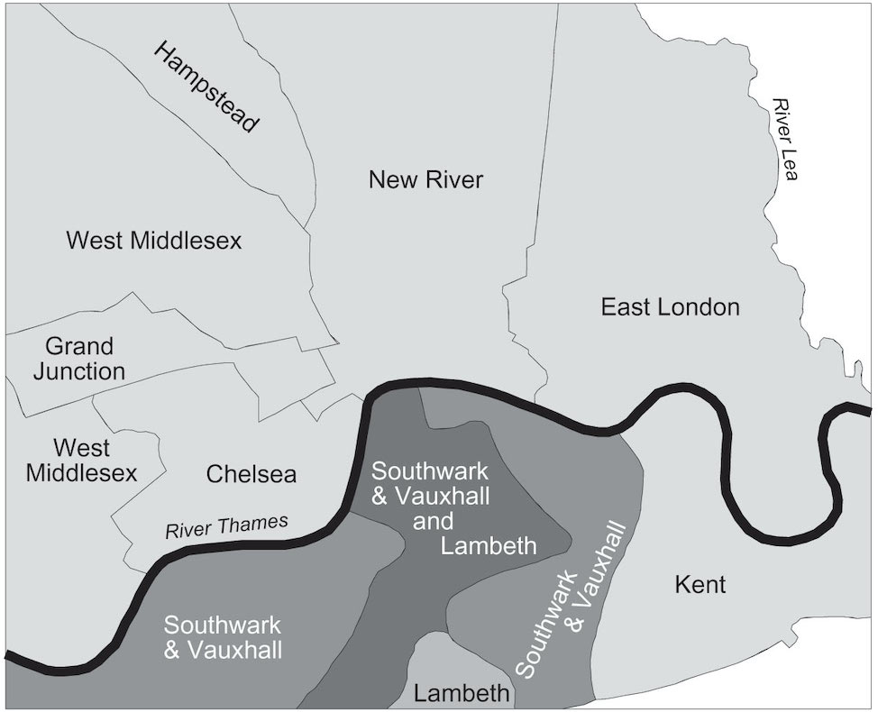
```

## Cholera DD

[Groups:]{.hi-slate}  [LW]{.hi} & [SVW]{.hi-green}

- [LW]{.hi} = treatment
- [SVW]{.hi-green} = control

[Periods:]{.hi-slate} Before and after 1852

- before 1852 = pre
- after 1852 = post

## Cholera DD

[Results:]{.hi-slate}
Mortality records showed few deaths in areas *only* served by [LW]{.hi}.

John Snow hired John Whiting to survey homes where people died and ask them who their water supplier was.

::: {.fragment}
- [SVW]{.hi-green}: 71 cholera deaths/10,000 homes
- [LW]{.hi}: 5 cholera deaths/10,000 homes
  - [SVW]{.hi-green} moved their intake upriver
  
:::

## DD as difference in Means

The primary assumption is that the counterfactual outcome can be written as:

$$E[Y_i|D_i=0,t=\tau] = \gamma_i + \lambda_t$$

There are two key assumptions here:

1. There is a static individual characteristic $\gamma_i$.  This is additive and not changing over time.

2. The time trend $\lambda_t$ is the same for treated and control observations.

Both are necessary for DD to generate causal estimates, and collectively are referred to as the [parallel trends assumption]{.hi}.

---

::: {.smaller}
Consider just two groups and two time periods:

- Treatment/control
- Pre/post - let's call the pre period $t=1$ and the post period $t=2$

The outcomes in the comparison group are for the two periods are:

$$E[Y_{0i}|D_i=0,t=1] = \gamma_i + \lambda_1$$
$$E[Y_{0i}|D_i=0,t=2] = \gamma_i + \lambda_2$$

Changes in control group's outcomes over time allow us to estimate the **time trend**.

$$\begin{align}
& E[Y_{0i}|D_i=0,t=2] - E[Y_{0i}|D_i=0,t=1] \\
&= E[\gamma_i|D_i=0] + \lambda_2 - (E[\gamma_i|D_i=0] + \lambda_1) \\
&= \lambda_2 - \lambda_1
\end{align}$$

:::

---

Let's consider the true effect of the treatment to be $\color{#0073e6}{\delta}$.  For now we'll consider it static and homogeneous.

The outcomes in the treatment group are for the two periods are:

$$E[Y_{1i}|D_i=1,t=1] = \gamma_i + \lambda_1$$
$$E[Y_{1i}|D_i=1,t=2] = \color{#0073e6}{\delta} + \gamma_i + \lambda_2$$

A simple pre-post analysis can eliminate the static individual effect $\gamma_i$, but not the time trend.

---

So a pre-post estimator results in:
$$\begin{align}
& E[Y_{1i}|D_i=1,t=2] - E[Y_{0i}|D_i=1,t=1] = \\
&= \color{#0073e6}{\delta} + E[\gamma_i|D_i=1] + \lambda_2 - (E[\gamma_i|D_i=1] + \lambda_1) \\
&= \color{#0073e6}{\delta} + \underbrace{\lambda_2 - \lambda_1}_{\text{time trend}}
\end{align}$$

::: {.fragment}
A treatment control estimator (in the post period) results in:
$$\begin{align}
& E[Y_{0i}|D_i=1,t=2] - E[Y_{0i}|D_i=0,t=2] = \\
&= \color{#0073e6}{\delta} + E[\gamma_i|D_i=1] + \lambda_2 - (E[\gamma_i|D_i=0] + \lambda_2) \\
&= \color{#0073e6}{\delta} + \underbrace{ E[\gamma_i|D_i=1] -  E[\gamma_i|D_i=0]}_{\text{selection bias}}
\end{align}$$
:::

---

The DD estimator utilizes both of these differences:
$$DD = \bar{Y}^{treat}_{post} - \bar{Y}^{treat}_{pre} - (\bar{Y}^{control}_{post} - \bar{Y}^{control}_{pre})$$

$$\begin{align}
& E[Y_{1i}|D_i=1,t=2] - E[Y_{0i}|D_i=1,t=1] - \\
 & (E[Y_{0i}|D_i=1,t=2] - E[Y_{0i}|D_i=0,t=2]) \\
&= \color{#0073e6}{\delta} + \underbrace{\lambda_2 - \lambda_1}_{\text{time trend}} - (\underbrace{\lambda_2 - \lambda_1}_{\text{time trend}}) \\
&= \color{#0073e6}{\delta} 
\end{align}$$

- The differences over time eliminates selection bias
- The differences across groups eliminates the time trend

# DD Regression
## DD Regression

We can estimate DD using a regression equation:

$$Y_{it} = \alpha + \beta D_i + \lambda P_t + \delta (D_i \times P_t) + \epsilon_{it}$$

::: {.fragment}
where

- $D_i$ = treatment indicator
- $P_t$ = post indicator
- $\delta$ = treatment effect
- $\alpha = E[\gamma_i|D_i=0] + \lambda_1$ the control group's period 1 mean
- $\beta = E[\gamma_i|D_i=1] - E[\gamma_i|D_i=0]$ the selection bias
- $\lambda = \lambda_2 - \lambda_1$ the time trend
:::

---

```{r, echo=F, out.width='90%', out.height='80%'}
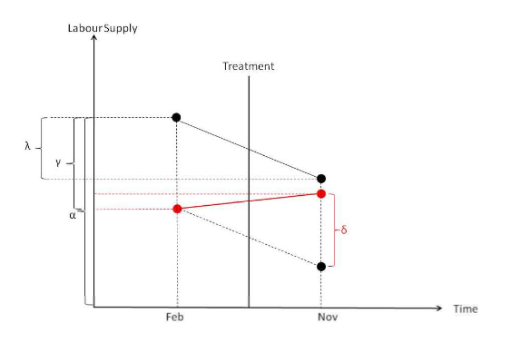
```
[Note: Figure from Scott Cunningham's Causal Mixtape]{.smallest}

## Variations - with controls

There are a lot of variations of the basic DD regression model.

First, you can consider expanding the regression to include additional covariates

$$Y_{it} = \alpha + \beta D_i + \lambda P_t + \delta (D_i \times P_t) + \beta_2 X'_{it} + \epsilon_{it}$$

- This should help with precision
- May help alleviate concerns of omitted variable bias
  - Need a *conditional* parallel trends assumption
- New developments show controls need to be used with caution
  - Need parallel treatment effects in X
  - Need no X-specific trends

## Variations - panel data

Another widely used model is a panel data version of the DD model, when you have many groups and time periods. 

$$Y_{it} = \alpha_i + \tau_t + \delta D_{it} + \epsilon_{it}$$

- $\alpha_i$ is an individual/group fixed effect
- $\tau_t$ is a time period 
- This can increase statistical power
- This model requires variation in the timing of treatment
  - is the timing exogenous conditional on fixed effects?
- Allows for tests of the parallel trends assumptions
- Validity of this design is also subject of recent work 
  - (spoiler - it's not as uniformly valid as previously thought)

## Variations - continuous treatment intensity

You can also estimate a continuous variation of the model where treatment intensity is a continuous variable.

$$Y_{it} = \alpha + \beta Intensity_i + \lambda P_t + \delta (Intensity_i \times P_t) + \epsilon_{it}$$

- Here the treatment affects different groups in different intensities
- Example: impact of federal minimum wage on state level employment
- $Intensity_i$ could be
  - The fraction of employees likely to be affected (maybe teen employment rate)
  - The difference between state and federal minimum wage (high state minimum wage = no effect)
- Surprise surprise, also current work on when this design creates challenges

# Assumptions
## Assumptions

There are three key assumptions.

::: {.incremental}
1. Parallel trends 

2. Functional form

3. Stable Unit Treatment Value Assumption (SUTVA)
:::

## Parallel trends

The parallel trends (or common trends) assumption gets most of the attention in DD analyses.  Typically authors will defend the parallel trend assumption in two ways:

1. A plot of the outcome variable over time for the treatment and control group.

  - Ideally you will see a common trend and then a change when treatment occurs.

2. When feasible you can actually run a formal test for common trends.

::: {.fragment}
How do we do this?
:::

## Parallel trends

Add pre-treatment indicators for the treatment variable:
$$Y_{it} = \alpha + \beta D_i + \lambda P_t + \delta (D_i \times P_t) + \delta_{-\tau} \sum_{\tau=0}^m D_i  + \epsilon_{it}$$

- Small and insignificant coefficients $(\delta_{-\tau})$ in the $m$ anticipatory periods (before treatment/policy actually occurs) provide evidence of common pre-trends.
- This is one half of the event study version of the DD.


## Parallel Trends
```{r, echo=F, out.width='80%', out.height='70%'}
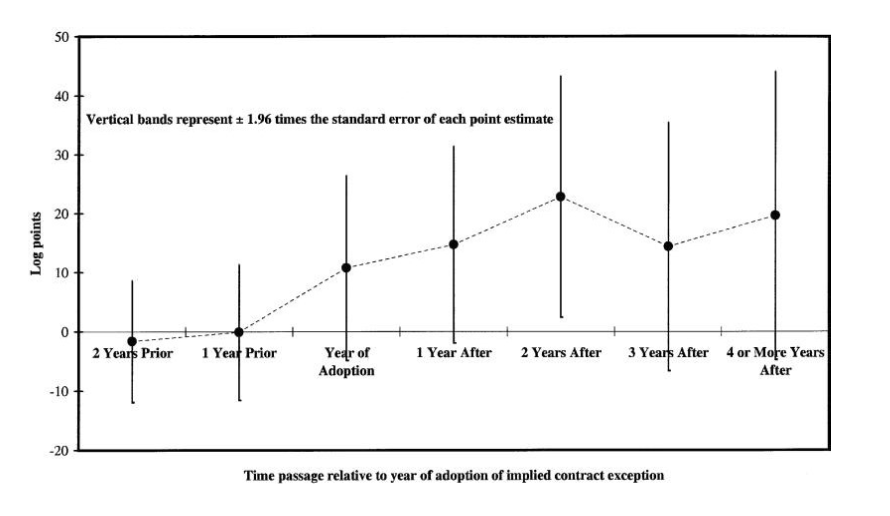
```
[Note: From Autor (2003)]{.tiny}

## Parallel Trends (1)
```{r, data1, echo=F, include = F, eval = T}

dat = data.table(
    t = rep((1:10),2),
  d = c(rep(0,10),rep(1,10))
)
dat[, p := ifelse(t >=5, 1,0)]
dat[,y := 3*d + t + 3*d*p]
dat[,group := ifelse(d==1, 'treat','control')]
```

```{r, parallel1, echo=F, include = T, eval = T, out.width='90%', out.height='90%'}
library(wesanderson)
ggplot(data=dat, aes(x=as.factor(t),y=y, color=group)) + 
  geom_point(size=3) + geom_vline(xintercept = 5, color = 'red', linetype='dashed') +
   scale_color_manual(values = wes_palette("Darjeeling1")) +
  # geom_segment(aes(x = 2, y = dat[d==0 & t==2,y], xend = 2, yend = dat[d==1 & t==2,y]), color='green') + 
    # geom_segment(aes(x = 6, y = dat[d==0 & t==6,y], xend = 6, yend = dat[d==1 & t==6,y]),color='blue') + 
  theme_minimal(base_size = 16) + xlab('time')
```


## Parallel Trends (1)
```{r, parallel2, echo=F, include = T, eval = T, out.width='90%', out.height='90%'}
library(wesanderson)
ggplot(data=dat, aes(x=as.factor(t),y=y, color=group)) + 
  geom_point(size=3) + geom_vline(xintercept = 5, color = 'red', linetype='dashed') +
   scale_color_manual(values = wes_palette("Darjeeling1")) +
  geom_segment(aes(x = 2, y = dat[d==0 & t==2,y], xend = 2, yend = dat[d==1 & t==2,y]), color='green') + 
    # geom_segment(aes(x = 6, y = dat[d==0 & t==6,y], xend = 6, yend = dat[d==1 & t==6,y]),color='blue') + 
  theme_minimal(base_size = 16) + xlab('time')
```


## Parallel Trends (1)
```{r, parallel3, echo=F, include = T, eval = T, out.width='90%', out.height='90%'}
library(wesanderson)
ggplot(data=dat, aes(x=as.factor(t),y=y, color=group)) + 
  geom_point(size=3) + geom_vline(xintercept = 5, color = 'red', linetype='dashed') +
   scale_color_manual(values = wes_palette("Darjeeling1")) +
  geom_segment(aes(x = 2, y = dat[d==0 & t==2,y], xend = 2, yend = dat[d==1 & t==2,y]), color='green') + 
    geom_segment(aes(x = 4, y = dat[d==0 & t==4,y], xend = 4, yend = dat[d==1 & t==4,y]), color='green') + 
    # geom_segment(aes(x = 6, y = dat[d==0 & t==6,y], xend = 6, yend = dat[d==1 & t==6,y]),color='blue') + 
  theme_minimal(base_size = 16) + xlab('time')
```


## Parallel Trends (1)
```{r, parallel4, echo=F, include = T, eval = T, out.width='90%', out.height='90%'}
library(wesanderson)
ggplot(data=dat, aes(x=as.factor(t),y=y, color=group)) + 
  geom_point(size=3) + geom_vline(xintercept = 5, color = 'red', linetype='dashed') +
   scale_color_manual(values = wes_palette("Darjeeling1")) +
  geom_segment(aes(x = 2, y = dat[d==0 & t==2,y], xend = 2, yend = dat[d==1 & t==2,y]), color='green') + 
      geom_segment(aes(x = 4, y = dat[d==0 & t==4,y], xend = 4, yend = dat[d==1 & t==4,y]), color='green') + 
    geom_segment(aes(x = 6, y = dat[d==0 & t==6,y], xend = 6, yend = dat[d==1 & t==6,y]),color='blue') + 
  theme_minimal(base_size = 16) + xlab('time')
```

## Parallel Trends (2)
```{r, data2, echo=F, include = F, eval = T}

dat = data.table(
    t = rep((1:10),2),
  d = c(rep(0,10),rep(1,10))
)
dat[, p := ifelse(t >=5, 1,0)]
dat[,y := 3*d + t + 3*d*p + 2*p]
dat[,group := ifelse(d==1, 'treat','control')]
```

```{r, parallel1-2, echo=F, include = T, eval = T, out.width='90%', out.height='90%'}
library(wesanderson)
ggplot(data=dat, aes(x=as.factor(t),y=y, color=group)) + 
  geom_point(size=3) + geom_vline(xintercept = 5, color = 'red', linetype='dashed') +
   scale_color_manual(values = wes_palette("Darjeeling1")) +
  # geom_segment(aes(x = 2, y = dat[d==0 & t==2,y], xend = 2, yend = dat[d==1 & t==2,y]), color='green') + 
    # geom_segment(aes(x = 6, y = dat[d==0 & t==6,y], xend = 6, yend = dat[d==1 & t==6,y]),color='blue') + 
  theme_minimal(base_size = 16) + xlab('time')
```

## Parallel Trends (2)
```{r, parallel2-2, echo=F, include = T, eval = T, out.width='90%', out.height='90%'}
library(wesanderson)
ggplot(data=dat, aes(x=as.factor(t),y=y, color=group)) + 
  geom_point(size=3) + geom_vline(xintercept = 5, color = 'red', linetype='dashed') +
   scale_color_manual(values = wes_palette("Darjeeling1")) +
  geom_segment(aes(x = 2, y = dat[d==0 & t==2,y], xend = 2, yend = dat[d==1 & t==2,y]), color='green') + 
    # geom_segment(aes(x = 6, y = dat[d==0 & t==6,y], xend = 6, yend = dat[d==1 & t==6,y]),color='blue') + 
  theme_minimal(base_size = 16) + xlab('time')
```

## Parallel Trends (2)
```{r, parallel3-2, echo=F, include = T, eval = T, out.width='90%', out.height='90%'}
library(wesanderson)
ggplot(data=dat, aes(x=as.factor(t),y=y, color=group)) + 
  geom_point(size=3) + geom_vline(xintercept = 5, color = 'red', linetype='dashed') +
   scale_color_manual(values = wes_palette("Darjeeling1")) +
  geom_segment(aes(x = 2, y = dat[d==0 & t==2,y], xend = 2, yend = dat[d==1 & t==2,y]), color='green') + 
    geom_segment(aes(x = 4, y = dat[d==0 & t==4,y], xend = 4, yend = dat[d==1 & t==4,y]), color='green') + 
    # geom_segment(aes(x = 6, y = dat[d==0 & t==6,y], xend = 6, yend = dat[d==1 & t==6,y]),color='blue') + 
  theme_minimal(base_size = 16) + xlab('time')
```

## Parallel Trends (2)
```{r, parallel4-2, echo=F, include = T, eval = T, out.width='90%', out.height='90%'}
library(wesanderson)
ggplot(data=dat, aes(x=as.factor(t),y=y, color=group)) + 
  geom_point(size=3) + geom_vline(xintercept = 5, color = 'red', linetype='dashed') +
   scale_color_manual(values = wes_palette("Darjeeling1")) +
  geom_segment(aes(x = 2, y = dat[d==0 & t==2,y], xend = 2, yend = dat[d==1 & t==2,y]), color='green') + 
      geom_segment(aes(x = 4, y = dat[d==0 & t==4,y], xend = 4, yend = dat[d==1 & t==4,y]), color='green') + 
    geom_segment(aes(x = 6, y = dat[d==0 & t==6,y], xend = 6, yend = dat[d==1 & t==6,y]),color='blue') + 
  theme_minimal(base_size = 16) + xlab('time')
```

## Parallel Trends (3)
```{r, data3, echo=F, include = F, eval = T}

dat = data.table(
    t = rep((1:10),2),
  d = c(rep(0,10),rep(1,10))
)
dat[, p := ifelse(t >=5, 1,0)]
dat[,y := 3*d + t + 2*d*t+ 3*d*p + 2*p]
dat[,group := ifelse(d==1, 'treat','control')]
```

```{r, parallel1-3, echo=F, include = T, eval = T, out.width='90%', out.height='90%'}
library(wesanderson)
ggplot(data=dat, aes(x=as.factor(t),y=y, color=group)) + 
  geom_point(size=3) + geom_vline(xintercept = 5, color = 'red', linetype='dashed') +
   scale_color_manual(values = wes_palette("Darjeeling1")) +
  # geom_segment(aes(x = 2, y = dat[d==0 & t==2,y], xend = 2, yend = dat[d==1 & t==2,y]), color='green') + 
    # geom_segment(aes(x = 6, y = dat[d==0 & t==6,y], xend = 6, yend = dat[d==1 & t==6,y]),color='blue') + 
  theme_minimal(base_size = 16) + xlab('time')
```

## Parallel Trends (3)
```{r, parallel2-3, echo=F, include = T, eval = T, out.width='90%', out.height='90%'}
library(wesanderson)
ggplot(data=dat, aes(x=as.factor(t),y=y, color=group)) + 
  geom_point(size=3) + geom_vline(xintercept = 5, color = 'red', linetype='dashed') +
   scale_color_manual(values = wes_palette("Darjeeling1")) +
  geom_segment(aes(x = 2, y = dat[d==0 & t==2,y], xend = 2, yend = dat[d==1 & t==2,y]), color='green') + 
    # geom_segment(aes(x = 6, y = dat[d==0 & t==6,y], xend = 6, yend = dat[d==1 & t==6,y]),color='blue') + 
  theme_minimal(base_size = 16) + xlab('time')
```

## Parallel Trends (3)
```{r, parallel3-3, echo=F, include = T, eval = T, out.width='90%', out.height='90%'}
library(wesanderson)
ggplot(data=dat, aes(x=as.factor(t),y=y, color=group)) + 
  geom_point(size=3) + geom_vline(xintercept = 5, color = 'red', linetype='dashed') +
   scale_color_manual(values = wes_palette("Darjeeling1")) +
  geom_segment(aes(x = 2, y = dat[d==0 & t==2,y], xend = 2, yend = dat[d==1 & t==2,y]), color='green') + 
    geom_segment(aes(x = 4, y = dat[d==0 & t==4,y], xend = 4, yend = dat[d==1 & t==4,y]), color='green') + 
    # geom_segment(aes(x = 6, y = dat[d==0 & t==6,y], xend = 6, yend = dat[d==1 & t==6,y]),color='blue') + 
  theme_minimal(base_size = 16) + xlab('time')
```

## Parallel Trends (3)
```{r, parallel4-3, echo=F, include = T, eval = T, out.width='90%', out.height='90%'}
library(wesanderson)
ggplot(data=dat, aes(x=as.factor(t),y=y, color=group)) + 
  geom_point(size=3) + geom_vline(xintercept = 5, color = 'red', linetype='dashed') +
   scale_color_manual(values = wes_palette("Darjeeling1")) +
  geom_segment(aes(x = 2, y = dat[d==0 & t==2,y], xend = 2, yend = dat[d==1 & t==2,y]), color='green') + 
      geom_segment(aes(x = 4, y = dat[d==0 & t==4,y], xend = 4, yend = dat[d==1 & t==4,y]), color='green') + 
    geom_segment(aes(x = 6, y = dat[d==0 & t==6,y], xend = 6, yend = dat[d==1 & t==6,y]),color='blue') + 
  theme_minimal(base_size = 16) + xlab('time')
```

## Functional forms

A related assumption is on the functional form of the regression equation.  This is particularly important when we have many post-treatment periods.

::: {.fragment}
If we have one coefficient to account for the time trend, we are essentially accounting for a simple difference in means over two time periods to account for the time trend.

Additionally, we often run regressions in logs because they have nice interpretation and often better fit the data.

However, you cannot have parallel trends in both levels **and** logs.  This forces the researcher to take (and defend) their stance on functional forms.

See [Roth and Sant'Anna (2022)](https://www.jonathandroth.com/assets/files/2010.04814.pdf) for more details on when functional form matters.
:::

## Stable Unit Treatment Value Assumption (SUTVA)

::: {.smaller}
The SUTVA assumption is also referred to a "no spillover" or "no interference" - attributed to Cox (1958) and Rubin (1986).

SUTVA states that the potential outcome of one unit should be unaffected by treatment assignment of other units.

When might this be violated?

::: {.fragment}
- General equilibrium effects
- Spillovers of information campaigns
- Spillovers of randomized encouragement designs
- Peer effects in classrooms
:::

::: {.fragment}
Need to consider if SUTVA holds and how it may bias the results if it doesn't.
:::
:::

# Challenges
## Challenges
Some (but not all) of the primary challenges in conducting a DD analysis:

- A single graph may be difficult to motivate your entire identification strategy.
- Formal tests of pre-trends may be under-powered.  This leads to type II errors.
- Performing analysis conditional on pre-trends may bias results (see [Roth (2022)](https://pubs.aeaweb.org/doi/pdfplus/10.1257/aeri.20210236)).
- It's good to have a variety of approaches to defend assumptions and display robustness.
- Serially correlated outcome variables leads to biased standard errors.

## Serial correlation

Bertrand et al. QJE (2004): "HOW MUCH SHOULD WE TRUST DIFFERENCES-IN-DIFFERENCES ESTIMATES?" 

[Problem:]{.hi-slate} Monte Carlo simulations showed 45% of placebo interventions generated estimates 'significant' at the 5% level.

[Solution:]{.hi-slate} Collapse the data into single pre and post time periods and effective number of groups

## Serial correlation

An example:

- PA enacted a policy in 2000.
- 49 other states did not.
- Annual data from 1990 - 2010
- N = 50*20 = 1000
- effective N = 4
  - One treated group pre (PA averages from 1990-1999)
  - One treated group post (PA averages from 2000-2010)
  - One control group pre (all other state averages from 1990-1999)
  - One control group post (all other state averages from 2000-2010)
  
# Extensions
## Extensions

DD is a common method that is frequently used to evaluate important policies. 

::: {.fragment .smaller}
As we showed there are some challenges in defending the assumptions of DD, so there are several extensions that help relax and soften those assumptions.  We will be going over five different extensions that help build the credibility of a DD identification strategy.

1. Difference-in-difference-in-differences
2. DD on a matched sample
3. Placebo tests
4. Event studies or dynamic DD

We will work through applied examples of each of these.  Some may be branched out to separate lectures.

This does not deal with recent developments in staggered adoption - that will come later.
:::

## Difference-in-difference-in-differences (DDD)

::: {.smaller}
The DDD model adds an additional control group to capture some additional unobserved heterogeneity not accounted for in DD model.

::: {.fragment}
This often takes the form of a group-specific time trend that violate the common trends assumption.
:::

::: {.fragment}
We need within-group variation to cancel out this group-specific trend.  

Usually this consists of sub-setting the groups into those affected by the treatment and those not affected by treatment.

[Example:]{.hi-slate} State law aimed at increasing **female** employment.

- **Difference 1:** Treatment vs. control states
- **Difference 2:** Pre vs. post periods
- **Difference 3:** Male vs. female
The male/female difference will net out any state-specific time effects that are common to men and women.
:::
:::

## DDD: Daylight savings time
```{r, echo=F, out.width='90%', out.height='80%'}
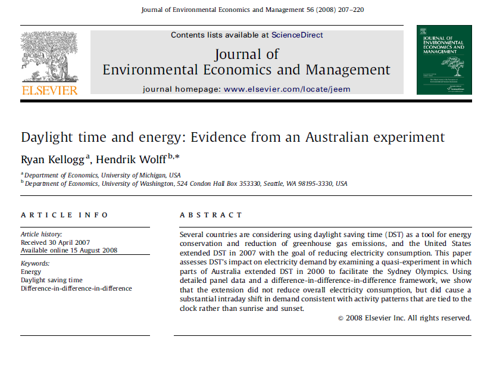
```

## DDD: Daylight savings time

[Research Question:]{.hi-slate} Does daylight savings time (DST) save energy?

[Identification:]{.hi-slate} DDD exploits natural experiment surrounding 2000 Olympics where DST was extended to help reduce jet lag.

- Olympics were in Sydney (NSW), but neighboring state (Victoria) also extended DST while South Australia did not.
- Another key component is that DST shifts the timing of energy use, but does not effect energy use in the middle of the day

- **Difference 1:** Victoria vs. South Australia
- **Difference 2:** During 2000 Olympics ('post') vs. year before and after ('pre')
- **Difference 3:** Treated hours vs. control hours (mid-day)

## DDD: Daylight savings time

```{r, echo=F, out.width='90%', out.height='80%'}
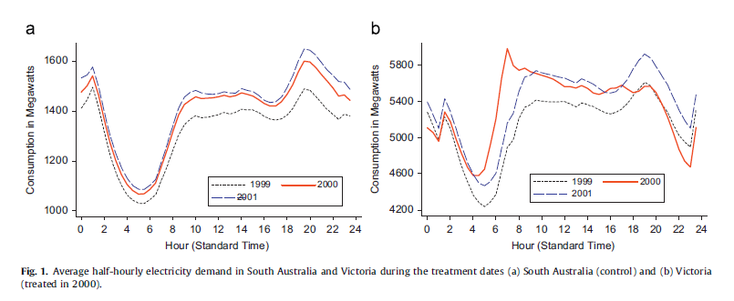
```
[Note: Kellog & Wolff (2008)]{.tiny}

## DDD: Daylight savings time

```{r, echo=F, out.width='90%', out.height='80%'}
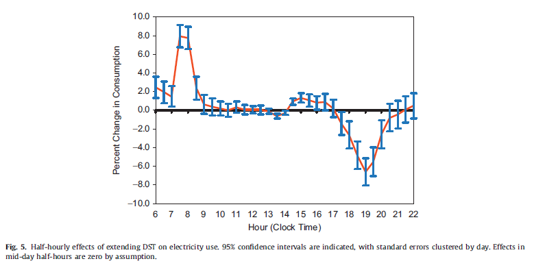
```
[Note: Kellog & Wolff (2008)]{.tiny}

## DDD: Daylight savings time

 Kellog and Wolff (2008)

> *Our treatment effect estimation strategy is based on the difference-in-difference (DD) framework that exploits, in both the treatment state and the control state, the difference in demand between the treatment year and the control years. We augment the standard DD model to take advantage of the fact that DST does not affect electricity demand in the mid-day. This allows us to use changes in mid-day consumption to control for unobserved state-specific shocks via a difference-in- difference-in-difference (DDD) specification. We show that this technique allows us to employ a mild identifying assumption that is more appropriate for the data than that of a standard DD model.*

## DD + Matching
Sometimes it may be difficult to find an appropriate control group where the parallel trends assumption holds.

This is particularly true when there are many treated and potential control observations.  

Using matching to pre-process the data provides a data-driven approach to finding an appropriate counterfactual sample where the relevant DD assumptions hold.

## DD Matching: Agro-environmental programs
```{r, echo=F, out.width='50%', out.height='50%'}
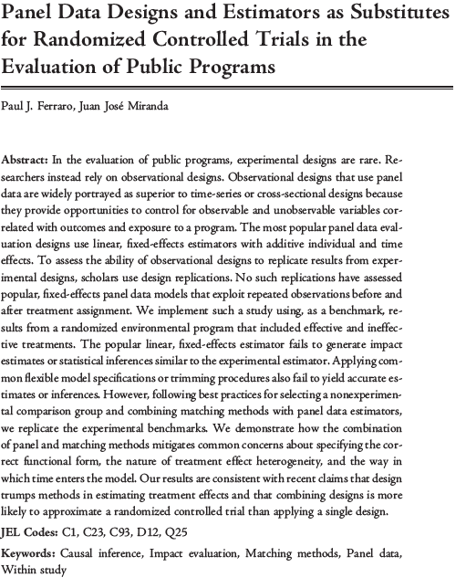
```

## DD Matching: Recovering experimenal results using non-experimental methods

[Research Question:]{.hi-slate} Can a panel data DD design with matching recover experimental results?

[Identification:]{.hi-slate} Standard DD assumptions + the using of matching to make the assumptions more defensible. This paper uses a randomized treatment groups and a different (non-randomized) groups.  They assess how different types of matching + panel data DD are able to reproduce the experimental result.

## DD Matching: Recovering experimenal results using non-experimental methods
```{r, echo=F, out.width='50%', out.height='50%'}
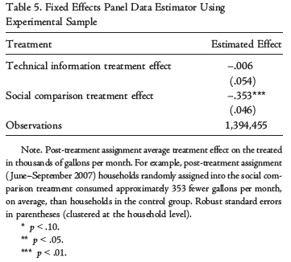
```

## DD Matching: Recovering experimenal results using non-experimental methods
```{r, echo=F, out.width='90%', out.height='90%'}
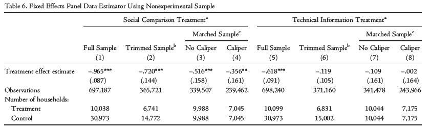
```

## DD Matching: Recovering experimenal results using non-experimental methods
```{r, echo=F, out.width='70%', out.height='70%'}
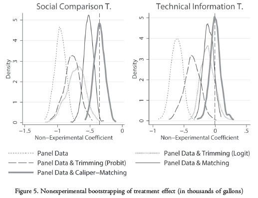
```

## DD Matching: Recovering experimenal results using non-experimental methods
```{r, echo=F, out.width='70%', out.height='70%'}
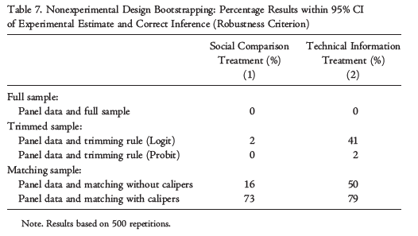
```


## Event Studies

Event studies are often used to see the impact of treatment over time.  This is important when there are dynamic effects - treatment effects could increase or decrease over time.

Event studies also present a visual test of pre-trends as described above.

Event studies are becoming an increasingly common diagnostic tool to defend the parallel trends assumption.

## Event Studies

The fully dynamic event study specification is:

$$Y_{it} = \alpha_i + \lambda_t + \delta_{\tau} \sum_{\tau=S}^E D_{i,\tau}  + \epsilon_{it}$$

::: {.smallest}
- The event study model estimates $S-E-1$ treatment effects, where $S$ is the starting period and $E$ is the ending period.
  - Note that $S$ and $E$ typically refer to full time periods, not relative to treatment
  - e.g. $S=2020$ and $E=2010$; 11 periods - 10  $\delta_{\tau}$ parameters
  - Typically normalized results to time period *before* treatment (exclude this period)
- $\delta_{\tau}$ refers to the treatment effect in period $\tau$.
  - We expect $\delta_{\tau} = 0$ when $\tau$ are periods *prior* to the start of treatment.
    - Pre-test for parallel trends assumption
- Time-period fixed effects $\lambda_t$ to control for general time trends, but no post treatment dummy $(P_t)$.
- No group effect $D_i$ because it is collinear with $D_{i,\tau}$ (don't need unit FEs).

:::

## Event Studies

The fully dynamic event study specification is:

$$Y_{it} = \alpha_i + \lambda_t + \delta_{\tau} \sum_{\tau=-k}^{k} D_{i,\tau}  + \epsilon_{it}$$

::: {.smaller}
- Another common setup is a symmetric number of periods around treatment
- Periods are not in calendar units but time-relative-to-treatment
  - When will these differ in practice?
- Still need to be concerned about heterogeneous treatment effects
- Important to understand interpretation with new methods

:::

## Event Studies - plastic bags
```{r, echo=F, out.width='70%', out.height='70%'}
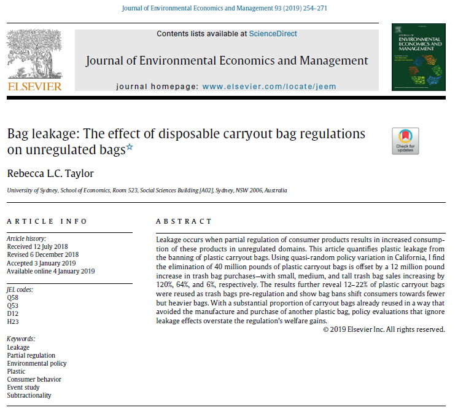
```

## Event Studies - plastic bags
```{r, echo=F, out.width='80%', out.height='70%'}
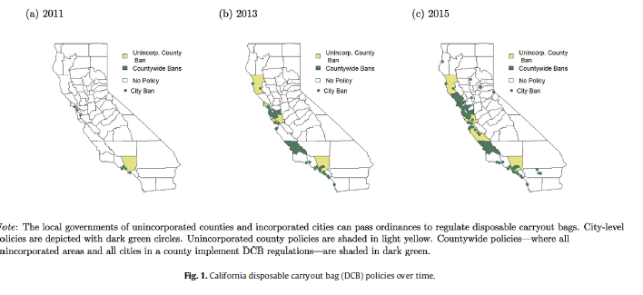
```

## Event Studies - plastic bags
```{r, echo=F, out.width='70%', out.height='70%'}
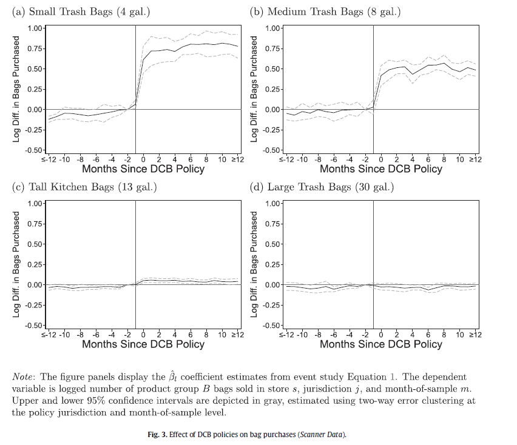
```

## Event Studies - plastic bags
```{r, echo=F, out.width='70%', out.height='65%'}
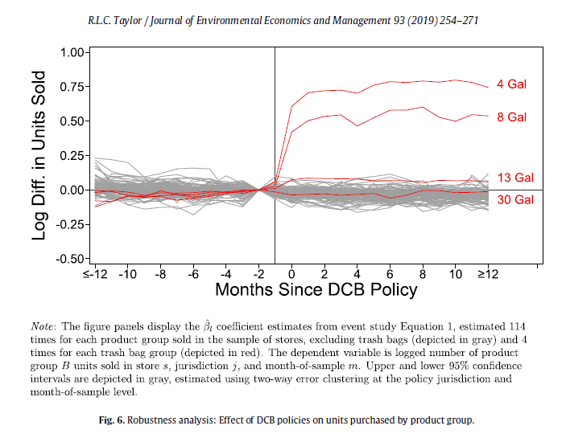
```

## Event Studies - plastic bags
[Identification: Taylor Bags]{.hi}

> The identifying assumption of the model is that, absent the DCB policies, outcomes at the treated stores would have remained similar to the stores yet to be treated. Underlying trends in the outcome variable correlated with DCB policy enactment are the most likely violation of this assumption. The pre-policy portion of the $\beta_{l}$ vector provides a check against this possible violation. If DCB policies are unassociated with underlying trends, there should be no trend in the $\beta_{l}$ vector in the pre-policy period. I discuss the pre-policy $\beta_{l}$  estimates in Section 4.1. To preview these results, I find no evidence of differential trends during the pre-policy period

## Placebo tests
A common approach to defending the common trends assumption is to estimate placebo effects.

A placebo test will find a scenario where the DD model predicts the an effect to be zero (for example outcomes prior to the when the policy was implemented). 

This test the counterfactual assumption, that in the absence of treatment, the treatment and control observations would have had similar outcomes.

Almost all applied papers have some version of a placebo or falsification test, and the type of placebo test depends on the application.

The key is to come up with a convincing approach to testing the identifying assumptions.

## Placebo tests - tolls and pollution
```{r, echo=F, out.width='70%', out.height='70%'}

```

## Placebo tests - tolls and pollution
```{r, echo=F, out.width='70%', out.height='70%'}
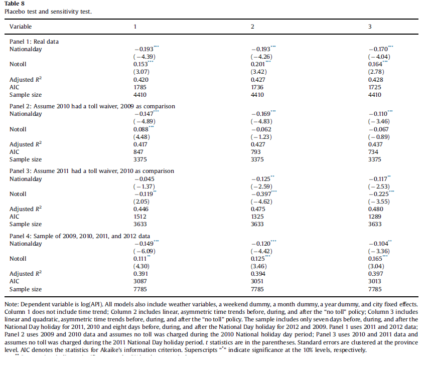
```

## Placebo tests - tolls and pollution
```{r, echo=F, out.width='90%', out.height='90%'}
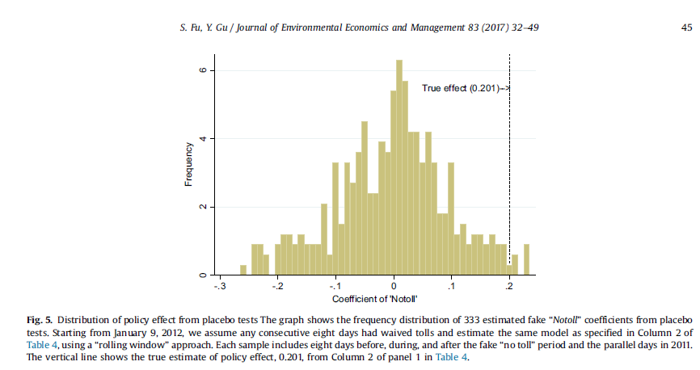
```
## Application - MTV and Pregnancy

DD is a widely used method, but it is also easily criticized.  We'll go through a high-profile example of a DD paper in the AER and discuss the identifying assumptions as well as the critiques.

The paper is question is *"Media Influences on Social Outcomes: The Impact of MTV’s 16 and Pregnant on Teen Childbearing* by Kearney and Levine (henceforth KL) published in the AER in 2015.

**Abstract**

::: {.smallest}
> This paper explores the impact of the introduction of the widely viewed MTV reality show 16 and Pregnant on teen childbearing. Our main analysis relates geographic variation in changes in teen childbearing rates to viewership of the show. We implement an instrumental variables (IV ) strategy using local area MTV ratings data from a pre-period to predict local area 16 and Pregnant ratings. The results imply that this show led to a 4.3 percent reduction in teen births. An examination of Google Trends and Twitter data suggest that the show led to increased interest in contraceptive use and abortion.

:::

---

::: {.smaller}
The research question is whether a show about teen pregnancy affected teen childbirth.

There are two identification strategies:

1. **DD:** Analyze designated market areas (DMAs) that had higher viewership and examine the impact on teen birth rates. 

2. **IV:** Since viewership could be correlated with teen birth rate unobserveables, the authors instrument based on MTV ratings prior to *16 and Pregnant* (henceforth 16P). (actually a shift-share (or Bartik) style IV)

[Assumption:]{.hi-slate}  Trends in teen birth rates in geographic areas with high- and low-MTV viewership would have been the same,
conditional on area and time-fixed effect and a limited set of covariates, in the absence of 16 and Pregnant.

[Results:]{.hi-slate} 16P *caused* a 4.3 drop in teen birth rates.
:::

---

```{r, echo=F, out.width='90%', out.height='90%'}
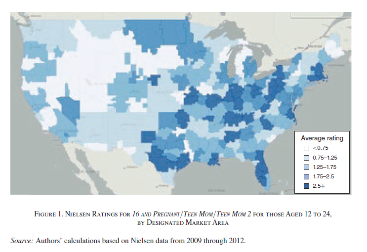
```

---

```{r, echo=F, out.width='90%', out.height='90%'}
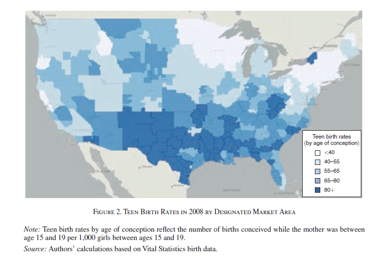
```

---

```{r, echo=F, out.width='80%', out.height='80%'}
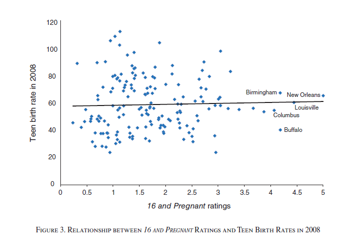
```

---

```{r, echo=F, out.width='90%', out.height='90%'}
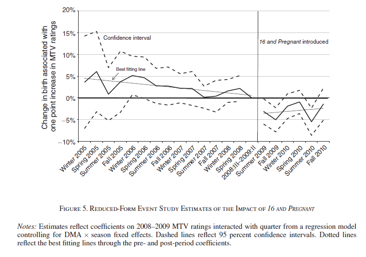
```

---

```{r, echo=F, out.width='90%', out.height='90%'}
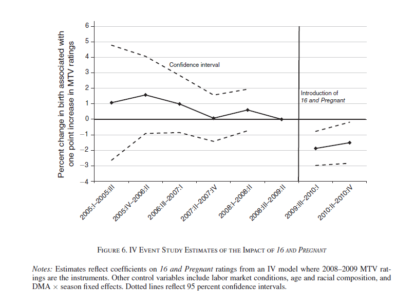
```

## Critique - MTV and Pregnancy

Some people didn't buy the identifying assumptions behind the DD and IV model.

Jaeger Joyce and Kaestner (JJK) published a paper questioning KL's results: *"A Cautionary Tale of Evaluating Identifying Assumptions: Did Reality TV Really Cause a Decline in Teenage Childbearing?"* JBES (2018)

Their key critiques are:

1. The instrument (MTV viewership) is a choice and not randomly assigned
2. Teen birth rate trends vary substantially by races, which are correlated with MTV viewership.
3. Event study showing no cumulative pre-effect is not robust.

[Results:]{.hi-slate} Including differential time trends by racial composition of DMA eliminates the results.

---

```{r, echo=F, out.width='70%', out.height='70%'}
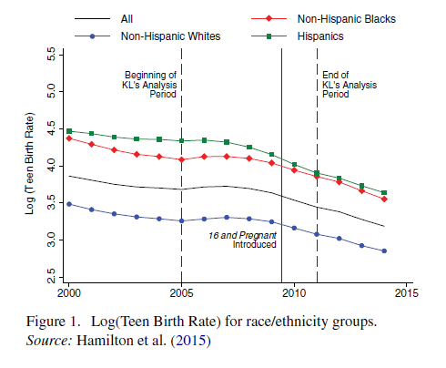
```

---

```{r, echo=F, out.width='70%', out.height='70%'}
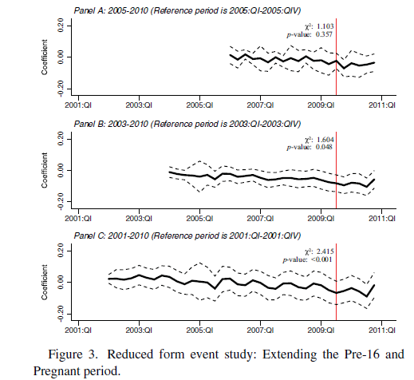
```

## Lessons from MTV and Pregnancy
### Kahn-Lang and Lang (KLL)

There was a public debate in economics about the validity of the KL results.

KLL have a paper forthcoming in JBES that attempts to generalize some of the lessons learned from this debate.

They offer three main lessons/best practices.

1. Address why original levels of treatment and control groups differ and how may this impact trends
2. Parallel trends requires functional form assumption and may not mesh with nonlinear models (e.g. probit and logit)
3. Parallel pre-trends is neither necessary nor sufficient for parallel counterfactual (post) trends


<!-- # Paper -->
<!-- ## Abstracts -->
<!-- The requirements for abstract, are also an important input to the paper. Motivation and question are important - but the key component of this course is **causal inference**. You should be able to describe each of these components in 1-2 sentences. -->

<!-- 1. What is your research question?  In this class that also requires **estimating a causal relationship**. -->
<!-- -- -->

<!-- 2. What is your data? The key discussion of data should be in support of addressing #1 and #3. -->
<!-- -- -->

<!-- 3. What is your identification strategy?  The simpler the better, but this needs to be *defended*. -->
<!-- .smaller[Think about two questions when defending your identification strategy: -->
<!--   1. what is the source of your (quasi) random variation in your variable of interest -->
<!--   2. what are the primary threats to your identifying assumptions? -->
<!-- ] -->

<!-- --- -->

<!-- # Paper -->
<!-- ## Abstracts -->
<!-- - Now we will go around in class to present your abstracts. -->
<!-- - Think of this as your "elevator pitch" - should by ~1min -->
<!-- - Get in the practice of discussing your research and getting feedback. -->
<!-- --- -->


<!-- ### New developments -->
<!-- .smallest[.smaller[ -->
<!-- 1. [Summary](#new) -->
<!-- 1. [Decomposition](#decomp) -->
<!-- 1. [Honest DD](#honest) -->
<!-- 1. [Pre-trends](#pre) -->
<!-- ]] -->

<!-- layout: true -->
<!-- # New Developments -->
<!-- --- -->
<!-- name: new -->
<!-- Given the prevalence of DD models in applied research, and the perceived flaws in many applications, there has been a lot of recent methodological approaches to highlight the misapplications of DD and create better tools for diagnostics and correcting common problems. -->

<!-- These papers among others provide some guidance for applied researches to follow. -->

<!-- There are three general categories that these papers fall into, and some fall into more than one (raise problems and offer solutions). -->

<!-- It is very likely that these methods will need to be applied to publish DD work in high quality journals. -->

<!-- --- -->

<!-- [Baker et al. (2021)](#https://papers.ssrn.com/sol3/papers.cfm?abstract_id=3794018) is a new working paper that summarizes some of the theoretical work and offers guidance for applied researchers.  A lot of the emphasis of recent research is on staggered DD designs and as Baker et al. note: -->

<!-- >  *The intuition is that in the standard staggered DiD approach, already-treated units can act as effective controls, and changes in their outcomes over time are subtracted from the changes of later-treated units (the treated).... -->
<!-- In each case, the alternative estimation strategy ensures that firms receiving treatment are not compared to firms that already received treatment in recent past.* -->

<!-- --- -->

<!-- ## DD with variation in treatment timing -->
<!-- #### How does regression weighting affect estimated coefficients? -->

<!-- 1. de Chaisemartin & D'Haultfœuille, [Two-Way Fixed Effects Estimators with Heterogeneous Treatment Effects](#https://www.aeaweb.org/articles?id=10.1257/aer.20181169), AER (2020) -->
<!-- 1. Goodman-Bacon (2020) - [DIFFERENCE-IN-DIFFERENCES WITH VARIATION IN TREATMENT TIMING](#http://goodman-bacon.com/pdfs/ddtiming.pdf), WP (2020) -->
<!-- 1. Callaway & Sant'Anna (2020) - [Difference-in-Differences with multiple time periods](#https://www.sciencedirect.com/science/article/abs/pii/S0304407620303948), JoE (2020) -->

<!-- --- -->

<!-- ## DD diagnostics -->
<!-- #### Do DD assumptions really hold? -->
<!-- 1. Roth - [Pre-test with Caution: Event-study Estimates After Testing for Parallel Trends](#https://jonathandroth.github.io/assets/files/roth_pretrends_testing.pdf) - WP (2020) -->
<!-- 1. Rambachan & Roth - [An Honest Approach to Parallel Trends](#https://jonathandroth.github.io/assets/files/HonestParallelTrends_Main.pdf) -->

<!-- --- -->

<!-- ## How to fix this problems? -->
<!-- #### Papers with pacakges to implement new techniques -->

<!-- 1. de Chaisemartin & D'Haultfœuille, [Two-Way Fixed Effects Estimators with Heterogeneous Treatment Effects](#https://www.aeaweb.org/articles?id=10.1257/aer.20181169), AER (2020) -->
<!-- 1. Callaway & Sant'Anna (2020) - [Difference-in-Differences with multiple time periods](#https://www.sciencedirect.com/science/article/abs/pii/S0304407620303948), JoE (2020) -->
<!-- 1. Roth & Sant'Anna (2021) - [Efficient Estimation for Staggered Rollout Designs](#https://arxiv.org/pdf/2102.01291.pdf), WP (2021) -->
<!-- 1. de Chaisemartin,  D'Haultfœuille & Guyonvarch [Fuzzy differences-in-differences with Stata](#https://journals.sagepub.com/doi/10.1177/1536867X19854019) - SJ (2019) -->
<!--   1. de Chaisemartin & D'Haultfœuille, [Fuzzy Differences-in-Differences](#https://academic.oup.com/restud/article-abstract/85/2/999/4096388), REStud (2019) -->

<!-- --- -->
<!-- layout: true -->
<!-- # DD decomposition -->
<!-- --- -->

<!-- name: decomp -->
<!-- ```{r, echo=F, out.width='80%', out.height='80%'} -->
<!-- 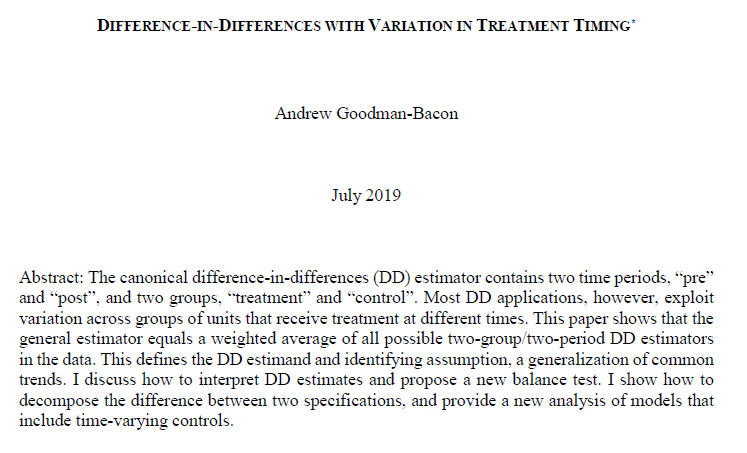 -->
<!-- ``` -->
<!-- --- -->

<!-- Consider the following setup. -->
<!-- Three groups and three time periods:  -->
<!-- 1. always untreated (U) -->
<!-- 1. early treated at T=2 (E) -->
<!-- 1. late treated at T=3 (L) -->

<!-- --- -->

<!-- In this setup there are four possible 2x2 DD. -->

<!-- 1. $\delta_{E,U} = (\bar{y}_E^{T2+T3} - \bar{y}_E^{T1}) - (\bar{y}_U^{T2+T3} - \bar{y}_U^{T1})$ -->

<!--   -Compare early treated to untreated control -->
<!-- 1. $\delta_{L,U} = (\bar{y}_L^{T3} - \bar{y}_L^{T1+T2}) - (\bar{y}_U^{T3} - \bar{y}_U^{T1+T2})$ -->

<!--   -Compare late treated to untreated control -->
<!-- 1. $\delta_{E,L} = (\bar{y}_E^{T2} - \bar{y}_E^{T1}) - (\bar{y}_L^{T2} - \bar{y}_L^{T1})$ -->

<!--   -Compare early treated to late treated as control (before late treated are treated) -->
<!-- 1. $\delta_{L,E} = (\bar{y}_L^{T3} - \bar{y}_E^{T2}) - (\bar{y}_E^{T3} - \bar{y}_E^{T2})$ -->

<!--   -Compare late treated to early treated as control (when late treated does not change treatment status) -->

<!-- --- -->

<!-- Four key insights that Baker et al (2020) provide: -->
<!-- 1. TWFE DD estimate is a weighted average of 2x2 DD estimates (there can be many more than 4 sets of 2x2 DD estimates in most settings) -->
<!-- 2. Treated units often serve as control observations -->
<!-- 3. The weights are sample dependent - the weights are based on variance of $D_i$. -->
<!-- 4. We need to consider a weighted average of common trends assumptions across 2x2 DD combinations -->

<!-- --- -->

<!-- ```{r, echo=F, out.width='70%', out.height='70%'} -->
<!-- include_graphics('gb_decomp1.png') -->
<!-- ``` -->
<!-- --- -->

<!-- ```{r, echo=F, out.width='80%', out.height='80%'} -->
<!-- include_graphics('gb_decomp2.png') -->
<!-- ``` -->
<!-- --- -->

<!-- Goodman-Bacon (2020) also provide the following useful decomposition: -->

<!-- $$ plim_{N \rightarrow \infty} \hat{\beta}^{DD} = VWATT + VWCT - \Delta ATT $$ -->
<!-- where: -->

<!-- - VWATT = (positively) variance weighted ATT (this is the TWFE estimand for ATT) -->
<!-- - VWCT = variance weighted common trends -->
<!-- - $\Delta ATT$ = ATT due to *changes* in treatment among treated groups when they serve as controls -->

<!-- When is this a problem  in practice? -->
<!-- 1. When the weights for VWATT don't align with sample weights -->
<!-- 2. When treatment effects change over time -->

<!-- --- -->

<!-- ```{r, echo=F, out.width='65%', out.height='65%'} -->
<!-- include_graphics('baker-decomp.png') -->
<!-- ``` -->
<!-- --- -->
<!-- layout: true -->
<!-- # Honest DD -->
<!-- --- -->
<!-- name: honest -->
<!-- ```{r, echo=F, out.width='70%', out.height='70%'} -->
<!-- 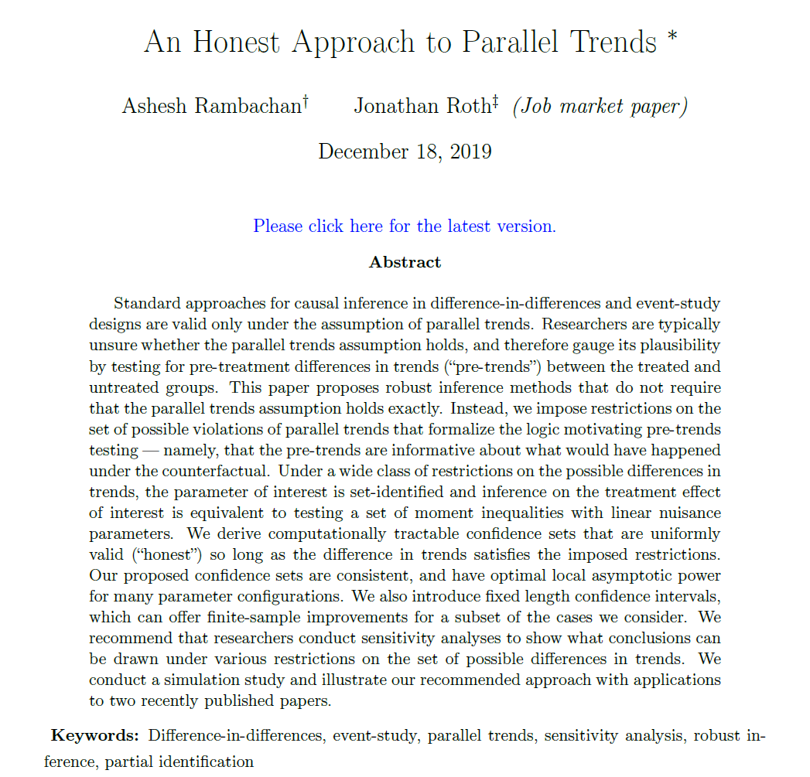 -->
<!-- ``` -->
<!-- --- -->

<!-- ```{r, echo=F, out.width='80%', out.height='80%'} -->
<!-- 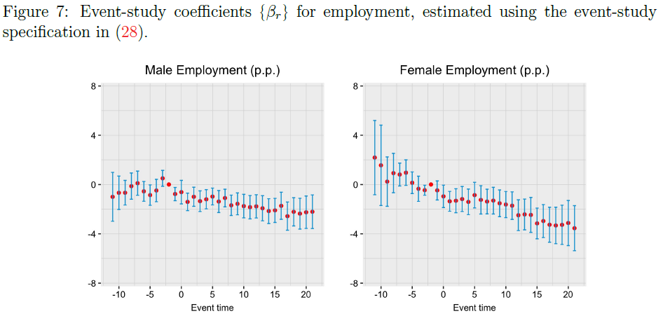 -->
<!-- ``` -->
<!-- --- -->

<!-- ```{r, echo=F, out.width='80%', out.height='80%'} -->
<!-- 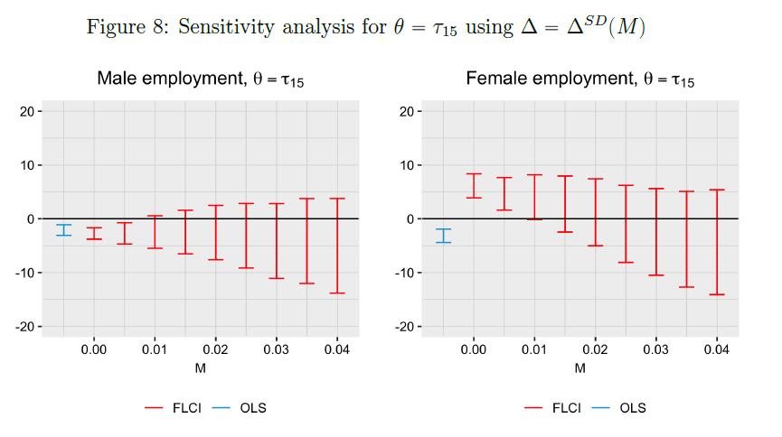 -->
<!-- ``` -->
<!-- --- -->

<!-- ```{r, echo=F, out.width='80%', out.height='80%'} -->
<!-- 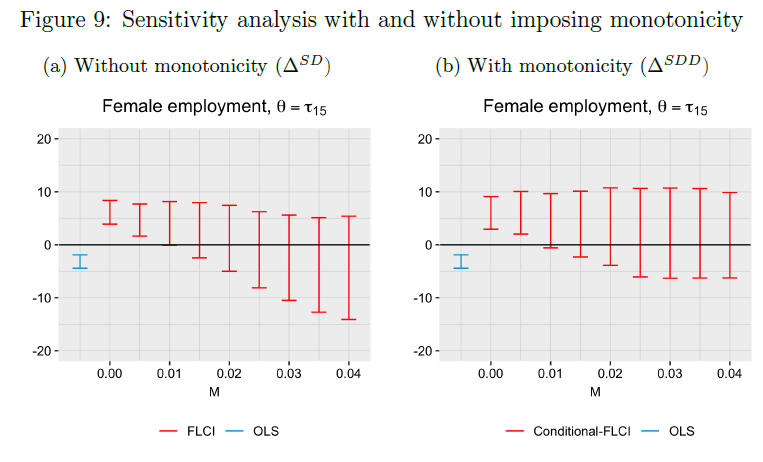 -->
<!-- ``` -->
<!-- --- -->
<!-- layout: true -->
<!-- # Pre-trend testing -->
<!-- --- -->
<!-- name: pre -->

<!-- ```{r, echo=F, out.width='70%', out.height='70%'} -->
<!-- 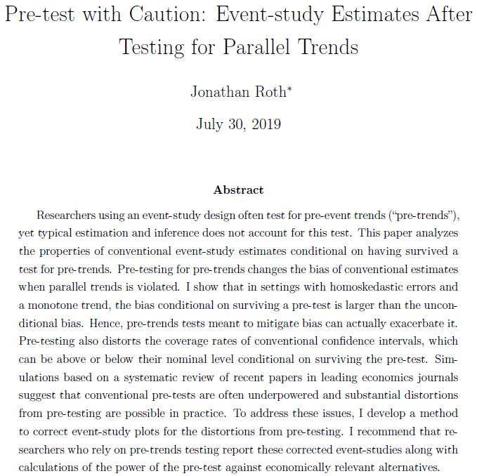 -->
<!-- ``` -->
<!-- --- -->

<!-- ```{r, echo=F, out.width='70%', out.height='70%'} -->
<!-- include_graphics('roth_pre1.png') -->
<!-- ``` -->
<!-- --- -->

<!-- ```{r, echo=F, out.width='70%', out.height='70%'} -->
<!-- include_graphics('roth_pre2.png') -->
<!-- ``` -->
<!-- --- -->

<!-- name: syn -->
<!-- # Extensions -->
<!-- ## Synthetic control -->
<!-- .smaller[ -->
<!-- Matching is a good approach when there are many treatment observations and many potential control observations. -->

<!-- However, in some settings - particularly in evaluating state or country level policies - there is only one treated observation. -->

<!-- Additionally, that there may not be any single potential control that serves as an appropriate counterfactual. Enter [synthetic control]{.hi}. -->
<!-- ]] -->
<!-- -- -->

<!-- .smaller[ -->
<!-- The [synthetic control]{.hi} method estimates weights from all the counterfactual individuals/groups to minimize the distance between the weighted average of the control observations ('synthetic' control) and the treatment observations in the [pre-treatment period]{.hi-green}. -->
<!-- - The optimal weights will minimize the synthetic’s mean squared prediction error -->
<!-- - Inference is proceeds by estimating placebo effects using control states (generate synthetic controls for the control) -->
<!-- ]] -->
<!-- --- -->
<!-- # Extensions -->
<!-- ## Synthetic control -->

<!-- This approach essentially constructs a counterfactual where the common trends assumption holds. -->

<!-- Developed by Abadie & Gardeazabal (2003) and Abadie, Diamond, & Hainmueller (2010).   -->
<!-- - The later group of coauthors developed an [R]{.mono} package `synth`, which helped popularize the method. -->

<!-- [Limitations:]{.hi-slate} -->
<!-- - Only allows for one treated unit. -->
<!-- - Requires continuous outcomes -->
<!-- - Inference is still a work-in-progress -->

<!-- --- -->
<!-- # Extensions -->
<!-- ## Synthetic control -->
<!-- ```{r, echo=F, out.width='80%', out.height='60%'} -->
<!-- include_graphics('abadie.png') -->
<!-- ``` -->
<!-- --- -->
<!-- # Extensions -->
<!-- ## Synthetic control -->
<!-- ```{r, echo=F, out.width='80%', out.height='80%'} -->
<!-- include_graphics('abadie1.png') -->
<!-- ``` -->
<!-- --- -->
<!-- # Extensions -->
<!-- ## Synthetic control -->
<!-- ```{r, echo=F, out.width='60%', out.height='50%'} -->
<!-- include_graphics('abadie2.png') -->
<!-- ``` -->
<!-- --- -->
<!-- # Extensions -->
<!-- ## Synthetic control -->
<!-- ```{r, echo=F, out.width='60%', out.height='50%'} -->
<!-- include_graphics('abadie3.png') -->
<!-- ``` -->
<!-- --- -->
<!-- # Extensions -->
<!-- ## Synthetic control -->
<!-- ```{r, echo=F, out.width='60%', out.height='50%'} -->
<!-- include_graphics('abadie4.png') -->
<!-- ``` -->
<!-- --- -->
<!-- # Extensions -->
<!-- ## Synthetic control -->
<!-- ```{r, echo=F, out.width='60%', out.height='50%'} -->
<!-- include_graphics('abadie5.png') -->
<!-- ``` -->
<!-- --- -->
<!-- # Extensions -->
<!-- ## Synthetic control -->
<!-- ```{r, echo=F, out.width='60%', out.height='50%'} -->
<!-- include_graphics('abadie6.png') -->
<!-- ``` -->
<!-- --- -->
<!-- # Extensions -->
<!-- ## Synthetic control - pricing waste -->
<!-- ```{r, echo=F, out.width='70%', out.height='70%'} -->
<!-- include_graphics('syn_bueno.png') -->
<!-- ``` -->
<!-- --- -->
<!-- # Extensions -->
<!-- ## Synthetic control - pricing waste -->
<!-- ```{r, echo=F, out.width='70%', out.height='65%'} -->
<!-- include_graphics('syn_bueno1.png') -->
<!-- ``` -->
<!-- --- -->
<!-- # Extensions -->
<!-- ## Synthetic control - pricing waste -->
<!-- ```{r, echo=F, out.width='60%', out.height='50%'} -->
<!-- include_graphics('syn_bueno2.png') -->
<!-- ``` -->
<!-- --- -->
