```{r, setup, include = F}
# devtools::install_github("dill/emoGG")
library(pacman)
p_load(
  broom, tidyverse,
  ggplot2, ggthemes, ggforce, ggridges,
  latex2exp, viridis, extrafont, gridExtra,
  kableExtra, snakecase, janitor,
  data.table, dplyr,
  lubridate, knitr,
  estimatr, here, magrittr, MASS, xtable
)
# Define pink color
red_pink <- "#e64173"
turquoise <- "#20B2AA"
orange <- "#FFA500"
red <- "#fb6107"
blue <- "#3b3b9a"
green <- "#8bb174"
grey_light <- "grey70"
grey_mid <- "grey50"
grey_dark <- "grey20"
purple <- "#6A5ACD"
slate <- "#314f4f"
# Dark slate grey: #314f4f
# Knitr options
opts_chunk$set(
  comment = "#>",
  fig.align = "center",
  fig.height = 7,
  fig.width = 10.5,
  warning = F,
  message = F
)
opts_chunk$set(dev = "svg")
options(device = function(file, width, height) {
  svg(tempfile(), width = width, height = height)
})
options(crayon.enabled = F)
options(knitr.table.format = "html")
# A blank theme for ggplot
theme_empty <- theme_bw() + theme(
  line = element_blank(),
  rect = element_blank(),
  strip.text = element_blank(),
  axis.text = element_blank(),
  plot.title = element_blank(),
  axis.title = element_blank(),
  plot.margin = structure(c(0, 0, -0.5, -1), unit = "lines", valid.unit = 3L, class = "unit"),
  legend.position = "none"
)
theme_simple <- theme_bw() + theme(
  line = element_blank(),
  panel.grid = element_blank(),
  rect = element_blank(),
  strip.text = element_blank(),
  axis.text.x = element_text(size = 18, family = "STIXGeneral"),
  axis.text.y = element_blank(),
  axis.ticks = element_blank(),
  plot.title = element_blank(),
  axis.title = element_blank(),
  # plot.margin = structure(c(0, 0, -1, -1), unit = "lines", valid.unit = 3L, class = "unit"),
  legend.position = "none"
)
theme_axes_math <- theme_void() + theme(
  text = element_text(family = "MathJax_Math"),
  axis.title = element_text(size = 22),
  axis.title.x = element_text(hjust = .95, margin = margin(0.15, 0, 0, 0, unit = "lines")),
  axis.title.y = element_text(vjust = .95, margin = margin(0, 0.15, 0, 0, unit = "lines")),
  axis.line = element_line(
    color = "grey70",
    size = 0.25,
    arrow = arrow(angle = 30, length = unit(0.15, "inches")
  )),
  plot.margin = structure(c(1, 0, 1, 0), unit = "lines", valid.unit = 3L, class = "unit"),
  legend.position = "none"
)
theme_axes_serif <- theme_void() + theme(
  text = element_text(family = "MathJax_Main"),
  axis.title = element_text(size = 22),
  axis.title.x = element_text(hjust = .95, margin = margin(0.15, 0, 0, 0, unit = "lines")),
  axis.title.y = element_text(vjust = .95, margin = margin(0, 0.15, 0, 0, unit = "lines")),
  axis.line = element_line(
    color = "grey70",
    size = 0.25,
    arrow = arrow(angle = 30, length = unit(0.15, "inches")
  )),
  plot.margin = structure(c(1, 0, 1, 0), unit = "lines", valid.unit = 3L, class = "unit"),
  legend.position = "none"
)
theme_axes <- theme_void() + theme(
  text = element_text(family = "Fira Sans Book"),
  axis.title = element_text(size = 18),
  axis.title.x = element_text(hjust = .95, margin = margin(0.15, 0, 0, 0, unit = "lines")),
  axis.title.y = element_text(vjust = .95, margin = margin(0, 0.15, 0, 0, unit = "lines")),
  axis.line = element_line(
    color = grey_light,
    size = 0.25,
    arrow = arrow(angle = 30, length = unit(0.15, "inches")
  )),
  plot.margin = structure(c(1, 0, 1, 0), unit = "lines", valid.unit = 3L, class = "unit"),
  legend.position = "none"
)
theme_set(theme_gray(base_size = 20))
# Column names for regression results
reg_columns <- c("Term", "Est.", "S.E.", "t stat.", "p-Value")
# Function for formatting p values
format_pvi <- function(pv) {
  return(ifelse(
    pv < 0.0001,
    "<0.0001",
    round(pv, 4) %>% format(scientific = F)
  ))
}
format_pv <- function(pvs) lapply(X = pvs, FUN = format_pvi) %>% unlist()
# Tidy regression results table
tidy_table <- function(x, terms, highlight_row = 1, highlight_color = "black", highlight_bold = T, digits = c(NA, 3, 3, 2, 5), title = NULL) {
  x %>%
    tidy() %>%
    select(1:5) %>%
    mutate(
      term = terms,
      p.value = p.value %>% format_pv()
    ) %>%
    kable(
      col.names = reg_columns,
      escape = F,
      digits = digits,
      caption = title
    ) %>%
    kable_styling(font_size = 20) %>%
    row_spec(1:nrow(tidy(x)), background = "white") %>%
    row_spec(highlight_row, bold = highlight_bold, color = highlight_color)
}
```

# Schedule
## Schedule
### Last time

DD Fundamentals

### Today

DD New developments - Diagnosing Problems

## Upcoming

- Problem Set 3 - DD estimation
- Problem Set 4 - DD referee report

## Problem Set 3: DID Simulation

- I'll provide simulated dataset(s) with known true treatment effects
  - I'll know the true treatment effect and assumptions, you won't
- In small groups you will present in class after spring break
- Each group will get one paper/method

1. Present the theory of the new method, including necessary assumptions
1. Diagnose any problems with the conventional TWFE estimator
1. Estimate the treatment effects of the new method
1. Compare the results from the new method and the TWFE estimator

## Problem Set 4: Replication/extension of a DD paper         

1. Read 'New Development' papers.

2. Find a DD paper in a top five journal that comes with data or an AI generated paper from [Project APE](https://ape.socialcatalystlab.org/)

3. Ensure that the paper has one of the following features

  - **staggered adoption**
  - **continuous or multi-level treatment**

4. Highlight why the standard assumptions of DD may not hold

5. Diagnose assumptions, and update results as needed

.hi[Goal:] Hone your thinking about **causal identification** in practice.


# Reading
## DID Solutions
- [Sun and Abraham (2021)](https://www.sciencedirect.com/science/article/pii/S030440762030378X)
- [Callaaway and Sant'Anna (2021)](https://www.sciencedirect.com/science/article/pii/S0304407620303948)
- [Borusyak et al. (2024)](https://academic.oup.com/restud/article/91/6/3253/7601390)
- [de Chaisemartin and d'Haultfoeuille (2024)](https://papers.ssrn.com/sol3/papers.cfm?abstract_id=3731856)
- [Dube et al (2025)](https://www.nber.org/papers/w31184)
- [Woolridge (2025)](https://link.springer.com/article/10.1007/s00181-025-02807-z)

# New Developments
## New Developments

Given the prevalence of DD models in applied research, and the perceived flaws in many applications, there has been a lot of recent methodological approaches to highlight the misapplications of DD and create better tools for diagnostics and correcting common problems.

These papers among others provide some guidance for applied researches to follow. It is very likely that these methods will need to be applied to publish DD work in high quality journals.

## Two points

1. More work is showing that *any* deviation from the canonical 2x2 DiD model can 
create problems with heterogeneous treatment effects

2. Some researchers in this field suggest that often correcting for staggered 
adoption does **not** change results much (depends on heterogeneity)

---

There are two  general categories that these papers fall into, and some fall into more than one (raise problems and offer solutions).

1. Diagnosing problems
1. Proposing solutions

Today we're going to focus on diagnosing problems. 

---

[Baker et al. (2022)](https://www.sciencedirect.com/science/article/pii/S0304405X22000204) is a paper that summarizes some of the theoretical work and offers guidance for applied researchers.  A lot of the emphasis of recent research is on staggered DD designs and as Baker et al. note:

>  *The intuition is that in the standard staggered DiD approach, already-treated units can act as effective controls, and changes in their outcomes over time are subtracted from the changes of later-treated units (the treated)....
In each case, the alternative estimation strategy ensures that firms receiving treatment are not compared to firms that already received treatment in recent past.*


# Diagnosing problems

## Problems
1. [Negative weights](https://www.aeaweb.org/articles?id=10.1257/aer.20181169)
1. [Staggared adoption](https://www.sciencedirect.com/science/article/abs/pii/S0304407621001445)
1. [Dynamics](#https://www.sciencedirect.com/science/article/pii/S030440762030378X)
1. [Continuous treatment](https://arxiv.org/abs/2107.02637)
1. [Treatment turning off](https://papers.ssrn.com/sol3/papers.cfm?abstract_id=3731856)
1. [Pre-trends](https://pubs.aeaweb.org/doi/pdfplus/10.1257/aeri.20210236)

# Negative weights
## Negative weights

de Chaisemartin & D'Haultfœuille, [Two-Way Fixed Effects Estimators with Heterogeneous Treatment Effects](https://www.aeaweb.org/articles?id=10.1257/aer.20181169), AER (2020)

de Chaisemartin & D'Haultfœuille (2020) (henceforth deD20) are the first published paper to bring attention to the negative weights in the TWFE.

Their paper does not explicitly focus on DD, but highlights a more general challenge of TWFE regressions.

Their survey article highlights that about 25% of papers published in the AER in the last five years employ at least one TWFE regression.

## Weights
Let's recall some notation and assumptions for 2x2 DD setup

$$
\begin{equation}
Y_{T,2} - Y_{T,1} - (Y_{C,2} - Y_{C,1}) \tag{1}
\end{equation}
$$

where $T$ is a group that is treated at time 2, and $C$ is never treated

Parallel trends assumption

$$
\begin{equation}
E[Y_{T,2}^0-Y_{T,1}^0] = E[Y_{C,2}^0-Y_{C,1}^0] \tag{2}
\end{equation}
$$

---

Using the parallel trends assumption 
$$
\begin{align}
 E[DD] & = Y_{T,2} - Y_{T,1} - (Y_{C,2} - Y_{C,1})
  \\
  &= E[Y_{T,2}^1-Y_{T,1}^0 - (Y_{C,2}^0-Y_{C,1}^0) ]
  \\
  &= E[Y_{T,2}^1- Y_{T,2}^0] + E[Y_{T,2}^0-Y_{T,1}^0] - E[(Y_{C,2}^0-Y_{C,1}^0) ]
  \\
  &= E[Y_{T,2}^1- Y_{T,2}^0]
\end{align}
$$
$E[DD]  = E[Y_{T,2}^1- Y_{T,2}^0]$ is our causal effect of interest, and the third line above comes from the parallel trends assumption.

---

Consider the observations divided into $G$ groups and $T$ time periods that leads the following regression equation.

$$
\begin{equation}
Y_{i,g,t} = \hat{\alpha}_g + \hat{\gamma}_t + \hat{\beta}_{fe} + \epsilon_{i,g,t} 
\end{equation}
$$

- A group $g$ is defined as the level where treatment is assigned
- For example, you can have individual level data analyzing a state policy.

---

Under the parallel trends assumption:

$$
\begin{equation}
E[\hat{\beta}_{fe}] = E \left[ \sum_{(g,t): D_{g,t \neq 0}} W_{g,t} TE_{g,t} \right] \tag{3}
\end{equation}
$$

- If the treatment is binary $TE_{g,t} = Y_{g,t}^1 - Y_{g,t}^0$ 
  - the ATE in group $g$ at time $t$
- If the treatment is continuous $TE_{g,t} = (Y_{g,t}^{D_{g,t}} - Y_{g,t}^0)/D_{g,t}$ 
  - the effect of moving $D_{g,t}$ from 0 to $D_{g,t}$ scaled by $D_{g,t}$.

---

Okay so what are the weights?

- The weights sum to 1 and are proportional, and have the same sign as:

$$
\begin{equation}
N_{g,t} \left( D_{g,t} - D_{g,.} - D_{.,t} + D_{.,.} \right) \tag{4}
\end{equation}
$$
where

- $N_{g,t}$ is the number of observations in cell $(g,t)$
- $D_{g,.}$ is the average treatment of group $g$ across periods
- $D_{.,t}$ is the average treatment in period $t$ across groups
- $D_{.,.}$ is the average treatment across groups and periods


## Implications of negative weights

- $\hat{\beta}_{fe}$ may be biased for treatment effect among treated cells - the ATT.
- Need additional assumptions beyond parallel trends for $\hat{\beta}_{fe}$ to be unbiased for the ATT

1. All treated units are treated at the same time and cannot move to untreated OR
1.  $\left( D_{g,t} - D_{g,.} - D_{.,t} + D_{.,.} \right)$ is uncorrelated with $TE_{g,t}$
  - A special case of this condition is homogeneous treatment effects
  
These are additional assumptions **beyond parallel trends** that do not hold in many settings.


## Implications of negative weights

::: {.smaller}
- A particularly worrying implication is that the weights may be negative.
- This could cause the ATT to be a different sign then the group level treatment effects.
- For example: treatment cell $A$ has a treatment weight = 2 and treatment cell $B$ has a weight equal to -3.
  - If $TE_A$ = 10% and $TE_B$ = 20%, then ATT = $3 \times 0.10 - 2 \times 0.20$ = -10%
  - Even though both treatment effects are positive, and weights sum to 1, the ATT is -10%
- Weights are likely to be positive with a binary treatment when:
  - No group is treated most of the time  $\left( D_{g,.} \ll 1 \right)$ 
  - No period has most units treated $\left( D_{.,t} \ll 1 \right)$
- Ways to mitigate negative weights are dropping final period and/or always treated groups
- deD20 develop packages that calculate the weights for diagnostics

:::

## Simulation excercise

Let's set up a simple simulation for how negative weights can bias TWFE estimates

- place **negative weights** on some treated cells
- produce **sign reversal**: \(\hat\beta_{TWFE} < 0\) even if all \(\Delta_{g,t} > 0\)


## Minimal setup (2 groups × 3 periods)

- \(g \in \{1,2\}\), \(t \in \{1,2,3\}\)
- Treatment path (staggered adoption):
  - Group 1: $D_{1,1}=0, D_{1,2}=0, D_{1,3}=1$
  - Group 2: $D_{2,1}=0, D_{2,2}=1, D_{2,3}=1$

- Heterogeneous (dynamic) treatment effects:
  - $\Delta_{1,3}=1$
  - $\Delta_{2,2}=1$
  - $\Delta_{2,3}=4$

All treated-cell ATEs are **positive**, but TWFE will go **negative**.

---

```{r}
library(data.table)
library(ggplot2)

set.seed(530)

# 2 groups x 3 periods
cells <- CJ(g = factor(c(1, 2)), t = factor(c(1, 2, 3)))

# Staggered adoption
cells[, D := fifelse(g == "1" & t %in% c("1", "2"), 0L,
             fifelse(g == "1" & t == "3",           1L,
             fifelse(g == "2" & t == "1",           0L, 1L)))]

# Cell-level ATE (dynamic heterogeneity)
cells[, Delta := 0]
cells[g == "1" & t == "3", Delta := 1]
cells[g == "2" & t == "2", Delta := 1]
cells[g == "2" & t == "3", Delta := 4]

cells
```

## Simulate individual-level panel & estimate TWFE

```{r}
n_per_cell <- 800L
setDT(cells)

# Repeat rows (guaranteed data.table output)
dat <- cells[rep(seq_len(.N), each = n_per_cell)]
dat[, u := rnorm(.N, mean = 0, sd = 1)]

# Common-trends holds by construction via additive group + time FE
alpha_g  <- c("1" = 0.0, "2" = 0.0)
lambda_t <- c("1" = 0.0, "2" = 0.0, "3" = 0.0)

dat[, Y0 := alpha_g[as.character(g)] + lambda_t[as.character(t)] + u]
dat[, Y  := Y0 + D * Delta]

twfe <- lm(Y ~ D + g + t, data = dat)
beta_hat <- unname(coef(twfe)[["D"]])
beta_hat
```

## Compute implied TWFE weights on treated cells

Sharp design ⇒ weights can be built by:

1) residualize \(D_{g,t}\) on group FE + time FE  
2) normalize residuals among treated cells

```{r}
D_cell <- unique(cells[, .(g, t, D, Delta)])

res_mod <- lm(D ~ g + t, data = D_cell)
D_cell[, eps := resid(res_mod)]

treated_cells <- D_cell[D == 1]
mean_eps_treated <- treated_cells[, mean(eps)]

D_cell[D == 1, `:=`(
  w = eps / mean_eps_treated,
  cell_share = 1 / .N
)]
D_cell[D == 1, W_total := cell_share * w]
D_cell[D == 0, `:=`(w = NA_real_, cell_share = NA_real_, W_total = NA_real_)]

D_cell[D == 1, .(g, t, eps, w, W_total)]
```

## Plot TWFE weights by treated cell

```{r}
#| echo: false
contrib <- D_cell[D == 1][
  , `:=`(
    cell = paste0("g", g, ", t", t),
    contribution = W_total * Delta
  )
][order(cell)]

ggplot(contrib, aes(x = cell, y = W_total)) +
  geom_hline(yintercept = 0) +
  geom_col() +
  labs(
    title = "Implied TWFE weights on treated cells",
    x = "Treated cell",
    y = "Weight"
  ) +
  theme_minimal(base_size = 18)
```

## Plot weighted contributions and sign reversal

$$ \hat\beta_{TWFE} \approx \sum_{(g,t):D_{g,t}=1} W_{g,t}\,\Delta_{g,t} $$

```{r}
#| echo: false
beta_from_weights <- contrib[, sum(contribution)]

ggplot(contrib, aes(x = cell, y = contribution)) +
  geom_hline(yintercept = 0) +
  geom_col() +
  labs(
    title = "Weighted contributions",
    subtitle = paste0("TWFE coef = ", round(beta_hat, 3),
                      " | Sum(W·Δ) = ", round(beta_from_weights, 3)),
    x = "Treated cell",
    y = "Contribution (Weight × ATE)"
  ) +
  theme_minimal(base_size = 18)
```

## Key takeaway

- All treated-cell ATEs are **positive**: \(1, 1, 4\)
- TWFE assigns a **negative weight** to the “already-treated later period” cell \((g=2,t=3)\)
- If effects grow over time, that negative-weight cell can dominate → **sign reversal**


# Staggered Adoption
## Staggered Adoption

Goodman-Bacon (2021), [Difference-in-differences with variation in treatment timing](https://www.sciencedirect.com/science/article/abs/pii/S0304407621001445), 
*Journal of Econometrics*

- A lot of attention has com from  (cited over >10000 times!)

- This paper intuitively lays out the problem of DD with staggered adoption

- Related to the negative weights problem - TWFE DD uses "bad" comparisons

- Diagnostics and a useful decomposition of the ATT

## Setup

Consider the following setup.

Three groups and three time periods: 

1. always untreated (U)

1. early treated at T=2 (E)

1. late treated at T=3 (L)

## 4 2x2 DDs

1. $\delta_{E,U} = (\bar{Y}_E^{T2+T3} - \bar{Y}_E^{T1}) - (\bar{Y}_U^{T2+T3} - \bar{Y}_U^{T1})$
    - Compare early treated to untreated control
  
1. $\delta_{L,U} = (\bar{Y}_L^{T3} - \bar{Y}_L^{T1+T2}) - (\bar{Y}_U^{T3} - \bar{Y}_U^{T1+T2})$
    - Compare late treated to untreated control
  
1. $\delta_{E,L} = (\bar{Y}_E^{T2} - \bar{Y}_E^{T1}) - (\bar{Y}_L^{T2} - \bar{Y}_L^{T1})$
    - Compare early treated to late treated as control (before late treated are treated)
  
1. $\delta_{L,E} = (\bar{Y}_L^{T3} - \bar{Y}_E^{T2}) - (\bar{Y}_E^{T3} - \bar{Y}_E^{T2})$
    - Compare late treated to early treated as control (when late treated does not change treatment status)

## Insights

Four key insights:

1. TWFE DD estimate is a weighted average of 2x2 DD estimates (there can be many more than 4 sets of 2x2 DD estimates in most settings)

2. Treated units often serve as control observations

3. The weights are sample dependent - the weights are based on variance of $D_i$.

4. We need to consider a weighted average of common trends assumptions across 2x2 DD combinations

---

```{r, echo=F, out.width='70%', out.height='70%'}
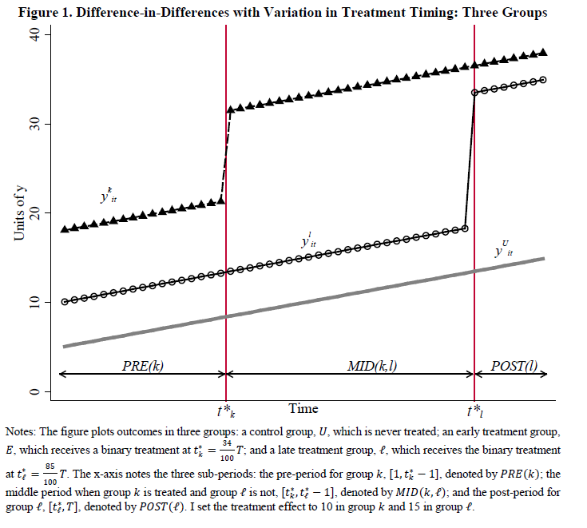
```

---

```{r, echo=F, out.width='70%', out.height='70%'}
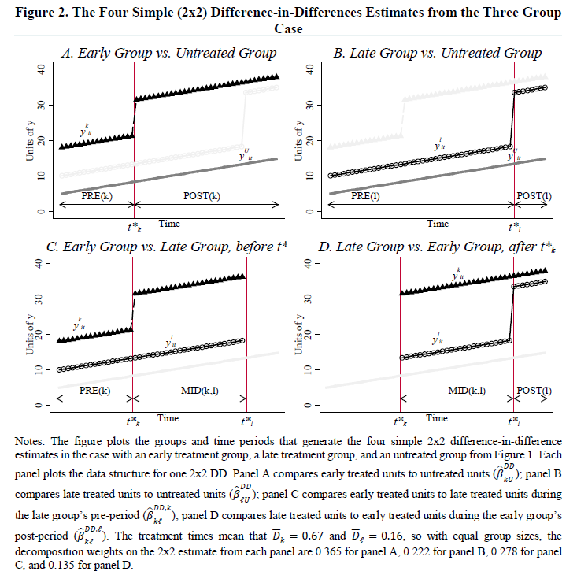
```

---

Goodman-Bacon (2021) also provide the following useful decomposition:

$$ plim_{N \rightarrow \infty} \hat{\beta}^{DD} = VWATT + VWCT - \Delta ATT $$
where:

- VWATT = (positively) variance weighted ATT (this is the TWFE estimand for ATT)
- VWCT = variance weighted common trends
- $\Delta ATT$ = ATT due to *changes* in treatment among treated groups when they serve as controls

---

When is this a problem  in practice?

1. When the weights for VWATT don't align with sample weights
2. When treatment effects change over time

## Dynamics

::: {.smaller}
The problems identified when estimating a static ATT extend to the dynamic case (i.e. event studies) as well.

Sun and Abraham (2021) and Callaway and Sant'Anna (2021) both document this problem.

Consider the following event study regression equation:

$$
\begin{equation}
Y_{g,t} = \hat{\gamma}_g + \hat{\lambda}_t + \sum_{l=-K,l \neq 1}^L \hat{\beta}_l D_l + \epsilon_{g,t}
\end{equation}
$$

- where $D_l$ is a dummy equal to one when group $g$ started receiving treatment $l$ periods ago
- when $l \geq 0$ then $\hat{\beta}_l$ is the cumulative effect of being treated $l+1$ periods ago
- when $l < 0$ then $\hat{\beta}_l$ is a placebo coefficient for testing parallel trends
:::

## Dynamics

Sun and Abraham (2021) decompose the event study coefficients as:

$$
\begin{equation}
E[\hat{\beta}_l] = \left[ \sum_g w_{g,l} TE_g(l) + \sum_{l'\neq l} \sum_g w_{g,l'}TE_g(l') \right]
\end{equation}
$$

where

- $TE_g(l)$ is the cumulative effect of $l+1$ treatment period in group $g$
- $w_{g,l}$ and $w_{g,l'}$ are weights such that $\sum_g w_{g,l} = 1$ and $\sum_g w_{g,l'} = 0$
- weights can be negative


## Dynamics
### Implications

- The first part is the static decomposition, and shows $\hat{\beta}_l$ can be biased if treatment effects at $l+1$ vary across groups

- The second summation is a weighted sum of $l' \neq l$ across periods and groups

- This drops out if treatment effects don't vary across groups since $\sum_g w_{g,l'} = 0$

- The placebo coefficients also suffer from these sources of bias

# Continuous treatment
## Continuous treatment

Many settings treatment is not binary - e.g. state-level minimum wage laws.

de Chaisemartin and D'Haultfoeuille (2018) show that even when treatment timing is not staggered different treatment *levels* can lead to bias.

There is a new paper that [Difference-in-Differences with a Continuous Treatment](https://arxiv.org/pdf/2107.02637.pdf) that highlights the challenges and proposes a solution (maybe).

- [See this [summary explanation](https://bcallaway11.github.io/posts/five-minute-did-continuous-treatment)
from Brantly Callaway]{.smallest}

---

First we'll go over how the concept of negative weights affects DID with continuous treatment.

Consider two groups and two periods with group $m$ being treated "more" and group $l$ being treated "less".

The TWFE estimator can be written as

$$
\begin{equation}
\hat{\beta}_{fe} = \frac{Y_{m,2} - Y_{m,1} - (Y_{l,2} - Y_{l,1})}{D_{m,2} - D_{m,1} - (D_{l,2} - D_{l,1})}
\end{equation}
$$

---

This will only identify a convex combination of treatment effects if:

1. Treatment effects are constant over time
2. Treatment effects are the same in groups $m$ and $l$

This may not be true in practice - the marginal effect of treatment may not be linear.

Consider the minimum wage: changing the minimum wage from 7 to 8 dollars may have a 
different effect than changing the minimum wage from 14 to 15 dollars.

## Applied example

- $m$ goes from 0 to 2 units from period 1 to 2
- $l$ goes from 1 to 2 units from period 1 to 2
- potential outcomes are additively linear in treatment units and are constant over time, but could vary by group

$$
\begin{align}
Y_{m,t}^d &= Y_{m,t}^0 + \delta_m d
\\
Y_{l,t}^d &= Y_{l,t}^0 + \delta_l d
\end{align}
$$


## Applied example
The treatment effect can be defined as:
$$
\begin{align}
E[\hat{\beta}_{fe}] &= E[Y_{m,2}^2 - Y_{m,1}^0 - (Y_{l,2}^1 - Y_{l,1}^0)]
\\
 &=E[Y_{m,2}^0 + 2\delta_m - Y_{m,1}^0 - (Y_{l,2}^0 + \delta_l - Y_{l,1}^0)]
\\
 &=E[Y_{m,2}^0 - Y_{m,1}^0] - E[Y_{l,2}^0 + - Y_{l,1}^0] + 2\delta_m - \delta_l ]
\\
 &= 2\delta_m - \delta_l 
\end{align}
$$

- Group $l$'s effect is negatively weighted
- This is because group $l$ is used as a control in period 2 even though it is treated
- If $\delta_m = 4$ and $\delta_l = 8$ then $\hat{\beta}_{fe} = 0$ 
even though both groups have positive treatment effects

---

The general setup from Callaway et al. (2025) is similar except:

- $D_{it}$ is continuous and we'll focus on specific values of $D_{it} = d$
- Here potential outcomes are $Y_{it} = Y_{it}(D_i)$
- For simplicity we'll focus on two periods where all units are untreated in period 1 $Y_{i1} = Y_{i1}(0)$

---

In this setup there are two parameters of interest:

$ATT(d|d) = E[Y_{t} - Y_{t0} |D=d]$

$ACRT(d|d) = \frac{\partial ATT(l|d)}{\partial l}|_{l=d}$

- The $ATT(d|d)$ is the causal **effect** of dose $d$ among those treated with $d$

- $ACRT(d|d)$ is the causal **response** of a marginal change in the dose at $d$

This distinguishes between total changes (going from 0 to $d$) and marginal changes 
(going from $d$ to $d+l$).


---

What is the parallel trends assumption in this case where there is an untreated group?

$E[Y_t(0) -Y_{t-1}(0)|D=d] = E[Y_t(0) -Y_{t-1}(0)|D=0]$

- The counterfactual trends over time are the same for all possible values of $d$

- $ATT(d|d) = E[\Delta Y_t | D=d] = E[\Delta Y_t|D=0]$

- One problem is the parallel trends assumption only holds for treated compared to untreated units

- When comparing to treated units of different amounts there can be a selection bias term

---

Consider two treatment levels $d_1$ and $d_2$

- This can be extended to cases of multiple or truly continuous dosage

\begin{align}
ATT(d_2 \mid d_2) - ATT(d_1 \mid d_1)
&=
\underbrace{ATT(d_2 \mid d_2) - ATT(d_1 \mid d_1)}_{\text{causal effect}} \\
&\quad +
\underbrace{ATT(d_1 \mid d_2) - ATT(d_1 \mid d_1)}_{\text{selection bias}}
\end{align}

- Parallel trends assumption above does not eliminate selection bias from units at different levels of treatment (as opposed to comparisons to the untreated group.)

---

The key takeaways are:

1. All solutions require a stronger version of the parallel trends assumption that may not hold in practice

2. TWFE will typically estimate the causal response to treatment $(ACRT)$

3. Heterogeneous and dynamic treatment effects can create additional challenges

# Baker, Larcker & Wang (2022, JFE)
## How Much Should We Trust Staggered Difference-in-Differences Estimates?

### Core Question

With staggered timing:

$$ Y_{it} = \alpha_i + \gamma_t + \beta D_{it} + \varepsilon_{it} $$

What is:

$$ \hat\beta^{TWFE} $$

actually estimating?

## Key Result

Under staggered adoption:

$$
\hat\beta^{TWFE}
=
\sum_{g,t} w_{g,t} ATT_{g,t}
$$

Where:

- $ATT_{g,t}$ = group-time treatment effects  
- $w_{g,t}$ can be:
  - Non-convex  
  - Negative  
  - Disproportionate relative to sample shares  

TWFE ≠ simple average ATT.

## The Fundamental Issue

Even if **parallel trends holds exactly**:

- TWFE compares:
  - Newly treated vs untreated is [**GOOD**]{.green}
  - Newly treated vs already treated [**BAD**]{.red}

The second comparison introduces:

$$ \Delta ATT $$

---

```{r, echo=F, out.width='75%', out.height='75%'}
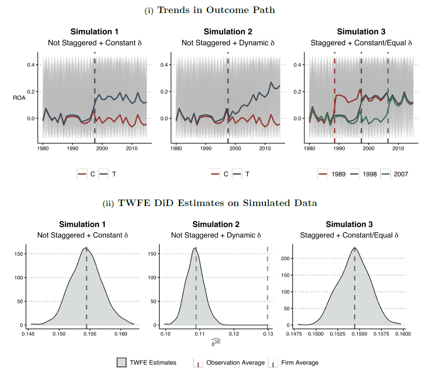
```

---

```{r, echo=F, out.width='72%', out.height='72%'}
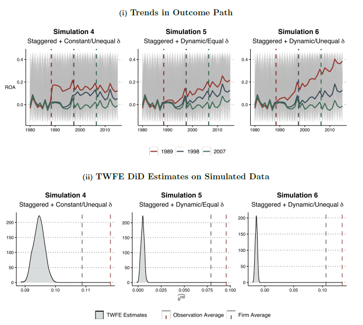
```

---

```{r, echo=F, out.width='60%', out.height='60%'}
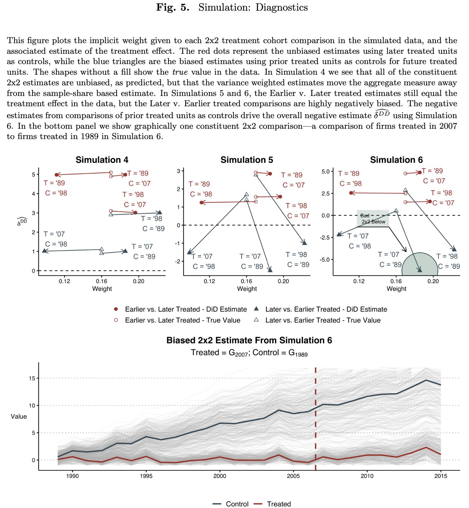
```

# Treatment turning on **and off**
## DID with Treatments Turning On and Off 

### Key Challenges

Most DID theory we use assumes:

- Treatment turns **on once and stays on**
- Groups are defined by **first treatment date**

But here:

- Treatment can **turn off**
- Units can **re-enter treatment**
- Exposure paths are multidimensional

This fundamentally changes the structure of the problem.

[This follows from DiD course from Pedro Sant'Anna][.smallest]

## Treatment Groups Dimensionality

With staggered adoption:

- Groups defined by first treatment time \( g \)

With on/off treatment:

- Groups defined by full **treatment sequences**

$$ d = (d_1, d_2, \dots, d_T), \quad d_t \in \{0,1\} $$

Number of possible sequences: $2^{T-1}$

Even with $T=4$, there can be 8 distinct paths.

This creates:

- Many more treatment groups
- Much more heterogeneity
- Severe dimensionality problems

## Potential Outcomes Must Be Indexed by Treatment Paths

Potential outcomes are now:

$$ Y_{i,t}(d) $$

indexed by entire sequences $ d $, not just treatment timing.

Parameter of interest:

$$
ATT(d,t) = E[Y_t(d) - Y_t(0) \mid G=d]
$$

Interpretation:

- Effect of following sequence $d$
- Relative to never-treated
- Among those who actually followed $d$

This is much harder to interpret than $ATT(g,t)$.


## Identification  Assumptions

We need:

**No Anticipation**
$$
Y_{i,t}(d) = Y_{i,t}(\infty) \quad \text{for } t < g^{start}
$$

**Strong Parallel Trends**
$$
E[Y_t(\infty)|G=d] - E[Y_{t-1}(\infty)|G=d]
=
E[Y_t(\infty)|G=d'] - E[Y_{t-1}(\infty)|G=d']
$$

for all $d, d'$. :contentReference[oaicite:4]{index=4}

This is stronger than typical staggered PTA:

- Must hold across *all treatment paths*
- Model becomes heavily over-identified


## Interpreting Effects

With on/off treatment:

- Many $ATT(d,t)$
- Many post-treatment periods
- Potentially dozens of parameters

Example in the lecture:

- $T=4$
- 7 treated groups
- 17 \((d,t)\) post-treatment parameters

Estimation is feasible.

Interpretation is the real challenge.


## Aggregation Is Complicated

We can aggregate by first treatment date:

$$
ATT^g(g^{start},t)
=
\sum_{d:Start(d)=g^{start}}
P(G=d \mid Start(d)=g^{start}) ATT(d,t)
$$

This looks like staggered DID.

But interpretation changes:

- We mix units who turned treatment off
- Units who re-enter
- Units with different exposure histories

Event-study aggregation:

$$
\theta^D_e(e)
$$

does **not** represent average effect by exposure length.

## “Per-Unit-of-Treatment” Normalization

[de Chaisemartin & D’Haultfœuille (2024)](https://direct.mit.edu/rest/article-abstract/doi/10.1162/rest_a_01414/119488/Difference-in-Differences-Estimators-of) propose:

$$
\theta^{per\,unit}_D(e)
=
\frac{\theta^D_e(e)}{FS(e)}
$$

Where:

- $FS(e)$ = average number of treated periods

Idea:
- Interpret as effect per unit of treatment

Caveat:
- Requires strong assumptions
- Implicitly assumes limited carryover
- Ignores interaction across sequential treatments
## Takeaways

1. Treatment groups are defined by full sequences, not just timing.
2. The number of causal parameters explodes.
3. Aggregation obscures economically meaningful interpretation.
4. Stronger assumptions may be required.
5. DID may not be the ideal framework in complex on/off settings.

## Practical Implications for Applied Work

If treatment turns on and off:

- Carefully define the causal question.
- Be explicit about treatment path interpretation.
- Be cautious with event-study aggregation.
- Consider dynamic treatment frameworks:
  - Marginal Structural Models
  - Panel experiments

# Pre-trends
## Pre-trends

Roth, (2022),  [Pre-test with Caution: Event-study Estimates After Testing for Parallel Trends](https://www.aeaweb.org/articles?id=10.1257/aeri.20210236) *AER Insights*

This paper makes two primary contributions:

1. Pre-trend tests may have low power
    - We saw this with the MTV and teen birth paper debate

1. Conditioning on pre-trend tests can make things worse
    - increase bias of point estimates
    - incorrect confidence intervals

---

```{r, echo=F, out.width='70%', out.height='70%'}
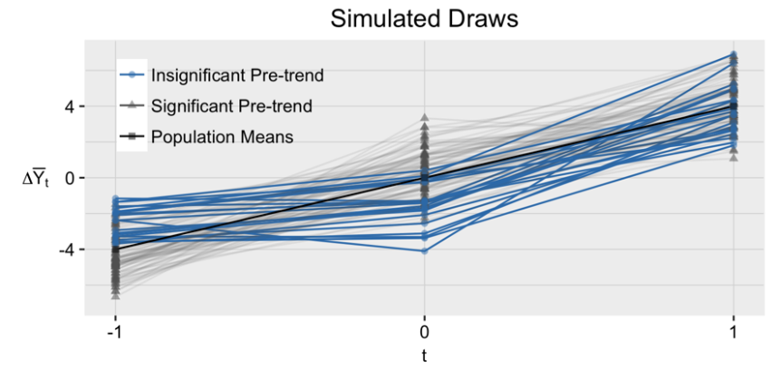
```

---

```{r, echo=F, out.width='70%', out.height='70%'}
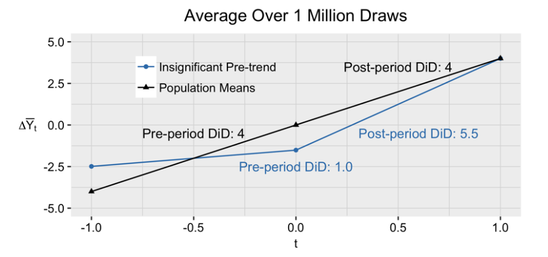
```

---

```{r, echo=F, out.width='70%', out.height='70%'}
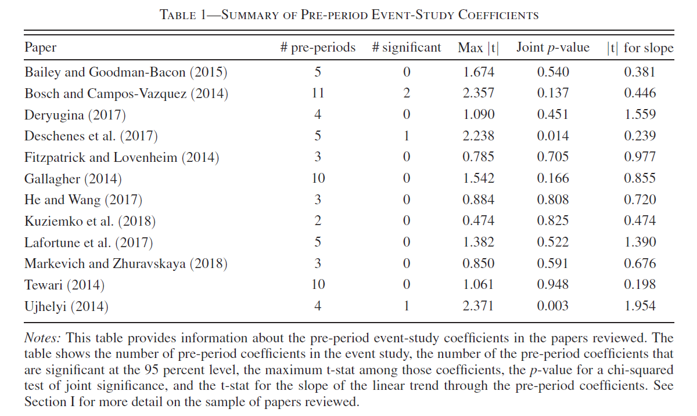
```

---

```{r, echo=F, out.width='70%', out.height='70%'}
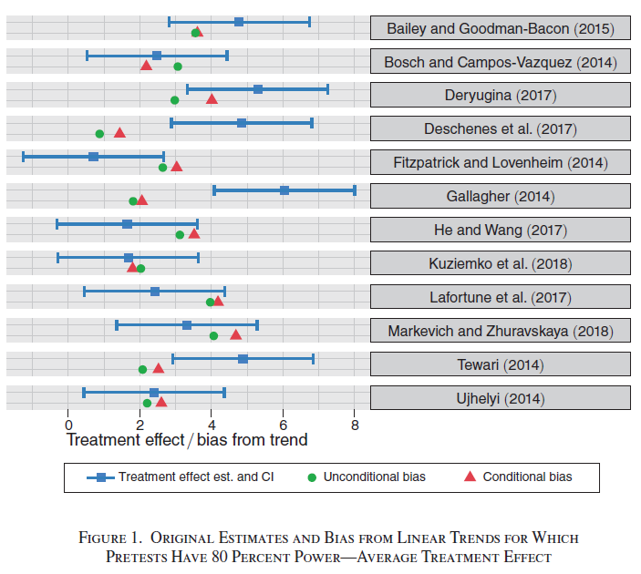
```

---

```{r, echo=F, out.width='70%', out.height='70%'}
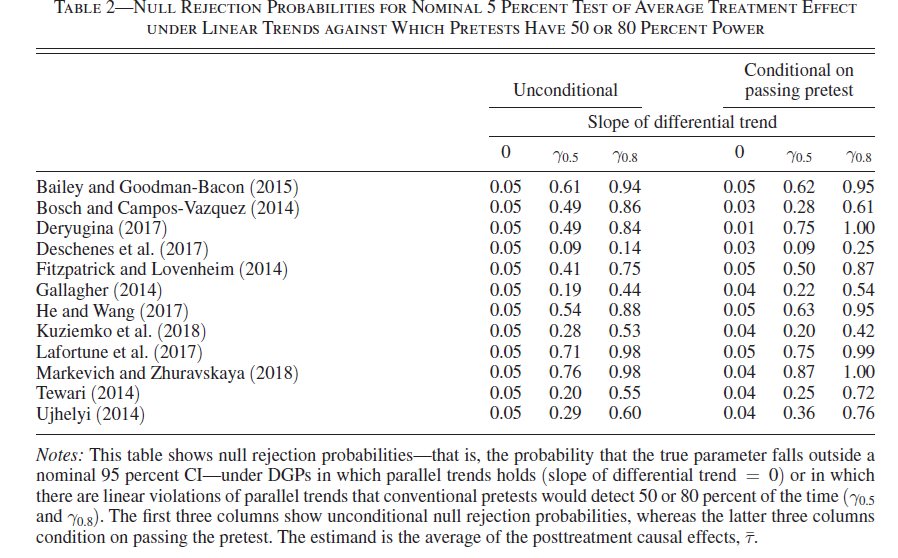
```

---

An additional challenge for pre-testings is that the new estimators for 
heterogeneous DID often construct pre- and post-treatment parameters asymmetrically

A new short paper [Interpreting Event-Studies from Recent Difference-in-Differences Methods](https://link.springer.com/article/10.1007/s42973-026-00235-x) by Jonathon Roth 
highlights how this affects "visual pre-trend testing"

The main takeaway is that you need to pay attention to the default settings on the
software packages and invest some effort into how to interpret the coefficients. 

---

Roth, Jonathan. "Interpreting event-studies from recent difference-in-differences methods." The Japanese Economic Review (2026): 1-14.

> The main point of this note is that for the purposes of assessing violations of 
parallel trends, the default event-study plots produced by software for several of the
most popular recent methods should not be interpreted in the same way as traditional
dynamic TWFE specifications. Indeed, I show that these event-study plots
do not match those of traditional dynamic TWFE specifications even when specialized
to the setting with non-staggered treatment timing

---

```{r, echo=F, out.width='70%', out.height='70%'}
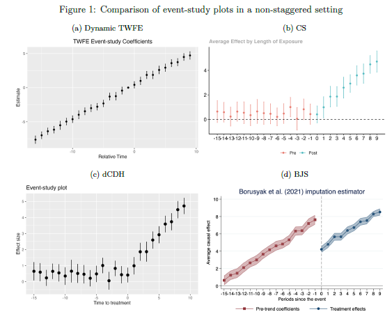
```

---

- The plots in the figure show a simulated non-staggerd DID DGP with no treatment effect and a violation of parallel trends

- TWFE shows the appropriate violation in parallel trends (panel (a))

- The Callaway and Sant'Anna (2021) and deDH estimators shows no parallel trends and a positive dynamic treatment effect

- The Borusyak, Jaravel and Spiess (2024) estimator shows a clear discontinuity at treatment

