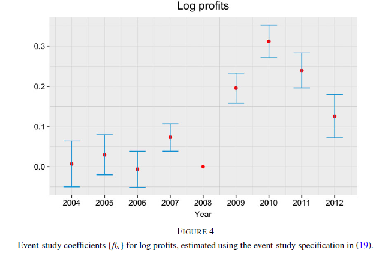
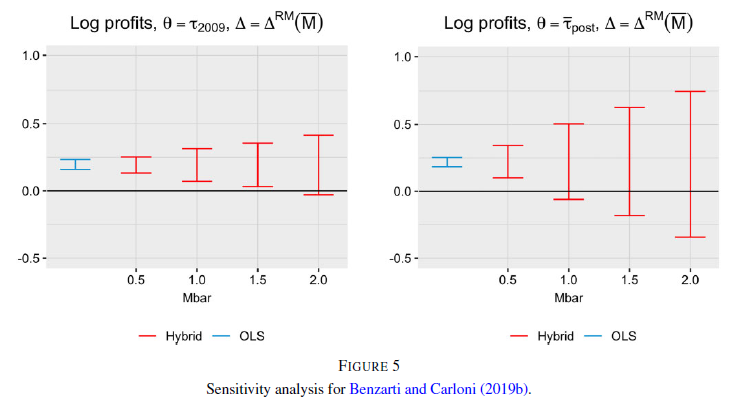
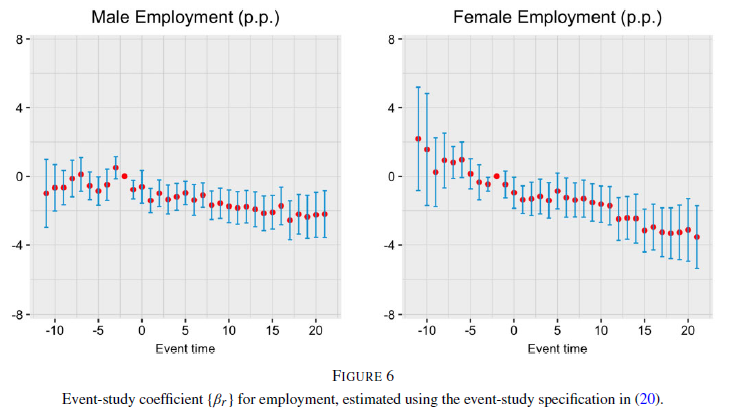
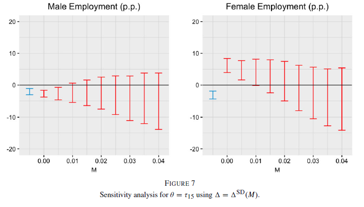

```{r, setup, include = F}
# devtools::install_github("dill/emoGG")
library(pacman)
p_load(
  broom, tidyverse,
  ggplot2, ggthemes, ggforce, ggridges,
  latex2exp, viridis, extrafont, gridExtra,
  kableExtra, snakecase, janitor,
  data.table, dplyr,
  lubridate, knitr,
  estimatr, here, magrittr, MASS, xtable
)
# Define pink color
red_pink <- "#e64173"
turquoise <- "#20B2AA"
orange <- "#FFA500"
red <- "#fb6107"
blue <- "#3b3b9a"
green <- "#8bb174"
grey_light <- "grey70"
grey_mid <- "grey50"
grey_dark <- "grey20"
purple <- "#6A5ACD"
slate <- "#314f4f"
# Dark slate grey: #314f4f
# Knitr options
opts_chunk$set(
  comment = "#>",
  fig.align = "center",
  fig.height = 7,
  fig.width = 10.5,
  warning = F,
  message = F
)
opts_chunk$set(dev = "svg")
options(device = function(file, width, height) {
  svg(tempfile(), width = width, height = height)
})
options(crayon.enabled = F)
options(knitr.table.format = "html")
# A blank theme for ggplot
theme_empty <- theme_bw() + theme(
  line = element_blank(),
  rect = element_blank(),
  strip.text = element_blank(),
  axis.text = element_blank(),
  plot.title = element_blank(),
  axis.title = element_blank(),
  plot.margin = structure(c(0, 0, -0.5, -1), unit = "lines", valid.unit = 3L, class = "unit"),
  legend.position = "none"
)
theme_simple <- theme_bw() + theme(
  line = element_blank(),
  panel.grid = element_blank(),
  rect = element_blank(),
  strip.text = element_blank(),
  axis.text.x = element_text(size = 18, family = "STIXGeneral"),
  axis.text.y = element_blank(),
  axis.ticks = element_blank(),
  plot.title = element_blank(),
  axis.title = element_blank(),
  # plot.margin = structure(c(0, 0, -1, -1), unit = "lines", valid.unit = 3L, class = "unit"),
  legend.position = "none"
)
theme_axes_math <- theme_void() + theme(
  text = element_text(family = "MathJax_Math"),
  axis.title = element_text(size = 22),
  axis.title.x = element_text(hjust = .95, margin = margin(0.15, 0, 0, 0, unit = "lines")),
  axis.title.y = element_text(vjust = .95, margin = margin(0, 0.15, 0, 0, unit = "lines")),
  axis.line = element_line(
    color = "grey70",
    size = 0.25,
    arrow = arrow(angle = 30, length = unit(0.15, "inches")
  )),
  plot.margin = structure(c(1, 0, 1, 0), unit = "lines", valid.unit = 3L, class = "unit"),
  legend.position = "none"
)
theme_axes_serif <- theme_void() + theme(
  text = element_text(family = "MathJax_Main"),
  axis.title = element_text(size = 22),
  axis.title.x = element_text(hjust = .95, margin = margin(0.15, 0, 0, 0, unit = "lines")),
  axis.title.y = element_text(vjust = .95, margin = margin(0, 0.15, 0, 0, unit = "lines")),
  axis.line = element_line(
    color = "grey70",
    size = 0.25,
    arrow = arrow(angle = 30, length = unit(0.15, "inches")
  )),
  plot.margin = structure(c(1, 0, 1, 0), unit = "lines", valid.unit = 3L, class = "unit"),
  legend.position = "none"
)
theme_axes <- theme_void() + theme(
  text = element_text(family = "Fira Sans Book"),
  axis.title = element_text(size = 18),
  axis.title.x = element_text(hjust = .95, margin = margin(0.15, 0, 0, 0, unit = "lines")),
  axis.title.y = element_text(vjust = .95, margin = margin(0, 0.15, 0, 0, unit = "lines")),
  axis.line = element_line(
    color = grey_light,
    size = 0.25,
    arrow = arrow(angle = 30, length = unit(0.15, "inches")
  )),
  plot.margin = structure(c(1, 0, 1, 0), unit = "lines", valid.unit = 3L, class = "unit"),
  legend.position = "none"
)
theme_set(theme_gray(base_size = 20))
# Column names for regression results
reg_columns <- c("Term", "Est.", "S.E.", "t stat.", "p-Value")
# Function for formatting p values
format_pvi <- function(pv) {
  return(ifelse(
    pv < 0.0001,
    "<0.0001",
    round(pv, 4) %>% format(scientific = F)
  ))
}
format_pv <- function(pvs) lapply(X = pvs, FUN = format_pvi) %>% unlist()
# Tidy regression results table
tidy_table <- function(x, terms, highlight_row = 1, highlight_color = "black", highlight_bold = T, digits = c(NA, 3, 3, 2, 5), title = NULL) {
  x %>%
    tidy() %>%
    select(1:5) %>%
    mutate(
      term = terms,
      p.value = p.value %>% format_pv()
    ) %>%
    kable(
      col.names = reg_columns,
      escape = F,
      digits = digits,
      caption = title
    ) %>%
    kable_styling(font_size = 20) %>%
    row_spec(1:nrow(tidy(x)), background = "white") %>%
    row_spec(highlight_row, bold = highlight_bold, color = highlight_color)
}
```

# Schedule {#schedule}
## Last time

DD New developments: Presentation of new methods

## Today

DD New developments: Solutions


## Upcoming

- Problem Set 5 - DD referee report/replication

# Reading
## Synthetic Control
- [Mixtape Ch. 10]{.orange}
- [Abadie, Diamond, Hainsmueller (2010)](https://www.tandfonline.com/doi/abs/10.1198/jasa.2009.ap08746)
- [Abadie (2021)](https://www.aeaweb.org/articles?id=10.1257/jel.20191450)
- [Arkhangelsky et al. (2021)](aeaweb.org/articles?id=10.1257/aer.20190159)
- [Ben-Michael et al. (2022)](https://academic.oup.com/jrsssb/article/84/2/351/7056152)

# Solutions
## Solutions

::: {.smaller}
1. Static effects
   - [de Chaistmartin & de D'Haultfoeuille (2020)](https://www.aeaweb.org/articles?id=10.1257/aer.20181169)
1. Dynamics
   - [Cengiz et al. (2019) Stacked regression](https://academic.oup.com/qje/article/134/3/1405/5484905)
   - [Sun and Abraham (2021)](https://www.sciencedirect.com/science/article/pii/S030440762030378X)
   - [Callaway and Sant'Anna (2021)](https://www.sciencedirect.com/science/article/pii/S0304407620303948)
   - [Borusyak et al. (2024)](https://academic.oup.com/restud/article/91/6/3253/7601390)
   - [Dube et al. (2025)](https://onlinelibrary.wiley.com/doi/epdf/10.1002/jae.70000)
   
   <!-- - [Woolridge (2025)](https://link.springer.com/article/10.1007/s00181-025-02807-z) -->
1. Non-binary/absorbing treatment
   - [de Chaistmartin et al. (2024)](https://papers.ssrn.com/sol3/papers.cfm?abstract_id=3731856)
   - [Callaway et al. (2025)](https://arxiv.org/pdf/2107.02637)
   
1. Pre-trends
   - [Rambachan & Roth (2023)](https://doi.org/10.1093/restud/rdad018)

:::

## DD anxiety

- You might be really concerned about starting any DD project

- Don't worry many of the papers that highlighted problems also offer solutions (with software packages!)

- There are also other papers working on solutions and fine-tuning packages

- We'll go through some of them, but this is still a very active area of research

# Static effects
## Static effects

de Chaisemartin & D'Haultfœuille, [Two-Way Fixed Effects Estimators with Heterogeneous Treatment Effects](#https://www.aeaweb.org/articles?id=10.1257/aer.20181169), AER (2020)

- In addition to highlighting the problem of negative weights in TWFE deD20 offer a solution
- This is only for static effects - no dynamics
- The logic comes from isolating two types of DD

1. "Switchers in": a DD comparing $t-1$ to $t$ change in outcomes from groups 
moving from untreated to treated compared to untreated at both dates

1. "Switchers out": a DD comparing $t-1$ to $t$ change in outcomes from groups 
treated at both dates compared to groups moving from treated to untreated

## Key Idea of the New Estimator

Instead of averaging across **all treated observations**, the estimator focuses on:

**cells where treatment changes.**

These are called **switching cells**.

Two types:

- Joiners: $D_{g,t-1}=0$, $D_{g,t}=1$
- Leavers: $D_{g,t-1}=1$, $D_{g,t}=0$

The estimator identifies the **average treatment effect for switching groups at the time of the switch.**

## Target Parameter

The parameter estimated is:

$$
\delta_S =
E\left[
\frac{1}{N_S}
\sum_{(i,g,t):t\ge2, D_{g,t}\neq D_{g,t-1}}
\left(Y_{igt}(1)-Y_{igt}(0)\right)
\right]
$$

Interpretation:

Average treatment effect among **groups that change treatment status.**

In staggered adoption designs:

- This equals the **average treatment effect at adoption.**

## Step 1: Joiner Difference-in-Differences

For joiners at time $t$:

$$
DID_{+,t}
=
\overline{\Delta Y}_{joiners,t}
-
\overline{\Delta Y}_{stable\ untreated,t}
$$

Compare:

- Groups switching **0 → 1**
- Groups remaining **0 → 0**

Interpretation:

Estimates treatment effect **for joiners at time $t$.**


## Step 2: Leaver Difference-in-Differences

For leavers:

$$
DID_{-,t}
=
\overline{\Delta Y}_{stable\ treated,t}
-
\overline{\Delta Y}_{leavers,t}
$$

Compare:

- Groups **1 → 1**
- Groups **1 → 0**

Interpretation:

Estimates treatment effect **for groups leaving treatment.**

## Final Estimator

The estimator aggregates the DID terms:

$$
DID_M
=
\sum_{t=2}^{T}
\left(
\frac{N_{1,0,t}}{N_S}DID_{+,t}
+
\frac{N_{0,1,t}}{N_S}DID_{-,t}
\right)
$$

Weights reflect the number of switching observations.

Result:

$$
E[DID_M] = \delta_S
$$

## Intuition

The estimator only compares **groups with the same treatment status prior to the switch.**

Example:

For joiners:

| Group | t-1 | t | Role |
|------|----|----|------|
| A | 0 | 1 | joiner |
| B | 0 | 0 | control |

Thus the comparison isolates the causal effect of treatment.

## Key Identification Assumptions
### 1. Common trends for untreated outcomes

$$
E(Y_{g,t}(0)-Y_{g,t-1}(0))
$$

is identical across groups.

This is the standard DID assumption.

## Key Identification Assumptions
### 2. Common trends for treated outcomes

$$
E(Y_{g,t}(1)-Y_{g,t-1}(1))
$$

is also identical across groups.

This allows identification when treatment status decreases.

## Key Identification Assumptions
### 3. Stable groups exist

If a group switches treatment between \(t-1\) and \(t\):

- There must be at least one group whose treatment **does not change**.

These groups provide the counterfactual trend.

## Interpretation

The estimator identifies:

**Average treatment effect at the time groups switch treatment status.**

Properties:

- Allows heterogeneity across groups and time
- Uses transparent DID comparisons
- Applies beyond staggered adoption designs

## Comparison with TWFE

::: {.smaller}
TWFE:

- Uses all treated observations
- May combine many DID comparisons

DIDM estimator:

- Uses **only valid DID comparisons**
- Focuses on **switching cells**

Tradeoff:

- More robust to heterogeneity
- Potentially higher variance

- Placebo test using trends of switchers and non-switchers before the switch
- Can be extended to non-binary treatments (de Chaisemartin et al. (2024))
:::

# Dynamic effects
## Dynamic effects

- There are now many ready to use estimators that allow for estimating dynamics.
- We're not going to cover all of them, but we'll go through some of the most widely-used
- These work when design is staggered and there are dynamic effects.

1. [Cengiz et al. (2019) Stacked regression](https://academic.oup.com/qje/article/134/3/1405/5484905)
1. [Sun and Abraham (2021)](https://www.sciencedirect.com/science/article/pii/S030440762030378X)
1. [Callaway and Sant'Anna (2021)](https://www.sciencedirect.com/science/article/pii/S0304407620303948)
1. [Borusyak et al. (2024)](https://academic.oup.com/restud/article/91/6/3253/7601390)
1. [Dube et al. (2025)](https://onlinelibrary.wiley.com/doi/epdf/10.1002/jae.70000)

# Cengiz et al. (2019) Stacked regression
## Cengiz et al. (2019) Stacked regression
### Motivation for the Stacked DID Approach

Event-study TWFE regressions often combine information from many treatment cohorts.

Problems arise when:

- Treatment occurs at **different times across groups**
- Some treated units become **controls for later treated units**

The stacked DID estimator instead constructs **clean two-group DID comparisons** for each treatment cohort.

This produces an event-study design that mimics **repeated $2\times2$ DID experiments.**

## Key Idea

For each treatment cohort:

1. Construct a **dataset specific to that treatment event**
2. Include:
   - units treated in that cohort
   - units **not yet treated** during that event window
3. Then stack all cohort-specific datasets together and estimate **one regression**.

Interact fixed effects for cohorts with all controls (e.g. unit and time FEs) and
cluster by unit and cohort to account for repeated observations.

## Constructing Each Stack

For treatment cohort $g$ define event time

$$
k = t - g
$$

where

- $k=0$ : treatment year  
- $k<0$ : pre-treatment periods  
- $k>0$ : post-treatment periods

Each stack includes:

- cohort $g$ units
- units **not yet treated by time $g+k$**

Thus controls remain untreated throughout the comparison window.

## Event-Study Regression in the Stacked Sample

::: {.smaller}
The stacked regression estimates

$$
Y_{itg} =
\sum_{k \neq -1}
\beta_k \mathbf{1}(t - g_i = k)
+
\alpha_{ig}
+
\lambda_{tg}
+
\varepsilon_{itg}
$$

where

- $g_i$ is the treatment cohort
- $k$ is event time
  - $k=-1$ is the omitted baseline period
- $g$ is a cohort indicator

Interpretation:

$$
\beta_k = \text{Average treatment effect at event time } k
$$

:::

## Why Stacking Works

Each stack compares:

- a **single treatment cohort**
- units that are **not yet treated**

Thus the estimator avoids comparisons between:

- early-treated units
- later-treated units

Each event-study coefficient corresponds to a **valid DID comparison.**

## Intuition

Instead of estimating one large regression using all treated units simultaneously, the method constructs

$$
\text{many smaller DID experiments}
$$

Example:

| Cohort | Treated | Controls |
|------|------|------|
| 2005 adopters | counties treated in 2005 | counties treated after 2005 |
| 2008 adopters | counties treated in 2008 | counties treated after 2008 |

Each cohort receives its **own control group.**

## Key Identification Assumption

### Parallel Trends Within Each Stack

For cohort $g$:

$$
E[Y_{it}(0) - Y_{i,t-1}(0) \mid g_i = g]
=
E[Y_{it}(0) - Y_{i,t-1}(0) \mid \text{controls}]
$$

Controls are units **not yet treated during the event window**.

## Additional Design Assumption

### No Anticipation

Potential outcomes before treatment do not depend on future treatment:

$$
Y_{it}(0) = Y_{it}
\quad \text{for } t < g_i
$$

Thus pre-treatment periods provide valid baseline comparisons.

## Interpretation of the Estimates

The stacked event-study coefficients estimate

$$
\beta_k =
E[\tau_{g,k}]
$$

where

- $g$ is the treatment cohort
- $k$ is event time

Thus the estimator recovers the **average dynamic treatment effect across cohorts.**

## Advantages of the Stacked DID

Advantages:

- Avoids treated-as-controls comparisons
- Produces interpretable event-study graphs
- Easy to implement with standard regression tools
- Transparent identification

Tradeoff:

- Some observations are excluded, which can increase variance relative to TWFE.
- Weighting is not obvious or necessarily desired.

## Practical Implementation

Steps:

1. Create cohort-specific datasets  
2. Restrict controls to **not-yet-treated units**  
3. Create event-time indicators using $k = t - g$  
4. Stack all datasets  
5. Estimate a fixed-effects regression

Common software implementations:

- R (`fixest`, manual stacking)
- Stata (`stackedev`)

## Wing et al. (2024)

[Wing et al. (2024)](https://www.nber.org/system/files/working_papers/w32054/w32054.pdf) highlight a limitation in the basic stacked DID regression.

Basic stacked DID constructs cohort-specific event studies and stacks them together.

However, the estimator can still suffer from **implicit weighting problems**.

Different stacks may contain different numbers of treated and control observations.

--- 

Thus the stacked regression implicitly estimates

$$
\hat{\beta}_k =
\sum_g w_{gk} \, \tau_{gk}
$$

where

- $g$ indexes treatment cohorts
- $k$ indexes event time
- $w_{gk}$ depends on the number of observations in each stacked dataset.

As a result, cohorts with larger control groups receive **more weight in the estimator.**

## Why Weighting Matters in Stacked DID

Stacking duplicates observations across multiple cohort datasets.

Example:

| Unit | Treatment Year | Appears in Stack for Cohort |
|-----|-----|-----|
| A | 2005 | 2005 |
| B | 2008 | 2005, 2008 |
| C | 2010 | 2005, 2008, 2010 |

Later-treated units appear as **controls in multiple stacks** and the weights $w_{gk}$ depend on **how often observations appear in stacks.**

Units that appear in more stacks receive **more influence**.

## Augmented Stacked DID

:::{.smaller}
The solution is to **reweight the stacked datasets** so that each cohort contributes appropriately to the estimator.

Instead of allowing regression sample sizes to determine weights, the augmented estimator ensures

$$
w_{gk} \propto \text{target population weights}
$$

For example:

- equal weight across cohorts
- weight proportional to cohort size
- weight proportional to treated observations

This produces a **transparent and interpretable average treatment effect.**
:::

## Augmented Stacked Regression

:::{.smaller}
The augmented estimator modifies the stacked regression by applying weights:

$$
Y_{itg} =
\sum_{k \neq -1}
\beta_k \mathbf{1}(t-g_i=k)
+
\alpha_{ig}
+
\lambda_{tg}
+
\varepsilon_{itg}
$$

but estimated using **stack-specific weights**:

$$
w_{itg} = \frac{1}{\text{number of times observation } i \text{ appears in stacks}}
$$

This ensures that repeated observations in multiple stacks do not receive excess influence.

The result is a properly weighted average of cohort-specific treatment effects.
:::

## Intuition

::: {.smaller}
Stacking creates **multiple copies of some observations** because units may appear as controls in several cohort datasets.

Without adjustment:

- observations appearing more frequently receive larger weight.

The augmentation corrects this by ensuring $\sum_i w_{itg} = N$ for the original sample.

Thus the estimator recovers the intended ATT:

$$
\beta_k = E[\tau_{g,k}]
$$

:::

## Takeaway

Basic stacked DID improves upon TWFE by constructing valid DID comparisons.

However:

- implicit weights may still depend on stack composition.

Augmented stacked DID solves this by

1. correcting observation weights across stacks  
2. ensuring interpretable cohort averaging  
3. preserving the clean DID comparison structure.

# Cohort-Specific Estimators
## Cohort-Specific Treatment Effects

Several recent DID estimators address heterogeneous treatment effects by estimating **cohort-specific causal effects first** and then aggregating them.

Two leading approaches:

- Sun & Abraham (2021)
- Callaway & Sant’Anna (2021)


## Key idea

Instead of estimating one global treatment coefficient ($\beta_{DD}$ or $\beta_{DD,k}$), estimate

$$
\tau_{g,t}
$$

the treatment effect for:

- cohort $g$
- time period $t$

and then aggregate these effects into a relevant ATT.

## Intuition

The core strategy is:

1. Identify **valid comparisons** where treated units are compared to units **not yet treated**.
2. Estimate treatment effects **separately for each cohort and event time**.
3. Aggregate these cohort-specific effects into an overall treatment effect.

Thus the estimator avoids comparisons between:

- early-treated units
- already-treated units

which generate bias in TWFE.

## Target Parameter

Both approaches focus on **group-time treatment effects**

$$
ATT(g,t) =
E[Y_t(1) - Y_t(0) \mid G=g]
$$

where

- $G=g$ denotes the cohort first treated in period $g$
- $t \ge g$

Interpretation:

Average treatment effect for units treated in cohort $g$ evaluated at time $t$.

## Sun & Abraham (2021)

Sun & Abraham (2021) modify the standard event-study regression.

Instead of estimating one coefficient per event time, they interact event time indicators with treatment cohorts.

Estimator:

$$
Y_{it} =
\alpha_i + \lambda_t +
\sum_{g}
\sum_{k \neq -1}
\beta_{gk}
\mathbf{1}\{G_i=g\} \times \mathbf{1}\{t-g=k\}
+
\varepsilon_{it}
$$

- controls are never-treated or last-treated cohorts
- this removes the contamination that occurs in TWFE event studies.

## Aggregation in Sun & Abraham

Each coefficient estimates:

$$
\beta_{gk} = ATT(g,g+k)
$$

After estimating cohort-specific effects, event-time averages are constructed using cohort weights:

$$
\beta_k =
\sum_g w_{gk} ATT(g,g+k)
$$

Weights typically reflect the **share of treated observations** in each cohort.

**Interpretation:** Average dynamic treatment effect at event time $k$.

## Key Assumptions (Sun & Abraham)

### Parallel Trends

For untreated outcomes:

$$
E[Y_{it}(0)-Y_{i,t-1}(0) \mid G=g]
=
E[Y_{it}(0)-Y_{i,t-1}(0) \mid G=\text{never treated}]
$$

### No Anticipation

$$
Y_{it}(0) = Y_{it}
\quad \text{for } t < G_i
$$

These allow identification of cohort-specific event-study effects.

## Callaway & Sant’Anna (2021)

Callaway & Sant’Anna estimate treatment effects **directly for each group and time period**.

$$
ATT(g,t) =
E[Y_t - Y_{g-1} \mid G=g]
-
E[Y_t - Y_{g-1} \mid C]
$$

where:

- $G=g$ is the treated cohort
- $C$ is the control group (never-treated or not-yet-treated)

This produces estimates for all $ATT(g,t)$ without requiring a regression framework.

## Aggregation

::: {.smaller}
Once group-time effects are estimated, they are aggregated into summary parameters.

Example: overall ATT

$$
ATT =
\sum_{g,t} w_{g,t} ATT(g,t)
$$

Different weights generate different estimands:

- cohort-weighted averages
- calendar-time averages
- event-time averages.

This makes the estimator **very flexible.**
:::

## Key Assumptions (Callaway & Sant’Anna)

### Conditional Parallel Trends

$$
E[Y_t(0)-Y_{t-1}(0) \mid G=g, X]
=
E[Y_t(0)-Y_{t-1}(0) \mid C, X]
$$

given covariates $X$.

This framework allows:

- regression adjustment
- propensity score weighting
- doubly robust estimators.

## Sun & Abraham vs Callaway & Sant’Anna

| Feature | Sun & Abraham | Callaway & Sant’Anna |
|---|---|---|
| Estimation | Event-study regression | Group-time ATT estimation |
| Unit of effect | $ATT(g,g+k)$ | $ATT(g,t)$ |
| Implementation | Modified regression | Two-step estimator |
| Aggregation | Event-time averages | Flexible weighting schemes |
| Covariates | Limited | Easily incorporated |

Common principle:

Estimate **cohort-specific treatment effects first**, then aggregate.

Both avoid the problematic comparisons in TWFE.

<!-- ## Software Implementations -->

<!-- ### Sun & Abraham (2021) -->

<!-- **R** -->
<!-- - Implemented in the **`fixest`** package -->

<!-- **Stata** -->
<!-- - Implemented in the **`eventstudyinteract`** package -->


<!-- ### Callaway & Sant’Anna (2021) -->

<!-- **R** -->
<!-- - Implemented in the **`did`** package -->

<!-- **Stata** -->
<!-- - Implemented in the **`csdid`** package -->


# Imputation methods
## Borusyak, Jaravel, and Spiess (2024) (BJS)


Core idea: estimate untreated potential outcomes using untreated observations only, then impute treatment effects for treated observations.

Why this matters:

- conventional TWFE can use invalid comparisons under staggered adoption
- heterogeneous treatment effects can generate biased weights
- dynamic TWFE can produce misleading long-run effects

## Setup and Target Estimand

Let $g_i$ denote the treatment date for unit $i$, and let treatment be absorbing.

Observed treatment status:
$$
D_{it} = 1[t \geq g_i]
$$

Potential untreated outcome:
$$
Y_{it}(0)
$$

Treatment effect for treated observation $(i,t)$:
$$
\tau_{it} = E[Y_{it} - Y_{it}(0)]
$$

## Setup and Target Estimand

The parameter of interest is a weighted average of treatment effects:
$$
\tau_w = \sum_{it \in \Omega_1} w_{it}\tau_{it}
$$

where $\Omega_1$ is the set of treated observations.

Examples include:

- the overall ATT
- horizon-specific event-study effects
- balanced dynamic effects
- subgroup- or exposure-weighted averages


## Identification Assumptions

### Parallel trends

Untreated potential outcomes follow:
$$
E[Y_{it}(0)] = \alpha_i + \beta_t
$$

### No anticipation

For untreated observations,
$$
Y_{it} = Y_{it}(0)
$$

so future treatment does not affect current outcomes.


## Formal estimator: Imputation approach

::: {.smallest}
With unrestricted treatment-effect heterogeneity, the efficient estimator takes an imputation form.

Step 1: Estimate untreated outcome model using untreated observations only
$$
Y_{it} = \alpha_i + \beta_t + \varepsilon_{it}
\qquad \text{for } (i,t) \in \Omega_0
$$

Step 2: Impute untreated potential outcomes for treated observations
$$
\widehat{Y}_{it}(0) = \hat{\alpha}_i + \hat{\beta}_t
$$

Step 3: Compute observation-specific treatment effects
$$
\hat{\tau}_{it} = Y_{it} - \widehat{Y}_{it}(0)
$$

Step 4: Aggregate using researcher-specified weights
$$
\hat{\tau}_w = \sum_{it \in \Omega_1} w_{it}\hat{\tau}_{it}
$$
:::

## Implications for inference

Inference is harder when treatment effects are heterogeneous because treatment effects cannot be cleanly separated from the residual for treated observations.

The paper develops:

- asymptotic theory for the imputation estimator
- cluster-robust conservative variance estimators
- leave-one-out style refinements for better finite-sample performance

Key implication:

- valid inference is still possible without imposing constant treatment effects

This is especially useful in short panels with staggered treatment timing.


## Dube, Girardi, Jordà, and Taylor (2025)

Core idea: combine *local projections* with a **clean control** rule so DiD comparisons only use valid controls.

Why this matters:

- conventional TWFE can use already-treated units as controls
- LP-DiD keeps only valid treated-control comparisons
- extends local-projection methods from time-series

## Setup and Target

Let $g_i$ denote the treatment time for unit $i$ and let treatment be absorbing.

Group-specific dynamic effect at horizon $h$ for cohort $g$:
$$
\tau_h^g = E\left[y_{i,g+h}(g) - y_{i,g+h}(0)\mid g_i = g\right]
$$

Main assumptions:

- no anticipation
- parallel trends

Under these assumptions, LP-DiD identifies convex averages of cohort-specific dynamic effects. 

## LP-DiD Estimator

The basic local projection is:
$$
y_{i,t+h} - y_{i,t-1} = \delta_t^h + \beta_h^{LP-DiD}\Delta D_{it} + e_{it}^h
$$

Estimate it using only observations that are either:

- **newly treated:** $\Delta D_{it} = 1$
- **clean controls:** $D_{i,t+h} = 0$

This clean-control restriction removes units whose outcomes may still be affected by earlier treatment.

**Note:** "Newly treated" units can include multiple periods post-treatment

## What Does It Estimate?

LP-DiD estimates:
$$
E\left(\hat{\beta}_h^{LP-DiD}\right)=\sum_{g\neq 0}\omega_{g,h}^{LP-DiD}\tau_h^g
$$

with weights
$$
\omega_{g,h}^{LP-DiD}
=
\frac{N_{CCS_{g,h}}\, n_{g,h}(1-n_{g,h})}
{\sum_{g\neq 0} N_{CCS_{g,h}}\, n_{g,h}(1-n_{g,h})}
$$

So the default estimator is a **variance-weighted ATT**:

- weights are always positive
- no negative-weight pathology
- weights depend on sample size and treatment variance


## What do the LP-DiD weights mean?

::: {.smallest}
$$
\omega_{g,h}^{LP-DiD}
=
\frac{N_{CCS_{g,h}}\, n_{g,h}(1-n_{g,h})}
{\sum_{g\neq 0} N_{CCS_{g,h}}\, n_{g,h}(1-n_{g,h})}
$$

::: {.fragment}
- $CCS_{g,h}$ = the **clean control sample** for cohort $g$ at horizon $h$
  - units in cohort $g$ that are newly treated at $p_g$, and
  - control units that are still untreated at $p_g+h$
- $N_{CCS_{g,h}}$ = the number of observations in that clean comparison set $CCS_{g,h}$
    - bigger clean comparison samples get more weight, all else equal
- $n_{g,h} \equiv \dfrac{N_g}{N_{CCS_{g,h}}}$
  - share of treated observations inside the clean comparison set for cohort $g$ at horizon $h$ 
- $n_{g,h}(1-n_{g,h})$ = the variance of a binary treatment indicator within the clean comparison set
  - weights are larger when there is more treatment variation in the clean comparison set
- $\sum_{g\neq 0} N_{CCS_{g,h}}\, n_{g,h}(1-n_{g,h})$ = the sum of these terms across all treated cohorts
    - normalize weights to sum to one
    
:::
:::

## Equally Weighted ATT and Extensions

If the target is an equally weighted ATT, LP-DiD can be reweighted or implemented via regression adjustment.

The framework also extends naturally to:

- covariates under conditional parallel trends
- pooled post-treatment effects
- alternative pre-treatment base periods
- nonabsorbing treatment with modified clean-control rules

A key advantage is flexibility: many recent DiD estimators can be viewed as special cases of LP-DiD.

## Relation to Other Estimators

The paper shows close links between LP-DiD and several modern DiD estimators:

- variance-weighted LP-DiD $\approx$ stacked regression
- reweighted LP-DiD $\approx$ Callaway and Sant'Anna
- premean-differenced LP-DiD is closely related to Borusyak, Jaravel, and Spiess

Their simulations show:

- TWFE performs poorly under heterogeneity
- LP-DiD tracks the true dynamic effects well
- LP-DiD performs similarly to other modern estimators
- LP-DiD is often computationally faster

# Non-binary/absorbing treatment

## de Chaisemartin and D’Haultfœuille (2024)

Core idea: build DiD event-study estimators for settings with

- non-binary treatments
- non-absorbing treatments
- lagged treatment effects

Why this matters:

- many applied settings do not fit binary staggered adoption
- TWFE can be biased with heterogeneous dynamic effects
- local-projection TWFE can be biased even with homogeneous effects

## Setup and Target

Let $D_{g,t}$ be group $g$'s treatment at time $t$, and let outcomes depend on current and lagged treatment.

For a group's first treatment change date $F_g$, define the group-level "actual vs. status quo" effect:
$$
\delta_{g,\ell}
=
E\left[
Y_{g,F_g-1+\ell}
-
Y_{g,F_g-1+\ell}(D_{g,1},\dots,D_{g,1})
\mid D
\right]
$$

This compares the actual outcome to the counterfactual where the group kept its period-1 treatment throughout.

The aggregate event-study effect averages these group-level effects across switchers. 

## Key Assumptions

::: {.smaller}
### No anticipation
$$
Y_{g,t}(d_1,\dots,d_T)=Y_{g,t}(d_1,\dots,d_t)
$$

### Parallel trends for the status-quo outcome

Groups with the same period-1 treatment have the same expected evolution of outcomes under the status quo path.

Key implication:

- controls should have the **same baseline treatment**
- otherwise identification can fail when lagged effects or time-varying effects matter

This is a central difference from simpler DiD setups. 
:::

## Group-Level DID Estimator

::: {.smaller}
For group $g$ and horizon $\ell$, compare its outcome change to groups with:

- the same period-1 treatment
- no treatment change yet by $F_g-1+\ell$

The estimator is:
$$
DID_{g,\ell}
=
Y_{g,F_g-1+\ell}-Y_{g,F_g-1}
-
\frac{1}{N^{g}_{F_g-1+\ell}}
\sum_{g':\,D_{g',1}=D_{g,1},\,F_{g'}>F_g-1+\ell}
\left(
Y_{g',F_g-1+\ell}-Y_{g',F_g-1}
\right)
$$

Under no anticipation and parallel trends,
$$
E[DID_{g,\ell}\mid D] = \delta_{g,\ell}.
$$
:::

## Event-Study and Normalized Effects

The non-normalized event-study estimator averages $DID_{g,\ell}$ across groups:
$$
DID_{\ell}
=
\frac{1}{N_{\ell}}
\sum_{g:F_g-1+\ell\leq T_g} S_g DID_{g,\ell}
$$

where $S_g$ flips the sign for groups whose treatment decreases, so effects are interpreted as exposure to a weakly higher dose.

## Normalized Estimator 

They also propose a **normalized** estimator:
$$
DID^n_{\ell} = \frac{DID_{\ell}}{\delta^D_{\ell}}
$$

Why normalize?

- raw effects can mix different treatment increments
- normalized effects recover a weighted average of the effects of the current treatment and its lags
- useful for testing whether lag effects are similar over time 

## No Sign Reversal Property

::: {.smaller}
**Intuition:** the estimator should not flip the direction of the effect

Suppose "more treatment" always helps.

Example for one group:

- period 1 treatment: $1$
- period 2 treatment: $2$
- period 3 treatment: $0$

Compare the actual path $(1,2,0)$ to staying at the baseline treatment forever $(1,1,1)$.

Then the period-3 effect compares:
$$
(1,2,0) \quad \text{vs.} \quad (1,1,1)
$$

:::

## No Sign Reversal Property

::: {.smallest}
This is not a clean "more treatment" comparison.

It combines:

- a **positive** effect from increasing treatment in period 2 from $1$ to $2$
- minus a **positive** effect from increasing treatment in period 3 from $0$ to $1$

So the net effect could be **negative**, even if every treatment increase is beneficial.

### Takeaway

The **no sign reversal property** means:

> if every relevant treatment increase moves outcomes in the same direction, the summary effect should not point the other way.

This is why the paper prefers designs where treatment paths do not cross their baseline in opposite directions over time.
:::


## Why Not TWFE or LP Regressions?

The paper shows that common alternatives can be problematic:

- **TWFE distributed-lag regressions**
  - can place negative weights on lag effects
  - can be contaminated by effects of other lags

- **Panel local projections**
  - can mix effects from different exposure lengths
  - can be biased even under homogeneous treatment effects

So even if treatment effects are constant, LP-style TWFE can still fail in these designs.

## Inference and Takeaway

The paper develops:

- asymptotic normality for $DID_{\ell}$
- conservative confidence intervals
- placebo estimators for testing assumptions
- extensions for covariates, trends, heterogeneity, and continuous baseline treatment

Takeaway:

> Compare switchers to not-yet-switchers with the same baseline treatment, then aggregate across horizons in a way that remains valid with non-binary, non-absorbing, and dynamic treatments. 

## Callaway, Goodman-Bacon, and Sant'Anna (2025)

### Difference-in-Differences with a Continuous Treatment

Core idea: with a continuous dose, DiD can target two different causal objects:

- **level effects**: effect of moving from zero treatment to dose $d$
- **causal responses**: effect of a marginal increase in dose

Why this matters:

- these are not the same object
- they require different assumptions
- simple TWFE can mix them in hard-to-interpret ways

## Setup and Parameters

::: {.smallest}
In period 1, nobody is treated. In period 2, units receive dose $D_i \in \{0\}\cup D_+$.

Potential outcomes:
$$
Y_t(d)
$$

### Average level treatment effect
$$
ATT(d\mid d) = E[Y_2(d)-Y_2(0)\mid D=d]
$$

This is the effect of dose $d$ for units that actually received dose $d$.

### Average causal response
$$
ACRT(d) = \frac{\partial E[Y_2(d)\mid D>0]}{\partial d}
$$

This is the effect of a marginal increase in the dose.
:::

## Standard Parallel Trends

Under standard parallel trends,
$$
E[Y_2(0)-Y_1(0)\mid D=d] = E[Y_2(0)-Y_1(0)\mid D=0]
$$

this identifies dose-specific level effects:
$$
ATT(d\mid d) = E[\Delta Y\mid D=d] - E[\Delta Y\mid D=0]
$$

Key point:

- this justifies comparing each dose group to the untreated group
- it identifies **level effects**
- it does **not** generally identify causal responses by comparing adjacent dose groups


## Why Causal Responses Are Harder

Comparing nearby dose groups mixes together:

- the causal effect of a higher dose
- differences in treatment effects across dose groups

This extra term is the paper's **selection bias**.

So under standard parallel trends:
$$
\frac{\partial E[\Delta Y\mid D=d]}{\partial d}
=
ACRT(d\mid d)
+
\text{selection bias}
$$

**Intuition:** higher-dose groups may differ not just because they got more treatment, but because they would experience different treatment effects even at the same dose.

## Strong Parallel Trends

::: {.smaller}
To interpret dose comparisons causally, the paper introduces **strong parallel trends**.

This rules out selection into dose on the basis of treatment effects and implies:
$$
ATT(d) = E[\Delta Y\mid D=d] - E[\Delta Y\mid D=0]
$$

and for continuous doses,
$$
ACRT(d) = \frac{\partial E[\Delta Y\mid D=d]}{\partial d}
$$

So under strong parallel trends:

- outcome changes across dose groups trace out the causal dose-response function
- derivatives of that function have a causal interpretation
:::

## Preferred Estimation Strategy

Instead of using TWFE as the estimand, the paper recommends **forward engineering**:

1. choose the causal object of interest
2. state the assumption that identifies it
3. estimate that object directly

Examples:

- estimate $ATT(d)$ or $ATT(d\mid d)$ as dose-specific DiD contrasts
- estimate $ACRT(d)$ using flexible regression of $\Delta Y$ on $D$ among treated units
- aggregate using the actual dose distribution, not TWFE weights

**Main message:** pick the estimand first, then build the estimator to match it.


# Pre-trends
## Rambachan and Roth (2023)

- Motivation is "partial identification", where you widen confidence intervals (or idenification set) by relaxing assumptions
  - See [Tamer (2022)](https://scholar.harvard.edu/files/tamer/files/pie.pdf) and [Manski and Pepper (2018)](https://direct.mit.edu/rest/article-abstract/100/2/232/58452/How-Do-Right-to-Carry-Laws-Affect-Crime-Rates?redirectedFrom=fulltext)

Core idea: do not assume parallel trends holds exactly.

- allow violations of parallel trends
- restrict how post-treatment violations can relate to pre-trends
- do inference on the treatment effect under those restrictions

This turns DiD into a **partial identification + sensitivity analysis** problem.

## Setup and Main Idea

::: {.smallest}
Let the event-study coefficients satisfy:
$$
\beta =
\begin{pmatrix}
0 \\
\tau_{post}
\end{pmatrix}
+
\begin{pmatrix}
\delta_{pre} \\
\delta_{post}
\end{pmatrix}
$$

where:

- $\tau_{post}$ is the causal effect of interest
- $\delta$ is bias from differential trends

Under exact parallel trends: $\delta_{post}=0$

Rambachan and Roth instead assume: $\delta \in \Delta$

where $\Delta$ is a researcher-chosen set describing plausible trend violations.

Key takeaway:

> Pre-trends are informative, but they do not justify assuming post-treatment bias is exactly zero.

:::

## Restriction Classes

::: {.smaller}

Two leading choices for $\Delta$:

**Relative magnitude restrictions**
Bound post-treatment violations using the size of pre-treatment violations:
$$
\Delta^{RM}(\bar M)
$$

**Intuition:** post-treatment confounding cannot be much larger than pre-treatment confounding

**Smoothness restrictions**
Bound changes in the slope of the differential trend:
$$
\Delta^{SD}(M)=\left\{\delta:\left|(\delta_{t+1}-\delta_t)-(\delta_t-\delta_{t-1})\right|\le M\right\}
$$

:::


## Identified Set and Honest Inference

For a scalar target
$$
\theta = l'\tau_{post},
$$
the treatment effect is generally **set identified**, not point identified.

The identified set is:
$$
S(\beta,\Delta)=\left[\theta^{lb}(\beta,\Delta),\theta^{ub}(\beta,\Delta)\right]
$$

So inference must account for:

- **sampling uncertainty** in estimating event-study coefficients
- **identification uncertainty** from not knowing the exact post-treatment bias

---

The paper proposes two approaches:

1. **Conditional / hybrid moment-inequality confidence sets**
   - general
   - valid for broad polyhedral restrictions

2. **Fixed-length confidence intervals (FLCIs)**
   - especially attractive for $\Delta^{SD}(M)$
   - can be shorter when smoothness is the main restriction

## Application 1: VAT Cut in France

The first application revisits Benzarti and Carloni (2019) on the effect of a VAT cut on restaurant profits.

## Original event study

```{r, echo=F, out.width='80%', out.height='80%'}

```

## HonestDiD sensitivity analysis

```{r, echo=F, out.width='80%', out.height='80%'}

```

---

Interpretation:

- the original event study shows a positive post-treatment effect
- under $\Delta^{RM}(\bar M)$, the conclusion remains positive for moderate departures from parallel trends
- the figure makes the **breakdown value** transparent: how large post-treatment confounding must be to overturn the result

## Application 2: Duty-to-Bargain Laws

The second application revisits Lovenheim and Willen (2019) on long-run employment effects of teacher collective bargaining laws.

## Original event study

```{r, echo=F, out.width='80%', out.height='80%'}

```

## HonestDiD sensitivity analysis

```{r, echo=F, out.width='80%', out.height='80%'}

```

---

Interpretation:

- for men, the result is somewhat robust to small smooth deviations from linear trends
- for women, allowing linear violations of parallel trends can substantially change the sign of the conclusion
- the method clarifies exactly how much nonlinearity is needed to overturn the original claim

---

## Practical Takeaways

Rambachan and Roth provide a framework for **honest DiD inference when parallel trends is questionable**.

Main lessons:

- pre-trends tests alone are not enough
- replace exact parallel trends with economically motivated restrictions on trend violations
- report **robust confidence sets** and **sensitivity analyses**
- use:
  - **FLCIs** for $\Delta^{SD}(M)$
  - **hybrid conditional methods** more generally

# Summary
## Modern DiD: What problem is each method solving?

::: {.smaller}
- **TWFE contamination / negative weights**
  - **Sun & Abraham (2021)**: contamination-free event-study coefficients
  - **Callaway & Sant'Anna (2021)**: group-time ATT, then aggregate
  - **Borusyak, Jaravel, Spiess (2024)**: imputation estimator
  - **Stacked DiD**: clean sub-experiments
  - **LP-DiD (Dube et al. 2025)**: local projections + clean controls

- **More complicated treatment paths**
  - **de Chaisemartin & D’Haultfœuille (2024)**: non-binary, non-absorbing, lagged effects
  - **Callaway, Goodman-Bacon, Sant'Anna (2025)**: continuous treatment / dose response

- **Relaxing exact parallel trends**
  - **Rambachan & Roth (2023)**: honest sensitivity analysis and robust inference
  
:::

## Quick Comparison of the Main Estimators

::: {.smallest}

- **Sun & Abraham (2021)**
  - Best for: dynamic effects with staggered absorbing treatment
  - Key idea: estimate cohort-specific event-time effects, avoid lead/lag contamination

- **Callaway & Sant'Anna (2021)**
  - Best for: flexible ATT aggregation, covariates, doubly robust estimation
  - Key idea: identify **group-time ATT** first, aggregate second

- **Borusyak, Jaravel, Spiess (2024)**
  - Best for: efficient robust event-study estimation
  - Key idea: estimate untreated outcomes on untreated observations only, then impute

- **Stacked DiD (Cengiz et al.; Wing et al.)**
  - Best for: intuitive clean-control event studies
  - Key idea: build valid sub-experiments; **weighted** stacked regression is needed for the trimmed aggregate ATT

- **LP-DiD (Dube et al. 2025)**
  - Best for: simple regression-based implementation with clean controls
  - Key idea: local projections version of DiD; closely links to stacked DID / CS / BJS

:::

## Specialized Extensions

::: {.smaller}

- **de Chaisemartin & D’Haultfœuille (2024)**
  - Use when treatment is **non-binary**, **non-absorbing**, or has **lagged path effects**
  - Compare switchers to groups with the **same baseline treatment**

- **Callaway, Goodman-Bacon, Sant'Anna (2025)**
  - Use when treatment is **continuous**
  - Distinguishes:
    - **level effects** of dose $d$
    - **causal responses** to marginal dose changes
  - Stronger assumptions are needed for causal dose-response comparisons

- **Rambachan & Roth (2023)**
  - Use when exact parallel trends is not fully credible
  - Treats DiD as a **sensitivity analysis / partial identification** problem

:::

## Software Packages

::: {.smaller}
### R

- **did** — Callaway & Sant'Anna (2021)
- **HonestDiD** — Rambachan & Roth (2023)
- **contdid** — Callaway, Goodman-Bacon, Sant'Anna (2025)
- **did_multiplegt_dyn** — de Chaisemartin & D’Haultfœuille (2024), complex dynamic designs

### Stata

- **did_imputation** + **event_plot** — Borusyak, Jaravel, Spiess (2024)
- **did_multiplegt** — DIDM from de Chaisemartin & D’Haultfœuille (2020)
- **did_multiplegt_dyn** — dynamic/complex-treatment dCDH estimators
- **HonestDiD / honestdid** — Rambachan & Roth (2023)
- **eventstudyweights** — Sun & Abraham (2021) diagnostics
- **stacked-did-weights** code repo — Wing, Freedman, Hollingsworth (2024)

:::

## Practical Guide: Which One Should I Use?

::: {.smaller}

- Want a strong default for staggered absorbing treatment?
  - **Callaway & Sant'Anna**, **Sun & Abraham**, or **Borusyak-Jaravel-Spiess**

- Want the most transparent regression implementation with clean controls?
  - **LP-DiD** or **weighted stacked DiD**

- Want efficiency and imputation-based estimation?
  - **Borusyak-Jaravel-Spiess**

- Need non-binary / on-off / dynamic path treatments?
  - **de Chaisemartin & D’Haultfœuille (2024)**

- Need continuous doses?
  - **Callaway, Goodman-Bacon, Sant'Anna (2025)**

- Worried parallel trends may fail?
  - **Rambachan & Roth (2023)**

:::
