```{r, setup, include = F}
# devtools::install_github("dill/emoGG")
library(pacman)
p_load(
  broom, tidyverse,
  ggplot2, ggthemes, ggforce, ggridges,
  latex2exp, viridis, extrafont, gridExtra,
  kableExtra, snakecase, janitor,
  data.table, dplyr,
  lubridate, knitr,
  estimatr, here, magrittr, MASS, xtable
)
# Define pink color
red_pink <- "#e64173"
turquoise <- "#20B2AA"
orange <- "#FFA500"
red <- "#fb6107"
blue <- "#3b3b9a"
green <- "#8bb174"
grey_light <- "grey70"
grey_mid <- "grey50"
grey_dark <- "grey20"
purple <- "#6A5ACD"
slate <- "#314f4f"
# Dark slate grey: #314f4f
# Knitr options
opts_chunk$set(
  comment = "#>",
  fig.align = "center",
  fig.height = 7,
  fig.width = 10.5,
  warning = F,
  message = F
)
opts_chunk$set(dev = "svg")
options(device = function(file, width, height) {
  svg(tempfile(), width = width, height = height)
})
options(crayon.enabled = F)
options(knitr.table.format = "html")
# A blank theme for ggplot
theme_empty <- theme_bw() + theme(
  line = element_blank(),
  rect = element_blank(),
  strip.text = element_blank(),
  axis.text = element_blank(),
  plot.title = element_blank(),
  axis.title = element_blank(),
  plot.margin = structure(c(0, 0, -0.5, -1), unit = "lines", valid.unit = 3L, class = "unit"),
  legend.position = "none"
)
theme_simple <- theme_bw() + theme(
  line = element_blank(),
  panel.grid = element_blank(),
  rect = element_blank(),
  strip.text = element_blank(),
  axis.text.x = element_text(size = 18, family = "STIXGeneral"),
  axis.text.y = element_blank(),
  axis.ticks = element_blank(),
  plot.title = element_blank(),
  axis.title = element_blank(),
  # plot.margin = structure(c(0, 0, -1, -1), unit = "lines", valid.unit = 3L, class = "unit"),
  legend.position = "none"
)
theme_axes_math <- theme_void() + theme(
  text = element_text(family = "MathJax_Math"),
  axis.title = element_text(size = 22),
  axis.title.x = element_text(hjust = .95, margin = margin(0.15, 0, 0, 0, unit = "lines")),
  axis.title.y = element_text(vjust = .95, margin = margin(0, 0.15, 0, 0, unit = "lines")),
  axis.line = element_line(
    color = "grey70",
    size = 0.25,
    arrow = arrow(angle = 30, length = unit(0.15, "inches")
  )),
  plot.margin = structure(c(1, 0, 1, 0), unit = "lines", valid.unit = 3L, class = "unit"),
  legend.position = "none"
)
theme_axes_serif <- theme_void() + theme(
  text = element_text(family = "MathJax_Main"),
  axis.title = element_text(size = 22),
  axis.title.x = element_text(hjust = .95, margin = margin(0.15, 0, 0, 0, unit = "lines")),
  axis.title.y = element_text(vjust = .95, margin = margin(0, 0.15, 0, 0, unit = "lines")),
  axis.line = element_line(
    color = "grey70",
    size = 0.25,
    arrow = arrow(angle = 30, length = unit(0.15, "inches")
  )),
  plot.margin = structure(c(1, 0, 1, 0), unit = "lines", valid.unit = 3L, class = "unit"),
  legend.position = "none"
)
theme_axes <- theme_void() + theme(
  text = element_text(family = "Fira Sans Book"),
  axis.title = element_text(size = 18),
  axis.title.x = element_text(hjust = .95, margin = margin(0.15, 0, 0, 0, unit = "lines")),
  axis.title.y = element_text(vjust = .95, margin = margin(0, 0.15, 0, 0, unit = "lines")),
  axis.line = element_line(
    color = grey_light,
    size = 0.25,
    arrow = arrow(angle = 30, length = unit(0.15, "inches")
  )),
  plot.margin = structure(c(1, 0, 1, 0), unit = "lines", valid.unit = 3L, class = "unit"),
  legend.position = "none"
)
theme_set(theme_gray(base_size = 20))
# Column names for regression results
reg_columns <- c("Term", "Est.", "S.E.", "t stat.", "p-Value")
# Function for formatting p values
format_pvi <- function(pv) {
  return(ifelse(
    pv < 0.0001,
    "<0.0001",
    round(pv, 4) %>% format(scientific = F)
  ))
}
format_pv <- function(pvs) lapply(X = pvs, FUN = format_pvi) %>% unlist()
# Tidy regression results table
tidy_table <- function(x, terms, highlight_row = 1, highlight_color = "black", highlight_bold = T, digits = c(NA, 3, 3, 2, 5), title = NULL) {
  x %>%
    tidy() %>%
    select(1:5) %>%
    mutate(
      term = terms,
      p.value = p.value %>% format_pv()
    ) %>%
    kable(
      col.names = reg_columns,
      escape = F,
      digits = digits,
      caption = title
    ) %>%
    kable_styling(font_size = 20) %>%
    row_spec(1:nrow(tidy(x)), background = "white") %>%
    row_spec(highlight_row, bold = highlight_bold, color = highlight_color)
}
```


# Schedule

## Last time

- Finish DD New Developments

## Today

- Synthetic control

## Upcoming

- Regression discontinuity
- Work on referee report/replication

# Reading

## Regression Discontinuity
- [*MHE* Ch. 6]{.red}
- [Mixtape Ch. 6]{.orange}
- [Effect Ch. 20]{.dblue}
- Imbens and Lemieux (2008), [Regression discontinuity designs: A guide to practice](https://www.sciencedirect.com/science/article/pii/S0304407607001091)
- Lee and Lemieux  (2010), [Regression Discontinuity Designs in Economics](https://www.aeaweb.org/articles?id=10.1257/jel.48.2.281)
- Cattaneo and Titiunik  (2022), [Regression Discontinuity Designs](https://cattaneo.princeton.edu/papers/Cattaneo-Titiunik_2022_ARE.pdf)
- [Robust data driven RD - Cattaneo and coauthors](https://rdpackages.github.io/)

# Synthetic Control
## Introduction

- To estimate causal effects from DD the untreated units need to have common trends to the treated units in the post period.

::: {.fragment}
- When may this *not* occur?
:::

::: {.fragment}
- A prime scenario is when the treated unit is not "representative" of **any** control units.
- Motivating examples are large atypical states or countries (e.g. California or China/U.S.)
- There may not be a set of control states to serve as a valid counterfactual.
:::

## Introduction

- We discussed combining matching + DD to help make the common trends assumption more palatable.

- However, matching helps motivates why we may need another method in some settings.

- Consider nearest-neighbor matching:

::: {.fragment}
- Do you think any single state serves as a good match for California?
- Do you think any single country serves as a good match for the U.S.?
:::


## Introduction

- What do we do in these settings?

::: {.fragment}
- [The Mixtape]{.orange} refers to these settings as **comparative case studies**. We may try to infer the cause of certain outcomes in one specific scenario based on logic and historical perspective.
- So one approach could be to do a *qualitative* comparative case study.
- What do we want to do if we want introduce formal causal inference and numerical precision?
:::

::: {.fragment}
Enter synthetic control.
:::

## Introduction

- The basic intuition of synthetic control is that while a **single** or **unweighted group** of untreated units may not serve as a valid counterfactual for an atypical treated unit...

::: {.fragment}
- We may be able to construct a valid counterfactual from a **weighted average** of untreated units.
:::

::: {.fragment}
- Specifically, we attempt to construct weights to minimize mean squared prediction error (MSPE) between the weighted average of the untreated units and the treated unit in the pre-period.
- [Intuition:]{.hi} If we can match the pre-treatment time path of treated units with a [synthetic control]{.hi}, then the synthetic control serves as a valid counterfactual in the out-of-sample post-period for treated units.
:::


## Implementation

::: {.smaller}
- Let $Y_{it}$ be the outcome of interest for $N+1$ aggregate units at time $t$.

- The treated unit is designated by $i = 1$.

- There is an intervention at time period $T_0$ that only affects the treated unit (treated periods are $t > T_0$).

- The causal effect of the intervention is modeled as:

$$
\hat{\tau}_{1t} = Y_{1t} - \hat{Y}_{1t}
$$

where

- $\hat{Y}_{1t} = \sum_{i=2}^{N+1} w_{it}^* Y_{it}$
- $w_{it}^*$ is a vector of optimally selected weights.

:::

## Weights

How do we select the weights?

::: {.fragment}
Consider a [pre-determined]{.hi-green} variable (or vector) $X$ that affects [post-intervention]{.hi} outcomes.

The weights are constructed to minimize the norm $||X_1 - X_0 W||$ where $W = (w_2, \ldots, w_{N+1})'$ subject to two weight constraints:

1. $w_i \geq 0$ for $i = 2, \ldots, N+1$
2. $\sum_{i = 2}^{N+1} w_i = 1$

In words:

1. no negative weights
2. weights sum to 1
:::

--- 

### Weights

What precisely are we trying to minimize?

::: {.fragment}
Abadie et al. (2010) consider

$$
||X_1 - X_0 W|| = \sqrt{(X_1 - X_0 W)' V (X_1 - X_0 W)}
$$

where $V$ is a $k \times k$ symmetric and positive semidefinite matrix, usually diagonal with diagonal elements $v_1, \ldots, v_k$.
:::

---

### Weights

In this setup the synthetic control weights minimize

$$
\sum_{j=1}^k v_j \left(X_{1j} - \sum_{i = 2}^{N+1} w_i X_{ij}\right)^2
$$

where $v_j$ measures the importance of variable $j$.

The choice of $V$ is important and should reflect the predictive power of the covariates.

---

### Weights

How do we select $V$?

::: {.fragment}
Abadie et al. (2010) suggest different choices of $V$.

Most often $V$ minimizes the mean squared prediction error (MSPE) in the pre-period.

$$
\sum_{t=1}^{T_0} \left(Y_{1t} - \sum_{i=2}^{N+1} w_i^*(V) Y_{it}\right)^2
$$
:::

---

### Weights

Another way to select $V$ proposed by Abadie, Diamond, and Hainmueller (2015) is to focus on out-of-sample prediction, though still in the pre-period.

1. Divide the pre-period into **training** and **validation** periods, e.g. training: $t = 1, \ldots, t_0$ and validation: $t = t_0 + 1, \ldots, T_0$.
2. Calculate the MSPE in the validation period for each $V$.
3. Select a value $V^*$ that minimizes validation-period MSPE.
4. Calculate $V^*$ for the validation period $(t = t_0 + 1, \ldots, T_0)$ to use in estimation.

---

### Weights

There are many different ways to select weights $V$ and $W$.

Ideally the set of weights does not dramatically affect the results. Recall the goal is just a "good" counterfactual prediction.

After generating our sets of weights we have to consider whether the treated outcomes lie within the convex hull of weighted untreated outcomes.

More on that later, but essentially the question is: can we reproduce a "good fit" based on a weighted combination of controls?

## Bias

Consider a generalization of the linear factor model for $Y_{it}^N$:

$$
Y_{it}^N = \delta_t + \theta_t Z_i + \lambda_t \mu_i + \epsilon_{it}
$$

where

- $\delta_t$ is a common time trend
- $Z_i$ and $\mu_i$ are observed and unobserved predictors of $Y_{it}^N$
- $\theta_t$ and $\lambda_t$ are coefficients
- $\epsilon_{it}$ is a mean-zero transitory shock.

If $X_1 = X_0 W^*$ (the synthetic control can replicate treated characteristics), then the bias of $\hat{\tau}_{1t}$ is limited by the ratio of the scale of transitory shocks and the number of pre-intervention periods.

## Bias

What does this mean?

::: {.fragment}
A synthetic control can only produce a good prediction when $\mu_1$ is unobserved if:

- $\mu_1$ is not important
- $\epsilon_{it}$ perfectly counteracts the effect of $\mu_1$

The second case is unlikely to happen if the scale of $\epsilon_{it}$ is small or the number of pre-periods $T_0$ is large.

This relies on $X_1 = X_0 W^*$.

In practice $X_1 \approx X_0 W^*$, and the synthetic control should only be used when good predictions of the characteristics, including pre-treatment outcomes, can be obtained.
:::


## Variable Selection

::: {.smaller}
Similar to any prediction, the choice of predictors is important.

Typically pre-intervention values of the outcome are included. They play an important role in reproducing the unobserved components $\mu_i$.

The way to model pre-intervention outcomes is context-specific.

- summary measures (average values within a range)
- multiple observations

Fewer predictors lead to sparse synthetic controls, which have some benefits:

- easy to interpret and evaluate
- reduces the chance of over-fitting

Cross validation to determine the predictive power of predictors is a valuable data-driven approach.
:::


## Graphs

Similar to regression discontinuity, synthetic control is heavily graph-oriented.

There are four primary graphs for synthetic control.

1. Outcomes over time for treated and untreated units.
2. Outcomes over time for treated units and synthetic control.
   - pre-treatment the outcomes should be very close
   - post-treatment the gap reflects the treatment effect
3. Gap in outcomes over time.
   - this is simply the difference in the two outcomes listed above
4. Inference graphs using placebos.

---


```{r, echo=F, out.width='80%', out.height='60%'}
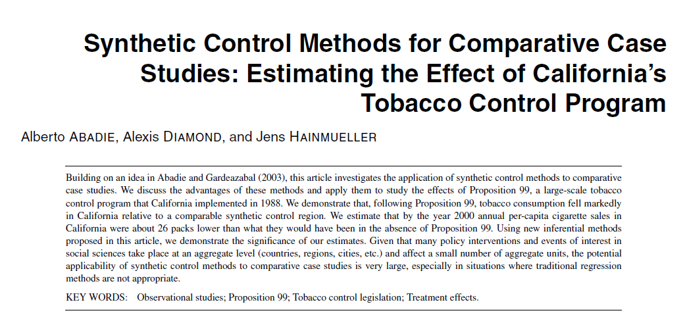
```

---

```{r, echo=F, out.width='80%', out.height='80%'}
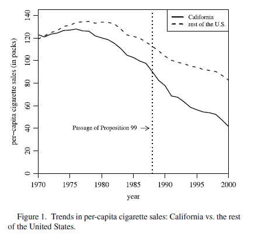
```

---

```{r, echo=F, out.width='60%', out.height='50%'}
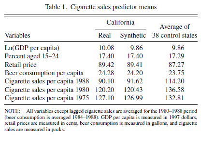
```

---

```{r, echo=F, out.width='60%', out.height='50%'}
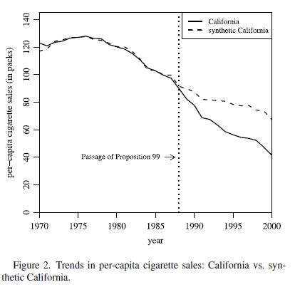
```

---

```{r, echo=F, out.width='60%', out.height='50%'}
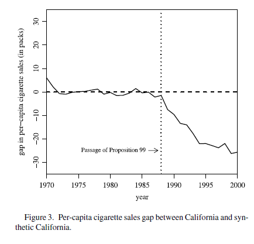
```

---

```{r, echo=F, out.width='60%', out.height='50%'}
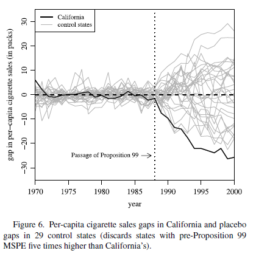
```


## Inference

:::{.smaller}
Since we ultimately have one treated unit and one synthetic control unit, standard large-sample inference methods are not applicable.

Abadie et al. (2010) propose inference based on exact p-values (Fisher, 1935).

This assigns treatment to each unit, including all untreated units as placebos, estimates the key model parameters, and collects them in a distribution used for inference.

Therefore, we do not focus on parametric distributions for inference, but rather the empirical distribution of estimated parameters to examine whether the parameter of interest is extreme.

We'll return to our inference graphs, which show the difference for all versions of synthetic control using each unit as the treated unit.
:::

---

```{r, echo=F, out.width='60%', out.height='50%'}
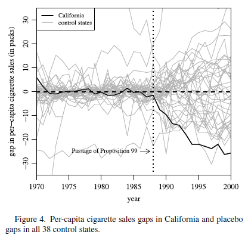
```


## Inference

Does California look to be the most extreme?

::: {.fragment}
There are two key takeaways from Figure 4.

1. There are several placebo synthetic controls that are just as large in the opposite direction.
2. There are several placebo synthetic control units that generate a poor [pre-period]{.hi} fit, i.e. no convex hull.
:::

::: {.fragment}
We would not actually be able to run synthetic control on these units, so it makes sense to discard them in the visual approach to inference.

Exclusion usually takes the form of some multiple of the mean squared prediction error (MSPE) in the pre-period for the actual treated unit.
:::

---

```{r, echo=F, out.width='60%', out.height='50%'}

```


## Inference

We can also use the placebo method to generate more formal test statistics.

Abadie et al. (2010) focus on the empirical ratio of pre- and post-MSPEs, which gets around the problem of an arbitrary threshold for pre-period MSPE.

Intuitively, this approach helps assess how extreme the treated unit's treatment effect is relative to the untreated units.


## Inference

Steps for exact p-value:

1. Apply synthetic control to every unit and collect the true and placebo effects.
2. Calculate MSPE for each unit in the pre-period:

$$
MSPE_{pre} = \frac{1}{T_0} \sum_{t=1}^{T_0} \left(Y_{1t} - \sum_{i=2}^{N+1} w_i^* Y_{it}\right)^2
$$


3. Calculate MSPE for each unit in the post-period:

$$
MSPE_{post} = \frac{1}{T - T_0} \sum_{t=T_0+1}^{T} \left(Y_{1t} - \sum_{i=2}^{N+1} w_i^* Y_{it}\right)^2
$$

---

4. Calculate the ratio of post- to pre-MSPE: $\frac{MSPE_{post}}{MSPE_{pre}}$.
5. Sort this ratio in descending order.
6. Calculate the treated unit's exact p-value in this distribution:

$$
p = \frac{\mathrm{RANK}}{\mathrm{TOTAL}}
$$

---

```{r, echo=F, out.width='60%', out.height='50%'}
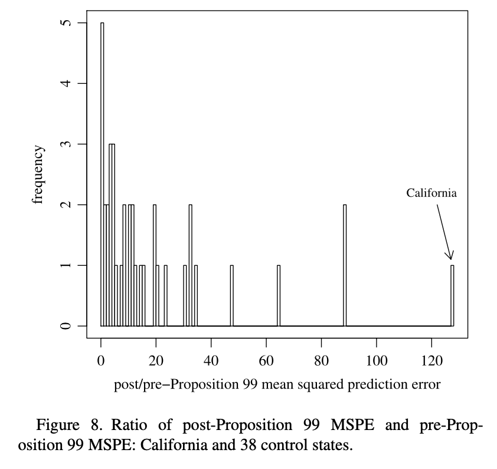
```

## Data Requirements

### Sufficient pre-intervention information

- To believe in synthetic control we need to be able to accurately track the pre-intervention outcomes.
- The bias in synthetic control is inversely proportional to the number of pre-treatment periods.
- It is important to have as long a time-horizon of pre-treatment periods as possible.
- Small number of pre-treatment periods may suffer from over-fitting.

## Data Requirements

### Sufficient post-intervention information

- Similar to contextual requirement, important if effects take place gradually.

# Robustness and Diagnostic Checks
## Robustness and Diagnostic Checks

1. Backdating (no effect prior to intervention)
2. Choice of units in donor pool
3. Choice of predictors

## Backdating

::: {.smaller}
- Backdating replicates the synthetic control analysis with a date *prior* to the actual policy date.
- This allows to test for anticipation effects.
- It also generates an "in-time placebo test".
- The weights are chosen to minimize the pre-intervention prediction error.
- Backdating tests whether using fewer pre-intervention periods still generates a null effect prior to the intervention.
- Additionally, backdating allows the synthetic control to pick up the true gap in outcomes when the intervention actually happens.
:::

---

```{r, echo=F, out.width='90%', out.height='90%'}
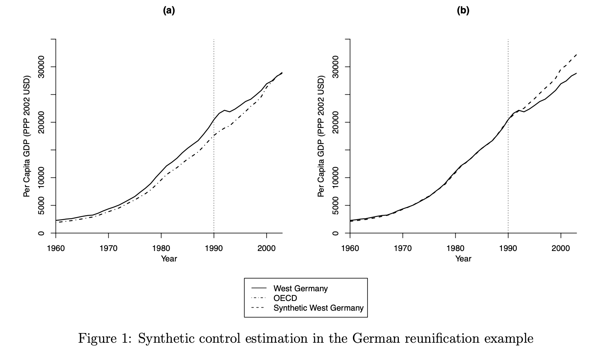
```

---

```{r, echo=F, out.width='80%', out.height='80%'}
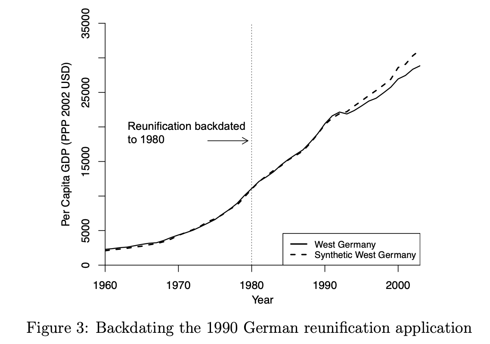
```

## Choice of units in donor pool and predictors

- It is helpful to vary the units in the donor pool to test the sensitivity of the results.
- This can be done in context specific ways where specific or poor fitting units are removed.
- Formal methods such as leave-one-out re-analysis can be done too.
- Similar approaches can be conducted to test the sensitivity of including/removing predictors.

# Applied example
## Synthetic control - pricing waste

```{r, echo=F, out.width='70%', out.height='70%'}

```

## Synthetic control - pricing waste

```{r, echo=F, out.width='70%', out.height='65%'}
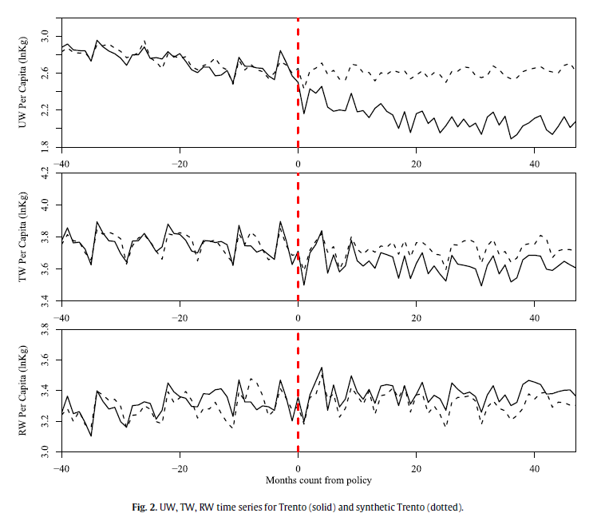
```

## Synthetic control - pricing waste

```{r, echo=F, out.width='60%', out.height='50%'}
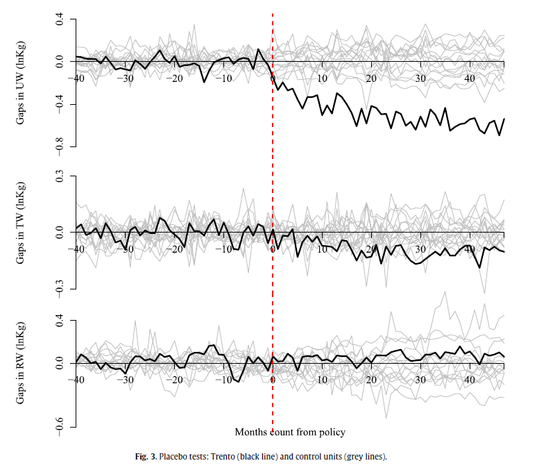
```

# Extensions
## Extensions

There are two important recent extensions of the synthetic control method.

1. Staggered adoption
2. Synthetic difference-in-differences

## Staggared adoption

There are two primary methods for staggered adoption and/or multiple treated units.

1. Separate synthetic control models (SCM) for each treated unit
2. Pooled synthetic control that averages all treated units

**Drawbacks**<br>
Separate SCM can have poor fit for the average and not aggregate properly when the goal is an average treatment effect.

Pooled SCM may have poor fits for individual treated units - this can lead to bias for time-varying treatment effects.

## Staggared adoption

[Ben-Michael & Rothstein (2022), "Synthetic Controls with Staggered Adoption"](https://academic.oup.com/jrsssb/article/84/2/351/7056152) offer a solution by proposing a "partially pooled" SCM.

Intuitively this minimizes a weighted average of the separate and pooled SCMs.

The paper has extensions that map to new DD developments in the large-sample setting.

## Partially pooled SCM

- $q_{sep}(\Gamma)$ = average pre-treatment imbalance across treated units
- $q_{pool}(\Gamma)$ = pre-treatment imbalance for the average treated unit

Then the paper chooses weights $\Gamma$ to solve:

$$
\min_{\Gamma \in \Delta^{scm}}
\nu \, \tilde q_{pool}(\Gamma)^2
+
(1-\nu)\,\tilde q_{sep}(\Gamma)^2
+
\lambda \|\Gamma\|_F^2
$$

::: {.fragment}
### Interpretation

- $\nu = 0$ gives [separate SCM]{.hi}
- $\nu = 1$ gives [pooled SCM]{.hi}
- $0<\nu<1$ gives [partial pooling]{.hi}: a compromise between fitting each treated unit and fitting the overall ATT target 
:::


## Intuition

What does the paper add relative to standard SCM?

::: {.fragment}
**Standard SCM:** For one treated unit, choose donor weights to match that unit’s pre-treatment path.
:::

::: {.fragment}
**Staggered adoption: we care about [two objects]{.hi}** 

1. each treated unit’s counterfactual
2. the [average]{.hi} counterfactual needed for the ATT
:::

::: {.fragment}
**Why it matters:** The paper proves that ATT error depends on both:

- [unit-specific imbalance]{.hi}
- [pooled/global imbalance]{.hi}

So minimizing only one of them is generally not enough. That theoretical result is what motivates partially pooled SCM. 
:::

## Intercept shift

::: {.smaller}
The paper further augments SCM by allowing a [unit-specific intercept shift]{.hi}.

::: {.fragment}
- Sometimes a treated unit and its synthetic control have similar trends but different levels.  
- Matching both levels and trends can be hard, especially when treated units lie far from the donor convex hull. 
:::

::: {.fragment}
With an intercept, the estimator becomes a [weighted difference-in-differences]{.hi}:

$$
\hat\tau^*_{jk}
=
\frac{1}{L_j}\sum_{\ell=1}^{L_j}
\left[
\left(Y_{j,T_j+k}-Y_{j,T_j-\ell}\right)
-
\sum_i \hat\gamma^*_{ij}\left(Y_{i,T_j+k}-Y_{i,T_j-\ell}\right)
\right]
$$

So the method connects SCM to modern DiD: it is essentially SCM applied to [demeaned outcome paths]{.hi}. The authors recommend this as a practical default. 
:::
:::

## Covariates

::: {.smaller}
The paper also adds [auxiliary covariates]{.hi} directly to the optimization problem.

::: {.fragment}
In many applications, matching lagged outcomes alone may not balance observed predictors well.
:::

::: {.fragment}
The objective now balances:

- pre-treatment outcomes
- covariates for each treated unit
- covariates for the pooled treated group

This improves overall comparability of treated and donor units, at some cost in outcome-fit flexibility.
:::

::: {.fragment}
In the application, adding covariates substantially improves covariate balance while only slightly worsening pre-treatment RMSE. 
:::
:::

## Main takeaways

### How this paper augments existing SCM

- Extends SCM from [single treated unit]{.hi} to [staggered adoption]{.hi}
- Shows that ATT error depends on both [individual]{.hi} and [pooled]{.hi} fit
- Introduces [partially pooled SCM]{.hi} to trade off those two goals
- Adds an [intercept shift]{.hi}, yielding a weighted DiD interpretation
- Adds [covariate balance]{.hi} and discusses inference
- Implements everything in the [`augsynth` R package]{.hi} 

::: {.fragment}

### Bottom line

This paper is not “just SCM with multiple treated units.”  
It is a [hybrid SCM/DiD framework]{.hi} for staggered adoption that explicitly targets the estimand researchers usually care about: the event-time ATT. 
:::

## Synthetic Difference-in-Differences (SDID)

[Arkhangelsky et al. (2021)](https://www.aeaweb.org/articles?id=10.1257/aer.20190159) develop a new model that applies synthetic control methods to large sample panel data.

This connects the SCM and DD literature.

The paper essentially uses both unit- and time-specific weights to make the DD assumptions more plausible.

The basic intuition is to use the weights to "localize" the estimator to emphasize control units and time periods that are more similar to the treated units and time periods.

This is still new to me and I'm still digesting this approach.

## SDID
### Motivation

- DID is attractive because it is simple, interpretable, and [invariant to additive unit fixed effects]{.hi}.
- Synthetic control is attractive because it [reweights control units to match pre-treatment trends]{.hi}.
- But each method has a weakness:
  - DID can fail when untreated potential outcomes do not satisfy a plausible parallel trends restriction.
  - SC can be sensitive to level differences and typically does not exploit the same large-panel inference structure as DID.

## SDID
### Core idea

Synthetic DID combines the two approaches:

- like SC, it chooses [unit weights]{.hi} to better match pre-treatment outcomes
- unlike standard SC, it also chooses [time weights]{.hi}
- like DID, it uses a [double-differencing structure]{.hi} that is invariant to additive unit-level shifts

::: {.fragment}
### Bottom line

SDID is designed to keep the [bias reduction intuition of SCM]{.hi} while preserving the [robustness and inference advantages of DID]{.hi}.
:::

## Contribution

**Standard SCM**<br>
For a treated unit or treated group, synthetic control chooses donor weights to match the pre-treatment outcome path.

::: {.fragment}
**SDID**

1. [Unit weights]{.hi}: reweight control units to resemble treated units in the pre-period  
2. [Time weights]{.hi}: reweight pre-periods so that the most relevant pre-period moments better resemble the post-period
:::

## Contribution

**Why time weights matter**

- Standard SCM asks: which control units look most like the treated units before treatment?  
- SDID also asks: [which pre-treatment periods are most informative for the post-treatment counterfactual?]{.hi}
- This is the main augmentation: SDID is not just “SC plus fixed effects.”  
- It is a [two-dimensional weighting estimator]{.hi} over both units and time.

## Formal estimator

::: {.smaller}
Let $\hat\omega$ denote the weights across control units and $\hat\lambda$ the weights across time periods.

A convenient representation of the estimator is the weighted double-difference:

$$
\hat\tau(\omega,\lambda)
=
\omega_{tr}'Y_{tr,post}\lambda_{post}
-
\omega_{co}'Y_{co,post}\lambda_{post}
-
\omega_{tr}'Y_{tr,pre}\lambda_{pre}
+
\omega_{co}'Y_{co,pre}\lambda_{pre}
$$

::: {.fragment}
**Interpretation**<br>

- This is DID, but with [smart weights]{.hi}:
- DID uses equal weights on treated units, controls, pre-periods, and post-periods
- SDID replaces those with [estimated unit and time weights]{.hi}
:::

::: {.fragment}
**Special cases**<br>

- If the weights are uniform, SDID collapses toward [standard DID]{.hi}
- If the focus is only on matching untreated paths through donor reweighting, it resembles [synthetic control]{.hi}
:::
:::

## Intuition for weights

::: {.smaller}
**Unit weights**<br>
Choose control units that make the weighted control pre-trend look like the treated pre-trend.

::: {.fragment}
**Time weights**<br>
Choose pre-period weights so that the weighted average of pre-period outcomes is most comparable to post-period outcomes.
:::

::: {.fragment}
**Why both dimensions help**<br>
If treated units differ from controls because of latent factors with time-varying loadings, then:

- [unit weights]{.hi} help align the cross-sectional composition
- [time weights]{.hi} help emphasize the most informative pre-period patterns
:::

::: {.fragment}
So SDID reduces reliance on a strict unweighted parallel trends assumption by building a locally comparable comparison group in [both unit space and time space]{.hi}.
:::
:::

## Benefits of SDID

**DID assumption**<br>
Absent treatment, the average outcome gap between treated and control units would evolve in parallel after removing additive unit and time effects.

::: {.fragment}
**Problem**<br>
That can fail when treated units have systematically different latent trends.
:::

::: {.fragment}
**SDID response**<br>
Rather than comparing treated units to all controls equally, SDID compares them to a [synthetic weighted control group]{.hi} and emphasizes [informative pre-periods]{.hi}.
:::

::: {.fragment}
In this sense, SDID weakens the empirical burden of DID by making the comparison group look more like the treated group before treatment.
:::

## Benefits of SDID

### Standard SCM strength

Excellent at matching pre-trends.

::: {.fragment}
**Standard SCM weakness**<br>
It is not invariant to additive unit-level shifts in the same way DID is.
:::

::: {.fragment}
**SDID augmentation**<br>
SDID keeps the matching logic of SCM but embeds it in a [difference-in-differences style contrast]{.hi}, so permanent level differences are differenced out.
:::

::: {.fragment}
That makes SDID especially attractive when units have persistent baseline differences but still need flexible reweighting to align trends.
:::

## Assumptions 

**Core conceptual assumption**<br>
The counterfactual path for treated units is well approximated by the weighted untreated outcomes of the controls.

::: {.fragment}
**Practical interpretation**<br>
SDID works best when:

- untreated potential outcomes admit a [stable latent factor structure]{.hi}
- pre-treatment fit is informative about post-treatment counterfactuals
- idiosyncratic shocks are not so persistent that pre-period matching becomes uninformative
:::

## Contributions

- unifies DID and SCM in one estimator
- introduces [unit weights and time weights]{.hi}
- shows the estimator can be written as a [weighted TWFE / weighted double-difference estimator]{.hi}
- establishes consistency and asymptotic normality in large panels
- provides practical inference tools

## Practical takeaway

Use SDID when:

- DID seems too strong because treated and control units have different pre-trends
- SCM alone feels too brittle or too tied to level matching
- you have a panel with enough structure to estimate meaningful unit and time weights

::: {.fragment}

[Synthetic DID adds time weights and embeds the estimator inside a DID-style double difference.]{.hi}

- better pre-treatment matching than plain DID
- more robustness to additive level differences than plain SCM
- a clean bridge between the two methods
:::

## Comparison

::: {.smaller}
Arkhangelsky et al. (2021) show the optimization function for DID, SC and SDID.

**SC**
$$
(\hat{\mu},\hat{\gamma}, \hat{\tau}) = \text{argmin} \left\{  \sum_{i=1}^N \sum_{t=1}^T (Y_{it} - \mu - \gamma_t - D_{it} \tau)^2\hat{\omega}_i \right\}
$$

**DID**
$$
(\hat{\mu}, \hat{\alpha}, \hat{\gamma}, \hat{\tau}) = \text{argmin} \left\{  \sum_{i=1}^N \sum_{t=1}^T (Y_{it} - \mu -\alpha_i - \gamma_t - D_{it}\tau)^2 \right\}
$$

**SDID**
$$
(\hat{\mu}, \hat{\alpha}, \hat{\gamma}, \hat{\tau}) = \text{argmin} \left\{  \sum_{i=1}^N \sum_{t=1}^T (Y_{it} - \mu -\alpha_i - \gamma_t - W_{it}\tau)^2\hat{\omega}_i\hat{\lambda}_t \right\}
$$

:::

---

```{r, echo=F, out.width='75%', out.height='75%'}
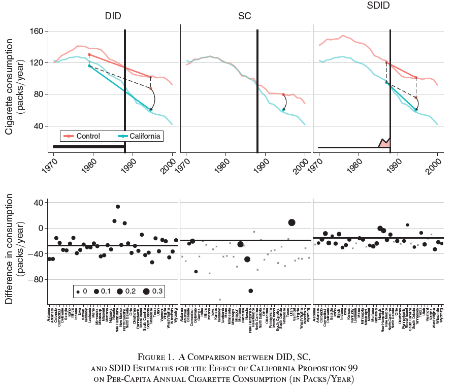
```

## Synthetic DD

Key differences

1. Pre-trend means do not need to match exactly
2. Weighting is not equivalent across all time periods

- Basically this is a more flexible way to generate counterfactuals.
- Still new and not as much applied work.
- Assumptions may feel less transparent, but as recent DID work shows some established methods did not actually have transparent assumptions either.


## R code

- I have a file that I posted `synth_script.R`.
- It goes through the Mixtape example in some more detail.
- There are some other packages that I haven't explored as much:
  - [`scul`](https://github.com/hollina/scul)
  - [`MASC`](https://github.com/maxkllgg/masc)
  - [`tidysynth`](https://github.com/edunford/tidysynth)
  - [`gsynth`](https://github.com/xuyiqing/gsynth)

