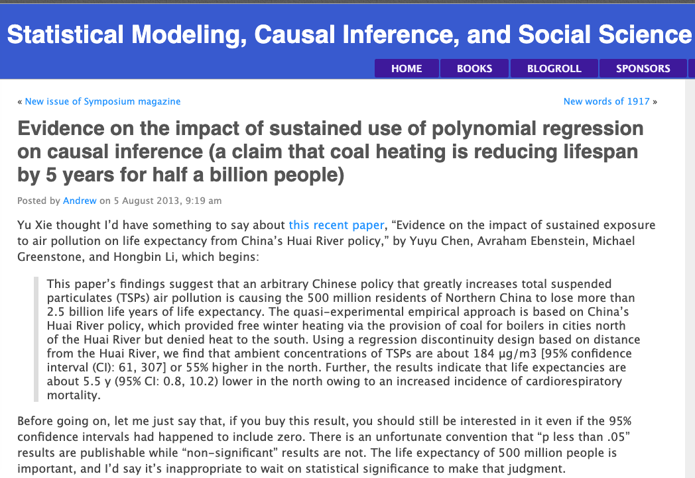
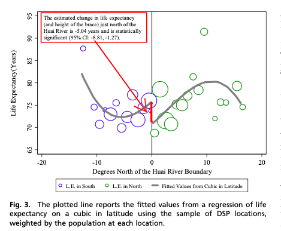
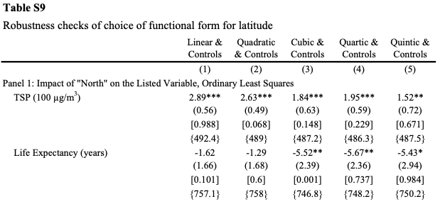
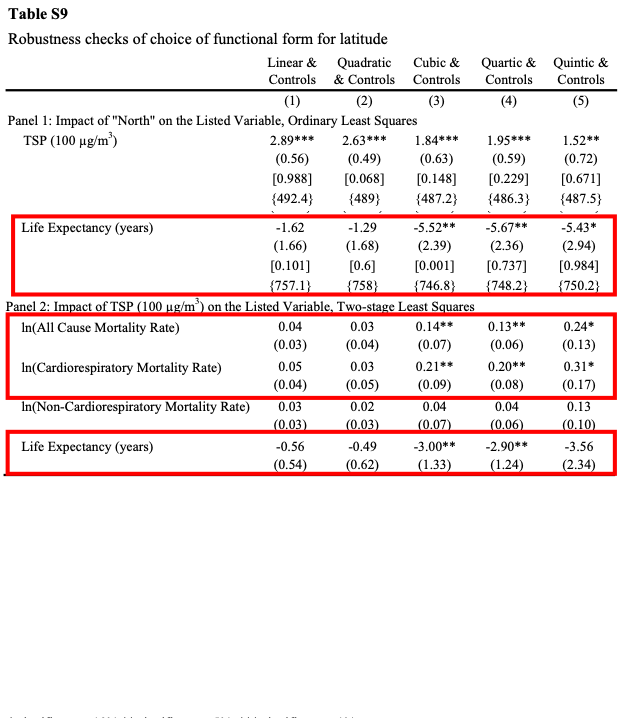
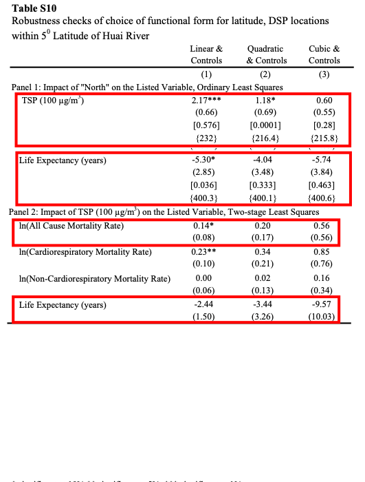
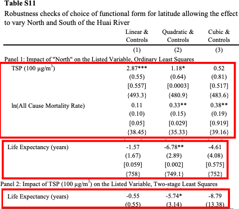
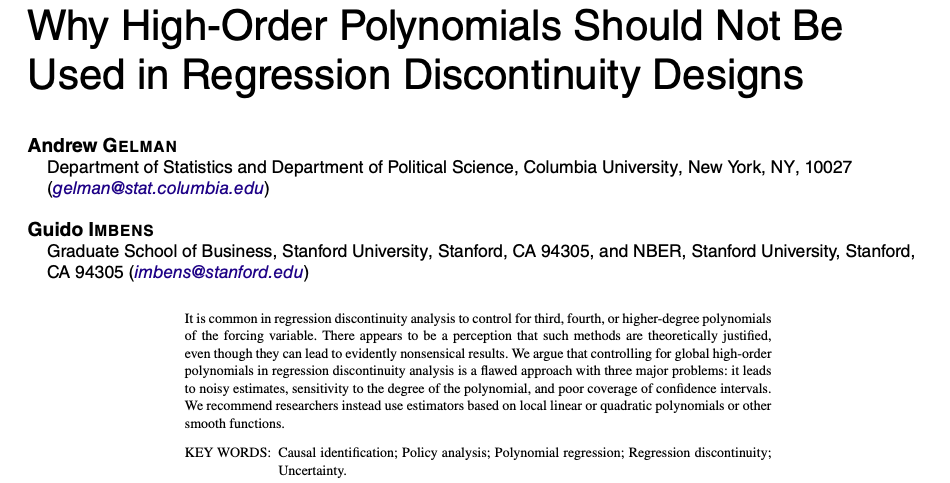
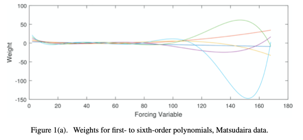
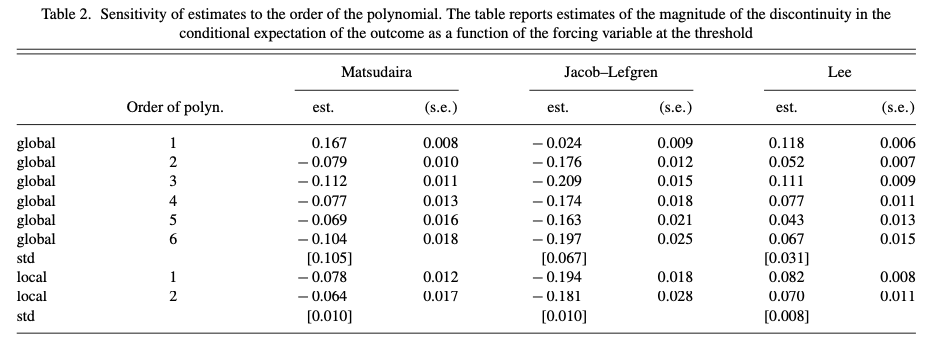
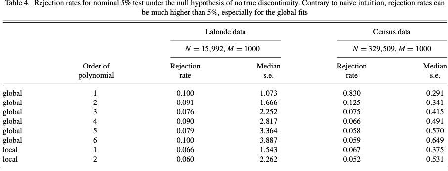

```{r, setup, include = F}
# devtools::install_github("dill/emoGG")
library(pacman)
p_load(
  broom, tidyverse,
  ggplot2, ggthemes, ggforce, ggridges,
  latex2exp, viridis, extrafont, gridExtra,
  kableExtra, snakecase, janitor,
  data.table, dplyr,
  lubridate, knitr,
  estimatr, here, magrittr
)
# Define pink color
blue <- "#0073e6"
turquoise <- "#20B2AA"
orange <- "#FFA500"
red <- "#fb6107"
blue <- "#0073e6"
green <- "#006400"
grey_light <- "grey70"
grey_mid <- "grey50"
grey_dark <- "grey20"
purple <- "#006400"
slate <- "#314f4f"
# Dark slate grey: #314f4f
# Knitr options
opts_chunk$set(
  comment = "#>",
  fig.align = "center",
  fig.height = 7,
  fig.width = 10.5,
  warning = F,
  message = F
)
opts_chunk$set(dev = "svg")
options(device = function(file, width, height) {
  svg(tempfile(), width = width, height = height)
})
options(crayon.enabled = F)
options(knitr.table.format = "html")
# A blank theme for ggplot
theme_empty <- theme_bw() + theme(
  line = element_blank(),
  rect = element_blank(),
  strip.text = element_blank(),
  axis.text = element_blank(),
  plot.title = element_blank(),
  axis.title = element_blank(),
  plot.margin = structure(c(0, 0, -0.5, -1), unit = "lines", valid.unit = 3L, class = "unit"),
  legend.position = "none"
)
theme_simple <- theme_bw() + theme(
  line = element_blank(),
  panel.grid = element_blank(),
  rect = element_blank(),
  strip.text = element_blank(),
  axis.text.x = element_text(size = 18, family = "STIXGeneral"),
  axis.text.y = element_blank(),
  axis.ticks = element_blank(),
  plot.title = element_blank(),
  axis.title = element_blank(),
  # plot.margin = structure(c(0, 0, -1, -1), unit = "lines", valid.unit = 3L, class = "unit"),
  legend.position = "none"
)
theme_axes_math <- theme_void() + theme(
  text = element_text(family = "MathJax_Math"),
  axis.title = element_text(size = 22),
  axis.title.x = element_text(hjust = .95, margin = margin(0.15, 0, 0, 0, unit = "lines")),
  axis.title.y = element_text(vjust = .95, margin = margin(0, 0.15, 0, 0, unit = "lines")),
  axis.line = element_line(
    color = "grey70",
    size = 0.25,
    arrow = arrow(angle = 30, length = unit(0.15, "inches")
  )),
  plot.margin = structure(c(1, 0, 1, 0), unit = "lines", valid.unit = 3L, class = "unit"),
  legend.position = "none"
)
theme_axes_serif <- theme_void() + theme(
  text = element_text(family = "MathJax_Main"),
  axis.title = element_text(size = 22),
  axis.title.x = element_text(hjust = .95, margin = margin(0.15, 0, 0, 0, unit = "lines")),
  axis.title.y = element_text(vjust = .95, margin = margin(0, 0.15, 0, 0, unit = "lines")),
  axis.line = element_line(
    color = "grey70",
    size = 0.25,
    arrow = arrow(angle = 30, length = unit(0.15, "inches")
  )),
  plot.margin = structure(c(1, 0, 1, 0), unit = "lines", valid.unit = 3L, class = "unit"),
  legend.position = "none"
)
theme_axes <- theme_void() + theme(
  text = element_text(family = "Fira Sans Book"),
  axis.title = element_text(size = 18),
  axis.title.x = element_text(hjust = .95, margin = margin(0.15, 0, 0, 0, unit = "lines")),
  axis.title.y = element_text(vjust = .95, margin = margin(0, 0.15, 0, 0, unit = "lines")),
  axis.line = element_line(
    color = grey_light,
    size = 0.25,
    arrow = arrow(angle = 30, length = unit(0.15, "inches")
  )),
  plot.margin = structure(c(1, 0, 1, 0), unit = "lines", valid.unit = 3L, class = "unit"),
  legend.position = "none"
)
theme_set(theme_gray(base_size = 20))
# Column names for regression results
reg_columns <- c("Term", "Est.", "S.E.", "t stat.", "p-Value")
# Function for formatting p values
format_pvi <- function(pv) {
  return(ifelse(
    pv < 0.0001,
    "<0.0001",
    round(pv, 4) %>% format(scientific = F)
  ))
}
format_pv <- function(pvs) lapply(X = pvs, FUN = format_pvi) %>% unlist()
# Tidy regression results table
tidy_table <- function(x, terms, highlight_row = 1, highlight_color = "black", highlight_bold = T, digits = c(NA, 3, 3, 2, 5), title = NULL) {
  x %>%
    tidy() %>%
    select(1:5) %>%
    mutate(
      term = terms,
      p.value = p.value %>% format_pv()
    ) %>%
    kable(
      col.names = reg_columns,
      escape = F,
      digits = digits,
      caption = title
    ) %>%
    kable_styling(font_size = 20) %>%
    row_spec(1:nrow(tidy(x)), background = "white") %>%
    row_spec(highlight_row, bold = highlight_bold, color = highlight_color)
}
```

# Background
## Background
- [Chen et al. (2013)](https://www.pnas.org/doi/10.1073/pnas.1616784114)
- [Gelman Blog #1](https://statmodeling.stat.columbia.edu/2013/08/05/evidence-on-the-impact/)
- [Gelman Blog #2](https://statmodeling.stat.columbia.edu/2013/08/07/i-doubt-they-cheated/)
- [Gelman & Imben (2018)](https://www.tandfonline.com/doi/full/10.1080/07350015.2017.1366909)
- [Chen et al. (2018)](https://www.pnas.org/doi/10.1073/pnas.1300018110)
- [Gelman Blog #3](https://statmodeling.stat.columbia.edu/2018/08/02/38160/)


# PNAS 2013
## PNAS 2013

```{r, echo=F, out.width='90%', out.height='90%'}

```

**Research question:** Does sustained air pollution affect health?

**Identification strategy:** Use Huai River policy in a spatial regression discontinuity analysis.

**Identification assumption:** There are spatiallly correlated unobserveables that can be accounted for with latitude.

**Results:** **BIG** effect of policy on life expectency. Also generate IV results for air pollution on health.

## Gelman Blog

```{r, echo=F, out.width='90%', out.height='90%'}

```

## Gelman Blog

Key criticisms:

- overfitting global polynomial
- not accounting appropriately for uncertainty (in model)
- not acknoledging robustness

## Gelman Blog

```{r, echo=F, out.width='75%', out.height='75%'}

```

## Gelman Blog

```{r, echo=F, out.width='90%', out.height='90%'}

```

## My perspective

```{r, echo=F, out.width='75%', out.height='75%'}

```

## My perspective

```{r, echo=F, out.width='70%', out.height='70%'}

```

## My perspective

```{r, echo=F, out.width='70%', out.height='70%'}

```

# Imbens and Gelman
## Imbens and Gelman

```{r, echo=F, out.width='80%', out.height='70%'}

```

## Imbens and Gelman

Three main points:

1. Regression (including polynomial) generates weights and global higher order polynomials generate high and variable weights away from the cutoff.
2. Results are sensitive to order of polynomial.
3. Incorrect confidence intervals.

## Weights

```{r, echo=F, out.width='90%', out.height='80%'}

```

## Sensitivity

```{r, echo=F, out.width='90%', out.height='80%'}

```

## Confidence Intervals

```{r, echo=F, out.width='90%', out.height='80%'}

```

# PNAS 2017
## PNAS 2017

- Updated analysis with (mostly) the same data
- New methods
  - Local linear regression for plots and main regressions
  - Optimized bandwidth selection (IK and CCT)
  - Placebo analysis
  - Robustness checks more consistent
- Gelman response:
  - Still don't buy it based on graphical evidence
  - Some data seems to change too
