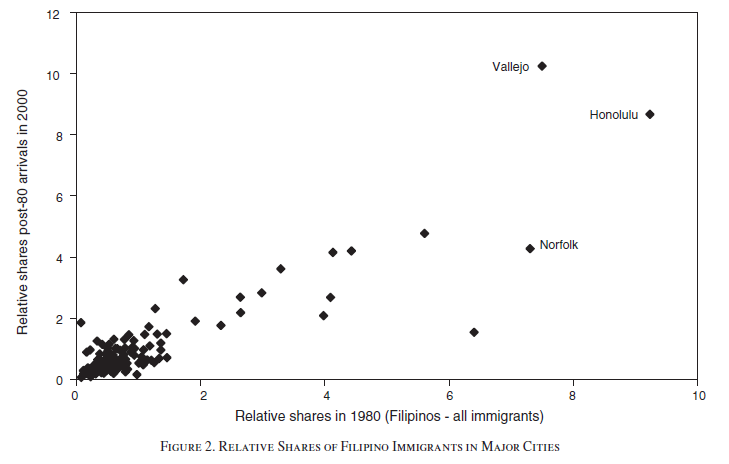
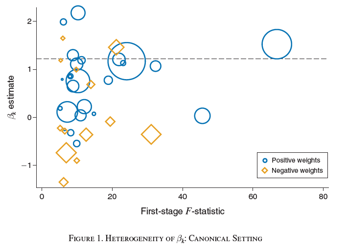
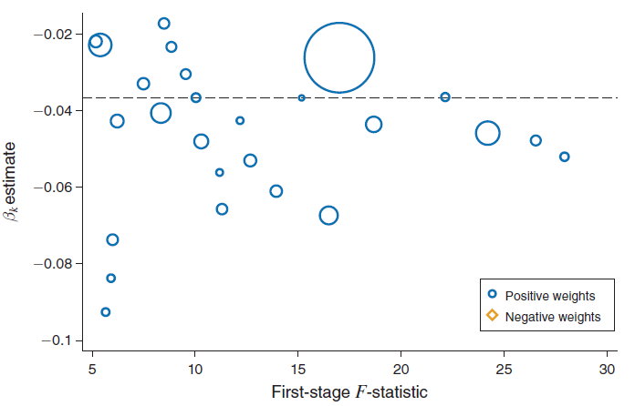
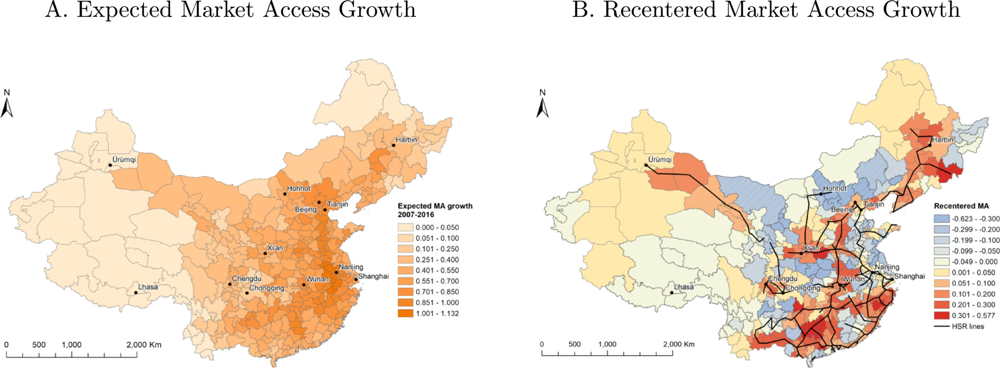

```{r, setup, include=FALSE}
# devtools::install_github("dill/emoGG")
library(pacman)
p_load(
  broom, tidyverse,
  ggplot2, ggthemes, ggforce, ggridges, scales,
  latex2exp, viridis, extrafont, gridExtra,
  kableExtra, snakecase, janitor, xtable,
  data.table, dplyr,
  lubridate, knitr,
  estimatr, here, magrittr,
  MASS, glmnet,
  parsnip, titanic
)

blue <- "#0073e6"
turquoise <- "#20B2AA"
orange <- "#FFA500"
red <- "#fb6107"
blue <- "#0073e6"
green <- "#006400"
grey_light <- "grey70"
grey_mid <- "grey50"
grey_dark <- "grey20"
purple <- "#006400"
slate <- "#314f4f"

opts_chunk$set(
  comment = "#>",
  fig.align = "center",
  fig.height = 7,
  fig.width = 10.5,
  warning = FALSE,
  message = FALSE
)
opts_chunk$set(dev = "svg")
options(device = function(file, width, height) {
  svg(tempfile(), width = width, height = height)
})
options(crayon.enabled = FALSE)
options(knitr.table.format = "html")

reg_columns <- c("Term", "Est.", "S.E.", "t stat.", "p-Value")

format_pvi <- function(pv) {
  ifelse(
    pv < 0.0001,
    "<0.0001",
    round(pv, 4) %>% format(scientific = FALSE)
  )
}
format_pv <- function(pvs) lapply(X = pvs, FUN = format_pvi) %>% unlist()

tidy_table <- function(x, terms, highlight_row = 1, highlight_color = "black", highlight_bold = TRUE, digits = c(NA, 3, 3, 2, 5), title = NULL) {
  x %>%
    tidy() %>%
    select(1:5) %>%
    mutate(
      term = terms,
      p.value = p.value %>% format_pv()
    ) %>%
    kable(
      col.names = reg_columns,
      escape = FALSE,
      digits = digits,
      caption = title
    ) %>%
    kable_styling(font_size = 20) %>%
    row_spec(1:nrow(tidy(x)), background = "white") %>%
    row_spec(highlight_row, bold = highlight_bold, color = highlight_color)
}
```

# Schedule
## Last time

- DD replication
- RD application

## Today

- [Shift share instruments]{.hi}
- Miscellaneous research designs

## Upcoming

- Exam
 - Exam will be during finals week according to LionPath 
 - Practice exam posted
 
## Exam

- Exam will primarily pull from notes and problem sets
- When studying problem sets focus on the answers with **intuition** and interpretation
- Understanding the assumptions for different identification strategies will be important
- There will be some core equations to recall, but not derivations


# Shift share designs
## Readings 

- [Borusyak, Hull, & Jaravel (2025)](https://www.aeaweb.org/articles?id=10.1257/jep.20231370)
- [Goldsmith-Pinkham, Sorkin, & Swift (2020)](https://www.aeaweb.org/articles?id=10.1257/aer.20181047)
- [Borusyak, Hull, & Jaravel (2022)](https://academic.oup.com/restud/article/89/1/181/6294942)
- [Borusyak & Hull (2022)](https://www.nber.org/papers/w27845)
- [Adão, Kolesar, and Morales (2019)](https://academic.oup.com/qje/article/134/4/1949/5552146)

## Overview

- Standard IV exploits some quasi-random variation in $Z$ that affects $X$ but not $\epsilon$
  - Maybe a quasi-random threshold in a fuzzy RD design

- Some settings are more complicated, combining variation across observations as well as a common dimension

- Canonical paper is Bartik (1991), which used predicted employment growth
  $z_l = \sum_k s_{lk} g_k$
  as an IV for actual employment growth $x_l$
  - $s_{lk}$ is lagged employment shares for industry $k$ in region $l$
  - $g_k$ is a national industry shock

## Overview

- The argument is that differential exposure to a common shock can generate random variation in the variable of interest

- This is called a **shift-share IV** (SSIV) and is widely used in applied micro research

- It is also called a **Bartik** instrument, based on Bartik (1991)

- There are a lot of papers that use this design, but similar to the staggered DD literature, the formal properties for identification and inference were not initially well defined

- We will cover recent work on SSIVs

- Recent work formalizes identification through either **shocks** $g_k$ or **shares** $s_{lk}$

## Autor, Dorn, Hanson (ADH 2013)

- ADH estimate the effect of rising Chinese imports on U.S. local labor markets (1990--2007)
  - Share of U.S. spending on Chinese goods *increased* from 0.6% to 4.6%
  - Share of manufacturing employment *decreased* from 12.6% to 8.4%
  - Concerns about endogeneity?

---

### ADH 2013

- Use SSIV: $z_l = \sum_k s_{lk} g_k$
  - $s_{lk}$ is lagged share of manufacturing employment in industry $k$ out of total employment in region $l$
  - $g_k$ is industry $k$'s import growth in eight non-U.S. economies
  - Variable of interest $x_l$ is local growth of Chinese imports
  - Outcome variable $y_l$ is local change in manufacturing employment share

---

### ADH 2013

> “Our IV strategy will identify the Chinese productivity and trade-shock component of United States import growth if the common within industry component of rising Chinese imports to the United States and other high-income countries stems from China’s rising comparative advantage and (or) falling trade costs in these sectors.” (p. 2129)

---

### ADH 2013

```{r, echo=FALSE, out.width='45%', out.height='18%', fig.show='hold', fig.align='center'}
include_graphics(c("inputs/adh1.png", "inputs/adh2.png"))
```

---

### ADH 2013

- Main IV estimate is -0.596 (0.099)
- If correct and causal, this effect explains 33% of the fall in manufacturing employment
- How should we assess the validity of this IV?

## Card 2009

- Card (2009) studies the effect of local immigration on local wages

- Use SSIV: $z_l = \sum_k s_{lk} g_k$
  - $s_{lk}$ is lagged share of immigrants from country $k$ in region $l$
  - $g_k$ is national immigrant inflow growth from country $k$
  - Variable of interest $x_{lj}$ is the log ratio of immigrant to native worker hours in skill group $j$ and region $l$
  - Outcome variable $y_{lj}$ is the log wage gap between immigrant and native men in skill group $j$ and region $l$

---

### Card 2009

- Goal is to address endogeneity of local labor demand shocks

```{r, echo=FALSE, out.width='75%'}

```

---

### Card 2009

> “If the national inflow rates from each source country are exogenous to conditions in a specific city, then the predicted inflow based on (6) will be exogenous.” (p. 9)

> “To the extent that initial immigrant shares are correlated with other unobserved features that affect relative wage differentials in a city, an enclave-based identification strategy may be less attractive...” (p. 15)

- Main finding is that there is little impact of immigration on native wage inequality

## Framework

Use the ADH setup as motivation:

$$
y_l = \beta_0 + \beta x_l + \epsilon_l
$$

- $E[x_l \epsilon_l] \neq 0 \Rightarrow$ need an instrument to estimate $\beta$
  - $l$: location (commuting zone)
  - $y_l$: manufacturing employment growth
  - $x_l$: import exposure to China growth
  - $\beta$: the effect of China's import rise on manufacturing employment

---

### SSIV

Identity 1:

$$
x_l = \sum_k s_{lk} g_{lk}
$$

- $s_{lk}$: location-industry shares $(S_l)$
- $g_{lk}$: location-industry import growth rates $(G_l)$
  - $k$ denotes industry

---

Identity 2:

$$
g_{lk} = g_k + \tilde{g}_{lk}
$$

SSIV/Bartik instrument:

$$
z_l = \sum_k s_{lk} g_k
$$

---

### 2SLS structure

::: {.smaller}
Structural equation:

$$
y_l = \beta_0 + \beta x_l + \epsilon_l
$$

First stage:

$$
x_l = \pi_0 + \pi_1 z_l + u_l
$$

Instrument:

$$
z_l = \sum_k s_{lk} g_k
$$

Shock composition:

$$
g_{lk} = g_k + \tilde{g}_{lk}
$$
:::

---

### Necessary conditions

$$
y_l = \beta_0 + \beta x_l + \epsilon_l
$$

$$
x_l = \pi_0 + \pi_1 z_l + u_l
$$

$$
z_l = \sum_k s_{lk} g_k
$$

$$
g_{lk} = g_k + \tilde{g}_{lk}
$$

<br>
$z_l$ needs to be a valid instrument

1. Relevance: $\pi_1 \neq 0$
2. Exclusion: $E[z_l \epsilon_l] = 0$

# New developments
## New developments

Recent work has focused on deriving two pathways for identification:

1. Identification from shares: Goldsmith-Pinkham et al. (2020)
2. Identification from shocks: Borusyak et al. (2022)

There are also other developments, such as inference and extensions to other settings, that we will not cover in detail.

- [Borusyak & Hull (2022)](https://www.nber.org/papers/w27845)
- [Adão, Kolesar, and Morales (2019)](https://academic.oup.com/qje/article/134/4/1949/5552146)

# Share-based
## Goldsmith-Pinkham, Sorkin, Swift (GPSS; 2020) 

- GPSS focus on using SSIV to leverage quasi-experimental variation across observations
  - View $g_k$ as fixed and $z_l = \sum_k s_{lk} g_k$ as a linear combination of shares
  - $z_l$ is valid when *shares* are exogenous

- GPSS establish a numerical equivalence
  - $\hat{\beta}$ can be obtained from an overidentified IV procedure that uses $K$ share instruments $s_{lk}$ and a weight matrix based on the shocks $g_k$

- The identification assumption has DD logic
  - When $\epsilon_l$ are unobserved trends (such as in ADH), the assumption is similar to a parallel trends assumption

## Weights

::: {.smaller}

GPSS also show how SSIV is a special case of Rotemberg (1983) weights:

$$
\hat{\beta}_{Bartik} = \sum_k \hat{\alpha}_k \hat{\beta}_k, \qquad \sum_k \hat{\alpha}_k = 1
$$

IV estimate using only the $k^{\text{th}}$ instrument:

$$
\hat{\beta}_k = (S_k' X)^{-1} S_k' Y
$$

Rotemberg weight:

$$
\hat{\alpha}_k = \frac{g_k S_k' X}{\sum_{k=1}^K g_k S_k' X}
$$

- Weights can be negative, which is a problem with heterogeneous effects

:::

## ADH 2013

```{r, echo=FALSE, out.width='75%'}

```

## Card 2009

```{r, echo=FALSE, out.width='75%'}

```

## Tests for identifying assumptions (share-based)

1. Confounds or correlates
2. Pre-trends
3. Alternative estimators or overidentification

## Alternative estimators or overidentification tests

Basic insight in GPSS: there are many instruments (all the shares)

- Gap between maximum likelihood and two-step estimators is evidence of misspecification

- Overidentification tests also provide evidence of misspecification

# Shock-based
## Borusyak, Hull, Jaravel (BHJ; 2022) {#bhj}

- BHJ show how and when SSIV can leverage quasi-random variation in the shocks

- They establish a numerical equivalence:
  - $\hat{\beta}$ can be obtained from a just-identified shock-level IV that uses $g_k$ to instrument for a shock-level aggregate of the treatment

$$
\hat{\beta}
= \frac{\sum_l z_l y_l}{\sum_l z_l x_l}
= \frac{\sum_l \sum_k s_{lk} g_k y_l}{\sum_l \sum_k s_{lk} g_k x_l}
= \frac{\sum_k g_k \sum_l s_{lk} y_l}{\sum_k g_k \sum_l s_{lk} x_l}
= \frac{\sum_k g_k s_k \bar{y}_k}{\sum_k g_k s_k \bar{x}_k}
$$

- $s_k = \frac{1}{L} \sum_l s_{lk}$ are weights that capture the average importance of shock $k$
- View $g_k$ as random shocks

## Assumptions

- **A1** Quasi-random shock assignment
  - Each shock has the same expected value, conditional on shock-level unobservables $\bar{\epsilon}_k$ and average exposure $s_k$

- **A2** Many uncorrelated shocks
  - Expected index of average shock exposure converges to zero
  - Shocks are mutually uncorrelated given the unobservables
  - Implies a shock-level law of large numbers

- Identification follows from the first stage
  - Most observations are mostly exposed to a small number of shocks that affect treatment

# Synthesis
## Share-based vs. shock-based

**Share-based**

- *Conditional* exogeneity
  - Typically exogenous to changes in the error term, not levels of outcomes
  - DID-style assumption: in a period, exposure to an industry matters for outcomes only through $x$

**Shock-based**

- Large number of industries (shares may be misspecified, so they need to average out)
- Random shocks across industries, so shocks need to be conditionally random

**Which is best?**

- BHJ argue for choosing ex ante
- It depends on the application

## Different cases for SSIV (BHJ)

**Case 1:** SSIV is based on a set of shocks that can be thought of as an instrument

- Many shocks, plausibly randomly assigned
- BHJ show how this identifying variation can estimate effects at different levels
  - industries $\Rightarrow$ local labor markets

**Case 2:** Unobserved shocks that can be estimated or predicted in sample

- Card (2009), where national immigration rates are estimated

**Case 3:** The shock $g_k$ cannot be viewed as an instrument

- Either too few shocks or implausibly exogenous
- Identification needs to follow from share exogeneity

```{r, include=FALSE, eval=FALSE}
pagedown::chrome_print("12-Shift.qmd")
```


# Intuition
## Why shift-share can work

A shift-share IV creates variation from two ingredients:

$$
z_l = \sum_k s_{lk} g_k
$$

- **Shares** $s_{lk}$ say *who is exposed*
- **Shifts** $g_k$ say *what happened to each component*
- The instrument is large when a location is highly exposed to components that got big shocks

---

### Core intuition

- Standard IV uses one source of quasi-random variation
- Shift-share uses many quasi-random pieces and aggregates them
- Identification depends on whether the credible randomness is in the **shares** or in the **shocks**

## Intuition: one object, two designs

::: {.smaller}

Same formula, two different causal stories:

$$
z_l = \sum_k s_{lk} g_k
$$

**Share-based view (GPSS)**

- Treat the shocks $g_k$ as fixed weights
- Cross-sectional variation comes from the shares $s_{lk}$
- **Assumption:** places with higher exposure would have evolved similarly absent treatment

**Shock-based view (BHJ/JEP)**

- Treat the shares as possibly endogenous
- Credible variation comes from quasi-random shocks $g_k$
- **Assumption:** shocks orthogonal to shock-level confounders
:::

## Intuition for the share-based design

GPSS imply that Bartik can be viewed as combining many single-share IV designs:

$$
\hat{\beta}_{SSIV} = \sum_k \hat{\alpha}_k \hat{\beta}_k
$$

- Each share $s_{lk}$ is like a separate instrument
- The Bartik estimate pools those instruments with weights determined by first-stage strength and the shifts
- This is why the identifying logic looks like a pooled **exposure design** or **difference-in-differences** design

**Q:** Would places with higher initial exposure to component $k$ have had similar outcome trends absent the treatment?

## Share-based intuition with Card (2009)

::: {.smaller}
Card's immigration design is the cleanest case for the **share** view:

$$
z_l = \sum_k s_{lk} g_k
$$

- $s_{lk}$: lagged share of immigrants from origin $k$ in city $l$
- $g_k$: national inflow from origin $k$

Why this is more plausible for share-based identification:

- The shares are relatively **tailored** to the treatment of interest
- A higher historical Mexican share mainly predicts exposure to future Mexican inflows
- This is closer to a DID-style exposure design than the ADH industry-share case

**Intuition:** compare cities with more vs. less prior exposure to a given origin-country inflow.

:::

## Why ADH is harder for the share-based view

In ADH, the shares are lagged industry employment shares:

$$
z_l = \sum_k s_{lk} g_k
$$

- These shares are often **generic** exposure measures
- They proxy exposure not just to China shocks, but to many other industry shocks
  - automation
  - domestic demand shifts
  - productivity changes
  - sectoral decline

---

### ADH and share-based assumptions

So under the share-based view, the key concern is:

- can industry composition itself be treated like an exogenous instrument?

This is why ADH is often viewed as less convincing under the share-based interpretation than the immigration-enclave design.

--- 

### BJH 2025

> The industry employment shares are “generic,” in that they could potentially measure an
observation’s exposure to other shocks (essentially, any industry shock), many of them
unobserved. In studies using such shares, it would not be plausible to make a case for
identification based on the exogeneity of shares. Under the exogenous shares view,
Autor, Dorn, and Hanson (2013) and Acemoglu and Restrepo (2020) use essentially
the same instruments (lagged employment shares) for different treatments.

# Shock-based intuition
## Intuition for the shock-based design

BHJ show that SSIV can be rewritten as a **shock-level IV**:

$$
\hat{\beta}
= \frac{\sum_l z_l y_l}{\sum_l z_l x_l}
= \frac{\sum_k g_k s_k \bar{y}_k}{\sum_k g_k s_k \bar{x}_k}
$$

with

$$
s_k = \frac{1}{L}\sum_l s_{lk}
$$
---

### Interpretation

- Aggregate outcomes and treatments to the **shock level**
- Then run IV using the shocks $g_k$ directly
- The identifying variation is no longer “many places” but effectively “many shocks”

## Shock-based intuition in words

A useful way to think about the shock view:

- Imagine randomly assigning subsidies, tariffs, or immigrant inflow shocks across industries/countries
- Regions inherit different treatment intensity because they were exposed to different components
- The shares do **not** need to be exogenous
- They only need to translate the quasi-random shock experiment to the unit level

So the key question becomes:

- Are the $g_k$ instruments valid for a shock-level analysis?

## Why many shocks matter

Under the shock-based approach, consistency needs a shock-level law of large numbers.

- A few shocks is not enough
- What matters is the **effective number of shocks**
- If one or two shocks dominate the design, the IV is effectively based on a tiny sample

Practical implication:

- A design with thousands of regions can still have weak external credibility if only a handful of industries matter
- This is why BHJ/JEP emphasize descriptive statistics and diagnostics at the **shock** level, not only the observation level

## Incomplete shares: why the sum of shares matters

Sometimes the shares do **not** add up to one:

$$
S_l = \sum_k s_{lk} \neq 1
$$

Example:

- ADH uses manufacturing-industry exposure shares relative to **total** local employment
- So places differ in overall manufacturing intensity
- Then $z_l$ is a weighted **sum**, not a weighted average
- Even random shocks can generate systematic variation in $z_l$ through $S_l$

**Fix:** control for the sum of shares $S_l$ (often interacted with time indicators in panels).

## Leave-one-out intuition

::: {.smaller}
When shocks are estimated in-sample, there can be mechanical endogeneity.

Example:

- A national industry growth rate may partly reflect the same local outcomes used in the regression

Then the measured shock may contain local endogenous noise.

**Leave-one-out idea:**

- Construct the shock for location $l$ excluding location $l$ from the national aggregation
- This reduces the mechanical link between local residuals and the instrument

This is often most relevant when shocks are estimated rather than externally observed.
:::

# Practical diagnosis
## Which identification story should you tell?

A simple rule from the recent literature:

**Tell a share-based story when**

- the shares are tailored to the treatment
- you are comfortable using the shares directly as instruments
- the design sounds like “differential exposure to a common shock"

**Tell a shock-based story when**

- the shares are generic or likely endogenous
- the shocks themselves look quasi-random
- the design is credible only because there are many shocks

## Ideal experient intution

Thinking about a randomized experiment can assist in the intuition.

**Shock-based experiment**
- shocks (e.g. industry subsidies) are randomized
- shares assign the weights at a local labor market level
- **Ex:** Social media experiments are weighed based on share of peers exposed to random treatment

**Share-based experiment**
- shares (e.g. local polices) are randomized
- randomly assigned shares (cities) then respond differently to a common shock
- **Ex:** How do households with randomly assigned water prices respond to a drought

## A practical checklist for the shock view

1. Start with the **idealized shift-level experiment**
   - what random shock assignment would solve the endogeneity problem?
2. Explain why the observed $g_k$ approximate that experiment
3. Include shift-share controls for any shock-level confounders
4. Control for the sum of shares when shares are incomplete
5. Report shock-level diagnostics
   - effective number of shocks
   - balance tests for shocks
   - shock-level first stage
6. Use exposure-robust inference

## A practical checklist for the share view

1. Explain why the shares are plausible instruments
2. Show they are **tailored** to the treatment, not generic exposure measures
3. Examine which shares matter most using Rotemberg weights
4. Test for balance and pre-trends in the high-weight shares
5. Compare Bartik to alternative many-instrument estimators
6. Use overidentification tests as a diagnostic, while remembering that heterogeneity can also drive differences

# Applied examples
## Applied example: labor supply and Bartik

::: {.smaller}
Classic application:

- outcome $y_l$: wage growth
- treatment $x_l$: employment growth
- instrument $z_l$: predicted employment growth from local industry shares and national industry growth

Economic intuition:

- local employment growth mixes labor demand and labor supply shocks
- the shift-share IV tries to isolate **demand-driven** employment growth

This is a useful teaching example because it shows both interpretations:

- **share view:** places differentially exposed to industry growth
- **shock view:** many industry demand shocks assigned across industries

:::

## Applied example: ADH China shock

ADH is best motivated through the **shock-based** view.

- Local industry shares are probably endogenous as standalone instruments
- But the non-U.S. import growth shocks are meant to isolate China's rising comparative advantage and falling trade costs

Teaching intuition:

- Ask students to imagine randomly assigning China-related demand shocks across industries
- Commuting zones then receive different import exposure because of preexisting specialization
- The identifying comparison is across local labor markets that were more vs. less exposed to those quasi-random industry shocks

## Applied example: immigration enclaves

Card (2009) is the canonical case where the **share-based** view is comparatively attractive.

- Historical origin-country shares are tailored to future immigrant inflows
- The core comparison is between cities with different initial enclave composition
- The main threat is that those city shares also proxy for local labor demand trends

This is why pre-trends and balance on high-weight shares are especially informative here.

# Extension
## Nonrandom Exposure to Shocks
[Borysak and Hull (2023)](https://onlinelibrary.wiley.com/doi/full/10.3982%2FECTA19367)

Treatment:
$$
x_i = \Delta \log(\text{Market Access}_i)
$$

Structure:
$$
x_i = f(g, w)
$$

- $g$ = rail line openings (shocks)  
- $w$ = geography + network position  

---

### Key problem

Even if shocks are exogenous:
$$
E[g \cdot \varepsilon] = 0
$$

we still have:
$$
E[x_i \varepsilon_i] \neq 0
$$

- exposure is **nonrandom**

## Why IV Fails

Try an to find an instrument $z_i$

::: {.fragment}
Decompose:
$$
z_i = \mu_i + (z_i - \mu_i), \quad \mu_i = E[z_i \mid w]
$$
:::

::: {.fragment}
Bias:
$$
E[z_i \varepsilon_i] = E[\mu_i \varepsilon_i] \neq 0
$$

- central regions → higher $\mu_i$  
- also → different growth potential  
    - IV captures **geography, not causal effect**

:::

## Why Shocks or Controls Don’t Fix It

### Using shocks directly

$$
x_i = \sum_\ell w_{i\ell} g_\ell
$$

- must aggregate shocks using weights $w_{i\ell}$  
- weights depend on geography  
    - exposure problem returns  

---

### Using controls

Need:
$$
\mu_i = E[x_i \mid w]
$$

::: {.fragment}
But $\mu_i$ depends on:

- full network structure  
- all bilateral connections  
- expansion timing  

difficult to capture with simple controls
:::

## Solution: Remove Expected Exposure

Construct:
$$
\mu_i = E[x_i \mid w]
$$

- simulate counterfactual rail expansions  
- average exposure across simulations  

Recenter:
$$
\tilde{x}_i = x_i - \mu_i
$$


::: {.fragment}
Then:
$$
E[\tilde{x}_i \varepsilon_i] = 0
$$

:::

## What Variation Identifies the Effect?

$$
x_i = \underbrace{\mu_i}_{\text{expected}} + \underbrace{(x_i - \mu_i)}_{\text{unexpected}}
$$


::: {.columns}

::: {.column width="50%"}
### Expected ($\mu_i$)
- driven by geography  
- correlated with fundamentals  
❌ not valid
:::

::: {.column width="50%"}
### Unexpected ($\tilde{x}_i$)
- driven by shocks  
- quasi-random  
✅ identifies effect
:::

:::

Identify effects using **unexpected shocks, not structural exposure**

---

```{r, echo=FALSE, out.width='75%'}

```

## Intuition

> Panel A = **structural exposure**  
> Panel B = **shock-driven residual exposure**

This is the core Borusyak–Hull idea: remove predictable exposure, then identify effects from the residual.


# Summary
## Summary

**Main lesson:**

- Shift-share is not one design; it is a formula that can embed different research designs

**For applied work, always ask:**

1. Is the credible exogeneity in the **shares** or the **shocks**?
2. Are the shares tailored or generic?
3. Do I have many shocks, or just the illusion of many observations?
4. Do the shares sum to one?
5. Is there nonrandom exposure that requires recentering or special controls?

The modern literature turns SSIV from a black box into a design that can be defended, diagnosed, and taught clearly.
