```{r}
#| label: setup
#| include: false

# devtools::install_github("dill/emoGG")
library(pacman)
p_load(
  broom, tidyverse, 
  ggplot2, ggthemes, ggforce, ggridges, scales, 
  latex2exp, viridis, extrafont, gridExtra, 
  kableExtra, snakecase, janitor,xtable, 
  data.table, dplyr, 
  lubridate, knitr, 
  estimatr, here, magrittr, 
  MASS,glmnet,
  parsnip,titanic
)
# Define pink color
blue <- "#0073e6"
turquoise <- "#20B2AA"
orange <- "#FFA500"
red <- "#fb6107"
blue <- "#0073e6"
green <- "#006400"
grey_light <- "grey70"
grey_mid <- "grey50"
grey_dark <- "grey20"
purple <- "#006400"
slate <- "#314f4f"
# Dark slate grey: #314f4f
# Knitr options
opts_chunk$set(
  comment = "#>",
  fig.align = "center",
  fig.height = 7,
  fig.width = 10.5,
  warning = F,
  message = F
)
opts_chunk$set(dev = "svg")
options(device = function(file, width, height) {
  svg(tempfile(), width = width, height = height)
})
options(crayon.enabled = F)
options(knitr.table.format = "html")

# Column names for regression results
reg_columns <- c("Term", "Est.", "S.E.", "t stat.", "p-Value")
# Function for formatting p values
format_pvi <- function(pv) {
  return(ifelse(
    pv < 0.0001,
    "<0.0001",
    round(pv, 4) %>% format(scientific = F)
  ))
}
format_pv <- function(pvs) lapply(X = pvs, FUN = format_pvi) %>% unlist()
# Tidy regression results table
tidy_table <- function(x, terms, highlight_row = 1, highlight_color = "black", highlight_bold = T, digits = c(NA, 3, 3, 2, 5), title = NULL) {
  x %>%
    tidy() %>%
    select(1:5) %>%
    mutate(
      term = terms,
      p.value = p.value %>% format_pv()
    ) %>%
    kable(
      col.names = reg_columns,
      escape = F,
      digits = digits,
      caption = title
    ) %>%
    kable_styling(font_size = 20) %>%
    row_spec(1:nrow(tidy(x)), background = "white") %>%
    row_spec(highlight_row, bold = highlight_bold, color = highlight_color)
}
```
# Schedule
## Last time

- DD replication
- RD application

## Today

- Shift share instruments
- [Miscellaneous research designs]{.hi}

<br>

1. High dimensional fixed effects
1. Boundary designs

## Upcoming

- Exam
   - Exam will be during finals week according to LionPath 
   - Practice exam posted
- Experiments
- Machine learning and econometrics


## Exam

- Exam will primarily pull from notes and problem sets
- When studying problem sets focus on the answers with **intuition** and interpretation
- Understanding the assumptions for different identification strategies will be important
- There will be some core equations to recall, but not derivations

## Readings

- [Ghanem & Smith (2021)](https://www.journals.uchicago.edu/doi/full/10.1086/710968)
- [Brent et al. (2026)](https://www.journals.uchicago.edu/doi/10.1086/739114)
- [Brent and Beland (2020)](https://www.sciencedirect.com/science/article/pii/S0095069620300620)
- [Butts (2023)](https://www.kylebutts.com/papers/spatial-spillovers/)
- [Black (1999)](https://academic.oup.com/qje/article/114/2/577/1844232)


# High dimensional fixed effects
## High dimensional fixed effects

- With the access of high-frequency data models with many fixed effects are 
increasingly popular
  - AMI data provides electricity/water data every hour (or 5min)
  - 5min traffic data
- This allows fixed effects (FEs) to control for many unobserveables
- Important to understand remaining sources of variation
- Helpful to write out what's in the error term and determine what the FEs
can and cannot control

## Benefits of high-frequency data

- [Ghanem & Smith (2021)](https://www.journals.uchicago.edu/doi/full/10.1086/710968) 
highlight when high-frequency data can provide advantages to aggregate data
- They consider the example of the impact of temperature on energy use
- Highlight three cases where aggregate data may generate inconsistent parameters
- If regressors are strictly exogenous and response is homogeneous across unites and time, 
low-frequency data will both generate consistent estimators

## Benefits of high-frequency data

1. Accounting for response heterogeneity at the high-frequency dimension
1. Identifying differential responses to high and low-frequency variation
1. Nonlinearities in the relationship between the high-frequency regressor and the outcome
1. Reducing the effect of omitted variable bias with more flexible 

## High-Frequency Data in Panel Models

**Question**

- Do high-frequency (HF) data improve fixed effects estimates?

**Setup**

- Outcome and regressor observed at high frequency (e.g., hourly)
- Compare:
  - HF estimator (uses $Y_{ith}, X_{ith}$)
  - Aggregated estimator (uses $\bar{Y}_{it}, \bar{X}_{it}$)

**Key Insight**

- HF and aggregated estimators may target **different parameters**

## When Do HF and Aggregated Estimates Agree?

They estimate the same parameter if:

- **Homogeneous response**
  $$
  Y_{ith} = X_{ith}\beta + \alpha_{ih} + \lambda_{th} + u_{ith}
  $$

- **Strict exogeneity across all time**
- **No dynamics / no lags**
- **Linear relationship**

::: {.fragment}
Otherwise:

- HF and LF estimators converge to **different probability limits**
:::

## Why Do Estimates Differ?

Three key mechanisms:

1. **High-frequency heterogeneity**
   - $\beta_h$ varies across time (e.g., hour of day)
   - HF: variance-weighted average of $\beta_h$
   - LF: weights depend on **covariance across time**

2. **Dynamic responses**
   - Outcomes depend on lags or averages of $X$
   - LF mixes short-run and long-run effects

3. **Nonlinearities**
   - $E[g(X_{ith})] \neq g(E[X_{ith}])$

::: {.fragment}
⇒ Aggregation changes the estimand
:::

## Results with different levels of aggregation

```{r}
#| eval: true
#| echo: false
#| out-height: 75%
#| out-width: 95%
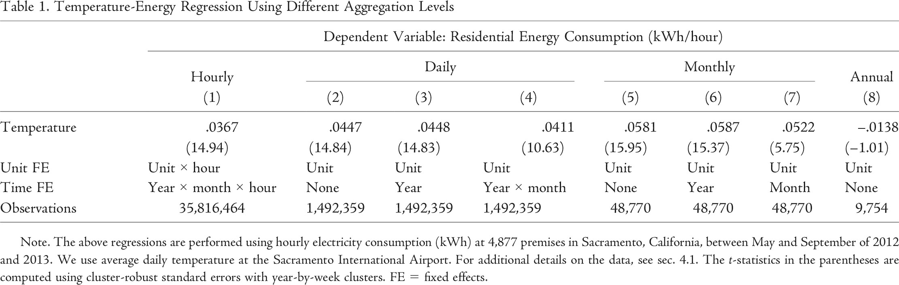
```

## Applied example

- [Brent and Beland (2020)](#https://www.sciencedirect.com/science/article/pii/S0095069620300620) 
attempt to estimate the impact of traffic on the response time of first responders (fire trucks)
- High frequency traffic data at 25,000 monitoring stations in California
- 840,000 5-min intervals for each stations $\Rightarrow$ about 21 billion traffic data points
- 2.7 million observations of fire dispatch incidents
- Merge traffic right before an incident at the zip code level

## High frequency traffic data

```{r}
#| eval: true
#| echo: false
#| out-height: 75%
#| out-width: 75%
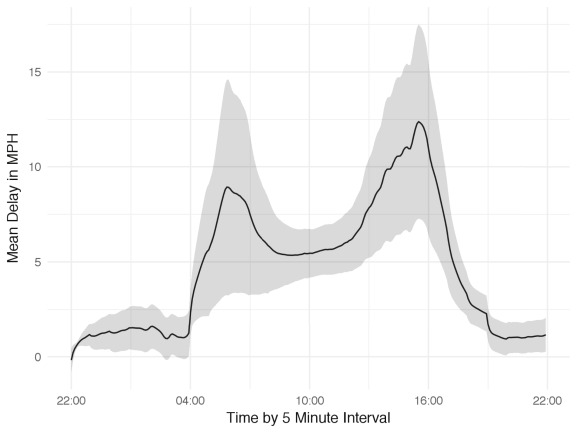
```

---

Main specification

$$
Y_{izt} - \beta_0 + \sum_k \beta_k Decile_{k,zt-1} + \beta_Z + \beta_{MY} + 
\beta_H + \epsilon_{izt}
$$

where

- $Y_{izt}$ is the response time to incident $i$ occurring in zip code $z$ at time $t$
- Focus on nonlinear effects based on zip-code level traffic deciles 
- FES at zip code year-month and hour-of-day level
- Allows for more flexible FEs as well

## Results of traffic on response time

```{r}
#| eval: true
#| echo: false
#| out-height: 75%
#| out-width: 75%
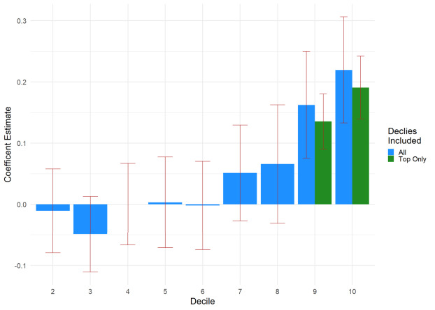
```

## Robustness

```{r}
#| eval: true
#| echo: false
#| out-height: 85%
#| out-width: 85%
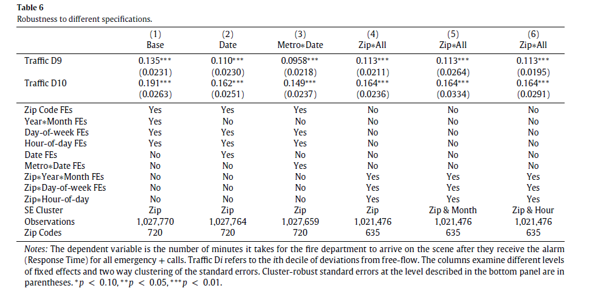
```

# Boundary designs
## Boundary designs

- Boundary discontinuity designs rely on a spatial assignment of treatment
- These types of identification strategies generate counterfactual groups by 
households, firms, or consumers that border their treated analogs
- This relies on a similar assumption to the RD literature that unobserveables
are correlated across space and units close to the boundary serve as valid counterfactuals
- More recent work highlights the potential for spatial spillovers which violates the SUTVA assumption


## Applied example

- One of the earliest examples was [Black (1999)](#https://www.jstor.org/stable/2587017)
- This paper estimates the effect of school quality on housing values
- The paper examines housing vales on either side of school attendance district boundaries
- Focusing on this sample removes "variation in neighborhoods, taxes, and school spending"
- Ignoring the spatial unobservables generate an estimate that is twice as big as the boundary discontinuity approach


## Border design

```{r}
#| eval: true
#| echo: false
#| out-height: 75%
#| out-width: 75%
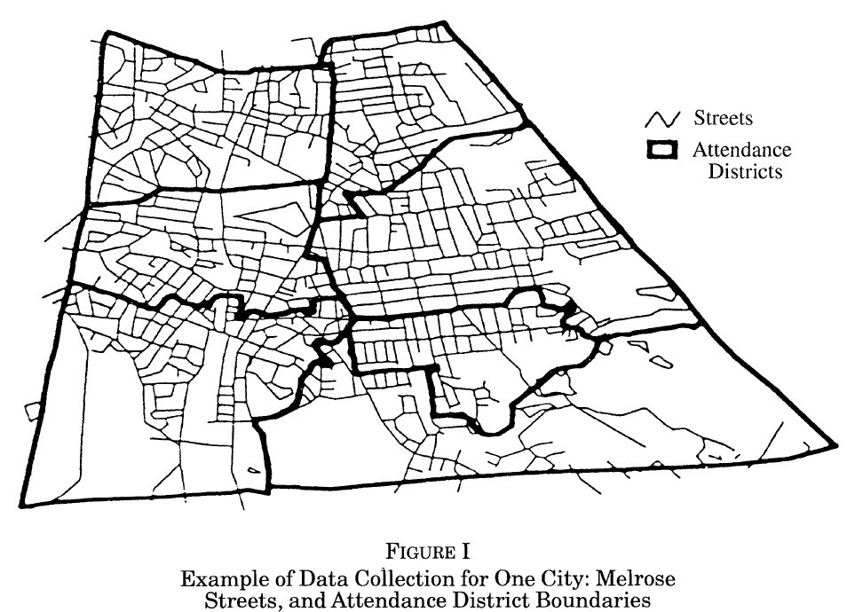
```


## Results

```{r}
#| eval: true
#| echo: false
#| out-height: 50%
#| out-width: 50%
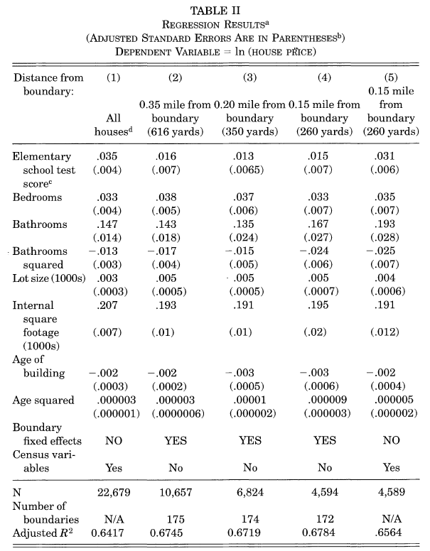
```

## Spatial Spillovers

- There are times when a spatially assigned treatment may spillover to nontreated regions
- This makes a boundary discontinuity approach challenging since the "best"
counterfactuals may have the largest spillovers
- [Butts (2023)](#https://arxiv.org/pdf/2105.03737.pdf) sets up an approach of using
"rings" to identify the spillover effects
- Other papers also highlight this challenge (e.g. [Jadim et al. (2022)](#https://www.nber.org/system/files/working_papers/w30075/w30075.pdf))


## Spatial spillovers

```{r}
#| eval: true
#| echo: false
#| out-height: 75%
#| out-width: 75%
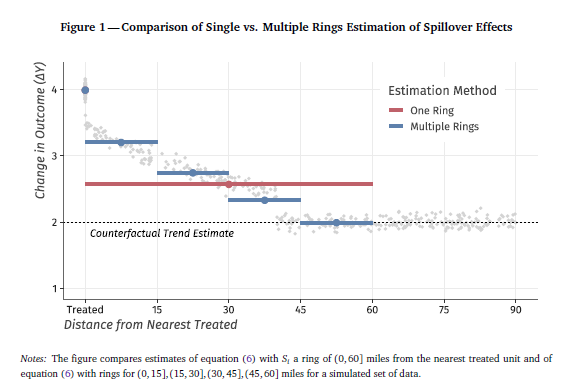
```

## TVA

```{r}
#| eval: true
#| echo: false
#| out-height: 75%
#| out-width: 75%
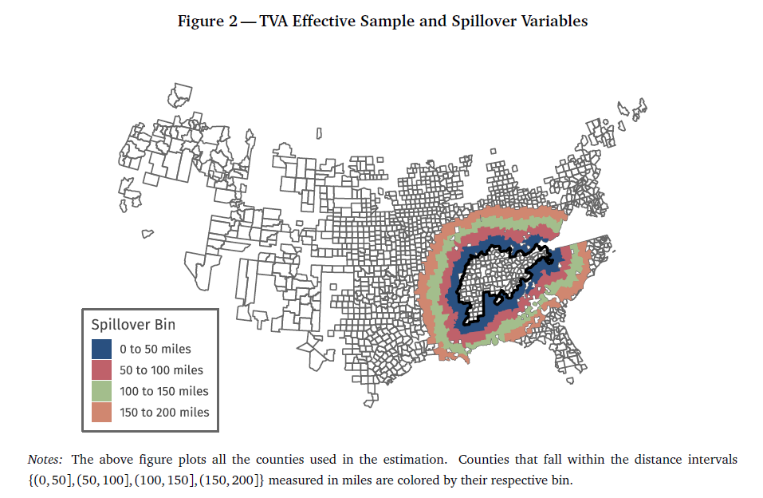
```


## TVA Results

```{r}
#| eval: true
#| echo: false
#| out-height: 75%
#| out-width: 75%
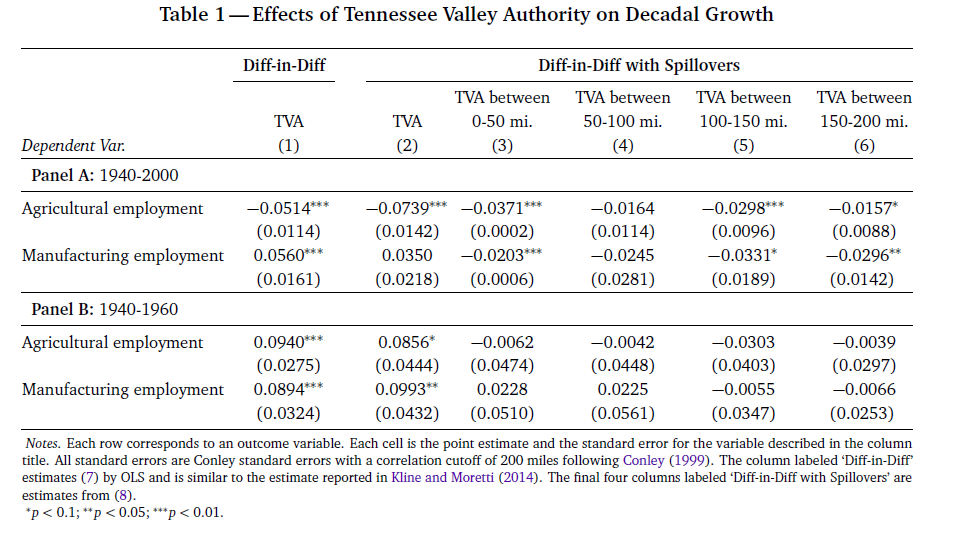
```

## Another application

- There are other ways to use spatial assignment other than direct treatment assignment
- Sometimes geographic features (e.g wind directions) or administrative boundaries can
generate quasi-random variation in the outcome of interest
- [Brent et al. (2026)](https://www.journals.uchicago.edu/doi/10.1086/739114)
use spatial variation to identify peer effects in a voluntary environmental program

## Peer effects

- Peer effects are notoriously difficult to causally estimate
- They can suffer from the reflection problem or spatially correlated unobserveables
- The key is generating random or quasi-random variation in the peer variables
- When examining adoption the key is randomly varying the number of peer adoptions
- Brent et al. (2026) use the **relative location** in eligibility sewersheds for a 
green infrastructure 

## Identification strategy

Identifying Assumptions:

1. Household location within eligible sewershed is exogenous to other factors affecting adoption
2. Households with more eligible peers will ultimately have more peers that sign up (testable)

**The number of potential peers serves as an instrument for peer adoption.**

## Peer groups

```{r}
#| eval: true
#| echo: false
#| out-height: 75%
#| out-width: 75%
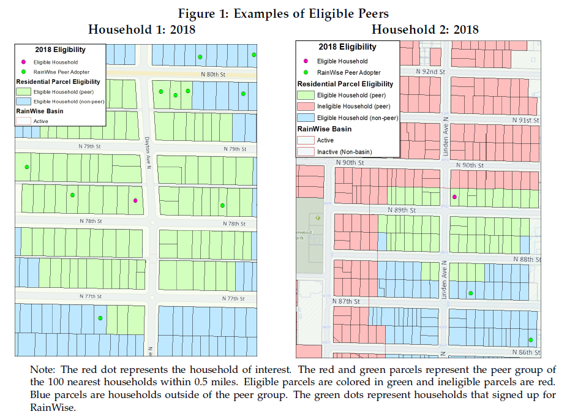
```

## Sewersheds

```{r}
#| eval: true
#| echo: false
#| out-height: 38%
#| out-width: 38%

```

## Support

```{r}
#| eval: true
#| echo: false
#| out-height: 42%
#| out-width: 42%
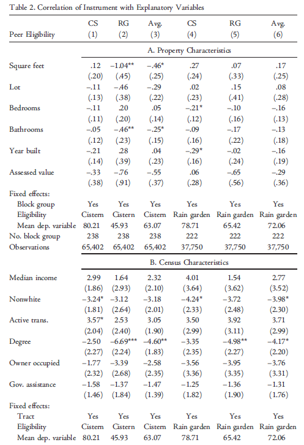
```


## Results

```{r}
#| eval: true
#| echo: false
#| out-height: 75%
#| out-width: 75%
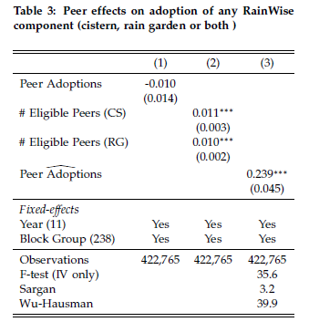
```

## Robustness

```{r}
#| eval: true
#| echo: false
#| out-height: 75%
#| out-width: 75%
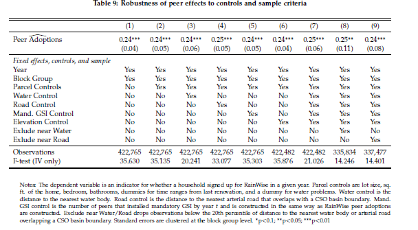
```
