```{r, setup, include=FALSE}
# devtools::install_github("dill/emoGG")
library(pacman)
p_load(
  broom, tidyverse,
  ggplot2, ggthemes, ggforce, ggridges, scales, glue,
  latex2exp, viridis, extrafont, gridExtra,
  kableExtra, snakecase, janitor, xtable,
  data.table, dplyr,
  lubridate, knitr,
  estimatr, here, magrittr,
  MASS, glmnet,
  parsnip, titanic, wesanderson, future, furrr
)

blue <- "#0073e6"
turquoise <- "#20B2AA"
orange <- "#FFA500"
red <- "#fb6107"
blue <- "#0073e6"
green <- "#006400"
grey_light <- "grey70"
grey_mid <- "grey50"
grey_dark <- "grey20"
purple <- "#006400"
slate <- "#314f4f"

opts_chunk$set(
  comment = "#>",
  fig.align = "center",
  fig.height = 7,
  fig.width = 10.5,
  warning = FALSE,
  message = FALSE
)
opts_chunk$set(dev = "svg")
options(device = function(file, width, height) {
  svg(tempfile(), width = width, height = height)
})
options(crayon.enabled = FALSE)
options(knitr.table.format = "html")

reg_columns <- c("Term", "Est.", "S.E.", "t stat.", "p-Value")

format_pvi <- function(pv) {
  ifelse(
    pv < 0.0001,
    "<0.0001",
    round(pv, 4) %>% format(scientific = FALSE)
  )
}
format_pv <- function(pvs) lapply(X = pvs, FUN = format_pvi) %>% unlist()

tidy_table <- function(x, terms, highlight_row = 1, highlight_color = "black", highlight_bold = TRUE, digits = c(NA, 3, 3, 2, 5), title = NULL) {
  x %>%
    tidy() %>%
    select(1:5) %>%
    mutate(
      term = terms,
      p.value = p.value %>% format_pv()
    ) %>%
    kable(
      col.names = reg_columns,
      escape = FALSE,
      digits = digits,
      caption = title
    ) %>%
    kable_styling(font_size = 20) %>%
    row_spec(1:nrow(tidy(x)), background = "white") %>%
    row_spec(highlight_row, bold = highlight_bold, color = highlight_color)
}

```


# Schedule
## Schedule
### Last time
- Regression discontinuity

### Today
- Design and analysis of randomized experiments
    - These notes largely follow Athey & Imbens (2017), plus notes from Owen Ozier and Ed Rubin.

### Upcoming
- Machine learning
<!-- - RD problem set -->

# Randomized Experiments

## Readings

- [Athey & Imbens (2017)](https://www.sciencedirect.com/science/article/pii/S2214658X16300174)
- [Young (2019)](https://academic.oup.com/qje/article-abstract/134/2/557/5195544)
- [Bruhn & McKenzie (2009)](https://www.aeaweb.org/articles?id=10.1257/app.1.4.200)

## Internal validity

Internal validity is whether we trust the study's ability to identify causal effects within the study population.

Most economists (and others) agree that randomized experiments are the gold standard in identifying causal effects.

Experiments will typically only fail to generate causal effects if there was some problem in the design of the experiment. 

## External validity

External validity is the ability to extrapolate results from one setting to another. 

Athey and Imbens (2017) describe external validity as:

> Suppose one carries out a randomized experiment in setting A, where the setting may be defined in terms of geographic location, or time, or subpopulation. What value have inferences about the causal effect in this location regarding the causal effect in a second location, say setting B?

This essentially comes down to treatment effect heterogeneity.

---

### External validity

Why is treatment heterogeneity important for external validity?

1. The characteristics in the experimental (that affect treatment heterogeneity) sample are different than the population or some other subpopulation of interest.

1. The treatment may be administered differently.
This is an important component for scaling up small-scale experiments. 

---

### External validity

If an experiment found an large and significant treatment effect for a job training program, why might it not be able to be replicated?

- Perhaps the initial sample was comprised of people more likely to benefit from the training program. It helps to ask, 'Why was *this sample* the initial setting?' 
- Perhaps the initial trainers were more qualified and it was harder to find enough good trainers at the same cost (upward sloping supply of trainers).

---

### External validity

```{r , echo=F, out.width='70%', out.height='70%'}
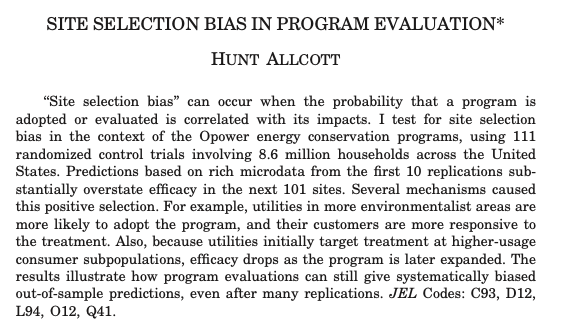
```

 [Allcott, H. (2015). Site selection bias in program evaluation. The Quarterly Journal of Economics, 130(3), 1117-1165.](https://academic.oup.com/qje/article-abstract/130/3/1117/1933105)

## Types of Experiments

There are a lot of types of experiments used in economics.

- Lab experiments
- Field experiments (in a lot of settings)
- Choice experiments (marketing and valuation)

We're going to abstract from that distinction and focus on statistical properties of different ways to assign observations to treatment and control.

Therefore, our 'types' are different assignment mechanisms.

## Growth in experiments within economics

```{r , echo=F, out.width='70%', out.height='70%'}
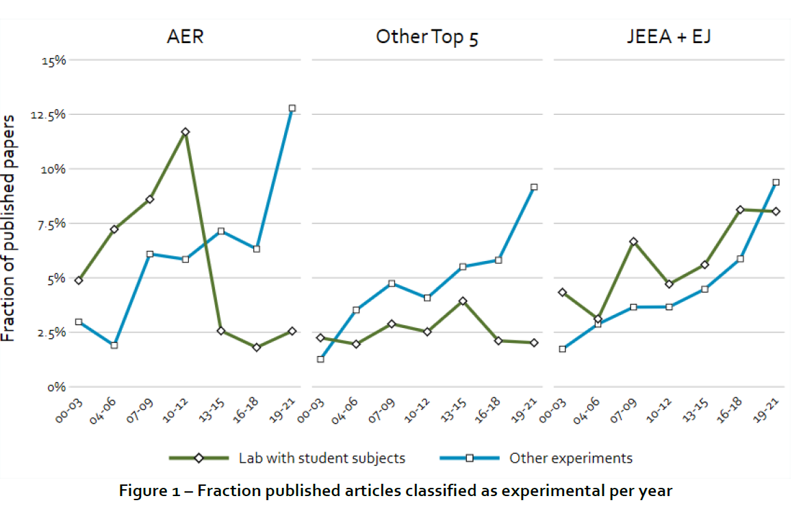
```

["Trends in the publication of experimental economics articles", Reuben et al. 2022
](https://link.springer.com/article/10.1007/s40881-022-00117-z)

## Types of Experiments

There are different ways to assign observations to treatment and control group, and Athey and Imbens (2017) establish four primary assignment mechanisms.

1. Completely randomized experiments 
1. Stratified randomized experiments 
1. Paired randomized experiments 
1. Clustered randomized experiments

## Potential outcomes refresher
We're still in the game of estimating the effect of a binary treatment $\text{D}_{i}$ on an outcome $\text{Y}_{i}$.

Now we get to assign $\text{D}_{i}$ such that:

$$\begin{align}
\text{Y}_{i} = \text{Y}_{1i} \text{ if } \text{D}_i = 1 \\
\text{Y}_{i} = \text{Y}_{0i} \text{ if } \text{D}_i = 0
\end{align}$$

What are the implications of how we (randomly) assign $\text{D}_{i}$?

---

### Potential outcomes refresher

- Since $D_i$ randomly assigned we don't think there are any differences in potential outcomes for treated and control units 

- That is $E[Y_{1i}|D_i=1] = E[Y_{0i}|D_i=1]$  & $E[Y_{1i}|D_i=0] = E[Y_{0i}|D_i=0]$

- So we can simplify the notation to $Y_i(1)$ and $Y_i(0)$ for potential outcomes for treated and control units, respectively.

## Completely randomized experiments 

From some study population $N$ we simply treat a fixed randomly selected set of observations to be treated $N_t$.

The rest of the study population represent the control group $N_c = N - N_t$.

Ex ante all individuals have the same probability of receiving treatment: $P(D_i = 1) = \frac{N_t}{N}$.

## Stratified randomized experiments 

- We can recover causal treatment effects from a completely randomized experiment
- With information on covariates we can improve precision by using that information in the assignment process.
- A stratified random sample splits the study population into $G$ subgroups (strata).
- We define $G_{ig}$ as an indicator if individual $i$ is within strata $g$.
- Define a fixed number of treated individuals within each strata $N_{t,g}$.  
- The total number of treated observations is $N_t = \sum_{g=1}^G N_{t,g}$.
- The assignment probability depends on the strata. 
    - It is possible to fix the proportion of treated individuals across all strata.

## Paired randomized experiments 

- Paired randomized experiments is an extreme form of stratification where each strata only contains two individuals.
- Within each set of pairs one individual is randomly selected to be treated and the other is in the control group.
- In this case there are $G = \frac{N}{2}$ strata, $N_g=2$ for all $G$,  and $N_{t,g} = 1$ for all $g$. 

## Clustered randomized experiments

- While stratified random sampling increases precision, we may also be concerned about spillover effects (remember SUTVA).

- Cluster randomized experiments randomize whole groups (clusters) into treatment, where a groups consists of multiple individuals.

- Cluster randomization is typically conducted when lower level randomization is not feasible.  
    - For example a whole classroom is randomized to a given student/teacher ratio because it is not feasible to randomize individual students.

- Another rationale for cluster randomization is that it may substantially decrease the cost of the study.

---

### Clustered randomized experiments

The notation is similar to a stratified random sample.  Now we define $G_{ig}$ as an indicator if individual $i$ belongs to cluster $g$.

Instead of having a fixed number of treated individuals within each cluster $N_{t,g}$ treated, whole clusters are treated at once.

So we treat $G_t$ out of $G$ clusters, and if $\bar{W_g} = \frac{W_i}{N_g}$ is the average probability of unit $i$ in cluster $g$ being treated we have $\bar{W_g} \in \{0,1\}$.

# Design of experiments
## Power analysis

::: {/.maller}
When conducting an experiment we typically have one (or more) hypotheses about how the treatment will affect outcomes.

When designing an experiment we want to assess whether observed differences between treatment and control groups are due to the treatment or just due to chance.

Let's consider our null hypothesis as no effect.

$$ H_0: E[Y_i(1) - Y_i(0)] = 0$$
Our alternative is that there is some non-zero difference in potential outcomes.

$$ H_a: E[Y_i(1) - Y_i(0)] \neq 0$$
Let's consider the different scenarios for these tests.
:::

## Power

Let's review our type I and type II errors.

First let's consider we know the truth and the results of our hypothesis test from our experiment.

```{r , results='asis',echo=F}
tab <- t(data.table(
  c('','','Test Result',''),
  c('','','Reject Null','Fail to Reject'),
  c('Truth','Yes Effect','Great!','Type II Error'),
  c('','No Effect','Type I Error','Great!')
))
rownames(tab) <- c()
kable(tab,col.names = NULL,row.names = NA) %>%
  kable_styling(bootstrap_options = c("striped", "bordered"), full_width = F) %>%
    column_spec(1, bold = T) %>%
    column_spec(2, italic = T) %>%
    row_spec(1, bold = T) %>%
    row_spec(2, italic = T)
# http://haozhu233.github.io/kableExtra/awesome_table_in_html.html

```

## Power

[Type I errors]{.hi} reject the null hypothesis even though there is *not* in fact an effect. This is known as a false positive and is based on the [size]{.hi} of the test.

[Type II errors]{.hi-red} fail to reject the null hypothesis even though there *is* in fact an effect. This is known as a false negative and is based on the [power]{.hi-red} of the test.

The [size** $(\alpha)$]{.hi} is the probability of a type I error and is typically set at 0.05.

The [power $(\kappa)$]{.hi-red} of the test is the probability that we **do not** have a type II error. P(type II error) = 1 - [$\kappa$]{.hi-red}. 

Usually we want tests that have power $\geq$ 0.80.

## Power

Let's review the concept of power graphically with an example of a coin toss.

We may want to test if a coin is fair by considering the probability of heads.  

We will need to flip the coin multiple times in order to have a meaningful sample size.

We will start with twenty flips and consider what how may times the coin turns up head.

## Power
```{r , include = F, cache=T,echo=F, out.width='80%', out.height='80%'}
p <- 0.5 # this is a fair coin
n <- 20
b <- 1000000

heads.50 <- data.table(
  H = rbinom(n = b,
             size = n,
             prob = p)
)

ggplot(heads.50, aes(x = H)) +
  geom_bar(aes(y = (..count..)/sum(..count..)),fill='dodgerblue',color=NA) +
  geom_text(aes(y = ((..count..)/sum(..count..)),
                label = scales::percent((..count..)/sum(..count..),accuracy=0.1)), 
            stat = "count", vjust = -0.25, size=3) +
  scale_y_continuous(labels = percent) +
  labs(title = "Percentage # heads from 20 tosses of fair coin 1 million times", y = "Percent", x = "# Heads") + 
  theme_minimal()
```

```{r , include = T, cache=T,echo=F, out.width='70%', out.height='70%'}
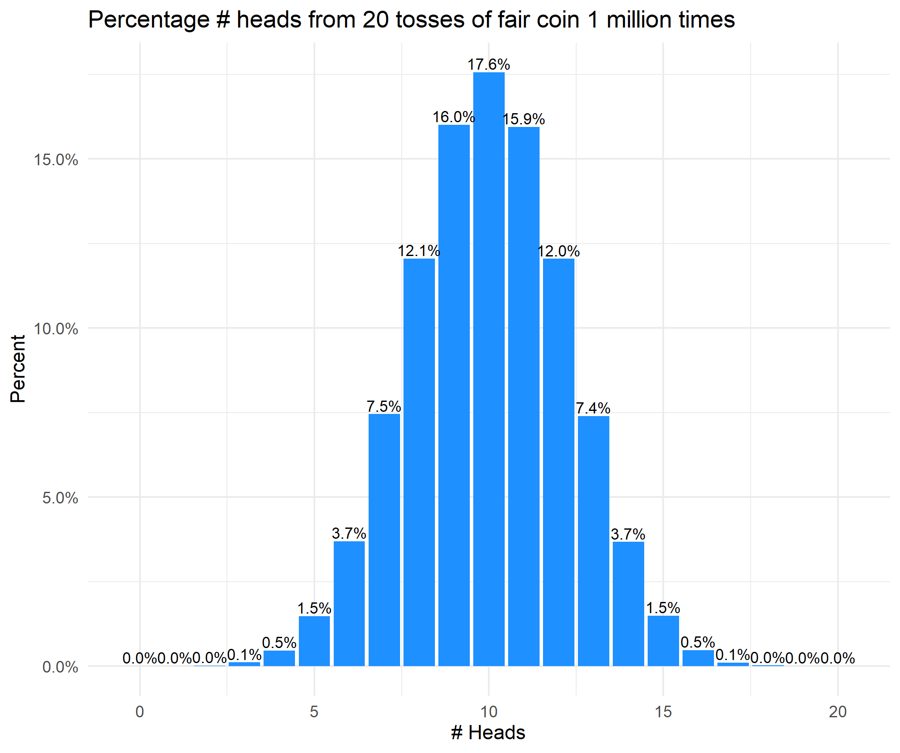
```

## Power
```{r , include = F, cache=T,echo=F, out.width='80%', out.height='80%'}
p <- 0.5 # this is a fair coin
n <- 20
b <- 1000000
heads.50 <- data.table(H = rbinom(n = b, size = n,prob = p))
heads.50[, prop := length(H)/length(heads.50$H), by = as.factor(H)]
heads.50.sum <-unique(heads.50[,list(H,prop)])
setorder(heads.50.sum,-H)
heads.50.sum[,alpha := cumsum(prop)]
setorder(heads.50.sum,H)
# https://gist.github.com/Teebusch/db0ab76d31fd31a13ccf93afa7d77df5
area.50 <- as.data.table(
  bind_rows(old = heads.50.sum,
            new = heads.50.sum %>% mutate(prop = lag(prop)),
            .id = "source") %>% arrange(H, source)
  )

ggplot(heads.50.sum,aes(x=H,y=prop)) + geom_step(color='dodgerblue') + 
  geom_ribbon(aes(x = H, ymin = 0, ymax = prop), data = area.50[alpha<.025],
              fill='dodgerblue',alpha=0.5) + 
    xlab('# of Heads') + ylab ('Probability') +
  theme_minimal(base_size = 16)
```

```{r , include = T, cache=T,echo=F, out.width='70%', out.height='70%'}
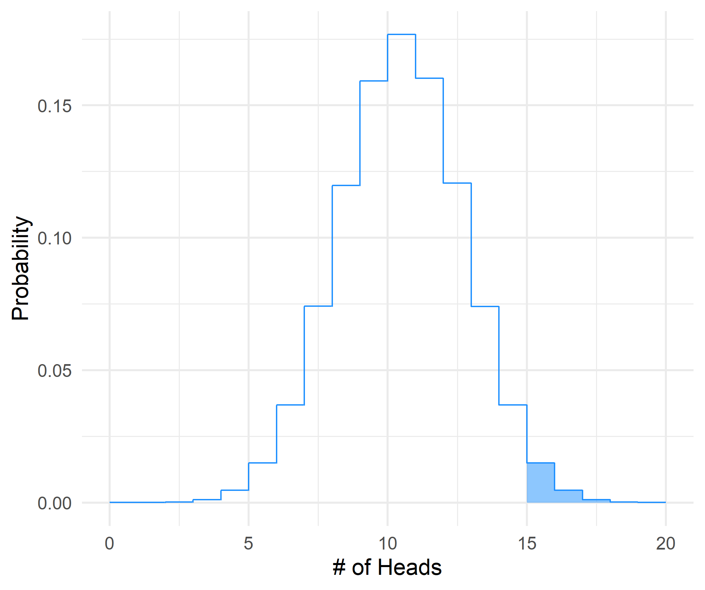
```

## Power with 20 tosses
```{r , include = T, cache=T,echo=F, out.width='80%', out.height='80%'}
p <- 0.75 # this is a not a fair coin
heads.75 <- data.table(H = rbinom(n = b, size = n,prob = p))
heads.75[, prop := length(H)/length(heads.75$H), by = as.factor(H)]
heads.75.sum <-unique(heads.75[,list(H,prop)])
setorder(heads.75.sum,-H)
heads.75.sum[,alpha := cumsum(prop)]
setorder(heads.75.sum,H)
area.75 <- as.data.table(
  bind_rows(old = heads.75.sum,
            new = heads.75.sum %>% mutate(prop = lag(prop)),
            .id = "source") %>% arrange(H, source)
)

heads.50.sum[,coin := 'Prob=50%'] 
heads.75.sum[,coin := 'Prob=75%'] 
heads.sum <- rbind(heads.50.sum,heads.75.sum)
setorderv(heads.sum,c('H','coin'))

power.20 <- sum(heads.75.sum[H>=min(area.50[alpha<.025,H]),prop])

ggplot(heads.sum,aes(x=H,y=prop)) + geom_step(aes(color=coin)) + 
  geom_ribbon(aes(x = H, ymin = 0, ymax = prop), data = area.50[alpha<.025],
              fill='dodgerblue',alpha=0.5) + 
  geom_ribbon(aes(x = H, ymin = 0, ymax = prop), data = area.75[H>=min(area.50[alpha<.025,H])],
              fill='firebrick',alpha=0.5) + 
  ggtitle(glue("Power {round(power.20, 2)}")) +
  scale_color_manual(name='',values = c('dodgerblue','firebrick')) + 
  xlab('# of Heads') + ylab ('Probability') +
  theme_minimal(base_size = 20)

```

<!-- ```{r , include = T, cache=T,echo=F, out.width='65%', out.height='65%'} -->
<!-- 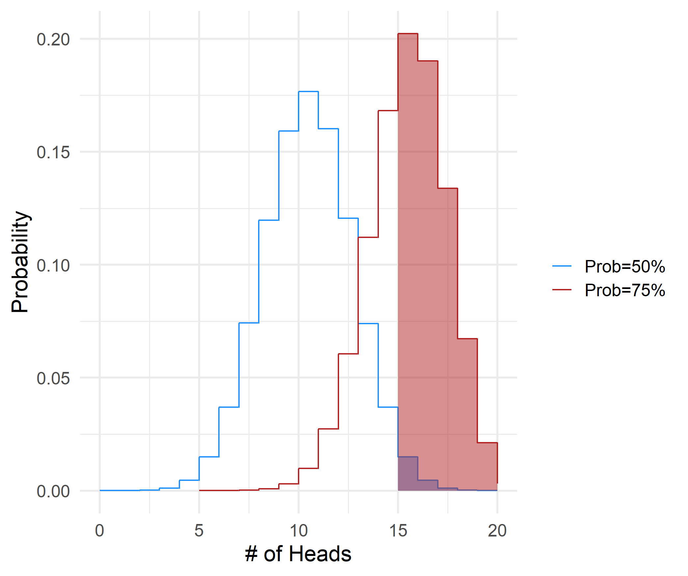 -->
<!-- ``` -->

## Power with 30 tosses
```{r , include = T, cache=T,echo=F, out.width='80%', out.height='80%'}
##### 30 flips #####
p <- 0.5 # this is a fair coin
n <- 30
heads.50 <- data.table(H = rbinom(n = b, size = n,prob = p))
heads.50[, prop := length(H)/length(heads.50$H), by = as.factor(H)]
heads.50.sum <-unique(heads.50[,list(H,prop)])
setorder(heads.50.sum,-H)
heads.50.sum[,alpha := cumsum(prop)]
setorder(heads.50.sum,H)
area.50 <- as.data.table(
  bind_rows(old = heads.50.sum,
            new = heads.50.sum %>% mutate(prop = lag(prop)),
            .id = "source") %>% arrange(H, source)
)

p <- 0.75
heads.75 <- data.table(H = rbinom(n = b, size = n,prob = p))
heads.75[, prop := length(H)/length(heads.75$H), by = as.factor(H)]
heads.75.sum <-unique(heads.75[,list(H,prop)])
setorder(heads.75.sum,-H)
heads.75.sum[,alpha := cumsum(prop)]
setorder(heads.75.sum,H)
area.75 <- as.data.table(
  bind_rows(old = heads.75.sum,
            new = heads.75.sum %>% mutate(prop = lag(prop)),
            .id = "source") %>% arrange(H, source)
)

heads.50.sum[,coin := 'Prob=50%'] 
heads.75.sum[,coin := 'Prob=75%'] 
heads.sum <- rbind(heads.50.sum,heads.75.sum)
setorderv(heads.sum,c('H','coin'))
power.30 <- sum(heads.75.sum[H>=min(area.50[alpha<.025,H]),prop])

ggplot(heads.sum,aes(x=H,y=prop)) + geom_step(aes(color=coin)) + 
  geom_ribbon(aes(x = H, ymin = 0, ymax = prop), data = area.50[alpha<.025],
              fill='dodgerblue',alpha=0.5) + 
  geom_ribbon(aes(x = H, ymin = 0, ymax = prop), data = area.75[H>=min(area.50[alpha<.025,H])],
              fill='firebrick',alpha=0.5) + 
  ggtitle(glue("Power {round(power.30, 2)}")) +
  scale_color_manual(name='',values = c('dodgerblue','firebrick')) + 
  xlab('# of Heads') + ylab ('Probability') +
  theme_minimal(base_size = 20)


```

<!-- ```{r , include = T, cache=T,echo=F, out.width='70%', out.height='70%'} -->
<!-- 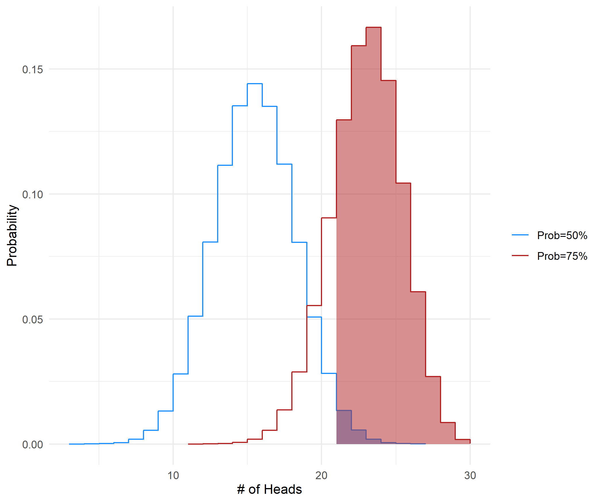 -->
<!-- ``` -->

## Power with 40 tosses
```{r , include = T, cache=T,echo=F, out.width='80%', out.height='80%'}

##### 40 flips #####
p <- 0.5 # this is a fair coin
n <- 40
heads.50 <- data.table(H = rbinom(n = b, size = n,prob = p))
heads.50[, prop := length(H)/length(heads.50$H), by = as.factor(H)]
heads.50.sum <-unique(heads.50[,list(H,prop)])
setorder(heads.50.sum,-H)
heads.50.sum[,alpha := cumsum(prop)]
setorder(heads.50.sum,H)
area.50 <- as.data.table(
  bind_rows(old = heads.50.sum,
            new = heads.50.sum %>% mutate(prop = lag(prop)),
            .id = "source") %>% arrange(H, source)
)

p <- 0.75
heads.75 <- data.table(H = rbinom(n = b, size = n,prob = p))
heads.75[, prop := length(H)/length(heads.75$H), by = as.factor(H)]
heads.75.sum <-unique(heads.75[,list(H,prop)])
setorder(heads.75.sum,-H)
heads.75.sum[,alpha := cumsum(prop)]
setorder(heads.75.sum,H)
area.75 <- as.data.table(
  bind_rows(old = heads.75.sum,
            new = heads.75.sum %>% mutate(prop = lag(prop)),
            .id = "source") %>% arrange(H, source)
)

heads.50.sum[,coin := 'Prob=50%'] 
heads.75.sum[,coin := 'Prob=75%'] 
heads.sum <- rbind(heads.50.sum,heads.75.sum)
setorderv(heads.sum,c('H','coin'))
power.40 <- sum(heads.75.sum[H>=min(area.50[alpha<.025,H]),prop])

ggplot(heads.sum,aes(x=H,y=prop)) + geom_step(aes(color=coin)) + 
  geom_ribbon(aes(x = H, ymin = 0, ymax = prop), data = area.50[alpha<.025],
              fill='dodgerblue',alpha=0.5) + 
  geom_ribbon(aes(x = H, ymin = 0, ymax = prop), data = area.75[H>=min(area.50[alpha<.025,H])],
              fill='firebrick',alpha=0.5) + 
  ggtitle(glue("Power {round(power.40, 2)}")) +
  scale_color_manual(name='',values = c('dodgerblue','firebrick')) + 
  xlab('# of Heads') + ylab ('Probability') +
  theme_minimal(base_size = 20)

```

<!-- ```{r , include = T, cache=T,echo=F, out.width='70%', out.height='70%'} -->
<!-- 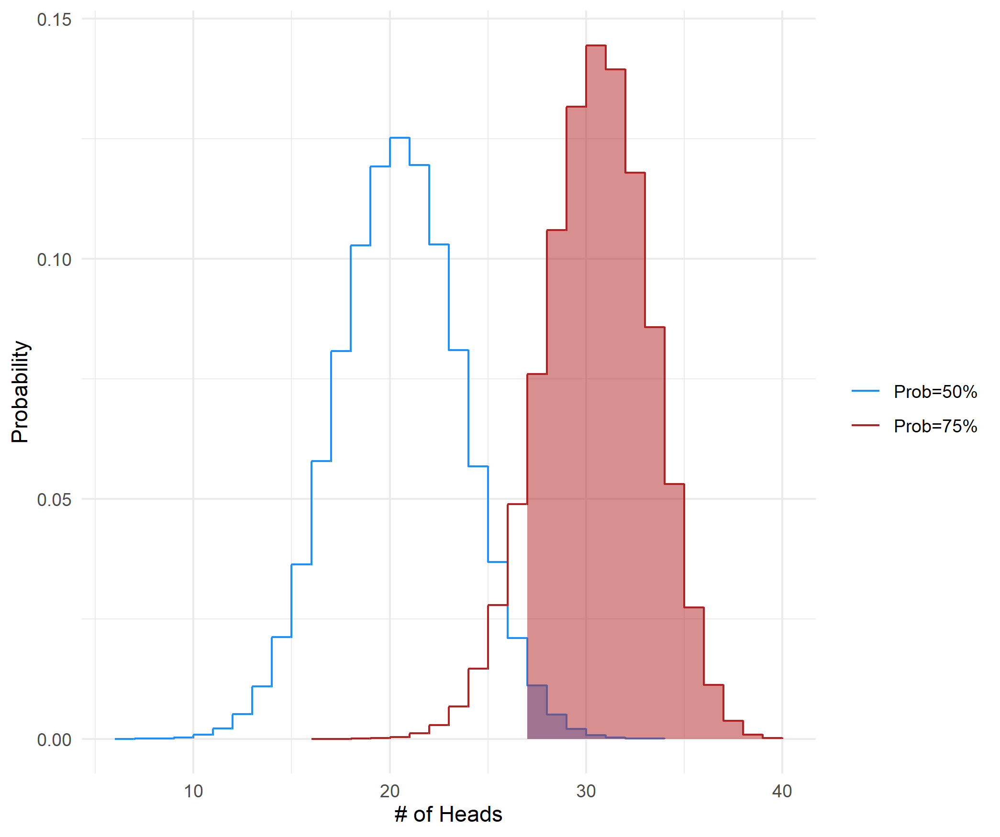 -->
<!-- ``` -->


## Power with 100 tosses
```{r , include = T, cache=T,echo=F, out.width='80%', out.height='80%'}

##### 100 flips #####
p <- 0.5 # this is a fair coin
n <- 100
heads.50 <- data.table(H = rbinom(n = b, size = n,prob = p))
heads.50[, prop := length(H)/length(heads.50$H), by = as.factor(H)]
heads.50.sum <-unique(heads.50[,list(H,prop)])
setorder(heads.50.sum,-H)
heads.50.sum[,alpha := cumsum(prop)]
setorder(heads.50.sum,H)
area.50 <- as.data.table(
  bind_rows(old = heads.50.sum,
            new = heads.50.sum %>% mutate(prop = lag(prop)),
            .id = "source") %>% arrange(H, source)
)

p <- 0.75
heads.75 <- data.table(H = rbinom(n = b, size = n,prob = p))
heads.75[, prop := length(H)/length(heads.75$H), by = as.factor(H)]
heads.75.sum <-unique(heads.75[,list(H,prop)])
setorder(heads.75.sum,-H)
heads.75.sum[,alpha := cumsum(prop)]
setorder(heads.75.sum,H)
area.75 <- as.data.table(
  bind_rows(old = heads.75.sum,
            new = heads.75.sum %>% mutate(prop = lag(prop)),
            .id = "source") %>% arrange(H, source)
)

heads.50.sum[,coin := 'Prob=50%'] 
heads.75.sum[,coin := 'Prob=75%'] 
heads.sum <- rbind(heads.50.sum,heads.75.sum)
setorderv(heads.sum,c('H','coin'))
power.100 <- sum(heads.75.sum[H>=min(area.50[alpha<.025,H]),prop])

ggplot(heads.sum,aes(x=H,y=prop)) + geom_step(aes(color=coin)) + 
  geom_ribbon(aes(x = H, ymin = 0, ymax = prop), data = area.50[alpha<.025],
              fill='dodgerblue',alpha=0.5) + 
  geom_ribbon(aes(x = H, ymin = 0, ymax = prop), data = area.75[H>=min(area.50[alpha<.025,H])],
              fill='firebrick',alpha=0.5) +
  ggtitle(glue("Power {round(power.100, 2)}")) +
  scale_color_manual(name='',values = c('dodgerblue','firebrick')) + 
  xlab('# of Heads') + ylab ('Probability') +
  theme_minimal(base_size = 20)

```

<!-- ```{r , include = T, cache=T,echo=F, out.width='70%', out.height='70%'} -->
<!-- 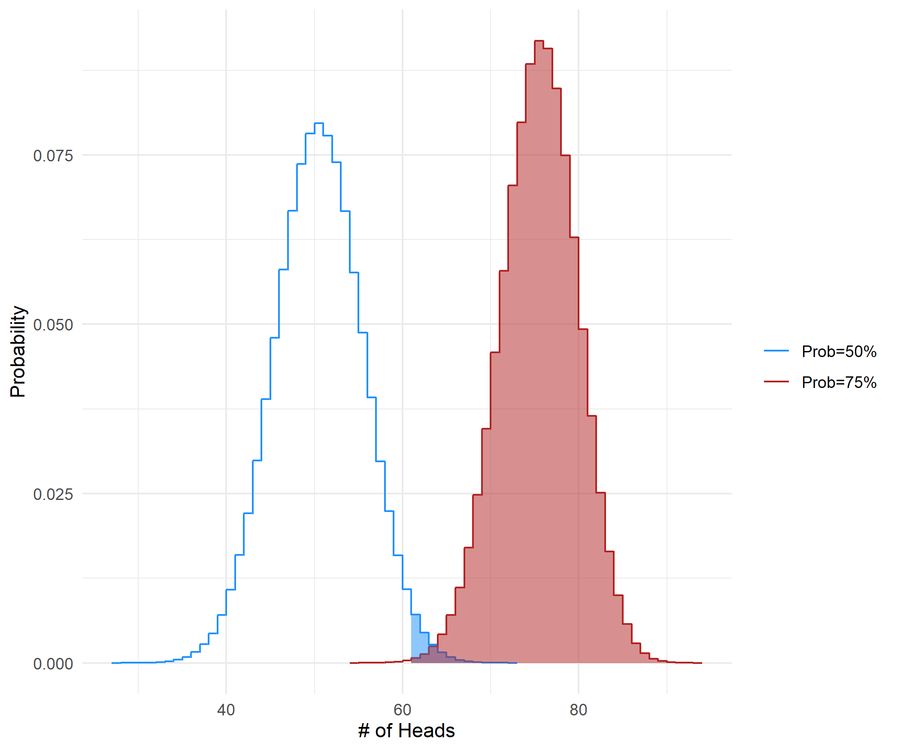 -->
<!-- ``` -->

## Significance level (size) $\alpha$
```{r , include = T, cache=T,echo=F, out.width='80%', out.height='80%'}
theme_min <- theme_minimal(base_size = 20) + theme(legend.position="bottom")
  
ggplot(data = data.frame(x = c(-3, 3)), aes(x)) +
  stat_function(fun = dnorm,
                geom = "line",
                aes(color = 'Null Distribution'),
                xlim = c(-10, 10),
                show.legend = T) +
  stat_function(fun = dnorm,
                geom = "area",
                aes(fill = "(False) Rejection probability"), 
                color = NA,
                alpha = 0.5,
                xlim = c(-5, -1.96)) +
  stat_function(fun = dnorm,
                geom = "area",
                aes(fill = "(False) Rejection probability"), 
                alpha = 0.5,
                xlim = c(1.96, 5)) +
  annotate(geom="text", x=-2.75, y=.05, label=expression(alpha/2), color="dodgerblue") + 
  annotate(geom="text", x=2.75, y=.05, label=expression(alpha/2), color="dodgerblue") + 
  scale_color_manual(name='', values = 'dodgerblue') +
  scale_fill_manual(name='', values = 'dodgerblue') +
  geom_vline(xintercept = -1.96) + geom_vline(xintercept = 1.96) + 
  scale_x_continuous(name ="",limits=c(-4,4), breaks = c(-1.96,0,1.96)) + 
  theme_min

```

## Consider a true 1 SD effect

```{r , include = T, cache=T,echo=F, out.width='80%', out.height='80%'}

ggplot(data = data.frame(x = c(-4, 4)), aes(x)) +
  stat_function(fun = dnorm,
                geom = "line",
                aes(color = 'Null'),
                xlim = c(-10, 10)) +
  stat_function(fun = dnorm,
                args = list(mean=1,sd=1),
                geom = "line",
                aes(color = '1 SD Effect'),
                xlim = c(-10, 10)) +
  geom_vline(xintercept = 0, color = 'dodgerblue') + 
  geom_vline(xintercept = 1, color = 'firebrick') + 
  scale_color_manual(name='', values = c('Null'='dodgerblue','1 SD Effect'='firebrick')) +
  scale_x_continuous(name ="",limits=c(-4,4), breaks = c(-1.96,0,1.96)) + 
  theme_min

```

## Consider a true 1 SD effect

```{r , include = T, cache=T,echo=F, out.width='80%', out.height='80%'}

ggplot(data = data.frame(x = c(-4, 4)), aes(x)) +
  stat_function(fun = dnorm,
                geom = "line",
                aes(color = 'Null'),
                xlim = c(-10, 10)) +
  stat_function(fun = dnorm,
                args = list(mean=1,sd=1),
                geom = "line",
                aes(color = '1 SD Effect'),
                xlim = c(-10, 10)) +
  stat_function(fun = dnorm,
                geom = "area",
                fill = 'dodgerblue',alpha = 0.5,
                xlim = c(1.96, 5)) +
  # stat_function(fun = dnorm,
  #               geom = "area",
  #               args = list(mean=1,sd=1),
  #               fill = 'firebrick',alpha = 0.5,
  #               xlim = c(1.96, 5)) +
  scale_color_manual(name='', values = c('Null'='dodgerblue','1 SD Effect'='firebrick')) +
  scale_x_continuous(name ="",limits=c(-5,5), breaks = c(0,1,1.96)) + 
  theme_min
```

## Consider a true 1 SD effect

```{r , include = T, cache=T,echo=F, out.width='80%', out.height='80%'}

ggplot(data = data.frame(x = c(-4, 4)), aes(x)) +
  stat_function(fun = dnorm,
                geom = "line",
                aes(color = 'Null'),
                xlim = c(-10, 10)) +
  stat_function(fun = dnorm,
                args = list(mean=1,sd=1),
                geom = "line",
                aes(color = '1 SD Effect'),
                xlim = c(-10, 10)) +
  stat_function(fun = dnorm,
                geom = "area",
                fill = 'dodgerblue',alpha = 0.5,
                xlim = c(1.96, 5)) +
  stat_function(fun = dnorm,
                geom = "area",
                args = list(mean=1,sd=1),
                fill = 'firebrick',alpha = 0.5,
                xlim = c(1.96, 5)) +
  scale_color_manual(name='', values = c('Null'='dodgerblue','1 SD Effect'='firebrick')) +
  scale_x_continuous(name ="",limits=c(-5,5), breaks = c(0,1,1.96)) + 
  theme_min
```

## Consider a true 3 SD effect

```{r , include = T, cache=T, echo=F, out.width='80%', out.height='80%'}

ggplot(data = data.frame(x = c(-6, 6)), aes(x)) +
  stat_function(fun = dnorm,
                geom = "line",
                aes(color = 'Null'),
                xlim = c(-10, 10)) +
  stat_function(fun = dnorm,
                args = list(mean=3,sd=1),
                geom = "line",
                aes(color = '3 SD Effect'),
                xlim = c(-10, 10)) +
  stat_function(fun = dnorm,
                geom = "area",
                fill = 'dodgerblue',alpha = 0.5,
                xlim = c(1.96, 10)) +
  stat_function(fun = dnorm,
                geom = "area",
                args = list(mean=3,sd=1),
                fill = 'firebrick',alpha = 0.5,
                xlim = c(1.96, 10)) +
  scale_color_manual(name='', values = c('Null'='dodgerblue','3 SD Effect'='firebrick'),) +
  scale_x_continuous(name ="",limits=c(-4,7), breaks = c(0,1,1.96)) + 
  theme_min

```

## Power analysis visually
```{r , include = T, cache=T, echo=F, out.width='90%', out.height='90%'}
ggplot(data = data.frame(x = c(-6, 6)), aes(x)) +
  stat_function(fun = dnorm,
                geom = "line",
                aes(color = 'Null'),
                xlim = c(-10, 10)) +
  stat_function(fun = dnorm,
                args = list(mean=3,sd=1),
                geom = "line",
                aes(color = '3 SD Effect'),
                xlim = c(-10, 10)) +
  stat_function(fun = dnorm,
                geom = "area",
                fill = 'dodgerblue',alpha = 0.5,
                xlim = c(-1.96, 1.96)) +
  stat_function(fun = dnorm,
                geom = "area",
                args = list(mean=3,sd=1),
                fill = 'firebrick',alpha = 0.5,
                xlim = c(1.96, 10)) +
  geom_vline(xintercept = 0, linetype=2) + 
  geom_vline(xintercept = 1.96, linetype=2) + 
  geom_vline(xintercept = 3, linetype=2) + 
  geom_segment(aes(x=1.96,xend=3,y=.3,yend=.3)) + 
  geom_segment(aes(x=0,xend=1.96,y=.1,yend=.1)) + 
  annotate(geom="text", x=2.5, y=.33, label=expression(t[1-kappa]), color="black",size=8) + 
  annotate(geom="text", x=.8, y=.115, label=expression(t[1-alpha/2]), color="black",size=8) + 
  annotate(geom="text", x=6, y=.2, label=expression('Area:'~kappa), color="firebrick",size=8) + 
  annotate(geom="text", x=6, y=.18, label='Power', color="firebrick",size=8) + 
  annotate(geom="text", x=-2.5, y=.2, label=expression('Area:'~1-alpha), color="dodgerblue",size=8) + 
  annotate(geom="text", x=-2.5, y=.18, label='Size', color="dodgerblue",size=8) + 
  scale_color_manual(name='', values = c('Null'='dodgerblue','3 SD Effect'='firebrick')) +
  scale_x_continuous(name ="",limits=c(-4,7), breaks = c(0,1,1.96)) + 
  theme_min

```


## Power formula

::: {.smaller}
Power analysis considers the magnitude of the effect size we can detect given the power and size of the test.

$$\text{Effect} = (t_{1-\kappa} + t_{\alpha/2}) \text{SE}(\hat{\beta})$$
Note: $t_{1-p}$ is the $p^{th}$ percentile of the student t distribution.

We often think about this as the *minimum detectable effect size* or MDE.
$$ \text{MDE} = (0.84 + 1.96) \text{SE}(\hat{\beta}) $$

Usually the main research degree of freedom is the sample size, so we consider how sample size impacts the MDE.  For a binary treatment:
$$\text{MDE} =(t_{1-\kappa} + t_{\alpha/2}) \sqrt{\frac{1}{P(1-P)}} \sqrt{\frac{\sigma^2}{N}}$$

:::

## Stratification

What do we mean by stratification in practice?

- Consider an experiment with a sample size of 100 with 60 treated individuals.  
    - There are 50 men and 50 women in the sample.  
- Stratification will ensure that there are 30 men and 30 women in the treatment group. - If gender impacts outcomes then a random imbalance in gender ratio in treatment and control will increase the variance.
- If gender does not impact outcomes then stratification is the same as a completely randomized design
    - so there is no cost of stratification.

## Stratification

::: {.smallest}
Consider a setting with a binary treatment with two strata: male (M) and female (F).

The variance in a completely random design is:

$$\begin{align} \text{Var}_{comp} = \frac{1}{4N} \left( \left( \mu_{FC} - \mu_{MC} \right)^2 + \left( \mu_{FT} - \mu_{MT} \right)^2  \right) + \\
\frac{1}{N} \left( \sigma_{FT}^2 + \sigma_{FC}^2 \right) + \frac{1}{N} \left( \sigma_{MT}^2 + \sigma_{MC}^2 \right)
\end{align}$$

The variance in a stratified design:

$$\text{Var}_{strat} = \frac{1}{N} \left( \sigma_{FT}^2 + \sigma_{FC}^2 \right) + \frac{1}{N} \left( \sigma_{MT}^2 + \sigma_{MC}^2 \right)$$

and the difference in variance is

$$\text{Var}_{comp} - \text{Var}_{strat} = \frac{1}{4N} \left( \left( \mu_{FC} - \mu_{MC} \right)^2 + \left( \mu_{FT} - \mu_{MT} \right)^2  \right) \geq 0$$

In general this term is greater than zero as long as potential outcomes are correlated with the strata.
:::

## Clustered designs

<!-- ::: {.smaller} -->
When designing a clustered random experiment we need to consider how the clustering affects the variance of the estimator.

Suppose our model for the treatment effect is: $Y_i = \beta D_i + \epsilon_i$, where $\epsilon_i$ is iid.

In a clustered random design we have the same model but  $\epsilon_i = \nu_g + \eta_{ig}$, since the error term can be divided up into a common cluster term and an idiosyncratic term.

The inference is similar to that of clustered standard errors.  We need to consider the intra-cluster correlation, which we call $\rho_{\epsilon}$.

$$\rho_{\epsilon} = \frac{\sigma_{\nu}^2}{\sigma_{\nu}^2 + \sigma_{\eta}^2} = \frac{\sigma_{\nu}^2}{\sigma_{\epsilon}^2}$$
<!-- ::: -->

## Clustered designs

We can show that the standard error of our treatment effect is now:

$$SE(\hat{\beta}) = \sqrt{\frac{1}{P(1-P)}} \sqrt{\frac{\sigma^2}{N}} \sqrt{(\bar n_g - 1)\rho_{\epsilon}+1}$$
In general we define the 'Moulton factor' as $\sqrt{1+(\bar n_g - 1)\rho}$, where $\rho$ is the intra-class correlation.

So now our MDE is defined as:

$$\text{MDE} =(t_{1-\kappa} + t_{\alpha/2}) \sqrt{\frac{1}{P(1-P)}} \sqrt{\frac{\sigma^2}{N}} \sqrt{1+(\bar n_g - 1)\rho}$$

## Why the clustering matters

::: {.smaller}
Suppose treatment is randomized at the **cluster level**:

- schools
- villages
- firms
- classrooms

but outcomes are observed at the **individual level**.

::: {.fragment}
Then observations within a cluster are typically **correlated** with:
:::

::: {.fragment}
- common environments
- common shocks
- peer effects
- group-level treatment assignment
:::

::: {.fragment}
So $N$ individual observations do **not** contain $N$ independent pieces of information.
:::

:::

---

### Why the clustering matters

If we ignore clustering, we act as if all individuals are independent.

::: {.fragment}
That is wrong when outcomes are correlated within clusters.
:::

::: {.fragment}
The result is:

- standard errors that are too small
- t-statistics that are too large
- rejection rates that are too high
:::

::: {.fragment}
This is the logic behind the **Moulton factor**.
:::

## Moulton Factor

A simple variance inflation formula is

$$
\text{Var}(\hat{\beta})_{\text{clustered}}
\approx
\text{Var}(\hat{\beta})_{\text{iid}}
\times
\left[1 + (\bar n_g - 1)\rho\right]
$$

where:

- $\bar n_g$ = average cluster size
- $\rho$ = intra-cluster correlation coefficient (ICC)

::: {.fragment}
The term

$$
1 + (\bar n_g - 1)\rho
$$

is the **Moulton factor**.
:::

## Intuition

The Moulton factor increases when:

- clusters are larger
- within-cluster correlation is stronger

::: {.fragment}
If $\rho = 0$, individuals within a cluster are independent.
:::

::: {.fragment}
Then

$$
1 + (\bar n_g - 1)\rho = 1
$$

and there is no inflation.
:::

::: {.fragment}
If $\rho$ is large, many individuals in the same cluster look like repeated copies of each other.
:::

## Extreme Case

If $\rho = 1$, everyone in a cluster has exactly the same outcome shock.

::: {.fragment}
Then a cluster of size $\bar n_g$ contributes about the same information as **one observation**.
:::

::: {.fragment}
So the effective sample size is much closer to the **number of clusters** than the number of individuals.
:::

## Numerical Example

Suppose an education experiment randomizes treatment across schools.

- number of schools: $G = 50$
- students per school: $\bar n_g = 20$
- total students: $N = 1000$
- ICC: $\rho = 0.10$

::: {.fragment}
Then the Moulton factor is

$$
1 + (20-1)(0.10) = 1 + 1.9 = 2.9
$$
:::

---

### Numerical Example

A Moulton factor of $2.9$ means:

$$
\text{Var}(\hat{\beta})_{\text{clustered}}
\approx
2.9 \times
\text{Var}(\hat{\beta})_{\text{iid}}
$$

::: {.fragment}
So standard errors are inflated by

$$
\sqrt{2.9} \approx 1.70
$$
:::

::: {.fragment}
Ignoring clustering would understate the true standard error by about **70\%**.
:::

## Effective sample size

A useful approximation is

$$
N_{\text{eff}} \approx \frac{N}{1 + (\bar n_g - 1)\rho}
$$

For this example:

$$
N_{\text{eff}} \approx \frac{1000}{2.9} \approx 345
$$

::: {.fragment}
So 1000 student observations contain information closer to about **345 independent observations**.
:::

## Clustering in experiments

In clustered randomized experiments:

- treatment often varies only at the cluster level
- residual shocks are often correlated within clusters

::: {.fragment}
So the coefficient is typically still centered on the true causal effect,
but the naive individual-level standard error is wrong.
:::

::: {.fragment}
The main problem is **inference**, not identification.
:::

::: {.fragment}
This is still very important because it informs the MDE and the sample size required to identify meaningfull effects.
:::

## Level of clustering

When treatment rs randomized by cluster, standard errors should usually be clustered at the **level of randomization**.

::: {.fragment}
Examples:

- school-level assignment $\rightarrow$ cluster by school
- village-level assignment $\rightarrow$ cluster by village
- firm-level assignment $\rightarrow$ cluster by firm
:::

::: {.fragment}
This is also a good rule for quasi-experiments as well.

When deciding about the level of clustering, think about what level your treatment is assigned at (e.g. state, individual, county, firm)
:::

## Monte Carlo Illustration

```{r}
#| echo: false
#| warning: false
#| message: false
#| cache: true

library(data.table)
library(fixest)
library(knitr)

set.seed(530)

#-----------------------------
# Design parameters
#-----------------------------
G <- 50          # clusters
m <- 20          # units per cluster
N <- G * m
rho <- 0.10      # target ICC
sigma2_total <- 1

# variance decomposition to induce ICC = rho
sigma2_cluster <- rho * sigma2_total
sigma2_idio    <- (1 - rho) * sigma2_total

# treatment assigned at cluster level
cluster_dt <- data.table(
  cluster = 1:G,
  treat = rep(c(0, 1), each = G/2)
)

#-----------------------------
# One draw for the numerical example
#-----------------------------
dt <- cluster_dt[CJ(cluster = 1:G, id_in_cluster = 1:m), on = "cluster"]
dt[, u_g := rep(rnorm(G, 0, sqrt(sigma2_cluster)), each = m)]
dt[, e_i := rnorm(.N, 0, sqrt(sigma2_idio))]
dt[, y := 1 + 0 * treat + u_g + e_i]

mod_ols  <- feols(y ~ treat, data = dt)
mod_cl   <- feols(y ~ treat, data = dt, vcov = ~cluster)

one_draw <- data.table(
  Estimator = c("Naive OLS SE", "Clustered SE"),
  Estimate  = c(coef(mod_ols)["treat"], coef(mod_cl)["treat"]),
  SE        = c(se(mod_ols)["treat"], se(mod_cl)["treat"]),
  t_stat    = c(coef(mod_ols)["treat"] / se(mod_ols)["treat"],
                coef(mod_cl)["treat"] / se(mod_cl)["treat"])
)

#-----------------------------
# Monte Carlo rejection rates under the null
# true treatment effect = 0
#-----------------------------
B <- 1000

sim_res <- rbindlist(lapply(1:B, function(b) {
  dtb <- copy(cluster_dt)[CJ(cluster = 1:G, id_in_cluster = 1:m), on = "cluster"]
  dtb[, u_g := rep(rnorm(G, 0, sqrt(sigma2_cluster)), each = m)]
  dtb[, e_i := rnorm(.N, 0, sqrt(sigma2_idio))]
  dtb[, y := 1 + 0 * treat + u_g + e_i]

  mod1 <- feols(y ~ treat, data = dtb)
  mod2 <- feols(y ~ treat, data = dtb, vcov = ~cluster)

  data.table(
    rej_naive   = abs(coef(mod1)["treat"] / se(mod1)["treat"]) > 1.96,
    rej_cluster = abs(coef(mod2)["treat"] / se(mod2)["treat"]) > 1.96
  )
}))

mf <- 1 + (m - 1) * rho
se_inflation <- sqrt(mf)
n_eff <- N / mf

summary_tab <- data.table(
  Quantity = c(
    "Clusters (G)",
    "Cluster size (m)",
    "Total N",
    "ICC (rho)",
    "Moulton factor",
    "SE inflation = sqrt(Moulton factor)",
    "Effective sample size"
  ),
  Value = c(G, m, N, rho, round(mf, 2), round(se_inflation, 2), round(n_eff, 1))
)

reject_tab <- data.table(
  Method = c("Naive individual-level SE", "Cluster-robust SE"),
  `Rejection rate at 5% nominal level` = c(
    mean(sim_res$rej_naive),
    mean(sim_res$rej_cluster)
  )
)

kable(summary_tab, digits = 2, caption = "Design and implied Moulton calculations")
```

---

```{r}
#| echo: false
#| warning: false
#| message: false

kable(one_draw, digits = 3, caption = "One simulated experiment")
```

<br>


```{r}
#| echo: false
#| warning: false
#| message: false

kable(reject_tab, digits = 3, caption = "Monte Carlo rejection rates under the true null")
```


# Analysis of experiments
## Estimation

When it comes to the analysis of randomized experiments much of the work is done during the design stage. 

Generally, we do not need to be concerned about endogeneity so we can use simple methods to estimate causal effects.

However, it is still useful to consider the types of analyses that are appropriate for randomized experiments and their interpretation.

---

### Estimation

We will discuss three types of analysis:

**1. Exact p-values for sharp hypotheses**<br>
**2. Average treatment effects**<br>
**3. Regression**

---

### Exact p-values

First we consider exact p-values under sharp null hypothesis developed by Fisher (1925).  Traditionally, the null hypothesis is that there is no treatment effect for *any* individual.

$$H_0: Y_i(1) - Y_i(0) = 0 \: \forall \: i = 1,..,N$$

We can create a counterfactual distribution based on the null hypothesis for any test statistic.

Consider the sample mean where: $T^{ave}(D,Y^{obs},X) = \bar{Y_{T}^{obs}} - \bar{Y_{C}^{obs}}$

We can calculate the probability over the randomization distribution of that statistic being as large in absolute value as what we observe.<br>
[**Note:** the randomization distribution is just all the possible combinations of random assignment. This is different that asymptotic sampling theory.]{.smallest}

$$p = P(|T^{ave}(D,Y^{obs},X)| \geq |T^{ave}(D^{obs},Y^{obs},X)|)$$

---

### Estimation: Exact p-values

$$p = P(|T^{ave}(D,Y^{obs},X)| \geq |T^{ave}(D^{obs},Y^{obs},X)|)$$

How do we calculate this probability?

We can randomly reassign the treatment many times and estimate the difference in means for the newly randomly assigned treatment.

We typically keep the number of treated and control individuals the same.

The p-value will simply be the probability that a randomly assigned treatment generates a difference in means larger than the one we actually observe.

This is a form of randomization inference, similar in spirit to the bootstrap method.  

This embraces the randomization distribution (all possible combinations of treatment assignment) as opposed to sampling inference.

## Average treatment effects

We can use randomization inference (more on that later) to analyze average treatment effects (ATE) for completely randomized experiments based on early work by Neyman.

The ATE is defined as:

$$\tau = \frac{1}{N} \sum_{i=1}^N Y_i(1) - Y_i(0) = \bar{Y(1)} - \bar{Y(0)}$$
The estimate of the ATE can be constructed by simple sample means

$$\hat{\tau} = \bar{Y}_T^{obs} - \bar{Y}_C^{obs}$$

---

### Average treatment effects

::: {.smaller}
To make inference and construct confidence intervals we need the variance of this estimator.

The sampling variance over the randomization distribution is:

$$Var(\hat{\tau}) = \frac{S_C^2}{N_C} + \frac{S_T^2}{N_T} - \frac{S_{TC}^2}{N}$$

here $S_C^2$ and $S_T^2$ are the variances of $Y_i(0)$ and $Y_i(1)$ in the sample, defined as:

$$S_C^2 = \frac{1}{N_C-1} \sum_{i=1}^{N_C} \left(Y_i(0) - \bar{Y(0)} \right)^2;   S_T^2 = \frac{1}{N_T-1} \sum_{i=1}^{N_T} \left(Y_i(1) - \bar{Y(1)} \right)^2$$

The last term, $S_{TC}^2$ is the sample variance of the unit-level treatment effects and typically cannot be estimated because we don't observe both potential outcomes for each observation.
:::

---

### Average treatment effects

We can estimate $S_C^2$ and $S_T^2$ with the observed sample variances $s_C^2$ and $s_T^2$, respectively.

Therefore the variance of the ATE is:

$$Var(\hat{\tau}) = \frac{s_C^2}{N_C} + \frac{s_T^2}{N_T}$$

Omitting the last term ($\frac{S_{TC}^2}{N}$) will often increase the variance except in two cases:

1. There is a constant treatment effect so $S_{TC}^2=0$
2. $Var(\hat{\tau})$ can be thought of as an estimator for the population ATE as opposed to the sample ATE.

To construct confidence intervals we need large-sample approximations that are usually based off normal approximations.

---

###  Average treatment effects

We can perform the same basic analysis with stratification by estimating ATEs within each strata $g$.

$$\hat{\tau_g} = \bar{Y}_{T,g}^{obs} - \bar{Y}_{C,G}^{obs}$$
The estimated variance for each strata is

$$Var(\hat{\tau_g}) = \frac{s_{C,g}^2}{N_{C,g}} + \frac{s_{T,g}^2}{N_{T,g}}$$

---

###  Average treatment effects

The overall ATE can be calculated by averaging the strata-level ATE:

$$\hat{\tau}_{strat} = \sum_{g=1}^G \hat{\tau_{g}} \frac{N_g}{N}$$

The variance of the ATE is:

$$Var{\hat{\tau}_{strat}} = \sum_{g=1}^G Var(\hat{\tau_g}) \left( \frac{N_g}{N} \right)^2$$

- We can calculate similar treatment effects for pairwise randomization, but we cannot estimate the variance within each strata (pair) in the same way.  
- We need at least two treated and two control observations in each strata to estimate the variance.

## Regression

In a successful completely randomized experiment we do not need to use covariates in regression to generate causal treatment effects.

There are two primary reasons to include covariates in a regression.

1. It can increase the precision of the estimated treatment effects if covariates are correlated with potential outcomes.
2. It can remove bias if there was a problem with the randomization.


## Randomization and regression

Athey and Imbens ([2017](https://www.sciencedirect.com/science/article/pii/S2214658X16300174)) **on regression and randomization inference**:

> Although these methods [regression] remain the most popular way of analyzing data from randomized experiments, **we suggest caution in using them**.

> ... In particular there is a disconnect between the way the conventional assumptions in regression analyses are formulated and the implications of randomization. As a result it is easy for the researcher using regression methods to go beyond analyses that are justified by randomization, and end up with analyses that rely on a **difficult-to-assess mix of randomization assumptions, modeling assumptions, and large sample approximation**.

---

### Randomization and regression

[Athey and Imbens 2017](https://www.sciencedirect.com/science/article/pii/S2214658X16300174) **on regression and randomization inference**:

> Ultimately **we recommend that researchers wishing to use regression or other model-based methods rather than the randomization-based methods we prefer, do so with care**. For example, using only indicator variables based on partitioning the covariate space, rather than using multi-valued variables as covariates in the regression function preserves many of the finite sample properties that simple comparisons of means have, and leads to regression estimates with clear interpretations. In addition, **in many cases the potential gains from regression adjustment can also be captured by careful ex ante design**, that is, through stratified randomized experiments to be discussed in the next section, without the potential costs associated with ex post regression adjustment.

## Heterogeneity

Previously we discussed introducing covariates into the analysis to increase precision or remove bias due to problems with the randomization.

We may also be interested in using covariates to analyze treatment effect heterogeneity.

This is particularly important if we want to extrapolate the results to a different population and we expect there is significant treatment heterogeneity along observable characteristics.

---

### Heterogeneity

The first way to conduct heterogeneity analysis is to simply estimate treatment effects on sub-populations of interest.

This is similar to the estimates of treatment effects within strata.

Heterogeneity of this kind should ideally be disclosed prior to the experiment in a pre-analysis plan to avoid concerns of ex-post p-hacking.

Generating subgroups of interest may also require corrections for multiple hypothesis testing.  Bonferonni correction is typically too conservative when the covariates are correlated with each other. 

[List et al. (2019)](#https://link.springer.com/article/10.1007/s10683-018-09597-5) provide a good method that addresses this issue.

---

### Heterogeneity

The cases above are appropriate when we have strong theoretical grounds to test heterogeneity over a limited set of covariates.

As experiments become more commonly linked to observational data with many potential covariates it is useful to explore data driven approaches to treatment heterogeneity.

We will discuss these methods in later classes on regularized regression (e.g. LASSO) and partitioning with causal regression trees.

## Noncompliance

::: {.smaller}
One last issue for the analysis of experimental data is noncompliance.  Noncompliance is when some individuals are assigned treatment but do not actually receive treatment. 

Noncompliance can occur for many reasons, but a particular challenge is when noncompliance is not random - as is often the case.

We can deal with noncompliance in two primary ways.

1. Estimate intent to treat effects based on treatment assignment rather than treatment receipt
1. Estimate local average treatment effects using random assignment as an instrument for treatment.

The second is very similar to out analysis of IV in an experimental setting.  A special case of this is a randomized encouragement design - where you cannot directly manipulate treatment.
:::

# Inference and (re)randomization
## Inference recap

Our inference techniques have focused on (asymptotic) **analytical methods**.

1. Choose (or derive) an estimator

2. Derived the estimator's (asymptotic) distribution
    - and, consequently, standard errors.
  
3. Construct confidence intervals or hypothesis tests


## Resampling

**Resampling methods** offers a different, more computationally intense (less asymptoically intense) approach.

A **resampling method** involves repeatedly drawing samples (*resampling*) from a dataset and refitting the model of interest on each sample. 

We can learn about the behavior of the model through its performance across the many iterations.

This approach is very similar to Monte Carlo simulations, except that we will sample *with replacement* from a single dataset.

**Common implementations:** Bootstrap (and jackknife), cross validation, permutation tests/randomization inference

# The bootstrap

## Basics

**Bootstrapping** resamples, **with replacement**, from the original dataset.

- In each sample, we apply our estimator.
- Then, we consider the distribution/properties of these estimates.

This resampling helps us better understand the uncertainty associated with our estimator (within the current data setting).

## More formally

Let's formalize the bootstrap a bit.
- $Z$ denotes our original dataset (_e.g._, $Z = \left[ \text{Y} \mid \text{X} \right]$ in our standard setup).

- $\hat\alpha(Z)$ refers to the estimate for $\alpha$ derived from our dataset $Z$.

- We draw $B$ bootstrap samples $b\in \left\{ 1,\,\ldots,\, B \right\}$.

- $Z^{\star 1}$ represents our first bootstrap sample $\left( b=1 \right)$.

- $\hat{\alpha}^{\star 1} = \hat\alpha(Z^{\star1})$ is our estimator evaluated on the first bootstrap sample.

The **bootstrapped standard error** of $\hat\alpha$ is the standard deviation of the $\hat\alpha^{\star b}$

$$
\begin{align}
  \mathop{\text{SE}_{B}}\left( \hat\alpha \right) = \sqrt{\dfrac{1}{B} \sum_{b=1}^{B} \left( \hat\alpha^{\star b} - \dfrac{1}{B} \sum_{\ell=1}^{B} \hat\alpha^{\star \ell} \right)^2}
\end{align}
$$
```{r , ex-boot-0, echo = F}
# Generate the dataset
set.seed(123)
n = 9
z = tibble(x = 1:n, y = 1 + x + rnorm(n, sd = 5))
b = lm(y ~ x, data = z)$coefficient[2]
boot_colors <- wes_palette("Zissou1", n, type = "continuous")
# boot_colors <- magma(n, begin = 0.1, end = 0.93)
s = 1:n
base_df <- expand.grid(x = 1:sqrt(n), y = 1:sqrt(n)) %>% as_tibble()
# Bootstrap 1
s1 <- sample(1:n, n, replace = T)
z1 <- z[s1,]
b1 <- lm(y ~ x, data = z1)$coefficient[2]
# Bootstrap 2
s2 <- sample(1:n, n, replace = T)
z2 <- z[s2,]
b2 <- lm(y ~ x, data = z2)$coefficient[2]
# Bootstrap 3
s3 <- sample(1:n, n, replace = T)
z3 <- z[s3,]
b3 <- lm(y ~ x, data = z3)$coefficient[2]
# Bootstrap 4
s4 <- sample(1:n, n, replace = T)
z4 <- z[s4,]
b4 <- lm(y ~ x, data = z4)$coefficient[2]
```

## More graphically

:::: {.columns}
::: {.column width="20%"}
$$Z$$
```{r,g1-boot0}
#| echo: false
#| fig-width: 4
#| fig-height: 4
#| out-width: "100%"

# Graph individuals
ggplot(
  data = base_df %>% mutate(fill = 1:n, lab = s),
  aes(x, y, fill = as.factor(fill))
) +
geom_tile(color = "white", size = 1.5) +
geom_text(aes(label = lab), color = "white", size = 10) +
coord_equal() +
scale_fill_manual(values = boot_colors[s]) +
scale_color_manual(values = boot_colors[s]) +
theme_void() +
theme(legend.position = "none")
```

$$
\hat\beta = `r round(b,3)`
$$

```{r,g2-boot0}
#| echo: false
#| fig-width: 4
#| fig-height: 4
#| out-width: "100%"
# Graph individuals
ggplot(
  data = z %>% mutate(s = 1:n),
  aes(x, y, color = as.factor(s))
) +
geom_smooth(method = lm, se = F, color = "grey85", size = 5) +
geom_point(size = 10, alpha = 0.5) +
coord_equal() +
xlim(-0.5,n+0.5) +
scale_color_manual(values = boot_colors[s]) +
theme_void() +
theme(legend.position = "none")
```

:::

::: {.column width="20%"}
::: {.fragment}

$$Z^{\star 1}$$
```{r , g1-boot1}
#| echo: false
#| fig-width: 4
#| fig-height: 4
#| out-width: "100%"

# Graph individuals
ggplot(
  data = base_df %>% mutate(fill = 1:n, lab = s1),
  aes(x, y, fill = as.factor(fill))
) +
geom_tile(color = "white", size = 1.5) +
geom_text(aes(label = lab), color = "white", size = 10) +
coord_equal() +
scale_fill_manual(values = boot_colors[s1]) +
scale_color_manual(values = boot_colors[s1]) +
theme_void() +
theme(legend.position = "none")
```

$$\hat\beta = `r b1 %>% round(3)`$$

```{r , g2-boot1}
#| echo: false
#| fig-width: 4
#| fig-height: 4
#| out-width: "100%"
# Graph individuals
ggplot(
  data = z1 %>% mutate(s = 1:n),
  aes(x, y, color = as.factor(s))
) +
geom_smooth(method = lm, se = F, color = "grey85", size = 5) +
geom_point(size = 10, alpha = 0.5) +
coord_equal() +
xlim(-0.5,n+0.5) +
scale_color_manual(values = boot_colors[s1]) +
theme_void() +
theme(legend.position = "none")
```
:::
:::

::: {.column width="20%"}
::: {.fragment}
$$Z^{\star 2}$$
```{r , g1-boot2}
#| echo: false
#| fig-width: 4
#| fig-height: 4
#| out-width: "100%"

# Graph individuals
ggplot(
  data = base_df %>% mutate(fill = 1:n, lab = s2),
  aes(x, y, fill = as.factor(fill))
) +
geom_tile(color = "white", size = 1.5) +
geom_text(aes(label = lab), color = "white", size = 10) +
coord_equal() +
scale_fill_manual(values = boot_colors[s2]) +
scale_color_manual(values = boot_colors[s2]) +
theme_void() +
theme(legend.position = "none")
```

$$\hat\beta = `r b2 %>% round(3)`$$

```{r , g2-boot2}
#| echo: false
#| fig-width: 4
#| fig-height: 4
#| out-width: "100%"

# Graph individuals
ggplot(
  data = z2 %>% mutate(s = 1:n),
  aes(x, y, color = as.factor(s))
) +
geom_smooth(method = lm, se = F, color = "grey85", size = 5) +
geom_point(size = 10, alpha = 0.5) +
coord_equal() +
xlim(-0.5,n+0.5) +
scale_color_manual(values = boot_colors[s2]) +
theme_void() +
theme(legend.position = "none")
```
:::
:::

::: {.column width="20%"}
::: {.fragment}
<div style="text-align: center; font-size: 3em; margin-top: 40%;">

...

</div>
:::
:::

::: {.column width="20%"}
::: {.fragment}

$$Z^{\star B}$$
```{r , g1-bootB}
#| echo: false
#| fig-width: 4
#| fig-height: 4
#| out-width: "100%"
# Graph individuals
ggplot(
  data = base_df %>% mutate(fill = 1:n, lab = s3),
  aes(x, y, fill = as.factor(fill))
) +
geom_tile(color = "white", size = 1.5) +
geom_text(aes(label = lab), color = "white", size = 10) +
coord_equal() +
scale_fill_manual(values = boot_colors[s3]) +
scale_color_manual(values = boot_colors[s3]) +
theme_void() +
theme(legend.position = "none")
```

$$\hat\beta = `r b3 %>% round(3)`$$

```{r , g2-bootB}
#| echo: false
#| fig-width: 4
#| fig-height: 4
#| out-width: "100%"
# Graph individuals
ggplot(
  data = z3 %>% mutate(s = 1:n),
  aes(x, y, color = as.factor(s))
) +
geom_smooth(method = lm, se = F, color = "grey85", size = 5) +
geom_point(size = 10, alpha = 0.5) +
coord_equal() +
xlim(-0.5,n+0.5) +
scale_color_manual(values = boot_colors[s3]) +
theme_void() +
theme(legend.position = "none")
```
:::
:::
::::

---

Running this bootstrap 1,000 times

```{r , boot-full, cache = T, eval = T}
plan(multisession, workers = 10)
# Set a seed
set.seed(123)

# Run the simulation 1000 times
boot_df <- future_map_dfr(
  # Repeat sample size 100 for 1000 times
  rep(n, 1000),
  # Our function
  function(n) {
    # Estimates via bootstrap
    est <- lm(y ~ x, data = z[sample(1:n, n, replace = T), ])
    # Return a tibble
    data.frame(int = est$coefficients[1], coef = est$coefficients[2])
  },
  # Let furrr know we want to set a seed
  .options = furrr::furrr_options(seed = TRUE)
)
```

```{r , boot-full-graph, echo = F, dev = 'png', dpi = 300, cache = T}
ggplot(
  data = z,
  aes(x, y, fill = as.factor(1:n))
) +
geom_abline(
  data = boot_df,
  aes(intercept = int, slope = coef),
  color = "grey50",
  alpha = 0.01
) +
geom_abline(
  intercept = lm(y ~ x, z)$coefficient[1],
  slope = lm(y ~ x, z)$coefficient[2],
  color = "black",
  size = 1.25
) +
geom_point(
  size = 10,
  stroke = 0.75,
  color = "white",
  shape = 21
) +
# coord_equal() +
# xlim(-0.5,n+0.5) +
scale_fill_manual(values = boot_colors[s]) +
theme_void() +
theme(legend.position = "none")

```

## Comparison

In this 1,000-sample bootstrap, we calculate a standard error for $\hat\beta_1$ of approximately `r sd(boot_df$coef) %>% round(3)`.

If we go the old-fashioned OLS route $\left( s^2 \left(\text{X}'\text{X}\right)^2 \right)$, we estimate `r tidy(lm(y~x,z))[2,3] %>% as.numeric() %>% round(3)`.

Not bad.

# Permutation tests
## Permutation tests

### Motivation

Consider the null hypothesis of *no average treatment effect*, _i.e._,
$H_0$:  $\overline{\text{Y}}_{0} = \overline{\text{Y}}_{1}  \quad \left(\implies \overline{\tau}=0 \right)$

We've discussed how randomization avoids the pitfalls of selection bias.

Randomization can also clarify inference—helping quantify uncertainty.

**Q:** How?

**A:** We know exactly how the randomness happened (we assigned it), so we don't need parametric assumptions to derive a distribution under $H_0$!


We use the **experimental design**, rather than a probability model.

## Tea drinkers 

**Classic example** Sir R. A. Fisher had a colleague who claimed to be able to tell whether the tea was poured into milk *or* milk was poured into the tea.

Being the friend he was, Fisher designed an experiment to determine whether his colleague was telling the truth.

Fisher randomized the order of 8 cups of tea:

- 4 cups with milk added first
- 4 cups with tea added first

Vindication! His colleague got all 8 correct.

**Q:** With random guessing, how likely is correctly guessing all 8 cups?

---

### Tea drinkers

**Q:** With random guessing, how likely is correctly guessing all 8 cups?

This question reflects our understanding of a **p-value**.

If Fisher's colleague had no ability and simply guessed ($H_0$), what is the probability she would have guessed all 8 cups correctly?

Fisher's $H_0$: the answers were unrelated to the cups' actual contents.

Under this hypothesis, we can re-randomize the cups and see how many times her answer was perfectly correct.

This is the idea behind **permutation testing** and **randomization inference**.

---

### Tea drinkers

There are $\binom{8}{4}=70$ equally likely assignments of 4 milk-first cups and 4 tea-first cups.

Only **one** of those assignments produces a perfect 8/8 match with the colleague's guesses, so the exact permutation-test p-value is

$$
\frac{1}{70} \approx 0.0143.
$$

```{r , graph-tea, echo = F, out.width = '100%', fig.asp = 1.4/1}
ggplot(
  data = tibble(x = 2 * (0:4), n = c(1, 16, 36, 16, 1)),
  aes(x = x, y = n)
) +
geom_col() +
geom_hline(yintercept = 0, size = 2) +
scale_x_continuous(
  "N. correct",
  breaks = 2 * (0:4)
) +
scale_y_continuous("Count") +
theme_pander(base_size = 65, base_family = "Fira Sans Book") +
theme(
  panel.grid.major = element_blank(),
  panel.grid.minor = element_blank()
)
```

So our permutation-test-based *p*-value is $1/70 \approx 0.0143$, so we reject $H_0$.

## Generalization

::: {.smaller}
The procedure for permutation-based hypothesis testing is the same as our "standard" asymptotic-based hypothesis testing.

  - Also called Fisher's exact test, because it delivers exact p-values.

1. **Define hypotheses**, $H_0$ and $H_A$.
1. Choose our **rejection threshold** $\alpha$ (tolerated type-I error rate).
1. Choose a **test statistic** that is a function of our sample.
1. Derive/calculate the test statistic's distribution under $H_0$.
1. **Compute the *p*-value** by comparing the test statistic to its $H_0$ distribution.
1. **Conclusions**—reject or fail to reject $H_0$.

**The difference:** Permutation tests use the randomization's mechanism to construct the test-statistic's exact distribution under $H_0$.
:::

---

### Generalization

Fisher focused on testing a **sharp null hypothesis**—no effect *for anyone*, _i.e._,
$H_0$: $\text{Y}_{1i} - \text{Y}_{0i} = 0 \enspace \forall i \quad \left( \implies \tau_i = 0 \enspace \forall i \right)$

against an alternative hypothesis that someone has a non-zero effect
$H_A$: $\enspace \text{Y}_{1i} - \text{Y}_{0i} \neq 0$ for some $i$ $\left( \implies \exists i \enspace \text{s.t.} \enspace \tau_i \neq 0\right)$

A **sharp null hypothesis** is specified *for all individuals*, *e.g.*,
$H_0$: $\text{Y}_{1i} - \text{Y}_{0i} = C \enspace \forall i$

which differs from the ATE-based nulls that we normally consider, *e.g.*,
$H_0$: $\mathop{E}\left[\text{Y}_{1i} - \text{Y}_{0i}\right] = C$.

---

### Generalization

Our estimate (or test statistic) is a function of

1. individuals' responses $\left( \text{Y}_{i} \right)$
2. individuals' treatment assignments $\left( \text{D}_{i} \right)$

**Under the sharp null** $H_0$: $\tau_i=0$ $\left( \forall i \right)$

- $\text{Y}_{0i} = \text{Y}_{1i} = \text{Y}_{i} \enspace \forall i$ (*i.e.*, changing $\text{D}_{i}$ will not affect observed $\text{Y}_{i}$)

- Permutations of $\text{D}$ construct the *exact* null distribution (unchanged $\text{Y}$).

The number of possible permutations can get big—*e.g.*, 500 treated and 500 control has 2.7 $\times$ 10299 options.

Approximate the distribution by sampling.

## Sharp null

The sharp null was central to Fisher's interpretation.

[Neyman *et al.* (1935)](https://www-jstor-org.libproxy.uoregon.edu/stable/2983637) extended this idea of permutation-based tests to the average treatment effect (testing $H_0$: $\mathop{E}\left[ \text{Y}_{1i} \right] - \mathop{E}\left[ \text{Y}_{0i} \right] = 0$).

Neyman and others also added standard errors and confidence intervals.

These extensions have come to be known as **randomization inference**.

*Permutation tests* and *Randomization inference* are not the most strictly defined terms.

# Randomization inference

## Setup

In order to **generalize our null hypothesis to the average treatment effect**,

$H_0$: $\overline{\tau} = 0 \implies \mathop{E}\left[ \text{Y}_{1i} - \text{Y}_{0i} \right] = 0$

we have to give up something.

1. If we want an exact null distribution, then we must **assume a uniform treatment effect**.
    - Assuming our way back to a sharp null.

2. If we want to avoid assuming $\tau_i = \overline{\tau} \enspace \forall i$, then we have to **accept a non-exact null distribution**. (We don't observe $\text{Y}_{0i}$ for $\text{D}_{i}=1$.)

If we don't like either option, then we need to go back to deriving asymptotic properties via probability modeling assumptions.

## Implementation

Once we decide which simplification we're willing to accept, we proceed similarly to permutation tests:

- shuffle $\text{D}$ in a way that mimics treatment assignment

- collect test statistics from each iteration

**Note** Monte Carlo simulations, bootstrap, permutation tests, and randomization all apply very similar processes.

## (Which) Test statistics

We still need to choose a test statistic on which we base the *p*-value.

- The **actual estimate**—difference in means or coefficient
- **Transformed estimates**
- **Quantiles**, *e.g.*, the median
- **_t_ statistic**
- **Rank** statistics

We can also extend this idea to **confidence intervals**.

***E.g.*,** Use the point estimates associated with the 2.5th and 95th percentiles to construct a 95% confidence interval.

## Example

::: {.smaller}
There's a famous dataset for estimating a the effect of a randomized job training program — the [LaLonde NSW dataset](https://users.nber.org/~rdehejia/data/.nswdata2.html).

```{r , read-nsw, echo = F}
# Read NSW data
nsw_df <- haven::read_dta("nsw.dta")
# Estimate
est_ols <- lm_robust(re78 ~ treat, data = nsw_df) %>% tidy()
```

- the NSW increased real earnings by $\color{#0073e6}{\hat{\beta}_1}\approx$ `r est_ols[2,"estimate"] %>% scales::dollar()`]
- (het.-robust) standard error of `r est_ols[2,"std.error"] %>% scales::dollar()`]
- _t_ statistic $\color{#0073e6}{t_\text{stat}}\approx$ `r est_ols[2,"statistic"] %>% round(2)`] with *p*-value $\approx$ `r est_ols[2,"p.value"] %>% round(4)`]

Let's re-randomize treatment 1,000 times. In each **iteration** $\color{#006400}{r}$, calculate

1. $\color{#006400}{\hat{\beta}_{1}^{r}}$, the **point estimate** (the regression coefficient)
1. $\color{#006400}{t_\text{stat}^{r}}$, the **_t_ statistic**

Then calculate the implied *p*-values using the location of $\color{#0073e6}{\hat\beta_1}$ and $\color{#0073e6}{t_\text{stat}}$ in the distributions of $\color{#006400}{\hat{\beta}_1^r}$ and $\color{#006400}{t_\text{stat}^r}$, respectively.
:::

## Example: Re-randomization

The main decision is how to generate treatment.

**Q** Should we permute $\text{D}$ or draw $\text{D}_{i}$ for each individual?
    - The difference is in whether we hold the number of treated individuals constant.

::: {.fragment}
**A** How was the original randomization conducted?
:::

::: {.fragment}
We'll assume the NSW started with a set number of treatments to disperse.
:::

--- 

### Example: Re-randomization

First, we'll write a function that performs one iteration.
```{r , random-fun1, eval = T}
# Arguments: 'i' (iteration), 'n_t' (# of trt)
fun_randomization <- function(i) {
  # Sample the treatment vector. NOTE: Sampling WITHOUT replacement
  t_i <- sample(nsw_df$treat, size = nrow(nsw_df), replace = F)
  # Regression using our re-randomized treatment
  est_i <- lm_robust(re78 ~ t_i, data = nsw_df) %>% tidy()
  # Return tibble with iteration, point estimate, and test statistic
  tibble(i, est = est_i[2,"estimate"], t_stat = est_i[2,"statistic"])
}
```

::: {.fragment}

And now run the re-randomization function 1,000 times.
```{r , random-fun2, cache = T, eval = T}
# Set up parallelization and seed
plan(multisession, workers = 4); set.seed(1234)
# Run the simulation 1e4 times
random_df <- future_map_dfr(
  1:1000,
  fun_randomization,
  .options = furrr::furrr_options(seed = TRUE)
)
```

:::

---

### Example: Re-randomization

**Result 1** Share $\color{#006400}{\big|\hat{\beta}_1^r\big|} > \color{#0073e6}{\hat{\beta}_1} =$ `r mean(abs(random_df$est)>abs(est_ols[2,"estimate"])) %>% round(4)`. (Original *p*-value $=$ `r round(est_ols[2,"p.value"], 4)`])

```{r , random-dist1, echo = F, fig.height = 6}
# Calculate density
gg_df <- density(random_df$est, n = 1e3, kernel = "epanechnikov") %$% tibble(
  est = x,
  density = y,
  reject = abs(est) > est_ols[2,"estimate"]
)
ggplot(
  data = gg_df,
  aes(x = est, ymin = 0, ymax = density)
) +
geom_ribbon(fill = "grey85", alpha = 0.8) +
geom_ribbon(
  data = gg_df %>% filter(est > abs(est_ols[2,"estimate"])),
  fill = green
) +
geom_ribbon(
  data = gg_df %>% filter(est < -abs(est_ols[2,"estimate"])),
  fill = green
) +
geom_hline(yintercept = 0) +
geom_vline(
  xintercept = est_ols[2,"estimate"],
  color = blue, size = 1, linetype = "longdash"
) +
xlab(TeX("$\\widehat{\\beta}_{1}^\\textit{r}$")) +
theme_pander(base_size = 18, base_family = "Fira Sans Book") +
theme(
  axis.text.y = element_blank(),
  axis.ticks.x = element_blank(),
  axis.title.x = element_text(family = "TeX Gyre Termes", size = 20),
  panel.grid.major = element_blank(),
  panel.grid.minor = element_blank()
)
```

---

### Example: Re-randomization

**Result 2** Share $\color{#006400}{\big| t_\text{stat}^r\big|} > \color{#0073e6}{t_\text{stat}} =$ `r mean(abs(random_df$t_stat)>abs(est_ols[2,"statistic"])) %>% round(4)`. (Original *p*-value $=$ `r round(est_ols[2,"p.value"], 4)`])

```{r , random-dist2, echo = F, fig.height = 6}
# Calculate density
gg_df <- density(random_df$t_stat, n = 1e3, kernel = "epanechnikov") %$% tibble(
  stat = x,
  density = y,
  reject = abs(stat) > est_ols[2,"statistic"]
)
ggplot(
  data = gg_df,
  aes(x = stat, ymin = 0, ymax = density)
) +
geom_ribbon(fill = "grey85", alpha = 0.8) +
geom_ribbon(
  data = gg_df %>% filter(stat > abs(est_ols[2,"statistic"])),
  fill = green
) +
geom_ribbon(
  data = gg_df %>% filter(stat < -abs(est_ols[2,"statistic"])),
  fill = green
) +
geom_hline(yintercept = 0) +
geom_vline(
  xintercept = est_ols[2,"statistic"],
  color = blue, size = 1, linetype = "longdash"
) +
xlab(TeX("\\textit{t}$_{stat}^\\textit{r}$")) +
theme_pander(base_size = 18, base_family = "Fira Sans Book") +
theme(
  axis.text.y = element_blank(),
  axis.ticks.x = element_blank(),
  axis.title.x = element_text(family = "TeX Gyre Termes", size = 20),
  panel.grid.major = element_blank(),
  panel.grid.minor = element_blank()
)
```

## Confidence intervals 

To construct confidence intervals, we **invert** randomization-based **hypothesis tests**, imposing a range of null hypotheses.

**E.g.,** To construct a 95% C.I. for $\color{#0073e6}{\hat{\tau}}$

1. Impose the null hypothesis $H_0$: $\tau = \tau_o$ for many values of $\tau_o$.
2. Find all values of $\tau_o$ that do not reject $\color{#0073e6}{\hat{\tau}}$ at the 5% level.

**Note** We must to be able to clearly impose the null in our "model".

---

```{r , fun-invert-ci, echo = F}
# Arguments: 'null', the null values
fun_invert_i <- function(null) {
  # Sample the treatment vector. NOTE: Sampling WITHOUT replacement
  t_i <- sample(nsw_df$treat, size = nrow(nsw_df), replace = F)
  map_dfr(
    null,
    function(null_j) {
      # Impose the null (generate outcomes)
      y_ij <- nsw_df$re78 + t_i * null_j
      # Regression using our re-randomized treatment
      est_ij <- lm_robust(y_ij ~ t_i) %>% tidy()
      # Return tibble with point estimate, se, test statistic, and null
      tibble(
        est = est_ij[2,"estimate"],
        se = est_ij[2, "std.error"],
        t_stat = est_ij[2,"statistic"],
        null = null_j
      )
    }
  ) %>% mutate(null_group = unlist(null) %>% seq_along())
}
# Function to run the function a bunch of times
fun_invert <- function(null, times = 1e3) {
  plan(multisession, workers = 4)
  future_map_dfr(
    rep(null, times),
    fun_invert_i,
  .options = furrr::furrr_options(seed = TRUE)
  )
}
```

```{r , run-invert-ci, echo = F, cache = T, eval = T}
ci_df <- fun_invert(
  # null = list(quantile(random_df$est, seq(0, 1, 0.01))),
  null = list(seq(from = est_ols[2,"conf.low"], to = est_ols[2,"conf.high"], length.out = 100)),
  times = 1000
)
```

```{r , summarize-ci, eval = T, echo=F}
# Add groups and test
ci_sum <- ci_df %>% mutate(
  reject = 2 * pt(abs((est - est_ols[2,"estimate"])/se), df = 720, lower.tail = F) < 0.05
)
# Summarize
ci_sum %<>% group_by(null_group) %>%
  summarize(
    reject = mean(reject),
    null = first(null)
  )
```


**Constructing a 95% confidence interval**
```{r , random-ci1, echo = F, fig.height = 6.75, eval = T}
ggplot(
  data = ci_sum,
  aes(x = null, y = reject, color = reject > 0.1)
) +
geom_hline(yintercept = 0.10, linetype = "dotted") +
geom_hline(yintercept = 0) +
geom_point(size = 2.5) +
xlab(TeX("$\\widehat{\\beta}_{1}^\\textit{o}$")) +
ylab("Share rejecting original estimate") +
scale_y_continuous(breaks = seq(0, 0.5, 0.1)) +
scale_color_manual("", values = c(green, "grey85")) +
theme_pander(base_size = 18, base_family = "Fira Sans Book") +
theme(
  legend.position = "none",
  axis.ticks = element_blank(),
  axis.title.x = element_text(family = "TeX Gyre Termes", size = 20, angle = 0, vjust = 0.5),
  panel.grid.major = element_blank(),
  panel.grid.minor = element_blank()
)
```

## Randomization inference and clustering

Permutation tests and randomization inference both work because we know the process through which treatment was randomly assigned.

If treatment is correlated within groups, then our bootstraps, permutations, and re-randomizations need to reflect this dependence.

## In practice

- [Young (2019)](https://academic.oup.com/qje/article/134/2/557/5195544) highlights the discrepancy 
between experimental design and analysis.

- We highlighted earlier that experiments - particularly field experiments - are growing in popularity

- These are often applied economists using randomization as an identification strategy

- However, the analysis often then proceeds in the same way as observational studies (OLS, robust/clustered SEs)

- Young highlights the impact on correct rejection rates for confidence intervals.

---

### In practice

- To summarize, randomization inference and multiple hypothesis testing can have 
large effects on inference and rejection rates.

- On average using randomization inference results in 13-22% fewer significant results

- Papers also fail to account for joint and/or multiple hypothesis testing

- A key factor in these results is leverage

## Leverage

- Leverage can be viewed as the weighted distance between an observations values and the mean value

- $h_{ii}$ is the $i^{th}$ diagonal element of $\mathbf{H}$ where

- $\mathbf{H} = \mathbf{X}(\mathbf{X^\prime} \mathbf{X})^{-1} \mathbf{X^\prime}$

- In empirical practice leverage is related to the sensitivity of outliers

- Young (2019) finds that removing 1 observation leads 35% of hypothesis tests at the .01 level
to be rendered insignificant

- The average difference between min and max leave-one-out p-value is 0.23

- [Broderick et al. (2023)](https://arxiv.org/abs/2011.14999) also shows leverage is important and
provide tools for robustness checks.


---

### Leverage

- One way to evaluate leverage is by removing one observation from the model (leave-one-out)

**Coefficient**

$$\hat{\beta}_{-i} = \hat{\beta} - \frac{\tilde{x}_i}{\sum_i \tilde{x}_i^2} \frac{\hat{\epsilon}_i}{(1-h_{ii})}$$

**Variance**

$$\frac{1}{\sum_i \tilde{x}_i^2} \sum \tilde{h}_{ii} \left( \hat{\epsilon}^2_i \frac{n}{n-k} \right)$$

---

### Leverage

```{r , echo=F, out.width='70%', out.height='70%'}
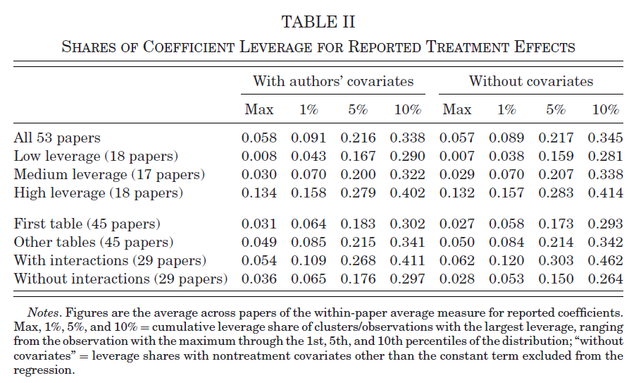
```

## Randomization inference: Monte Carlo

```{r , echo=F, out.width='70%', out.height='70%'}
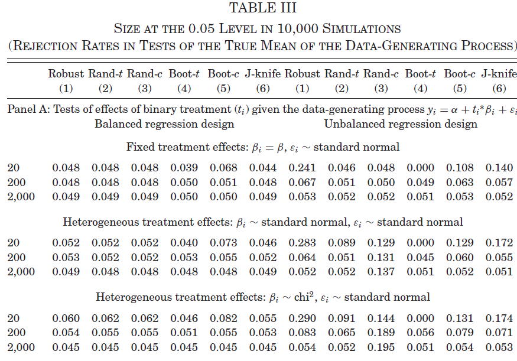
```

---

### Randomization inference: Monte Carlo

```{r , echo=F, out.width='70%', out.height='70%'}
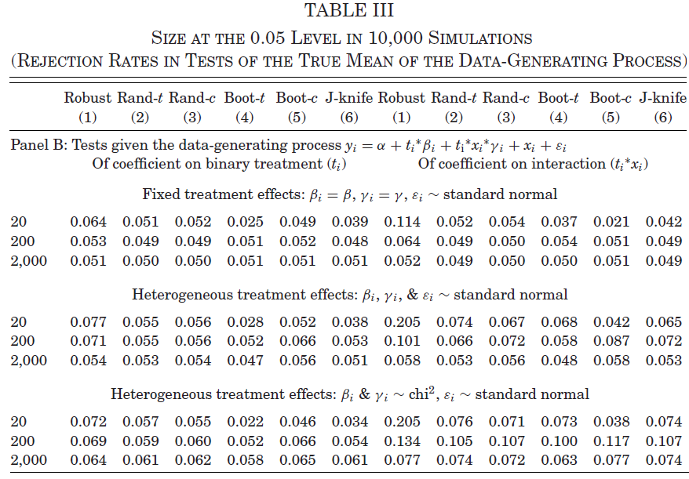
```

---

### Randomization inference: Monte Carlo

```{r , echo=F, out.width='70%', out.height='70%'}
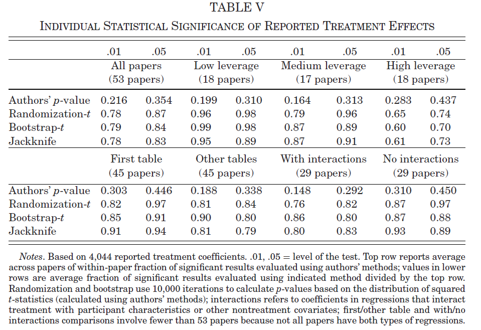
```


# Multiple hypothesis testing
## Multiple hypothesis testing

- Multiple testing arises whenever we test more than one null hypothesis at once.

- In applied micro, this naturally comes from:
  - **multiple outcomes**
  - **multiple treatments**
  - **multiple subgroups**
  - and, in observational work, often **multiple specifications** or **multiple treatment definitions**

::: {.fragment}
If we test each hypothesis separately at level $\alpha$, the probability of at least one false rejection rises with the number of tests.
:::

---

### Multiple Hypothesis Testing


If all $M$ nulls are true and tests are independent:
$$
\text{Family-wise Error Rate (FWER)} = 1 - (1-\alpha)^M
$$

::: {.fragment}
So with $\alpha=0.05$ and $M=20$:
$$
1 - 0.95^{20} \approx 0.64
$$
:::

::: {.fragment}
**Intuition:** with many chances to find significance, noise starts to look like signal.
:::

## A common problem

- In experiments, the family of hypotheses often comes from:

  - several outcomes
  - several treatment arms
  - subgroup heterogeneity

::: {.fragment}
- In observational studies, the same logic applies:

  - many outcomes
  - several treatment definitions
  - subgroup interactions
  - alternative control sets
  - different bandwidths, samples, or functional forms
  
:::

---

### Setup

A useful way to think about the size of the family is:
$$
M = J \times T \times G \times S
$$

where:

- $J$ = outcomes
- $T$ = treatment contrasts
- $G$ = subgroups
- $S$ = specifications

::: {.fragment}
The risk is not only “data mining” across outcomes; it is also inference after searching across design choices.
:::

## FWER vs FDR

### Family-wise error rate
$$
\text{FWER} = P(\text{at least one false rejection})
$$

- Strict criterion
- Best for **confirmatory** analysis
- Natural when one false positive is very costly

---

### False discovery rate
$$
\text{FDR} = E\left[\frac{V}{\max(R,1)}\right]
$$

where:

- $V$ = false rejections
- $R$ = total rejections

::: {.fragment}
- Less strict
- Better suited to **larger families**
- Trades some tolerance for false discoveries for higher power
:::

## Correction Methods

### Classical FWER corrections
- **Bonferroni**:$p_m^{adj} = \min(Mp_m,1)$
- **Holm**: step-down Bonferroni; weakly more powerful

::: {.fragment}
### FDR correction
- **Benjamini-Hochberg (BH)** controls the expected share of false discoveries among rejections
:::

::: {.fragment}
### Resampling-based FWER
- **Westfall-Young**
- **Romano-Wolf / List-Shaikh-Xu**
  - Use resampling to preserve the **dependence structure** across tests.
- They are much less conservative than Bonferroni when outcomes are correlated.

:::

## Observational studies

- The core multiplicity problem is the same, but there is an extra layer:

::: {.fragment}
- In an RCT, the family may come from outcomes, treatments, and subgroups.

- In an observational study, the family may also come from:

  - alternative identifying assumptions
  - different covariate sets
  - matching vs weighting vs regression adjustment
  - bandwidth or window choices
  - multiple event-study horizons
  
:::

::: {.fragment}
**Practical implication:** Even if the paper reports “one preferred specification,” readers should often think of the underlying family as much larger.
:::

## Practical guidance

:::{.smaller}
- For a **small, pre-specified, confirmatory family**:
  - prefer **FWER** control

::: {.fragment}
- For a **large family** with many related outcomes or treatment contrasts:
  - **FDR** is often more informative
:::

::: {.fragment}
- For subgroup analysis:
  - treat the subgroup exercise as a family of tests
  - do not interpret isolated significant interaction terms as standalone evidence
:::

::: {.fragment}
- For observational studies:
  - define the family explicitly
  - separate **primary estimands** from **robustness/specification checks**
  - report raw and adjusted inference
  
:::
:::


## Simple Simulation

::: {.smaller}
- This simulation mirrors a common applied setting with:
  - multiple outcomes
  - multiple treatment contrasts
  - subgroup analysis
  - and, in an observational extension, multiple specifications

::: {.fragment}
- We compare:
  - no correction
  - Bonferroni (FWER)
  - Holm (FWER)
  - Benjamini–Hochberg (BH / FDR)
:::

::: {.fragment}
- The point is to show the tradeoff:
  - **FWER** methods are stricter and reduce false positives more aggressively
  - **FDR** is looser and typically preserves more power
  
:::
:::


```{r, echo=FALSE, message=FALSE, warning=FALSE, results='asis', fig.width=9, fig.height=5}
suppressPackageStartupMessages({
  library(dplyr)
  library(tidyr)
  library(purrr)
  library(ggplot2)
  library(knitr)
  library(tibble)
})

set.seed(530)

simulate_once <- function(n = 1200, J = 5, K = 5, G = 3, rho = 0.5) {
  # K includes control: treatments are 0,1,2,3,4
  subgroup <- sample(1:G, size = n, replace = TRUE)
  treat <- sample(0:(K - 1), size = n, replace = TRUE)

  # Correlated outcomes
  f <- rnorm(n)
  U <- matrix(rnorm(n * J), nrow = n, ncol = J)
  Y <- sqrt(rho) * matrix(f, nrow = n, ncol = J) + sqrt(1 - rho) * U

  # Sparse true effects: treatment x outcome x subgroup
  true_eff <- array(0, dim = c(K - 1, J, G))
  true_eff[1, 1, 1] <- 0.35
  true_eff[1, 2, 1] <- 0.25
  true_eff[2, 3, 2] <- 0.30
  true_eff[3, 4, 3] <- 0.25
  true_eff[4, 5, 1] <- 0.20

  for (g in 1:G) {
    for (k in 1:(K - 1)) {
      idx <- subgroup == g & treat == k
      if (any(idx)) {
        Y[idx, ] <- sweep(Y[idx, , drop = FALSE], 2, true_eff[k, , g], `+`)
      }
    }
  }

  dat <- as.data.frame(Y)
  names(dat) <- paste0("y", 1:J)
  dat$treat <- factor(treat, levels = 0:(K - 1))
  dat$subgroup <- factor(subgroup)

  # Observational-style covariates to create multiple specifications
  dat$x1 <- rnorm(n)
  dat$x2 <- rnorm(n)

  tests <- purrr::map_dfr(1:G, function(g) {
    dg <- dplyr::filter(dat, subgroup == g)

    purrr::map_dfr(1:J, function(j) {
      yname <- paste0("y", j)

      # Spec 1
      fit1 <- lm(stats::as.formula(paste0(yname, " ~ treat + x1")), data = dg)
      ct1 <- summary(fit1)$coef

      out1 <- tibble::tibble(
        subgroup = paste0("G", g),
        outcome = yname,
        treatment = paste0("T", 1:(K - 1)),
        spec = "Spec 1",
        p = ct1[paste0("treat", 1:(K - 1)), "Pr(>|t|)"],
        nonnull = true_eff[, j, g] != 0
      )

      # Spec 2
      fit2 <- lm(stats::as.formula(paste0(yname, " ~ treat + x1 + x2")), data = dg)
      ct2 <- summary(fit2)$coef

      out2 <- tibble::tibble(
        subgroup = paste0("G", g),
        outcome = yname,
        treatment = paste0("T", 1:(K - 1)),
        spec = "Spec 2",
        p = ct2[paste0("treat", 1:(K - 1)), "Pr(>|t|)"],
        nonnull = true_eff[, j, g] != 0
      )

      dplyr::bind_rows(out1, out2)
    })
  })

  tests |>
    dplyr::mutate(
      raw = p,
      bonferroni = stats::p.adjust(p, method = "bonferroni"),
      holm = stats::p.adjust(p, method = "holm"),
      bh = stats::p.adjust(p, method = "BH")
    ) |>
    tidyr::pivot_longer(
      cols = c(raw, bonferroni, holm, bh),
      names_to = "method",
      values_to = "p_adj"
    ) |>
    dplyr::mutate(reject = p_adj < 0.05)
}

R <- 250
sim_results <- purrr::map_dfr(1:R, ~simulate_once(), .id = "rep")

sim_summary <- sim_results |>
  dplyr::group_by(rep, method) |>
  dplyr::summarise(
    true_rejections = sum(reject & nonnull),
    false_rejections = sum(reject & !nonnull),
    any_false_rejection = as.integer(false_rejections > 0),
    fdp = ifelse(sum(reject) == 0, 0, false_rejections / sum(reject)),
    .groups = "drop"
  ) |>
  dplyr::group_by(method) |>
  dplyr::summarise(
    `Avg. true rejections` = mean(true_rejections),
    `Avg. false rejections` = mean(false_rejections),
    `Pr(any false rejection)` = mean(any_false_rejection),
    `Avg. FDP` = mean(fdp),
    .groups = "drop"
  ) |>
  dplyr::mutate(
    Method = dplyr::recode(
      method,
      raw = "No correction",
      bonferroni = "Bonferroni",
      holm = "Holm",
      bh = "BH (FDR)"
    )
  ) |>
  dplyr::select(
    Method,
    `Avg. true rejections`,
    `Avg. false rejections`,
    `Pr(any false rejection)`,
    `Avg. FDP`
  )

plot_dat <- sim_summary |>
  tidyr::pivot_longer(
    cols = c(`Avg. true rejections`, `Avg. false rejections`),
    names_to = "type",
    values_to = "value"
  ) |>
  dplyr::mutate(
    type = dplyr::recode(
      type,
      `Avg. true rejections` = "True rejections",
      `Avg. false rejections` = "False rejections"
    )
  )

sim_plot <- ggplot(plot_dat, aes(x = Method, y = value, fill = type)) +
  geom_col(position = "dodge") +
  labs(
    x = NULL,
    y = "Average number of rejections",
    fill = NULL,
    title = "Simulation: power vs. false positives"
  ) +
  theme_minimal(base_size = 16) +
  theme(legend.position = "bottom")
```

## Simulation Summary: Truth vs. Methods

**Design**

- Total tests: $120 = 5 \times 4 \times 3 \times 2$  
- True effects: **5**  
- True nulls: **115**


```{r, echo=FALSE, message=FALSE}
# Create concise table with implied missed detections
summary_table <- sim_summary |>
  dplyr::mutate(
    `Missed true effects` = 5 - `Avg. true rejections`
  ) |>
  dplyr::select(
    Method,
    `Avg. true rejections`,
    `Missed true effects`,
    `Avg. false rejections`,
    `Pr(any false rejection)`
  )

knitr::kable(summary_table, digits = 2)
```


```{r, echo=FALSE, message=FALSE, warning=FALSE, results='asis', fig.width=9, fig.height=5}

# Emit another new slide with the figure
cat("\n\n## Simulation Results: Figure\n\n")
cat("FWER methods reduce false positives more aggressively; BH/FDR usually retains more power.\n\n")
print(sim_plot)
```


## Interpretation

**No correction**<br>
Recovers more of the 5 true effects
But falsely rejects many of the 115 nulls
→ Not credible inference


::: {.fragment}
**Bonferroni / Holm (FWER)**<br>
Very few (often zero) false rejections
But misses many true effects
→ Low power (high Type II error)
:::

::: {.fragment}
**BH (FDR)**<br>
Recovers more true effects
Allows some false positives, but controls their proportion
→ Best balance in high-dimensional settings
:::

---

### Bottom line

Many tests + few true effects ⇒ hard inference problem

FWER: minimize any mistake → conservative

FDR: allow some mistakes → recover signal

→ In large families (outcomes × subgroups × specs), FDR is often the practical default

## R Implementations: Multiple Hypothesis Testing

```{r, message=FALSE, warning=FALSE, echo=TRUE}
# Core setup
set.seed(123)

n <- 500
dat <- data.frame(
  treat = rbinom(n, 1, 0.5),
  x1 = rnorm(n),
  x2 = rnorm(n)
)

# Five outcomes: some true effects, some nulls
dat$y1 <- 0.30 * dat$treat + 0.4 * dat$x1 + rnorm(n)
dat$y2 <- 0.20 * dat$treat + 0.3 * dat$x1 + rnorm(n)
dat$y3 <- 0.00 * dat$treat + 0.2 * dat$x2 + rnorm(n)
dat$y4 <- 0.00 * dat$treat + rnorm(n)
dat$y5 <- 0.15 * dat$treat + 0.2 * dat$x1 + rnorm(n)

outcomes <- paste0("y", 1:5)
```

---

```{r, message=FALSE, warning=FALSE, echo=TRUE}
# Estimate one model per outcome and collect raw p-values
fits_lm <- lapply(outcomes, function(y) {
  lm(stats::as.formula(paste0(y, " ~ treat + x1 + x2")), data = dat)
})

raw_p <- sapply(fits_lm, function(m) {
  summary(m)$coef["treat", "Pr(>|t|)"]
})

# Standard multiple-testing adjustments
mht_results <- data.frame(
  outcome = outcomes,
  raw_p = raw_p,
  bonferroni_p = stats::p.adjust(raw_p, method = "bonferroni"),
  holm_p = stats::p.adjust(raw_p, method = "holm"),
  bh_q = stats::p.adjust(raw_p, method = "BH")
)
```

---

```{r, message=FALSE, warning=FALSE, echo=FALSE}
knitr::kable(mht_results, digits = 4)
```

---

## `fixest` implemetation

```{r, message=FALSE, warning=FALSE, echo=TRUE}

library(fixest)

fits_feols <- lapply(outcomes, function(y) {
  feols(stats::as.formula(paste0(y, " ~ treat + x1 + x2")), data = dat)
})

raw_p_fixest <- sapply(fits_feols, function(m) {
  coeftable(m)["treat", "Pr(>|t|)"]
})

fixest_results <- data.frame(
  outcome = outcomes,
  raw_p = raw_p_fixest,
  holm_p = stats::p.adjust(raw_p_fixest, method = "holm"),
  bh_q = stats::p.adjust(raw_p_fixest, method = "BH")
)
```

---

```{r, message=FALSE, warning=FALSE, echo=FALSE}
knitr::kable(fixest_results, digits = 4)
```

<!-- ## Romano–Wolf for `fixest` Models: `wildrwolf` -->

<!-- ```{r, message=FALSE, warning=FALSE, echo=TRUE} -->
<!-- # remotes::install_github("s3alfisc/wildrwolf") -->
<!-- library(wildrwolf) -->

<!-- fit1 <- feols(y1 ~ treat + x1 + x2, data = dat) -->
<!-- fit2 <- feols(y2 ~ treat + x1 + x2, data = dat) -->
<!-- fit3 <- feols(y3 ~ treat + x1 + x2, data = dat) -->

<!-- rwolf( -->
<!--   models = list(fit1, fit2, fit3), -->
<!--   param = "treat", -->
<!--   B = 500 -->
<!-- ) -->
<!-- ``` -->

<!-- ## Westfall–Young for `fixest` Models: `wildwyoung` -->

<!-- ```{r, message=FALSE, warning=FALSE, echo=TRUE} -->
<!-- # remotes::install_github("s3alfisc/wildwyoung") -->
<!-- library(wildwyoung) -->

<!-- wyoung( -->
<!--   models = list(fit1, fit2, fit3), -->
<!--   param = "treat", -->
<!--   B = 500 -->
<!-- ) -->
<!-- ``` -->
