```{r, setup, include = F}
# devtools::install_github("dill/emoGG")
library(pacman)
p_load(
  broom, tidyverse, 
  ggplot2, ggthemes, ggforce, ggridges, scales, 
  latex2exp, viridis, extrafont, gridExtra, 
  kableExtra, snakecase, janitor,xtable, 
  data.table, dplyr, 
  lubridate, knitr, 
  estimatr, here, magrittr, 
  MASS,glmnet,
  parsnip,titanic
)
# Define pink color
blue <- "#0073e6"
turquoise <- "#20B2AA"
orange <- "#FFA500"
red <- "#fb6107"
blue <- "#0073e6"
green <- "#006400"
grey_light <- "grey70"
grey_mid <- "grey50"
grey_dark <- "grey20"
purple <- "#006400"
slate <- "#314f4f"
# Dark slate grey: #314f4f
# Knitr options
opts_chunk$set(
  comment = "#>",
  fig.align = "center",
  fig.height = 7,
  fig.width = 10.5,
  warning = F,
  message = F
)
opts_chunk$set(dev = "svg")
options(device = function(file, width, height) {
  svg(tempfile(), width = width, height = height)
})
options(crayon.enabled = F)
options(knitr.table.format = "html")

# Column names for regression results
reg_columns <- c("Term", "Est.", "S.E.", "t stat.", "p-Value")
# Function for formatting p values
format_pvi <- function(pv) {
  return(ifelse(
    pv < 0.0001,
    "<0.0001",
    round(pv, 4) %>% format(scientific = F)
  ))
}
format_pv <- function(pvs) lapply(X = pvs, FUN = format_pvi) %>% unlist()
# Tidy regression results table
tidy_table <- function(x, terms, highlight_row = 1, highlight_color = "black", highlight_bold = T, digits = c(NA, 3, 3, 2, 5), title = NULL) {
  x %>%
    tidy() %>%
    select(1:5) %>%
    mutate(
      term = terms,
      p.value = p.value %>% format_pv()
    ) %>%
    kable(
      col.names = reg_columns,
      escape = F,
      digits = digits,
      caption = title
    ) %>%
    kable_styling(font_size = 20) %>%
    row_spec(1:nrow(tidy(x)), background = "white") %>%
    row_spec(highlight_row, bold = highlight_bold, color = highlight_color)
}
```

# Schedule
## Last time

- Design and analysis of randomized experiments

## Today

- Machine learning and econometrics

::: {.footnote}
These notes largely follow notes from [Athey & Imbens 2019](https://www.annualreviews.org/doi/abs/10.1146/annurev-economics-080217-053433) and 
[James, Witten, Hastie & Tibshirani (2017)](https://www.statlearning.com/).
:::

## Upcoming

- Exam 5/4 (Monday) 4:40PM - 6:30PM Boucke Bldg 323

# Machine Learning

## Readings

- [Athey & Imbens (2019)](https://www.annualreviews.org/doi/abs/10.1146/annurev-economics-080217-053433)
- [Mullanaithan & Speiss (2017)](https://pubs.aeaweb.org/doi/pdfplus/10.1257/jep.31.2.87)
- [James, Witten, Hastie & Tibshirani (2017)](https://www.statlearning.com/) [New version out](https://hastie.su.domains/ISLR2/ISLRv2_website.pdf)
- [Hastie, Tibshirani & Friedman (2017)](https://web.stanford.edu/~hastie/ElemStatLearn/)

## Researchers
- [Susan Athey](https://athey.people.stanford.edu/)
- [Victor Chernozhukov](http://www.mit.edu/~vchern/)


# Machine learning basics
## Machine learning basics

::: {.smaller}
Machine learning (ML) techniques have become very popular in statistics, data science and computer science.

There has been a slower rate of adoption in economics, though it is picking up steam.  Why do you think that is?

::: {.fragment}
Economics focuses on causal interpretation of parameters, whereas many ML techniques have focused on prediction.

Sometimes these coincide, but often they don't.  As more econometricians have spent time on ML techniques there have been developments to use ML techniques in the goal of causal inference.
:::

::: {.fragment}
Additionally, there are times when prediction absent of causality is an important component of economic analysis, so the use of ML in economics is only likely to grow.
:::
:::

## Lingo

In our class we will maintain the language of econometrics as much as possible, but as you read ML papers it's helpful to know some of the common language.

- estimating sample => training sample
- estimate a model => train a model
- regressors/covariates/predictors => features
- parameters => weights
- discrete response => classification
- supervised learning: observe both predictors and outcomes
- unsupervised learning: observe only predictors and attempt to group observations into clusters


## Model accuracy

James et al. (2017) introduce the need for model accuracy as follows:

> Why is it necessary to introduce so many different statistical learning approaches, rather than just a single best method? There is no free lunch in statistics: no one method dominates all others over all possible data sets.

More generally, ML focuses on prediction as opposed to causal identification.  This requires metrics of what constitutes 'good' prediction, or accurate models.

---

### Goodness of fit

::: {.smaller}
In regression a commonly used goodness of fit is the **mean squared error (MSE)**, which communicates how far the predicted outcomes deviate from the actual outcomes.

$$\text{MSE} = \frac{1}{N} \sum_{i=1}^N (y_i - \hat{f}(x_i))^2$$

where $\hat{f}(x_i)$ is the predicted value for observation $i$ based on covariate values $x_i$.

In economics we typically use all the data to generate the MSE and might compare a couple different specifications.

In ML the goal is prediction so we want to estimate $\hat{f}(x_i)$ on one sample (training sample) and then generate the MSE in another sample (validation/testing sample).  This better fits the goal of *out-of-sample* prediction.
:::

---

### Model accuracy

Let's formalize this point by distinguishing two variants of the MSE.  First we'll divide the sample in half.

- $i = 1,..,N/2$ is the training sample
- $i = N/2 + 1,...,N$ is the validation or testing sample

We will estimate $\hat{f}(x_i)$ using only observations $i = 1,..,N/2$.  We could calculate the $\text{MSE}_{train}$ as 

$$\text{MSE}_{train} = \frac{1}{N/2} \sum_{i=1}^{N/2} (y_i - \hat{f}(x_i))^2$$

--- 

### Model accuracy
However, this may not be informative for algorithms (such as regression) that were specifically designed to minimize the $\text{MSE}_{train}$.  

A more informative measure of model accuracy when the goal is prediction is $\text{MSE}_{test}$

$$\text{MSE}_{test} = \frac{1}{N/2} \sum_{i=N/2+1}^{N} (y_i - \hat{f}(x_i))^2$$

where $\hat{f}(x_i)$ is generated only on the training data and 

$\hat{f}(x_i) \: \forall \: i = N/2 + 1,...,N$ are out-of-sample predictions.

---

### Model accuracy

::: {.smaller}
Does this matter in practice?  Aren't $\text{MSE}_{train}$ and $\text{MSE}_{test}$ likely to be similar?
:::

::: {.fragment .smaller}
Not always - especially when there are concerns about overfitting.
```{r, eval=T, include=T, echo=F, out.width='75%'}
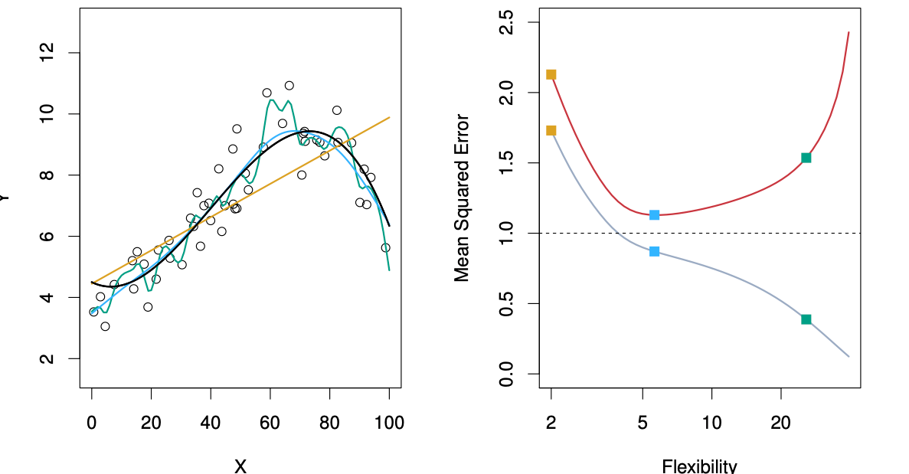
```
:::

::: {.tiny .fragment}
- Figure from [Introduction to Statistical Learning](https://www.statlearning.com/).
- Left: Black line = DGP; three estimators: linear regression and two smoothing splines. Right: $\color{grey}{\text{MSE}_{train}}$ and $\color{red}{\text{MSE}_{test}}$
:::

## Bias-variance tradeoff

::: {.smaller}
Now let's refer to observations in the training/estimation data as $x_i \: \forall \: i=1,...N$ and a test/validation data point where $i=0$ and the covariates for this out-of-sample observation are $x_0$.

Therefore, the out-of-sample prediction is written as $\hat{f}(x_0)$.

The MSE for $\hat{f}(x_0)$ can be decomposed into three parts:

1. the variance of $\hat{f}(x_0)$
1. the bias of $\hat{f}(x_0)$
1. the variance of the error term $\epsilon$ where $\epsilon_i = y_i = \hat{f}(x_i)$

$$E[(y_0 - \hat{f}(x_0))^2] = \text{Var}(\hat{f}(x_0)) + [\text{Bias}(\hat{f}(x_0))]^2 + \text{Var}(\epsilon)$$
where $E[(y_0 - \hat{f}(x_0))^2]$ is the *expected* test MSE.
:::

---

### Bias-variance tradeoff

Ideally we have a predictor with low bias and low variance.  We can't control the last term - it is the underlying variability of the data and that is the optimal level of MSE that we can aim for.

What is the variance of the predictor $\hat{f}$?

::: {.fragment}
You can consider the variance of $\hat{f}$ as the change in $\hat{f}$ as we change the training sample.  Ideally we want $\hat{f}$ to be stable - we get similar predictions for a given covariate $x_0$ for a lot of different training samples.  

If we get wildly different predictions than $\hat{f}$ has high variance.

Generally more flexible methods have **higher** variance.
:::

---

### Bias-variance tradeoff

What is the bias of the predictor $\hat{f}$?

This is incorrectly modelling the fundamental data generating process.

In our parlance of omitted variable bias, a linear model that attempts to model a data-generating process that is in fact quadratic, is biased.  It is omitting the quadratic term.

Generally, more flexible methods have **less** bias.


---

### Bias-variance tradeoff

```{r, eval=T, include=T, echo=F, out.width='85%'}

```
::: {.tiny}
Figure from [Introduction to Statistical Learning](https://www.statlearning.com/) 
:::

---

### Bias-variance tradeoff

```{r, eval=T, include=T, echo=F, out.width='85%'}
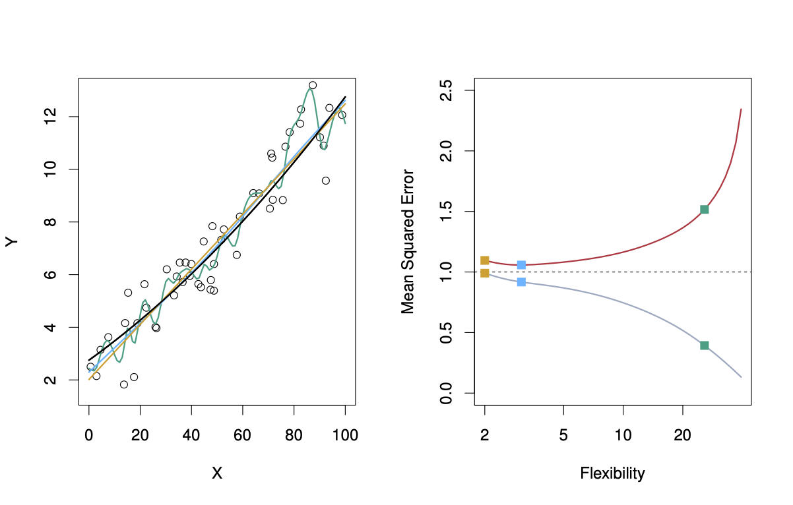
```
::: {.tiny}
Figure from [Introduction to Statistical Learning](https://www.statlearning.com/) 
:::

---

### Bias-variance tradeoff

```{r, eval=T, include=T, echo=F, out.width='85%'}
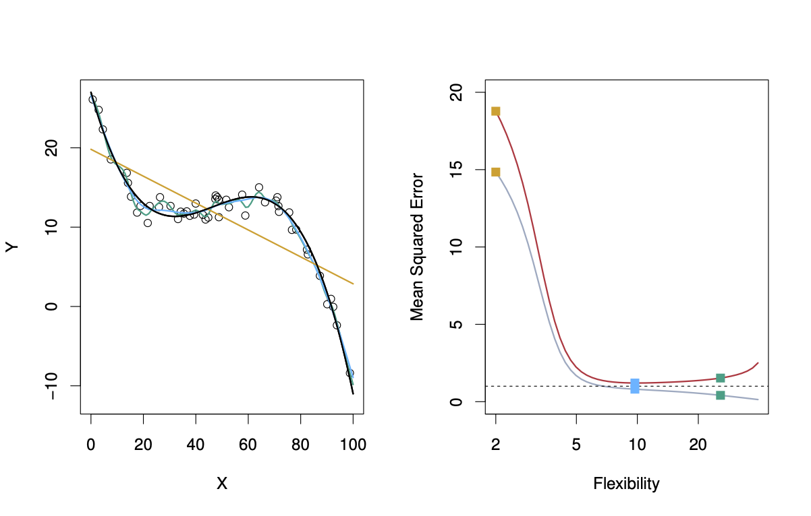
```
::: {.tiny}
Figure from [Introduction to Statistical Learning](https://www.statlearning.com/) 
:::

---

### Bias-variance tradeoff

```{r, eval=T, include=T, echo=F, out.width='85%'}
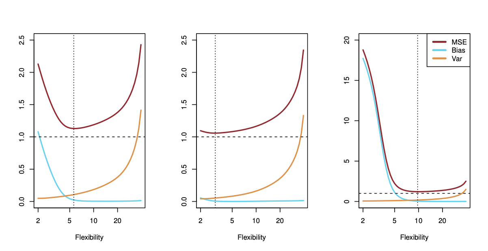
```
::: {.tiny}
Figure from [Introduction to Statistical Learning](https://www.statlearning.com/) 
:::

---

### Bias-variance tradeoff

In general we do not observe the true DGP $f$ so we cannot decompose the bias and variance components of the MSE.

However, the bias-variance tradeoff is important to consider when choosing between different methods and consider the challenge of overfitting the data.  As James et al. (2017) note:

::: {.smaller}

> *To take an extreme example, suppose that the true f is linear. In this situation linear regression will have no bias, making it very hard for a more flexible method to compete. In contrast, if the true f is highly non-linear and we have an ample number of training observations, then we may do better using a highly flexible approach*

:::


## Classification

The MSE is a useful metric for numerical outcome data, but is not appropriate for categorical data (classification problems).

One metric to minimize in classification settings is the error rate, which is simply an indicator for an incorrect prediction.

$$\text{Error rate} = \frac{1}{N} \sum_{i=1}^N \text(I)(y_i \neq \hat{y_i})$$

We similarly have training and test versions of this metric, and alternative metrics for different methods.


## Cross validation

What is cross validation (CV)?

::: {.fragment}
The basics of cross validation use the insights of model accuracy that show model performance can be drastically different in and out of sample.

There are different methods of cross validation, but the basic approach is to divide the sample in some way and use some of the observations for estimating the model and the other set for assessing model accuracy or **model assessment**.

The observations that are not used in model estimation are called the validation set or hold-out set.  We perform model assessment on the out-of-sample observations that were explicitly excluded from the estimation sample.

:::

---

### Validation set approach

One precursor to CV is the **validation set approach**.  This is relatively simple.

Step 1. Randomly divide the sample (maybe in half)

Step 2. Estimate the model using the training sample

Step 3. Estimate model accuracy (e.g. MSE) in the validation sample to get an *estimate* of the test MSE

If you run a variety of models in the training sample you can assess their performance based on their relative MSEs in the validation sample.

You can repeat this process by iterating steps 1-3 so you get a range of estimates of the test MSE.

---

### Validation set approach

```{r, eval=T, include=T, echo=F, out.width='95%'}
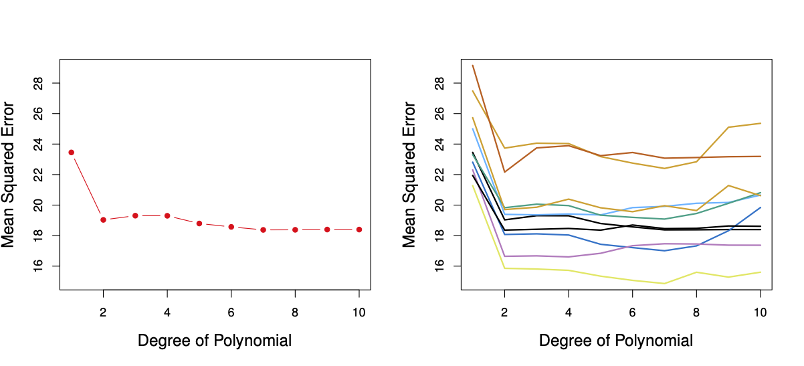
```
::: {.tiny}
Figure from [Introduction to Statistical Learning](https://www.statlearning.com/)

Left: Average $\text{MSE}_{test}$ by order of polynomial.

Right: $\text{MSE}_{test}$ by order of polynomial by 10 sample splits.
:::

---

### Validation set approach

There are two main limitations of the validation set approach.

1. The test MSE can vary substantially across random draws of the estimation/validation samples.
1. Models are noisier with less data so we likely overestimate the test MSE.


---

### Leave-one-out CV (LOOCV)

Another form of cross validation is **leave-one-out CV (LOOCV)**, where the estimation sample is all but one observation, and the out-of-sample prediction is performed on one observation at a time.  

In a single iteration the model performance is better because it uses $N-1$, instead of $N/2$, observations. However, the test MSE based on a single out-of-sample prediction is worse.  To overcome this problem LOOCV is performed $N$ times leading to:

$$CV_{(N)} = \frac{1}{N} \sum_{i=1}^N \text{MSE}_i$$

---

### Leave-one-out CV (LOOCV)

One challenge with LOOCV is that it can be computationally intensive: we need to run the model $N$ times!

There is a shortcut for regression that allows us to calculate this with only one model run by exploiting the residuals and the *leverage statistic* $(h_i)$.

$$CV_{(N)} = \frac{1}{N} \sum_{i=1}^N \left( \frac{y_i - \hat{y_i}}{1-h_i} \right)^2$$

Leverage is a measure of an individual observations role on model parameters. It is defined as: $h_i = \frac{1}{N} + \frac{(x_i - \bar{x})^2}{\sum_{i'=1}^N x_i' - \bar{x})^2}$ 

---

### k-fold CV 

Another version of CV is called **k-fold CV**, which is similar to LOOCV.  

k-fold CV randomly divides the data up into $k$ equal segments and then treats $k-1$ segments as the estimation sample and the $k^{th}$ segment as the validation sample. This process is repeated $k$ times.

$$CV_{(k)} = \frac{1}{k} \sum_{i=1}^k \text{MSE}_i$$

LOOCV is a special case of k-fold CV where $k=n$.  The main disadvantage of k-fold CV is computational for models that take a long time to run.

---

## Bias-variance tradeoff in cross validation

LOOCV has low bias of the test MSE because it performs the procedure $n$ times and uses all the $n-1$ observations in the estimation sample.

However, since each estimation sample is almost exactly the same all the individual $\text{MSE}_{test,i}$ will be highly correlated with each other.

By contrast k-fold CV will have estimation samples that are less correlated with each other, and therefore have lower variance.

This leads to a bias-variance tradeoff in k-fold CV.  In practice $k=\{5,10\}$ have shown to offer good balance between bias and variance.

::: {.footnote}
**Note:** Means based on highly correlated observations have higher variance than means of less correlated observations.
:::

---

### Bias-variance tradeoff in cross validation

```{r, eval=T, include=T, echo=F, out.width='95%'}
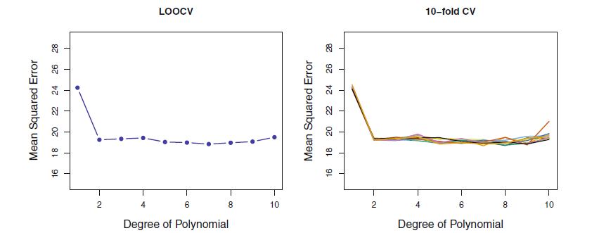
```
::: {.tiny}
Figure from [Introduction to Statistical Learning](https://www.statlearning.com/)
:::


## Ensemble methods

**Ensemble methods** incorporate multiple models to generate predictions  This is also called **model averaging.**

In many situation a single method may not perform as well as a combination of methods.

**Example:** [Netflix Prize](https://www.netflixprize.com/) challenged researchers to most accurately predict users movie preferences.  The grand prize winners and all the top contenders used ensemble methods as opposed to a single method.

---

### Ensemble methods

A corollary in conventional econometrics is Bayesian model averaging (BMA).  

BMA Markov Chain Monte Carlo Model Composition algorithm randomly adds variables and then assesses the model performance with and without the variable (via model posterior distribution). All possible models are weighted by the posterior model probabilities, so models that occur more often receive more weight.

BMA can be estimated in `R` with the `BMS` and `BMA` packages.  


## Bayesian model averaging

```{r, eval=T, include=T, echo=F, out.width='50%', out.height='50%'}
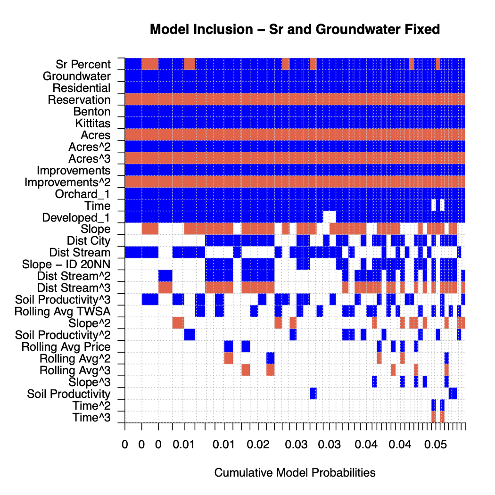
```
::: {.tiny}
Figure from [Brent (2017)](https://onlinelibrary.wiley.com/doi/abs/10.1093/ajae/aaw057) 
:::

## Ensemble methods

::: {.smaller}
The primary distinction between ML ensemble methods and BMA is that BMA is more similar to variable selection.  The basic model is the same and different subsets of variables are selected and estimated.  

A common ML approach is to take different types of models that have distinct strengths and weaknesses.  

For example, consider predictions from OLS $(\hat{y}_i^{OLS})$, LASSO $(\hat{y}_i^{LASSO})$ and random forest $(\hat{y}_i^{RF})$. An ensemble approach will generate weights for each of the predictions by minimizing the out of sample prediction error, where $\rho^{OLS}$, $\rho^{LASSO}$, and $\rho^{RF}$ are weights assigned to each model:

$$(\hat{\rho}^{OLS},\hat{\rho}^{LASSO},\hat{\rho}^{RF}) = \underset{\rho^{OLS}, \rho^{LASSO} \rho^{RF}}{\text{argmin}} \sum_{i=1}^{N_{test}} \left[ y_i -  \left( \rho^{OLS} \hat{y_i}^{OLS} + \rho^{LASSO} \hat{y_i}^{LASSO} + \rho^{RF} \hat{y_i}^{RF} \right) \right]^2$$
subject to $\rho^{OLS}+ \rho^{LASSO} + \rho^{RF}=1$ and $\rho^{OLS}, \rho^{LASSO}, \rho^{RF} \geq 0$ 
:::


# Regularized regression 

## What is regularization?
Regularization has the goal of creating sparse models - or models that contain the most important information from a set of candidate predictors.

This is particularly important in big data settings where there are a lot of potential predictors.  A special case is where the number of predictors, $p$, is greater than the number of observations $N$.

While you may not think there are many economic applications where $p>N$, you can also consider *technical transformations* of regressors.  For, example you can consider higher order terms, binned variables, and interactions as technical transformations that can quickly expand the number of potential predictors.

---

### What is regularization?

In practice regularization **shrinks** the number of covariates used to zero by imposing a penalty on adding additional parameters.  

Some methods shrink coefficients close to zero and others shrink them exactly to zero, so regularization can be considered a data-driven variable selection method.

Regularization for sparsity use penalty terms referred to as $\ell_k$ norms, which refer to how parameters are penalized.
- $\ell_0$ penalizes the number of non-zero parameters
- $\ell_1$ penalizes the absolute value of the magnitude of all parameters
- $\ell_2$ penalizes the squared magnitude of all parameters

$\text{Note}$: Unlike OLS, regularized regression (beyond $\ell_0$) is not scale-invariant. Income in dollars vs. thousands of dollars will affect the penalty term and therefore it is common practice to standardize covariates.

## Ridge Regression

Recall that OLS parameters solve the following minimization problem:

$$\hat{\beta}^{OLS} = \underset{\beta}{\text{argmin}} \sum_{i=1}^N (y_i - \sum_{j=1}^p \beta_j x_{ij})^2$$

Ridge regression augments this minimization problem with an $\ell_2$ penalty term.

$$\hat{\beta}^{R} = \underset{\beta}{\text{argmin}} \sum_{i=1}^N (y_i - \sum_{j=1}^p \beta_j x_{ij})^2 + \lambda \sum_{j=1}^p \beta_j^2$$

where $\lambda$ is a *tuning* parameter that adjusts the degree of the *shrinkage penalty* $\lambda \sum_{j=1}^p \beta_j^2$

---

### Ridge Regression

$\lambda$ is estimated separately from $\beta$, and typically there will be a different set of $\beta$ parameters for each value of $\lambda$.

$\lambda$ is typically chosen based on cross validation for different values of $\lambda$.

The advantage of ridge regression over OLS lies in the bias variance tradeoff.  With many possible coefficients the probability of overfitting increases.  Penalizing additional parameters may increase bias, but it will decrease variance.

$\text{Note}_1$: When $\lambda=0$ $\beta^R = \beta^{OLS}$, and when $\lambda \rightarrow \infty$ all the coefficients will shrink to zero.

$\text{Note}_2$: In practice we do not shrink the intercept term.

---

### Ridge Regression

```{r, eval=T, include=T, echo=F, out.width='95%'}
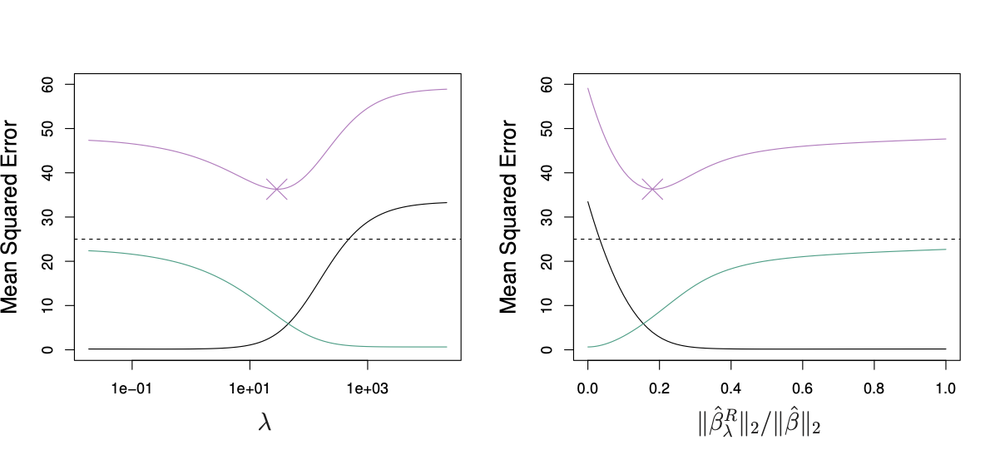
```
::: {.tiny}
Squared bias (black), variance (green), and test mean squared error (purple) for the ridge regression predictions on a simulated data set. Figure from [Introduction to Statistical Learning](https://www.statlearning.com/) 
:::

## LASSO

One downside of ridge regression is that it includes all predictors in the final model - many of the regressors will shrink close to zero but not to zero exactly.

This is not a problem for prediction, but does present challenges for interpretation - which is often the goal in economic applications.

The **least angular shrinkage and selection operator (LASSO)** addresses this limitation of ridge regression by conducting a similar minimization problem with an $\ell_1$ penalty.

$$\hat{\beta}^{L} = \underset{\beta}{\text{argmin}} \sum_{i=1}^N (y_i - \sum_{j=1}^p \beta_j x_{ij})^2 + \lambda \sum_{j=1}^p |\beta_j|$$

---

### LASSO

Similar to ridge regression, LASSO shrinks parameters towards zero.  However, unlike ridge regression with large enough $\lambda$ LASSO shrink some parameters exactly to zero and thus functions as a variable selection tool.

Similar to ridge regression $\lambda$ is typically chosen through cross validation.

The LASSO and ridge regression can be reformulated as the standard least squares optimization problem subject to the following constraints:

LASSO: $\sum_{j=1}^p |\beta_j| \leq s$

ridge regression: $\sum_{j=1}^p \beta_j^2 \leq s$

where $s$ is a unique value the depends on the tuning parameter $\lambda$.  The differences are most clearly seen graphically.


## LASSO vs. Ridge Regression

```{r, eval=T, include=T, echo=F, out.width='95%'}
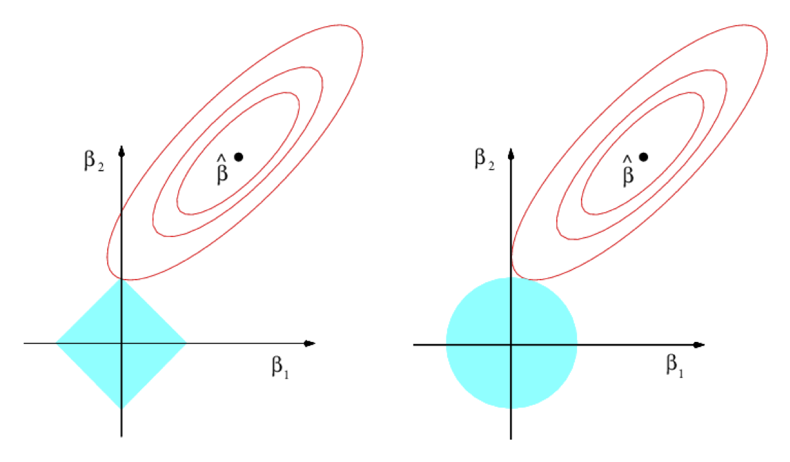
```

::: {.tiny}
Contours of the error and constraint functions for the lasso (left) and ridge regression (right). The solid blue areas are the constraint regions, $|\beta_1| + |\beta_2| \leq s$ and $\beta_1^2 + \beta_2^2 \leq 2$, while the red ellipses are the contours of the RSS. Figure from [Introduction to Statistical Learning](https://www.statlearning.com/) 
:::


## Elastic net

::: {.smaller}
There are advantages and disadvantages of both LASSO and ridge regression.  This primarily depends on the data generating process.

If the process indeed has many zero terms, then LASSO is preferred  If the DGP is sparse, but a lot of variables have very small predictive power then ridge regression performs better.

[Zou & Hastie (2005)](https://rss.onlinelibrary.wiley.com/doi/full/10.1111/j.1467-9868.2005.00503.x) developed the **elastic net**, which is a weighted average of both $\ell_1$ and $\ell_2$ penalty terms:

$$\lambda \sum_{j=1}^p \left(\alpha \beta_j^2 + (1-\alpha)|\beta_j| \right)$$
where $\alpha$ is a parameter between zero and one and (surprise) can be chosen with cross validation.

The elastic net selects variables like LASSO and shrinks them like ridge regression.
:::


## Simulation: Ridge vs. LASSO

::: {.smallest}
**Dataset 1:**

- lots of noise, little signal
- DGP: $N=1000$; $p=5000$; $\beta_j= \underbrace{1,...,1,}_\text{15}  \underbrace{0,...,0}_\text{4985}$; iid
:::

::: {.smallest}
**Dataset 2:**

- lots of noise, lots of signal
- DGP: $N=1000$; $p=5000$; $\beta_j= \underbrace{1,...,1,}_\text{1500}  \underbrace{0,...,0}_\text{3500}$; iid
:::

::: {.smallest}
**Dataset 3:**

- lots of noise, varying signal, correlated regressors
- DGP: $N=1000$; $p=500$; $\beta_j= \underbrace{10,...,10,}_\text{20}  \underbrace{5,...,5,}_\text{20} \underbrace{1,...,1}_\text{100};  \underbrace{0,...,0}_\text{320}$; $\rho=0.7$
:::

## Simulation: Create the data and divide the sample
```{r, include = T, eval=T, echo=T, cache=T}
#####  Example 1 - lots of noise #####
set.seed(19875)  # Set seed for reproducibility
n <- 1000  # Number of observations
p <- 5000  # Number of predictors included in model
real_p <- 15  # Number of true predictors
x <- matrix(rnorm(n*p), nrow=n, ncol=p)
y <- apply(x[,1:real_p], 1, sum) + rnorm(n)

# Split data into train (2/3) and test (1/3) sets
train_rows <- sample(1:n, .66*n)
x.train <- x[train_rows, ]
x.test <- x[-train_rows, ]

y.train <- y[train_rows]
y.test <- y[-train_rows]
```

---

### Simulation

Fit the data (for plots) and then perform 10-fold CV for different values of alpha
Note: in `glmnet` the weights are defined so $\alpha=0$ is ridge; $\alpha=1$ is LASSO.

```{r, include = T, eval=T, echo=T, cache=T}
# Fit models 
# (For plots on left):
fit.lasso <- glmnet(x.train, y.train, family="gaussian", alpha=1)
fit.ridge <- glmnet(x.train, y.train, family="gaussian", alpha=0)
fit.elnet <- glmnet(x.train, y.train, family="gaussian", alpha=.5)

# 10-fold Cross validation for each alpha = 0, 0.1, ... , 0.9, 1.0
# (For plots on Right)
for (i in 0:10) {
  assign(paste("fit", i, sep=""), cv.glmnet(x.train, y.train, type.measure="mse", 
                                            alpha=i/10,family="gaussian"))
}

```

---

### Simulation: Plot results

```{r, include = T, eval=F, echo=T,cache=T, out.width='80%', out.height='80%'}
# Plot solution paths:
par(mfrow=c(3,2))
# For plotting options, type '?plot.glmnet' in R console
plot(fit.lasso, xvar="lambda")
plot(fit10, main="LASSO")

plot(fit.ridge, xvar="lambda")
plot(fit0, main="Ridge")

plot(fit.elnet, xvar="lambda")
plot(fit5, main="Elastic Net")
```

---

```{r, include = T, eval=T, echo=F,cache=T, out.width='80%', out.height='80%'}
# Plot solution paths:
par(mfrow=c(3,2))
# For plotting options, type '?plot.glmnet' in R console
plot(fit.lasso, xvar="lambda")
plot(fit10, main="LASSO")

plot(fit.ridge, xvar="lambda")
plot(fit0, main="Ridge")

plot(fit.elnet, xvar="lambda")
plot(fit5, main="Elastic Net")
```

---

### Simulation: Assess Model Accuracy

```{r, include = T, eval=T, echo=T, cache=T}
### calculate test MSE
for (i in 0:10) {
  assign(paste("yhat", i, sep=""), predict(get(paste0('fit',i)), 
                                           s=get(paste0('fit',i))$lambda.1se,
                                           newx=x.test)
  )
  assign(paste0('mse',i),mean((y.test-get(paste0('yhat',i)))^2))
}

tab <- data.table(
 'alpha' = c('0 (Ridge)','.1','.2','.3','.4','.5','.6','.7','.8','.9','1 (LASSO)'),
  MSE = round(c(mse0,mse1,mse2,mse3,mse4,mse5,mse6,mse7,mse8,mse9,mse10),2)
)
```

---

### Assess Model Accuracy
::: {.smallest}
```{r, include = T, eval=T, echo=F, cache=T}
kable(tab,row.names = NA) %>%
  kable_styling(bootstrap_options = c("striped", "bordered"), full_width = F) %>%
  row_spec(11, color = 'red',bold=T)
```
:::

---

```{r, include = T, eval=T, echo=F, cache=T,results='asis'}
load('reg_regress_ex.RData')
example.tab
```


# Trees & forests
## Regression trees

Decision trees stratify the data into discrete groups and then the outcome is evaluated within those subgroups.  There are two primary types of decision trees:

1. Regression trees for continuous outcome data
2. Classification trees for discrete outcome data

We will primary work through the regression trees and then briefly discuss how the method can be applied for discrete data (classification).

---

### Regression trees

Regression trees split the data into distinct groups, called **leaves** and then prediction for a given observation is performed by taking the average (or mode) of all observations in the same leaf.

Formally, for all possible sets of the predictor space $X_1,...,X_p$, we create $J$ distinct and non-overlapping regions $R_1,...,R_J$.

The prediction in region $R_J$ is $\hat{y}_{R_j}=\frac{1}{N_{R_j}} \sum_{i \in R_j} y_i$, and regression trees minimize:

$$RSS = \sum_{j=1}^J \sum_{i \in R_j} (y_i - \hat{y}_{R_j})^2$$

---

### Regression trees

Splits can occur at any level of a covariate, so for a predictor with 100 unique values there can be 99 possible splits.  With more than a couple variables it becomes computationally intractable to evaluate all the potential partitions of the data.

To solve this problem regression trees are fitted using a *top-down*, *greedy* algorithm called **recursive binary splitting**.

- **top down:** splits start at the top of the tree and then successively continues splitting
- **greedy:** the best split is simply made at that step, as opposed to being forward-looking at all alternative future splits

---

### Regression trees

For any specific split, the algorithm considers two regions based on the value of a predictor.

- $R_1(j,s) = \{X|X_j < s\}$, where $s$ is the cutoff value, and
- $R_2(j,s) = \{X|X_j \geq s\}$.

A single split considers all possible values of all possible variables to minimize:

$$\sum_{i: x_i \in R_1(j,s)} (y_i - \hat{y_{R_1}})^2 + \sum_{i: x_i \in R_2(j,s)} (y_i - \hat{y_{R_2}})^2$$

---

### Regression trees: example

```{r, eval=T, include=T, echo=F, out.height='50%', out.width='50%'}
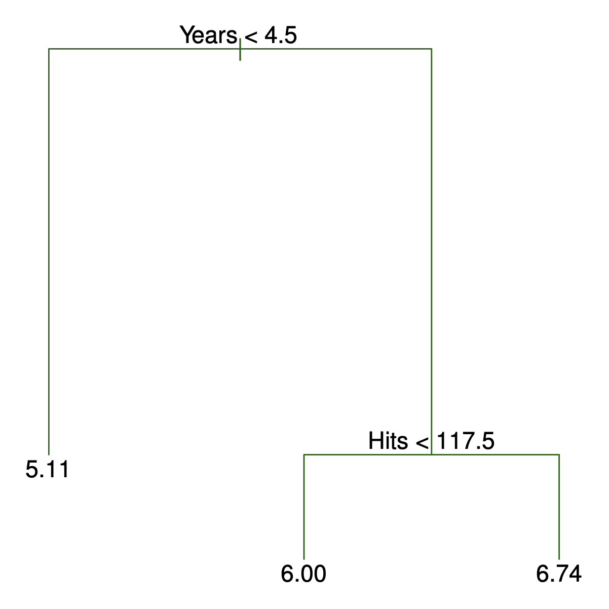
```
::: {.tiny}
Example of regression trees for predicting baseball players salaries. Figure from [Introduction to Statistical Learning](https://www.statlearning.com/) 
:::

---

### Regression trees: example

```{r, eval=T, include=T, echo=F, out.height='50%', out.width='50%'}
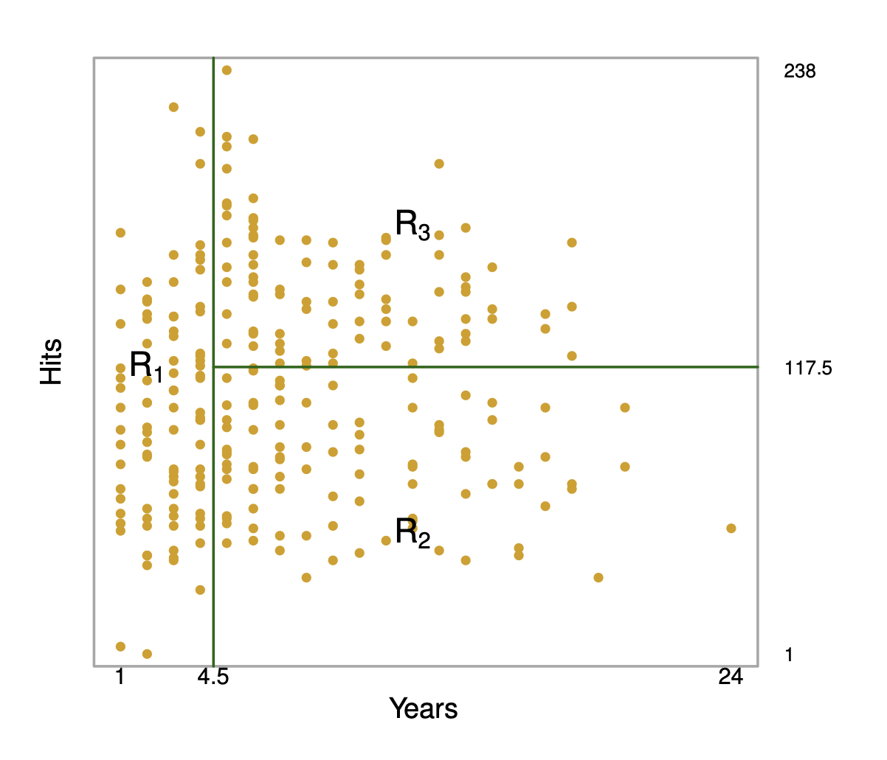
```
::: {.tiny}
Example of regression trees for predicting baseball players salaries. Figure from [Introduction to Statistical Learning](https://www.statlearning.com/) 
:::

---

### Pruning

Regression trees have a tendency to overfit the data. A way to deal with this problem is called **pruning** the tree.  

First we grow a very large tree $T_0$, and then we *prune* it to create a *subtree* that is a subset of the splits from $T_0$.

::: {.fragment}
How do we find the optimal subtree? 
:::

::: {.fragment}
Cross validation, right? 
:::

::: {.fragment}
Actually cross validation is too computationally expensive to examine all the possible subtrees, so we use a method called **cost complexity pruning** or **weakest link pruning**.
:::

---

### Pruning

Cost complexity pruning evaluates a distinct sequence of subtrees, which is determined by a tuning parameter $\alpha$.

Similar to the tuning parameter in regularized regression $\alpha$ penalizes more complex trees by adding a penalty term to the optimization given an initial tree $T_0$.

Formally, cost complexity pruning solves the minimization problem for $T \subset T_0$

$$\sum_{m=1}^M \sum_{i: x_i \in R_m} \ (y_i - \hat{y}_{R_m})^2 + \alpha|T|$$
where $|T|$ is the number of terminal nodes in tree $T$ and $\alpha$ is selected through cross validation.

---

### Regression trees

**Some advantages of regression trees:**

- easy to interpret
- may better mimic human behavior 
- graphical display of output

**Some disadvantages of regression trees:**

- typically not as accurate as regression or other methods
- sensitive to small changes in the data (not robust - high variance)

## Random forests 

::: {.smaller}
Random forests were developed to overcome the lack of predictive power of regression trees.

A precursor to random forests is called **bagging**, which is a form of bootstrap.  Bagging is a general method that is particularly helpful when applied to regression trees to reduce variance.

Typically bootstrapping is used in economics as an alternative to asymptotic theory to generate inference (standard errors).

Bagging resamples in order to get the average of the prediction.

Bagging for regression trees simply generates $B$ bootstrap samples and estimates an *unpruned* tree in each sample.  The unpruned trees will have *low bias* and *high variance*.

Averaging the predictions from all $B$ trees can drastically reduce the variance.
:::

---

### Random forests

::: {.smaller}
Random forests take a similar approach to bagging by generating regression trees in many bootstrapped samples (hence the name *forest*).

The advantage of random forests over bagging lies in a step to reduce the correlation of the individual trees.

At each split a random sample of $m$ predictors are used to generate the split, with standard practice as $m \approx \sqrt{p}$.

While using less information may seem counter-intuitive, the rationale lies in the recursive nature of the regression tree algorithm.

When there is one (or a few) very strong predictors these variables will generate splits at the top of the tree, which will alter subsequent splits based on other predictors that still are influential.  Considering a subset of variable can lead to different sequences of splits, which may have useful predictive power.
:::

## Classification

::: {.smallest}
Decision tree methods can be used for classification (discrete outcome data), and are called **classification trees**.

The prediction for each region in a classification tree is simply the most common outcome in that region.

The previously used *error rate* is not actually sensitive enough for use in classification trees so the **Gini Index** is often the minimized in practice:

$$G = \sum_{k=1}^K \hat{p}_{mk} (1-\hat{p}_{mk})$$

where $\hat{p}_{mk}$ is the proportion of observations in region $m$ that belong to class $k$.  This takes on small values when all $\hat{p}_{mk}$s are close to zero or one and is also called a measure of node *purity*.

Another methods used to optimize classification trees is entropy, defined as:

$$D = -\sum_{k=1}^K \hat{p}_{mk} log(\hat{p}_{mk})$$
:::

---

### Classification
[Grant McDermott](https://grantmcdermott.com/) came up with a nice `R` package to visualize classification trees called `parttree` which uses the `ggplot2` package.

I'll go through an example developed by [Paul van der Laken](https://paulvanderlaken.com/) posted to [R Bloggers](https://www.r-bloggers.com/visualizing-decision-tree-partition-and-decision-boundaries/), which is a nice resource if you were not already aware of it.

First let's install the package

```{r, chache=T, eval=T, echo=T, include=T, results='hide'}
# install.packages("remotes")
remotes::install_github("grantmcdermott/parttree")
library(parttree)
```

---

### Classification
```{r, chache=T, eval=T, echo=T, include=T, results='hide'}
set.seed(123) ## For consistent jitter

titanic_train$Survived = as.factor(titanic_train$Survived)

## Build our tree using parsnip (but with rpart as the model engine)
ti_tree =
  decision_tree() %>%
  set_engine("rpart") %>%
  set_mode("classification") %>%
  fit(Survived ~ Pclass + Age, data = titanic_train)
```

---

::: {.smaller}
```{r, chache=T, eval=T, echo=T, include=T, out.width='75%', out.heigh='75%'}
## Plot the data and model partitions
titanic_train %>%
  ggplot(aes(x=Pclass, y=Age)) +
  geom_jitter(aes(col=Survived), alpha=0.7) +
  geom_parttree(data = ti_tree, aes(fill=Survived), alpha = 0.1) +
  theme_minimal()
```
:::

# ML and causality
## Model Selection 

If we are using a conditional independence assumption (e.g. matching or regression) then we still have to make the decision about what variables to condition upon.

Often this is decided in an ad hoc manner or by evaluating in-sample goodness-of-fit measures.

Techniques such as LASSO make variable selection data driven, which has some merits. 

However, there researchers need to acknowledge that the algorthim is inherently introducing some bias in order to reduce variance.

Additionally, the assumptions that motivate LASSO or other shrinkage models is that the underlying DGP is at least approximately sparse.

---

### Model Selection

Consider an example: let's say that we're trying to estimate the effect job training on future incomes.

We have a lot of candidate regressors and decide to use LASSO.

Imagine that selection into the job training program is highly correlated with education. Conditional on including the treatment dummy, education may not add a lot of predictive power to earnings, and LASSO may shrink the coefficient to zero.

::: {.fragment}
Is this desireable? 
:::

::: {.fragment}
The short answer is: NO.
:::

---

### Model Selection

To understand why it's important to reconsider our formula for omitted variable bias.

Omitted variable bias is a function two criteria:

- the correlation of the omitted variable with the outcome
- the correlation of the omitted variable with treatment

[Belloni et al. 2014](https://www.aeaweb.org/articles?id=10.1257/jep.28.2.29) describe the pitfalls of using LASSO when the goal is causal inference.

---

### Model Selection

They suggest using a "post-double-selection" method.  The technical details are in [Belloni et al. 2014](https://academic.oup.com/restud/article-abstract/81/2/608/1523757), but the main insight is to run two LASSO models for variable selection.

1. $y_i = \gamma D_i + \beta X_i + \epsilon_i$
1. $D_i = \theta X_i + \psi_i$

The union of variables from **both** models are used in the final regression model.  This procedure will pick up all covariates correlated with outcomes **and** treatment.

---

### Model selection

```{r, eval=T, include=T, echo=F, out.height='75%', out.width='75%'}
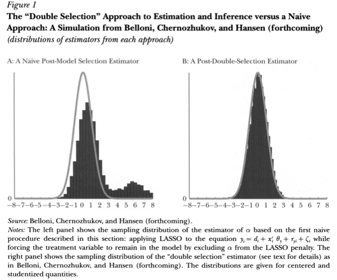
```

::: {.tiny}
Image from [Belloni et al. 2014](https://www.aeaweb.org/articles?id=10.1257/jep.28.2.29).
:::


## ATE

::: {.smaller}
There are some new methods that help overcome the weakness of traditional methods.

For example some methods weight by the inverse of the propensity score.  If the propensity score is noisy and difficult to estimate this will lead to very noisy estimates of treatment effects since it enters the denomiator.

One approach is to use "doubly robust" methods such as combining conditional expectations and the propensity score.

- [Chernozhukov et al. (2018)](https://academic.oup.com/ectj/article/21/1/C1/5056401)

Covariance balancing techniques attempt to balance observeables in treatment and control groups as opposed to estimate the propensity score.  This can lead to better properties in settings with weak predictors of treatment.

- [Athey et al. (2016) ](https://arxiv.org/abs/1604.07125) and [Zubizaretta 2015](https://amstat.tandfonline.com/doi/abs/10.1080/01621459.2015.1023805)
:::

## Heterogeneity

Another major advantage of machine learning is investigating treatment heterogeneity. ML approaches are particularly well-suited for settings where there is not strong prior theory on what factors impact treatment heterogeneity.

A major development by [Athey & Imbens (2016)](https://www.pnas.org/content/113/27/7353) transforms the outcome variable into:

$$Y_i^* = D_i\frac{Y_i}{p(D_i|X_i)} + (1-D_i)\frac{Y_i}{1 - p(D_i|X_i)}$$

Here the average of the outcome variable is in fact the ATE: $E[Y_i^*|X_i] = E[\tau_i|X_i]$.

---

### Heterogeneity

Using this transformed outcome variable, different methods can be used to estimate heterogeneous treatment effects.

[Athey & Imbens (2016)](https://www.pnas.org/content/113/27/7353) apply regression trees to the $Y_i^*$ where now the algorithm optimizes treatment heterogeneity instead of predicted outcomes.

Means and confidence intervals at each leaf represent conditional average treatment effects (CATEs).

[Athey & Wager (2018)](https://www.tandfonline.com/doi/full/10.1080/01621459.2017.1319839) apply this same appraoch to random forests in the so-called **causal forest**.  They show the asymptotic properties of this method although the interpretation can still be challenging.

---

### Heterogeneity
A nice application of the causal forest is [Prest (2020)](https://www.journals.uchicago.edu/doi/abs/10.1086/705798).

He looks at data from a randomized experiment of critical peak energy pricing in Ireland.

The data had been analyzed before, but he applied the causal regression tree to examine hetergeneity.  It was a good application because there was a rich set of predictors in the data.

The main insight is that **awareness** of the program is the main determining factor for whether it actually generated reductions in peak energy use.

---

### Heterogeneity

```{r, eval=T, include=T, echo=F, out.height='75%', out.width='75%'}
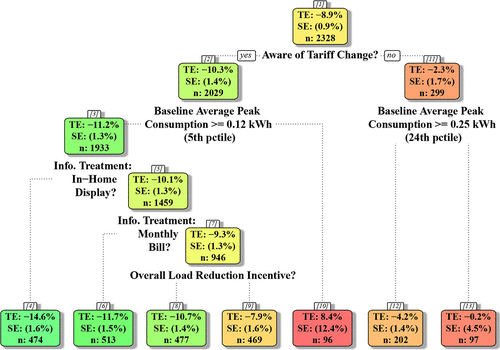
```
::: {.tiny}
Image from [Prest (2020)](https://www.journals.uchicago.edu/doi/abs/10.1086/705798).
:::


## Honest trees/forests

One challenge with trees, and even more so with challenge is the interpretation and inference.  

While trees offer nice insights and forests offer increased predictive power, it's still hard to discern the importance and/or interpretation of a specific variable.

[Athey and Wagner (2018)](https://www.tandfonline.com/doi/full/10.1080/01621459.2017.1319839) develop the asymptotic theory for a specific type of random forest.

They define an **honest tree** first splits the sample and then utilizes one subsample to defines the splits and the other to estimate the average outcomes in each node.

---

### Honest trees/forests

Random forests can be considered a form of kernel estimation, where each tree is a matching estimator and the random forest providing weights.

By averaging over many trees a random forest will place more weight for the predicted value of a given observation on nodes that occur more often.

$$\hat{y}_i^{RF} = \sum_{i=1}^N \alpha_i(x) y_i$$

where the weights $\alpha_i$ are generated from the random forest, sum to one, and are weakly positive.
